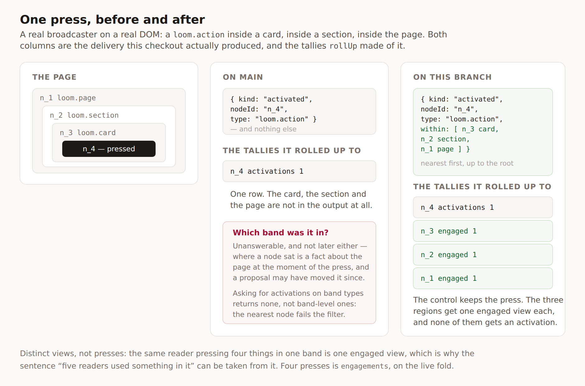

# The region it happened in

**Date:** 2026-09-17 · **Routine:** `Loom daily build` · **Section:** §6 — Reader
signals · **Branch:** `framework-41-the-region-it-happened-in`

## What was done, in plain language

A reader presses a button on a Loom page. Until today the signal that left the
browser said *this button was pressed* and nothing else — not which card the
button was in, not which band, not which page. Now it says all three.

That sounds like a nicety and it is not, because the fact cannot be recovered
afterwards. Where a node sat is a property of the page **at the moment of the
press**. A rollup reading the batch an hour later has a node id and a revision,
and the tree that would answer the question may have been changed by a proposal
since. The only thing in the system that ever knows is the browser that saw it,
and it was throwing the answer away while walking past it.

`Loom marketing` found this the honest way: by wiring the front door up to
broadcast for real and asking the delivery what it had said. The picture above
is the same press run against both branches on this checkout.

## Where the migration stands

**Done, and done before this run.** `apps/loom` is on `main` with its four route
groups; `apps/portal`, `apps/docs` and `apps/marketing` were retired into
`(portal)`, `(docs)` and `(marketing)` on 19 August, and `(lessons)` and
`(demo)` have since been filled by their owners. The tree is not half-migrated
and nothing in this branch touches it. The three routines that were waiting on
its shape are not waiting.

## What changed

**The signal.** `activated` and `disclosed` may carry `within`: the addressed
nodes the signal happened inside, nearest first, up to and including the root.
Those two are `DELEGATED_READER_SIGNAL_KINDS` — the kinds whose node is not the
thing a reader aimed at. `viewed` and `dwelled` do not carry it and will not;
they are observed on the addressed element itself, and they are the high-volume
kinds.

**The broadcaster.** The walk it was already doing to find the nearest addressed
element is continued rather than stopped. No new import, so the browser bundle is
the same size class it was — `browser-weight.test.ts` still finds no package
behind `broadcast.ts`. A host that reports on controls alone passes
`within: false` and the field is **omitted**, not emptied.

**The counters.** `ReaderTally` gains `engaged` — distinct page views in which a
reader used something strictly inside this node. The live fold gains the
occurrence analogue `engagements`, because a fold is one page view and
distinctness there means nothing. `loom_reader_tallies` gains one defaulted
column, with an `ADD COLUMN IF NOT EXISTS` for a deployment whose table predates
it.

## Decisions that were mine to make, and why

**A view counter rather than a press counter.** Both sentences on
`/what-readers-do` are about readers — *five used something in it* — and an
occurrence total is the number that makes one enthusiastic reader look like five.
`engaged` is therefore a view counter like `views` and `reached`, with the same
bound and the same dependence on the view key.

**Absent is not empty.** `within: []` is a claim — *nothing addressed above this
node* — and a sender that was told not to walk has made no claim. Reading the two
as the same thing would report a press at the top of the page for every batch a
fixture or a server synthesised. Three tests hold the distinction, one in each of
the schema, the broadcaster and the rollup.

**Disclosures count as using something.** A disclose control is deliberately
*not* reported as a press (it would double-count the one thing a reader did), so
a band whose only interactive element is a disclosure would have read as zero
engagement forever. It carries the ancestry too, and `engaged` counts it.

**Funnels were left alone.** A `within` scope on `FunnelEnd` would have answered
nothing the tally does not, and would have put two more columns inside a primary
key that already has six. Recorded as rejected rather than deferred.

**Strictly inside.** A button's `engaged` is 0 while its `activations` is 1; its
band's is the other way round. The two never describe the same node, so a subtree
total is the addition and nothing double-counts.

## Records

- **[0167](../decisions/0167-a-delegated-signal-names-the-regions-it-happened-inside.md)** —
  *A delegated signal names the regions it happened inside, and a region is
  counted in views rather than in presses.* **Accepted.** Four alternatives
  recorded as rejected, including the two the finding offered.

Nothing superseded. `pnpm decisions:index` regenerated; it notes 0152–0154 as
claimed on unmerged branches, which is unchanged from `main`.

## Findings

**Closed.** *A press is filed against the button, and `rollUp` has no way to say
which band it was in* — filed by `Loom marketing`, 17 September. Shape 1, the
one that finding recommended.

**Filed.** *The band is on the signal now, and `/what-readers-do` can stop
minting a press no browser sends* — for `Loom marketing`, with the two figures
mapped to what they should read and the two traps (absent-is-not-empty, and
`engaged` needing a view key); and for `Loom portal`, that `StoredTally` carries
a fifth number and it is the only one on a band's row that is ever about a band.

## Cross-lane diff, named rather than left to a blame

Three files outside `src/`:

- `apps/loom/app/(portal)/_lib/reading-view.test.ts` and
  `apps/loom/app/(portal)/portal/readers/_components/page-reading.test.tsx` —
  one line each, `engaged: 0` in a `StoredTally` fixture. Adding a required field
  to a framework type cannot land green without it, and the alternative was
  making the field optional to avoid touching another lane, which is weakening a
  type to dodge a two-line diff.
- `apps/loom/app/(docs)/_lib/api/reference.generated.json` — regenerated with
  `pnpm --filter @loom/app docs:api`, which is what `verify` tells you to run
  when the runtime's published surface moves. Generated, not written.

## Tests

`pnpm install && pnpm verify` — **green, exit 0**, read off the run rather than
off a pipe.

| suite | files | tests |
| --- | --- | --- |
| `@loom/runtime` | 153 | 2,747 |
| `@loom/app` | 271 | 4,756 |

668 findings, 0 malformed. 107 prerendered pages, 852 text junctions, 0 run
together.

**26 tests added, none removed, none weakened, nothing skipped.** Twenty-five
`it` blocks, one of which is in the shared tally-store contract and therefore
runs twice — against the memory store and against Postgres — which is the whole
reason that suite exists. The framework suite goes from 2,721 to 2,747; the
application suite is unchanged at 4,756, because nothing in this branch changes
what an application renders.

**Two existing assertions were updated rather than added to**, and both were
exact-equality assertions on a signal that now carries one more field:
`broadcast.test.ts`'s disclosure test, which now names the two regions the
`details` is inside, and `fold.test.ts`'s *fills in the counters a node has no
signals for*, which now expects `engagements: 0`. Neither is a weakening — both
assert more than they did.

**One thing failed on the way and is worth recording.** The first full verify was
red on `documentation.test.ts`: a doc comment I wrote made a decision-record
number part of a published sentence, which the maintainer's rule on the API
reference forbids. Reworded to a parenthetical; the rule is right and the test
caught it before a reviewer did.

**What is not covered by a live run.** The Postgres tally store's new column is
exercised by the contract suite against the in-process reference and by the
generated SQL, not against a live database in this session — the same arrangement
every other column in that table has.

## Open questions

- **Should `within` have a ceiling?** It is unbounded, like every other array in
  the batch schema, and a batch arrives from a browser. The depth of a real page
  bounds it in practice and the two delegated kinds are rare, so this is a
  consistency question about the whole schema rather than about this field —
  which is why nothing was added here rather than adding the only bound in the
  file.
- **Should `engaged` have an occurrence sibling on the tally?** *Fourteen presses
  in this band* is a real report and the ancestry can already answer it. Nothing
  has asked, and a counter nobody reads is a column everybody migrates.
