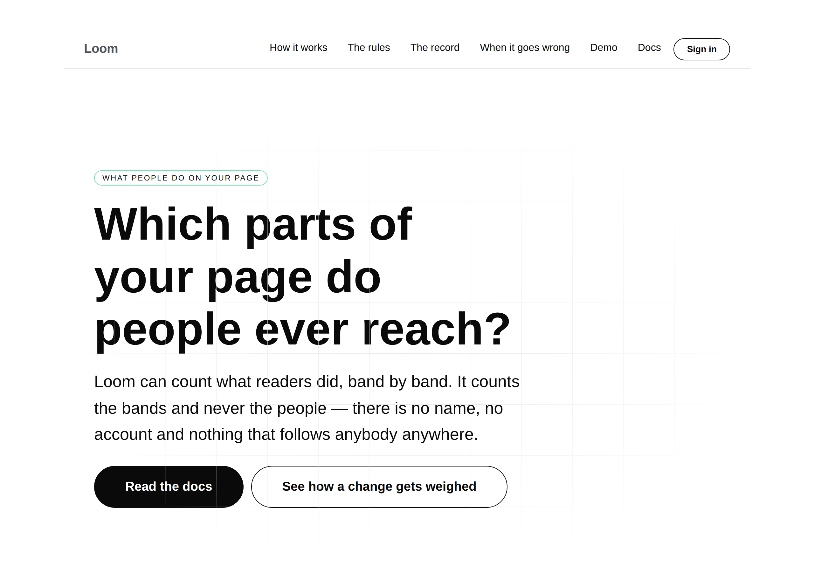
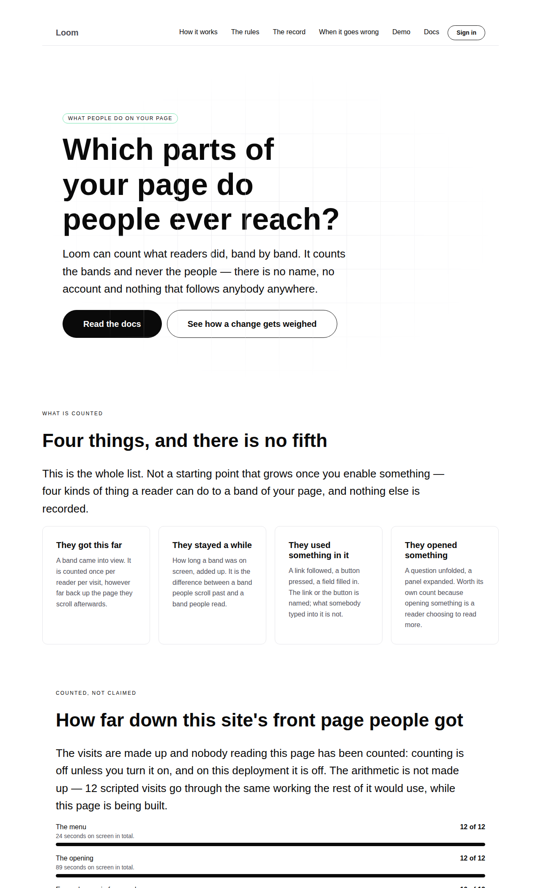
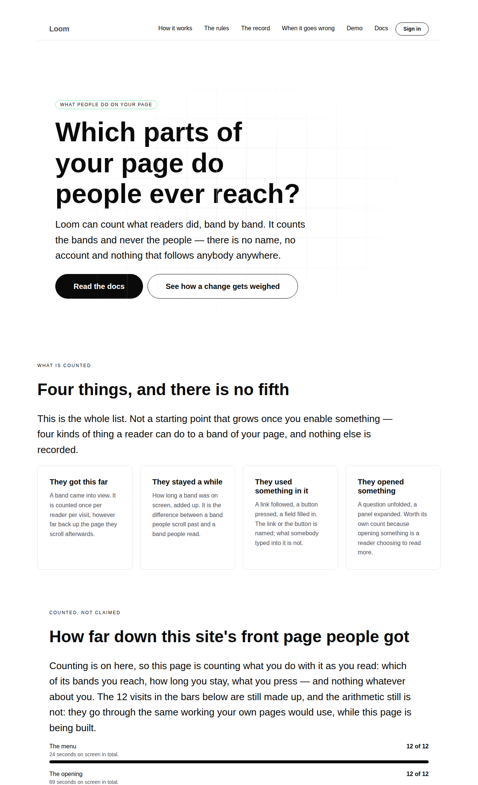
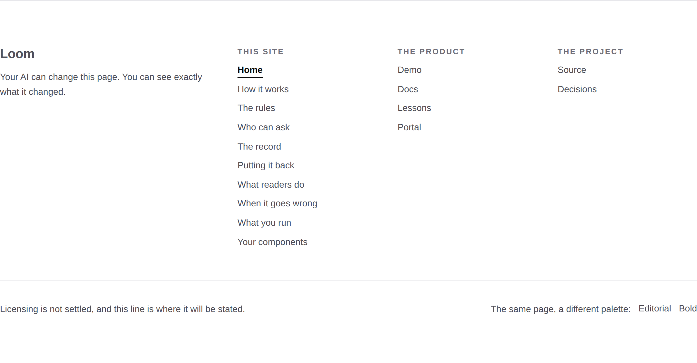
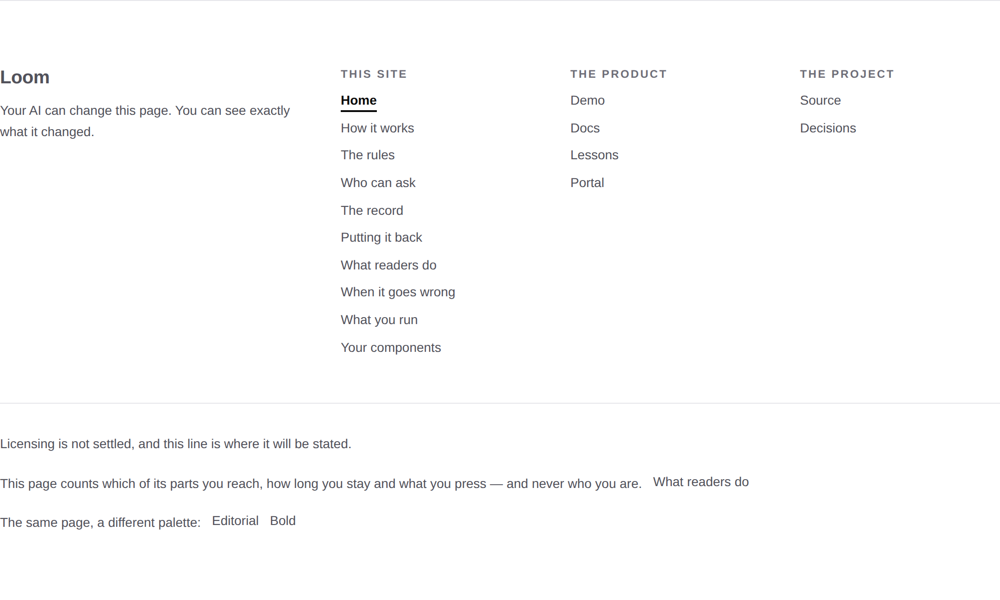
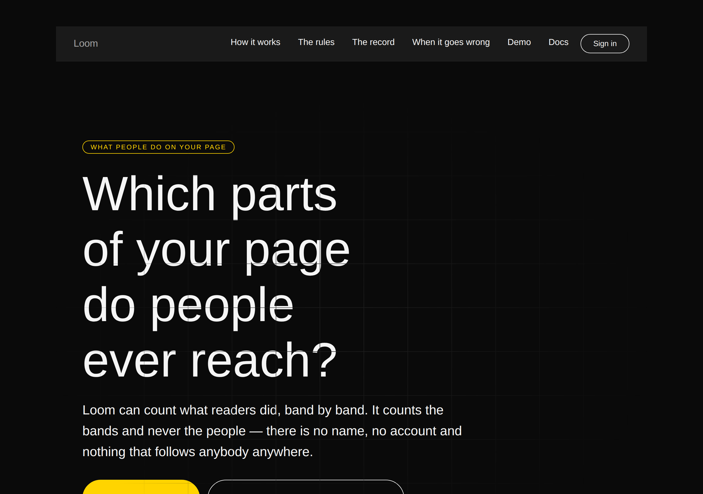
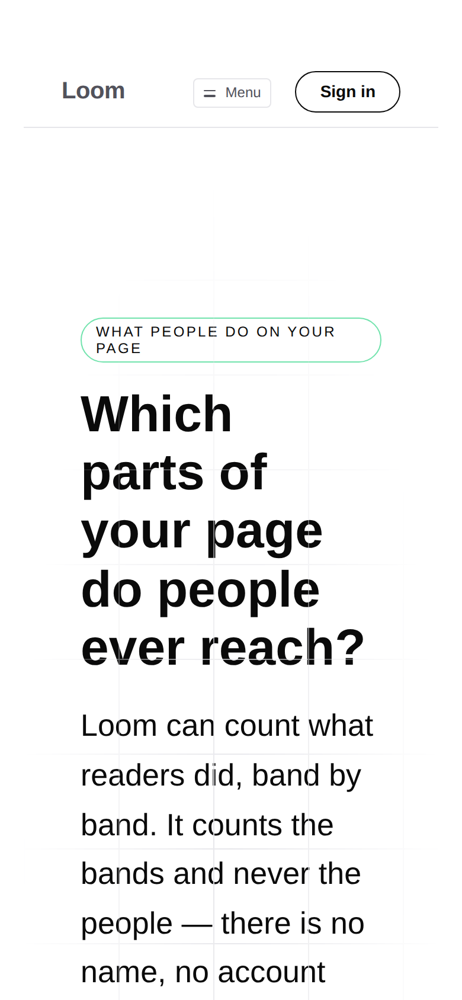

# 2026-09-17 — marketing: the site speaks through the door

`/what-readers-do` has said since yesterday that Loom can count what readers
did, and that counting is off unless you turn it on. Both halves were true, and
the second one was true of this surface **by doing nothing at all**: no page of
this route group broadcast anything, so *this site counts nobody* cost nothing
to promise.

`/api/reader-signals` landed on `main` with #312 overnight, which was the exact
precondition this lane wrote down on 16 September for the other half of the
framework lane's finding — *the door is open and nobody is speaking through it*.
So the site speaks through it now, and says so where a reader can read it.



---

## What shipped

**One boolean, read once per request, and three things follow from it.**

`LOOM_SIGNAL_INTAKE` is the switch the endpoint already reads to decide whether
it keeps a batch. `_lib/readers/counting.ts` reads the same switch through the
endpoint's own `readIntakeSwitch`, rather than parsing the variable a second
time, so this surface cannot disagree with the endpoint about whether the
deployment collects.

| what reads it | what it does |
| --- | --- |
| `render.ts` | renders every page `addressed`, so each band carries the id a signal names |
| `layout.tsx` | mounts one client component that starts a broadcaster and posts to `/api/reader-signals` |
| the page trees | the foot of every page, and two sentences on `/what-readers-do`, say which of the two deployments this is |

**Off — which is what this deployment is until somebody sets the variable — the
markup is byte-identical to yesterday's, nothing is downloaded, and no batch is
sent anywhere.** That is measured below rather than asserted.

### What this site asks to be told

`_lib/readers/asked.ts` is the promise, as one object: time on screen for the
bands, presses for the controls, openings for a question. A list per kind rather
than one list for everything, which is the shape 0136 exists for — asking all
four kinds of everything would bury the reading that matters under a `dwelled`
for every link on screen several times a minute.

| kind | what it is asked about |
| --- | --- |
| `viewed`, `dwelled` | `loom.hero`, `loom.section`, `loom.logo-cloud` — the bands a reader travels through |
| `activated` | `loom.action`, `loom.link`, `loom.logo` |
| `disclosed` | `loom.faq` |

The menu and the foot of the page are deliberately left out, and the menu is the
one that matters: the bar is `position: sticky`, so it is on screen for every
second of every visit. Time on screen for it would be the largest figure on any
report, about the one band nobody reads.

**`loom.logo-cloud` is in that first row because the test put it there.** The
row of four plain words on the front door is a band at the top level of the
tree — one of the nine bars `/what-readers-do` already prints — and the list I
wrote by hand had two of the three. Left as it was, it would have been the one
band of the site's most-read page that nothing counted, and nothing would have
said so.

### The one piece of this site that runs in a browser

`_components/count-readers.tsx` — `"use client"`, returns `null`, starts one
broadcaster on `[data-loom-tree]`, stops on unmount. It draws nothing on
purpose: a visible element here would be markup this site does not build out of
registered primitives, and *the whole page is data* has to be true at the edges
too.

It leaves one thing behind that a reader never sees:
`data-reader-signals="broadcasting"` on the document, or `"unaddressed"` when
there was nothing to broadcast from. A broadcaster that started against the
wrong element behaves exactly like a site nobody is visiting — no batch, no
error, no difference — and that attribute is what makes the difference
falsifiable, in a test and in a real browser.

Not `data-loom-…`: that prefix is the runtime's, for the addresses a signal
names, and a surface inventing a fifth one would make the set of attributes that
mean something to Loom a matter of who wrote them.

---

## Measured in Chromium, against `next start`

Both states, on the built application, with the endpoint's status endpoint asked
first so the two halves are known to agree.

| | counting off (this deployment today) | counting on |
| --- | --- | --- |
| `GET /api/reader-signals` | `intake: off` | `intake: on` |
| `data-reader-signals` on the document | **absent** | **`broadcasting`** |
| elements carrying `data-loom-node` | **0** | **138** on `/`, **117** on `/what-readers-do` |
| batches posted after a scroll, a press and an opening | **0** | **2** |
| what the endpoint answered | — | **204, both** |

The batch bodies are read off the page's own `loom:signals` event, because a
`sendBeacon` body is not visible to a network listener. On the front door, one
page view, two deliveries:

```
{ treeId: "t_home1", revision: 0, view: "d4ddf420b8…", signals: 20,
  kinds: [viewed, activated, disclosed, dwelled],
  types: [loom.hero, loom.logo-cloud, loom.section, loom.action, loom.faq] }
{ treeId: "t_home1", revision: 0, view: "d4ddf420b8…", signals: 1,
  kinds: [dwelled], types: [loom.section] }
```

Four things worth reading off that: every kind arrived, **only the asked types
arrived**, both batches carry **one** view key — correlated inside one page view
and nowhere else (0146) — and `loom.logo-cloud` is in it, which is the band the
test caught.

---

## Found while building: a press is filed against the button, not the band

The tile on `/what-readers-do` for *they used something in it* said **"The band
it happened in is named; what was typed is not."** Wiring the real broadcaster
up and reading a batch back says otherwise:

```
{ kind: "activated", nodeId: "<the button>", type: "loom.action" }
```

`broadcastReaderSignals` files a signal against the **nearest addressed element**
to what was pressed, and every control in the starter library is an addressed
node of its own. Narrowing `types.activated` to band types does not walk further
up either — the nearest element fails the filter and the signal is dropped — so
asking for band-level activations yields **none** rather than band-level ones.

It matters beyond a curiosity, because two things on that page are band-level
activation claims: the per-band caption *5 used something in it*, and the funnel
question whose second leg is an activation. Both are correct arithmetic over
scripted visits that mint `activated` against **band ids**, which is a thing no
browser will send. On real signals those figures are zero for every band,
forever, and the page would not notice: the arithmetic is the same and the input
is empty.

**Filed for `Loom daily build`** with three shapes and a recommendation — the
signal carrying the band as well as the control (a schema change and probably a
record), `rollUp` being given the tree (cheap and wrong across revisions), or
nothing changing and this page reporting controls instead. What this lane did
today is the part that is unambiguously ours: **the tile now says "The link or
the button is named; what somebody typed into it is not."** The figures stay as
they are, beside a sentence that already says the visits are made up.

---

## The copy, and the two sentences that are now a function of the deployment

Nothing here is a new claim about who the product is for. Positioning, audience
and pricing are untouched.

**The readings band, leading the numbers** — off:

> The visits are made up and nobody reading this page has been counted: counting
> is off unless you turn it on, and on this deployment it is off. The arithmetic
> is not made up — 12 scripted visits go through the same working the rest of it
> would use, while this page is being built.

and on:

> Counting is on here, so this page is counting what you do with it as you read:
> which of its bands you reach, how long you stay, what you press — and nothing
> whatever about you. The 12 visits in the bars below are still made up, and the
> arithmetic still is not.

| | |
| --- | --- |
|  |  |

**The foot of every page, when it is counting:** *"This page counts which of its
parts you reach, how long you stay and what you press — and never who you are."*
with a link to the page that says the rest of it.

It is in the chrome rather than on one page because the counting is: a
broadcaster is started by the layout, so whichever of the ten pages somebody
landed on is counting them. A site that counted on ten pages and disclosed on
one would be making the argument this site sells in exactly the form it tells a
reader not to accept.

| | |
| --- | --- |
|  |  |

**And the question band's answer to *do the bars come from real visitors?*** —
still *no* on either deployment, with the second sentence saying whether the
reader asking is being counted. A reader on a counting deployment gets the
awkward half in the same breath as the reassuring half: the bars are a fixture,
**and** you are counted, and those are not in tension because what is kept about
you is a band and a number of seconds.

---

## Also closed: seven of the eight rungs, not four

The framework lane's finding with the eighth rung asked this lane to re-derive
*"four of the eight rules refuse to consult who asked at all"*. Re-derived, and
the answer is **seven**.

Four was a count of the rungs whose comments say *whatever latitude its origin
has*. The question the sentence asks is which rungs **read an origin**, and off
`ESCALATION_RULES` that is exactly one: `stakes-above-ceiling`, through
`ceilingFor(policy, origin)` — which is 0002's *"the one place origin is
load-bearing rather than merely recorded"* and the reason `/who-can-ask` exists
at all.

Both comments now say seven and say how it was counted. **Nothing a reader sees
was wrong**: the only count in front of a reader is the link label *The eight,
one by one*, which the framework lane had already corrected.

---

## Tests

`pnpm install && pnpm verify` — **green, exit 0. Nothing failed, nothing
skipped, no test weakened or deleted.**

| suite | `main` at `d5b1eb2` | this branch |
| --- | --- | --- |
| `@loom/runtime` | 153 files / 2,697 tests | **153 / 2,697** — `src/` was not opened |
| `@loom/app` | 263 files / 4,652 tests | **266 / 4,679** |
| marketing, within it | 33 files / 1,530 tests | **36 / 1,557** |

`findings:check` reads 656 entries, 0 malformed. `prerender:check` reports 106
pages and 834 junctions, 0 run together — unchanged, and correctly so: every
page of this route group reads `searchParams`, so none has ever been in that
count.

The `main` numbers were measured by checking `main` out and running the suite,
not quoted from a report.

**27 tests are new across 3 new files**: the switch and the two things it keeps
in step (10), what this site asks about (5), and the broadcaster on a real tree
in jsdom (8), plus 3 on the footer's disclosure in `chrome.test.ts` and 1 on the
readers page in both states.

### Mutations

Nine defects restored one at a time, each against a committed baseline. **Eight
were caught first time. The ninth was not, and it is the useful half.**

| mutation | result |
| --- | --- |
| `addressed` hardwired off — the flag ignored | **6 red** across both projects |
| `addressed` hardwired on — every page addressed with nothing listening | **2 red** |
| a value that is neither on nor off read as on | **1 red** |
| the footer note on every page, counting or not | **2 red** |
| the footer never discloses | **2 red** |
| `loom.logo-cloud` dropped from the bands | **1 red** |
| the two sentences swapped | **3 red** |
| the broadcaster started on `body` rather than on the tree | **4 red** |
| `types` removed — every kind about every addressed primitive | **passed** |

The last one is the one worth the space. The component asking for *everything*
was invisible to eight tests, for a reason that reads as reassuring and is not:
**every control this site has is one it asks about**, so a press could not
discriminate, and `viewed` never fired at all because jsdom has no
`IntersectionObserver` and the stub watched nothing.

The fix is a second stub — an observer that hands back everything it was asked
to watch as *on screen*. What the broadcaster **observes** is decided by `types`,
so that instrument can tell *the bands* from *the page*. With the narrowing in
place the batch carries three types; without it, twenty-five, and the assertion
names them:

```
AssertionError: expected [ 'loom.action', 'loom.badge', …(23) ] to deeply equal []
```

Caught now — 1 red, and the same test covers the measurement path that matters
most.

---

## Both palettes, and a phone

`scrollWidth 1280 / innerWidth 1280` and `390 / 390` — no overflow at either
width, in either state.

| | |
| --- | --- |
|  |  |



The phone shot is one image rather than two on purpose: photographed in both
states, the files came back **byte-identical** (`md5 70373690…`), because
nothing above the fold differs — the disclosure is in the foot of the page and
the sentence that changes is three bands down.

No colour is named anywhere in the diff; every value is a token. **Nothing was
added to the library**, and nothing in `src/` was opened. The one new component
renders `null`.

---

## Decisions and findings

**No record written.** Nothing is constrained outside this route group, no
Accepted record is touched, and the switch is the endpoint's own. The one thing
that would deserve a record is not mine: what an `activated` signal should be
filed against.

**Two findings closed**, both owned by this lane: the broadcast half of #312's
finding (this branch is what it said the next run would do), and the rung count
re-derivation.

**Two findings filed.** The press-versus-band attribution, for
`Loom daily build`. And the recipe, for `Loom demo`, `Loom docs` and
`Loom lessons` — the three surfaces that still owe the same two calls — with the
three things that would otherwise cost each of them a run: import from
`@loom/runtime/signals/broadcast` and take the batch as a `type`; keep the
environment read out of the client component's module graph; and make a silent
broadcaster say something, because otherwise it is unfalsifiable.

**One shape changed beyond the obvious scope.** `BackContext` and `AskersContext`
spelled out their own `origin` and `theme` instead of extending `PageContext`,
which is how they became the two page contexts that could not be told whether
the deployment counts its readers. They now extend it, like the two beside them
already did. Found by `tsc`, not by a test.

## Needs your input

- **Do you want counting on?** Nothing in this branch turns it on. Setting
  `LOOM_SIGNAL_INTAKE=on` on the deployment makes the site count its own
  readers, disclose it in the footer, and post batches to `/api/reader-signals`;
  `DATABASE_URL` decides whether what is kept survives the instance. My
  recommendation is **yes, on the preview first**, because the funnel of this
  site's own front door is the most useful reader-signal data this project can
  get and it costs nothing to stop.
- **The disclosure wording is mine and it is a privacy statement**, which is the
  one kind of copy I am least comfortable inventing. It claims exactly what
  `asked.ts` asks for and 0146 guarantees, and it is one sentence in the footer.
  Re-word freely; if you would rather it were a page, or a line in a privacy
  policy that does not exist yet, say so and I will build that instead.
- **The licence line** (#96, on every marketing PR since #134). Still the site's
  one placeholder.
- **Positioning, audience and pricing.** Untouched.

Nothing scheduled and nothing armed.
