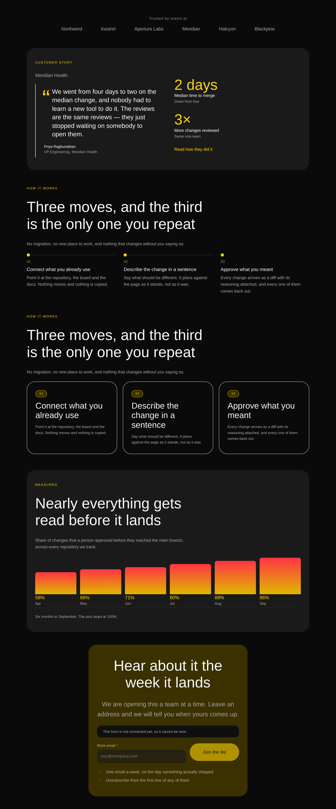

# Four second designs of the spine, and two anchors that pointed at the wrong band

**Routine:** `Loom primitives` · **Date:** 2026-09-17 · **Branch:**
`primitives-37-the-spine-second-designs` · **Section:** §4b

## What this run chose, and why that

Two questions went to the maintainer on #313 and neither has been answered: the
arithmetic to 250 at four designs a run, and whether the rule I invented for
what may enter the catalogue is the right bar. So this run holds to what the
brief says — *four excellent beats twelve thin* — and to the lane's own
measurement, which has now been the standing recommendation for four days:

> **Hold the vocabulary near 110 and spend the week on compositions.**
> — `docs/primitive-gap-inventory.md`, 13 September

**The catalogue goes 23 → 27.** The choice of *which* four is the part worth
arguing. The page's spine — the bands a marketing site actually stands on — is
nav, hero, proof, features, pricing, testimonials, faq, cta, footer. Four of
those already had a second design after #313. This run takes four that had one,
picked by what a demo leans on rather than by working down the parts list in
order:

| design | part | why this one |
| --- | --- | --- |
| **`proof-story`** | proof | the band under the hero, making the *opposite* claim to a logo wall — one named customer with two results |
| **`steps-cards`** | steps | the same three sentences as `steps`, in a different set of nodes. Chosen because it is the clearest statement of 0162's rule the catalogue can contain |
| **`metrics-chart`** | metrics | `loom.stat-chart` shipped in #289 to close what the inventory called *"the single largest hole"* — and **no band in the catalogue used it** |
| **`cta-signup`** | cta | every page ends with one, and the capture form is the ending `cta`'s two buttons cannot be |

## The one that is not a new band at all

`metrics-chart` is worth leading with because it is the only one that closes
something already paid for.

The inventory's Tier A named *a figure drawn from numbers* the largest gap in
the library. `loom.stat-chart` closed it on #289, correctly, with a doc comment
explaining exactly what a page could not previously say. Then twenty-three
designs shipped and **not one of them plotted anything.** The metrics band in
the phrasebook is four flat figures in a `loom.stat-grid`.

So the answer to the largest hole was reachable only by somebody who already
knew the type existed and was willing to write nine nodes by hand — which is
precisely the complaint the composition layer was built to answer, one level up.
A primitive nothing in the catalogue uses is a primitive most callers will never
find.

**This is also the pair where 0162's bar is genuinely close**, and the report
should say so rather than assert the verdict. `loom.stat-chart` and
`loom.stat-grid` take *the same children* — that is 0054 working — and the
chart's own header advertises that re-plotting is *"one `configure` on the
container"*. Read only that far and this band is a `configure` of `metrics` and
does not belong in the catalogue.

It is not, and the reason is what the children have to carry. A plotted child
needs a `magnitude` or it draws nothing, and the canonical band's four figures
are `12k+`, `99.98%`, `4 min` and `40+` — **four different units, no ceiling
that plots them together.** Turning one band into the other is six new children
replacing four, with a different subject. That is `remove` and `insert`.

The sentence the chart advertises is true of a grid whose children are *already
one series*. Both bands stay because a marketing page wants both kinds of claim.

## The pair that is the argument

`steps` and `steps-cards` say **the same three things in the same three
sentences**, deliberately. Every other second design in the phrasebook differs
in its copy as well as its structure, which makes 0162's rule easy to agree with
and impossible to see. Holding the copy constant leaves exactly the difference
the rule is about:

| | `steps` | `steps-cards` |
| --- | --- | --- |
| container | `loom.milestone-row`, which draws a rail | `loom.grid` of `loom.card` |
| a step is | one `loom.milestone` — marker, title and body are **props** | a card holding a `loom.badge`, a `loom.heading` and a `loom.prose` |
| nodes | **10** | **28** |
| *"make the third step's heading a link"* | unreachable — a title that is a prop has no inside | one operation |

Neither is better. The granularity doc is explicit that over-decomposing has a
real cost, and a row of three terse steps under a rail is the better band when
the steps *are* terse — ten nodes is cheaper to drop in and cheaper to read.
What the extra eighteen buy is reachability, and the choice between them is a
choice about how much of the band the author expects to edit, which only the
author knows.

The rail is the thing lost, and it is not nothing: a grid of cards says *these
are three things* and leaves sequence to the numbers in the badges. Which is why
the badges are load-bearing here — and why what happened to them mattered.

## The badge that was 281 pixels wide

The first photograph was wrong and the reason is a class of defect this lane has
now hit four times in a month.

`loom.badge` declares `display: "inline-flex"` — *shrink-wrap to your content*.
Nothing overrides it and no stylesheet rule contradicts it. It is simply **not
what `inline-flex` means once the element is a flex item**: a flex container
blockifies its children and stretches them on the cross axis. A badge placed
directly inside a `loom.card`, which is a flex column, becomes a full-width bar.

Measured in Chromium at 1280px against the `steps-cards` band:

| | badge reading `01` | card inner width |
| --- | --- | --- |
| before | **281px** | 281px |
| after | **40px** | 281px |

Four primitives in this directory already carry `alignSelf: "flex-start"` for
exactly this — `control.ts`, `loom.perk`, `loom.feature`, `loom.milestone` —
each with a comment saying why. `loom.badge` never did. It belongs on the child
rather than on every container that might hold one, which is
[0155](../decisions/0155-a-container-may-only-add-to-its-children-what-they-left-unspoken.md).

**This was not my band's defect.** `catches-the-eye.specimen.ts` puts a badge
directly in a card too, and has photographed "Most popular" as a full-width bar
since it shipped. Nobody reported it; that specimen is about lights and nobody
was looking at the badge. Every `loom.tier` badge had it as well.

**Why it is filed as well as fixed.** The 16 September finding proposed a check
for *an inline property a stylesheet rule is trying to override*, which would
have caught all three instances it was written about. It would not have caught
this one — nothing is overridden here. The shape is **a declaration correct in
isolation and wrong in the layout context the element is placed into**, and the
only instrument that can see it is a browser with a layout engine. The specimen
harness already has one; it photographs and does not assert. That is the cheap
version and it is what I recommend.

## The two anchors, which nothing was positioned to see

Found by listing every anchor in `PAGE_SEQUENCE` and counting, which took one
script and had never been done.

| | |
| --- | --- |
| `features` and `bento` **both carried `anchor: "features"`** | both are on the canonical page, so the rendered document had two elements with `id="features"`. A link to `#features` reaches the first; **the bento band has been unaddressable by fragment since it shipped** |
| `testimonials` carried **no anchor**; `testimonials-wall` carried `#testimonials` | the link resolved on a page that had taken the alternate design and nowhere on the default page |

Neither produced an error, a diagnostic or a failing test. The whole of what a
duplicate `id` does is that the second one stops being found.

`anchor.ts` has said since it shipped that its schema cannot check this —
*"duplication is a fact about a tree"* — and filed it for the framework lane,
which is right and still wanted. What it left open is that **the catalogue
assembles a tree**, and this library was shipping two bands with the same anchor
and putting both on its own starting page.

[0165](../decisions/0165-an-anchor-belongs-to-the-part-and-is-unique-over-the-assembled-page.md)
rules on two things:

- **An anchor names the part, not the design.** `hero` and `hero-split` both
  answer to `#top`; `steps` and `steps-cards` both answer to `#how-it-works`.
  This is the load-bearing half. A design is a thing a host *swaps in*, and an
  anchor is the one piece of a band that something outside it points at — so an
  anchor varying between designs is a dependency that breaks quietly on exactly
  the operation the catalogue exists to make cheap.
- **No two bands on the assembled page share an anchor**, asserted over
  `PAGE_SEQUENCE` rather than over any one band, which is 0125.

The record rejects three alternatives with reasons, including the one I tried
first: deriving the anchor from the part inside `Composition`. It would break
`build`'s contract that a composition is a pure function to a subtree, and the
part name is frequently the wrong anchor — `hero` answers to `#top`,
`credentials` to `#certifications`, `articles` to `#writing`.

## Which Hermes fields became nodes, and which stayed props

**None, in either direction.** Nothing was ported from Hermes this run — these
are new designs over content models already in the library, which is the same
honest answer #313 gave. What each design *is* against 0052 is the table at the
top and the three sections above.

The one place the question does arise is `steps-cards`, and the answer is worth
stating plainly: a `loom.milestone`'s `title` and `body` **stay props**, because
they are a fixed set of fields on one record. `steps-cards` does not re-decide
that. It uses *different primitives* whose content model happens to be nodes,
and the two bands exist side by side precisely so the trade is a choice rather
than a ruling.

## Screenshots

| | |
| --- | --- |
| [editorial, 1280](2026-09-17-primitives-the-spine-second-designs-editorial-wide.png) | the four designs with the two canonicals they alternate with |
| [bold, 1280](2026-09-17-primitives-the-spine-second-designs-bold-wide.png) | the same, dark ground — the chart's gradient columns are the palette, not a colour in the band |
| [editorial, 390](2026-09-17-primitives-the-spine-second-designs-editorial-phone.png) | `scrollWidth 390 / innerWidth 390` |
| [bold, 390](2026-09-17-primitives-the-spine-second-designs-bold-phone.png) | `scrollWidth 390 / innerWidth 390` |

`cta-signup` photographs **dimmed, with a notice above it**, and that is correct
rather than a bad shot: `loom.form` disables its own fieldset when no submission
endpoint has been resolved, and a specimen has no deployment behind it.
`contact` has photographed this way since it shipped. Seeding a fake endpoint to
make the picture look better would be photographing a state no reader of this
report can reach.

The sheet puts `steps` and `steps-cards` on one document, which gives it two
elements with `id="how-it-works"` — the exact defect 0165 is about. It does not
fire because the assertion is over `PAGE_SEQUENCE`, and a page never holds two
designs of one part. This is a contact sheet, not a page, and the duplicate is
the cost of putting a pair side by side. Said in the specimen's own header,
which `phrasebook-designs.specimen.ts` had not said about its own `#features`
duplicate.

## Checks

- `pnpm install && pnpm verify` green, **exit 0**. Framework 153 files /
  **2,706** tests; application 263 files / 4,652 tests; 655 findings 0
  malformed; 106 prerendered pages, 834 text junctions, 0 run together. Nothing
  failed, nothing skipped, **no test weakened**.
- Every new band renders under both starter palettes with **no diagnostics** —
  the per-band test the suite already generates, which is what proves a node was
  not silently dropped.
- **Four defects restored, four caught**, each by the assertion that should:
  `bento`'s anchor put back to `features` (the page uniqueness test, naming both
  bands); `testimonials`' anchor removed (the part-agreement test, printing
  `[] ["testimonials"]`); one month's `magnitude` deleted from `metrics-chart`
  (*"a point in metrics-chart has no magnitude and would draw nothing"*); the
  badge's `align-self` removed.
- **The restoration cost me my own fixes once.** `git checkout` to undo a
  restored defect reverted two tracked files to `HEAD`, dropping the anchor
  fixes I had not yet committed, and left the third — an untracked file —
  holding its defect. This is the trap #313 recorded on 16 September and I hit
  it anyway. The lesson is narrower than "be careful": **commit before
  restoring**, then restore against a commit. The later badge restoration was
  done with `sed` both ways and cost nothing.
- No literal colour anywhere in the diff; every value is a token or a length.

## What the library still cannot express

**The specimen harness photographs and cannot assert.** It has a browser, a
served page and a viewport — everything needed to check *this element is
narrower than its parent* — and the badge defect is the fourth in a month that
only a layout engine could see. Filed.

**`COMPOSITION_PARTS` is still closed at nineteen.** A newsletter strip or a
careers band needs the tuple widened first. Unchanged from #313 and still the
right bar.

**The arithmetic to 250 still does not work at four a run**, and the question
from #313 is still open. This run took the catalogue 23 → 27 against a second
row the inventory sizes at ~140 by 19 September. That is two days away and it is
not reachable at this bar. It is in the PR comment rather than buried here,
because it is the maintainer's call and this is the second run asking.

## Outside the lane

Two generated files, neither edited by hand (0139):
`apps/loom/app/(docs)/_lib/api/reference.generated.json` and
`decisions/README.md`, regenerated with `pnpm decisions:index`.

`src/primitives/loom.badge.ts` is inside this lane. Nothing under `apps/` and
nothing in `src/` outside `src/primitives/` was edited.

**On the commit author.** `docs/routines.md` gives two opposite instructions —
§"Commit identity" says to set it to `jonathanbravecredit`, §"Commit identity,
and the preview that goes missing" says not to set one at all. `Loom portal`
filed that contradiction on 16 September and it is not mine to resolve. This run
followed the second: the session was already configured as
`Claude <noreply@anthropic.com>`, which both sections name as a known-good
deploying identity, and the safer reading of a contradiction is the one that
touches nothing.
