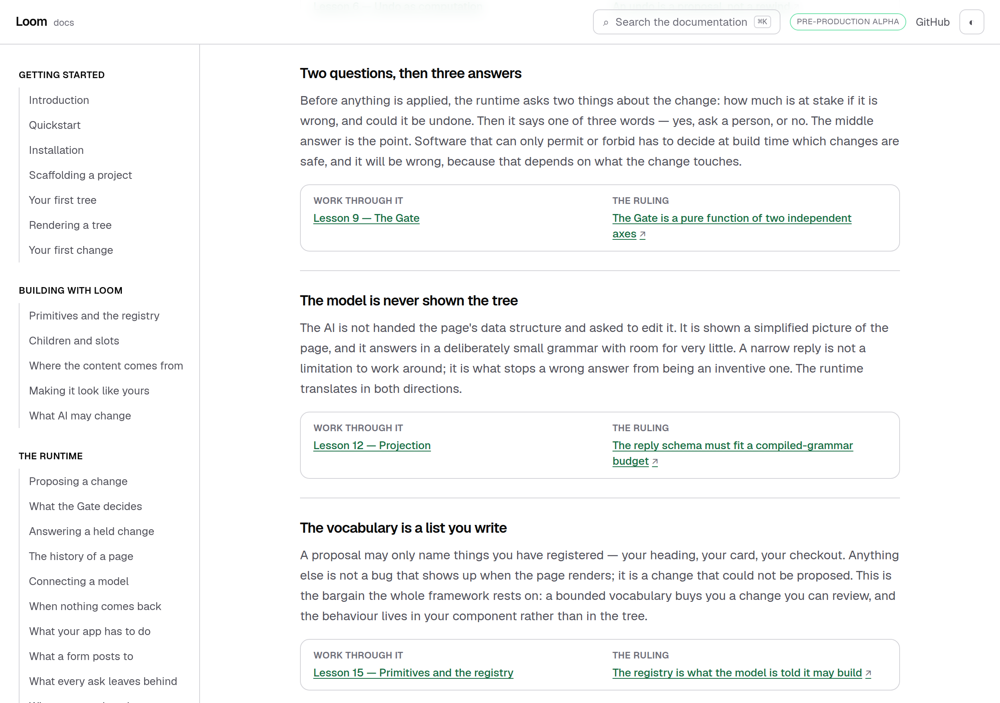
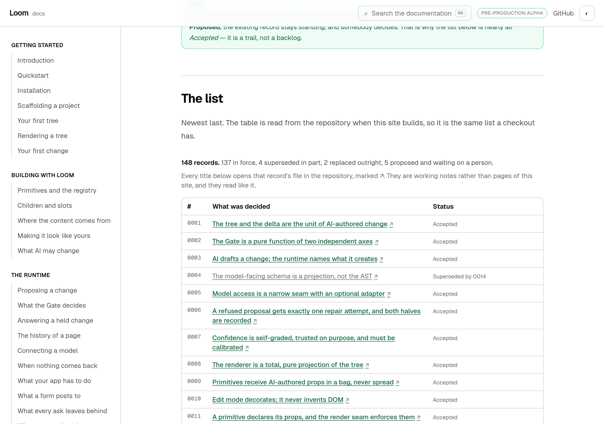
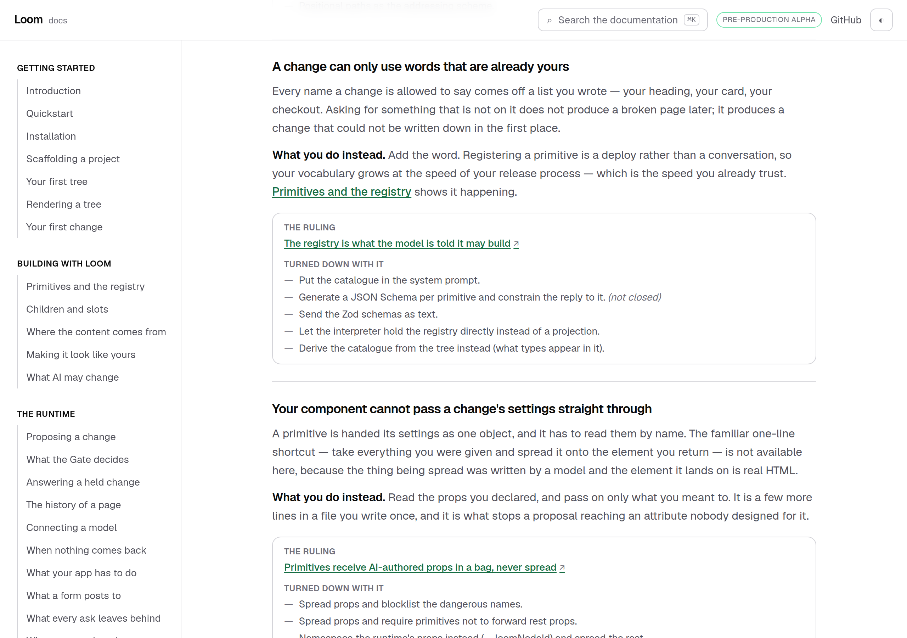
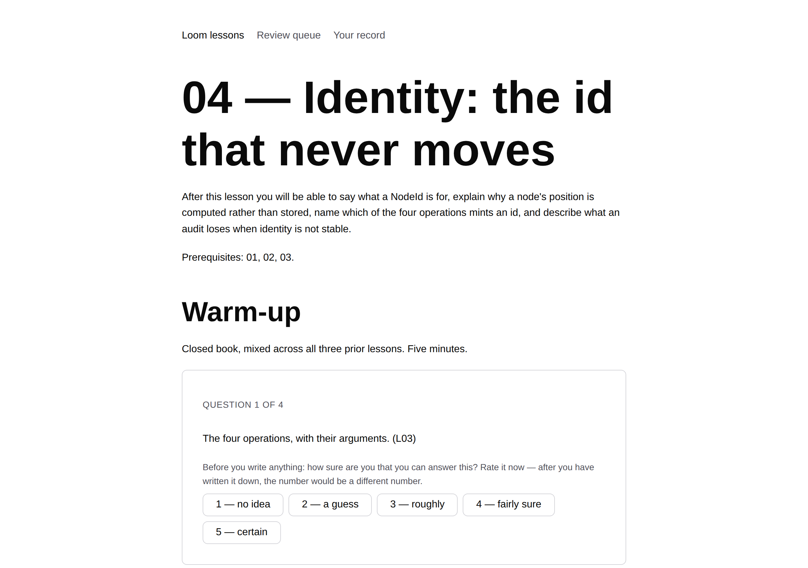
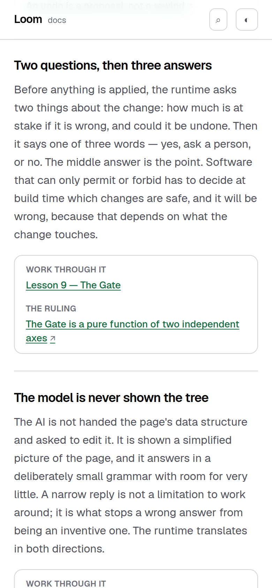

# 18 September 2026 — the course has an address, so the section stops handing out files

**Routine:** `Loom docs` · **Branch:** `docs-28-the-course-has-an-address` · **Section:** §4c

**Preview:** the pull request's Vercel deployment for
`/docs/architecture/how-it-fits-together`. Read off the deployment rather than
opened — `vercel.app` is off this sandbox's egress allowlist, which is the
standing 15 September finding and is not re-filed. Every screenshot below is a
production build of this commit, served locally by `next start`.

## What this run was

The larger of the two things yesterday's report said it would write next, whose
condition had just been met:

> **Architecture is three pages and the course in `lessons/` is twenty-six.**
> The section indexes them correctly and says nothing they do not — which is
> right — but a reader who wants the argument is currently sent to a GitHub
> blob. When `lessons/` grows a route, that is the section that changes.

`lessons/` grew a route. `(lessons)` now serves `/lessons/01` … `/lessons/26`,
one page per written lesson, and the module this lane wrote in August said in as
many words what to do about it:

> Neither the course nor the records are rendered as pages anywhere in this
> application yet, so a pointer to one is a pointer to the file. **When either
> grows a route, this is the one function that changes.**

There were no open findings owned by this lane that asked for anything, and no
maintainer comments on any open pull request, so this was the plan.

## What changed for a reader

Eight doors on *How it fits together* used to leave the documentation for raw
markdown on GitHub. They now go to the lesson's page on this same deployment.
Every one of them was followed against a real build:

| door | address | |
| --- | --- | --- |
| A page is data | `/lessons/02` | 200 |
| A change is data too | `/lessons/03` | 200 |
| Every node keeps its name | `/lessons/04` | 200 |
| Nothing throws at a seam | `/lessons/05` | 200 |
| Undo is another change | `/lessons/06` | 200 |
| Two questions, then three answers | `/lessons/09` | 200 |
| The model is never shown the tree | `/lessons/12` | 200 |
| The vocabulary is a list you write | `/lessons/15` | 200 |
| *start it here* | `/lessons` | 200 |

**The rulings still leave, and that is deliberate.** `decisions/` has no route
and this run did not give it one — see *Needs your input* on the pull request.
What changed there is that a link which leaves now says so: a `↗` at each one,
and a sentence in the prose saying what is behind it. The mark is `aria-hidden`
and the words are in the prose rather than inside each link, because a
visually-hidden "opens on GitHub" reads well under a pair of doors and badly on
a table with one row per record.

*What it costs you* is where the two kinds sit closest together, and so the place
the mark is easiest to get wrong: **the ruling** leaves and *shows it happening*
does not, in the same box. A test walks every link the page renders and asserts
the mark is on exactly the ones whose address leaves.

## The thing the screenshot taught me, which changed the page

Making the link work was ten lines. Looking at where it lands was the run.

A reader who clicks **Work through it** under *Two questions, then three
answers* arrives at `/lessons/09` and the first thing on the page is:

> **Warm-up** — *Closed book, five minutes, mixed across five lessons. Write
> something for all five before you look anything up.*

Above it, `Prerequisites: 01, 02, 03, 04, 05, 06, 07, 08.` The explanation is
behind that and behind Predict, because the lessons surface holds the body back
until every prediction is written down — which is the whole design of that
surface and is right.

But it is a reader that surface did not have before. They came for the reasoning
behind one idea, they have done none of the course, and the first screen asks
them four closed-book questions about lessons they have not read. The old link
handed them a file they could simply read.

**This lane's half is prose, and it is now checked rather than believed.** *The
two doors* says the course runs in order, that a lesson opens with a closed-book
warm-up on the lessons before it, and that a reader who wants the argument rather
than the practice should take the other door.
`_lib/architecture/claims.test.ts` reads the linked lessons and holds all three
claims against them — including the one about lesson 1, which has no warm-up
because it has nothing before it, which is why the sentence says *on the lessons
before it* rather than *every lesson*.

The other half — whether a lesson reached cold from outside should offer a way
past the warm-up — is the lessons lane's call and is filed for them, with the
argument for leaving it exactly as it is.

## Decisions taken that were not specified

**A lesson's markdown is kept and never shown to a reader.** `CourseLesson` now
carries `href` (the page) and `source` (the file), and nothing renders `source`.
The checks that are about what is on disk go on working; the reader is never
offered *or just read the file*. That is not tidiness — the file is the one place
a reader can also see the printed answers, which is most of what that surface's
gates exist for, and the lessons lane moved its own pointers off GitHub for
exactly this reason. A test asserts no rendered link in the section points at a
lesson's markdown.

**The records were not given a route.** Rendering 148 decision records as pages
here is a bigger and more arguable change than this one — see the pull request —
and the section's standing position is that they are a trail in the repository
rather than a second documentation site. Doing it quietly inside a link fix would
have been the wrong way to settle it.

**One import crosses a lane boundary, in a test, and is filed.** Both surfaces
decide which lessons exist by parsing `lessons/README.md` with their own small
parser, deliberately. Two parsers agreeing today is not the same as two parsers
agreeing, and the failure is a link on the friendliest page in the section with a
404 behind it — invisible from either side alone. So
`lesson-routes.test.ts` imports `WRITTEN_LESSONS` from `(lessons)/_lib/syllabus`
and asserts the two sets of numbers are equal. It is test-only, nothing that
renders depends on it, and `Loom lessons` has been told it exists so a rename
there is a conversation rather than a surprise.

**No decision record.** Nothing here decides anything new. The link followed a
route somebody else built, on the instruction the module was already carrying.

## Found while writing

Two filed, both for `Loom lessons`, neither urgent:

- **The dependency above**, so a rename of `WRITTEN_LESSONS` is expected to go
  red in `(docs)` rather than discovered there.
- **A reader can now arrive in the middle of the course from outside it.** The
  question of whether that reader is owed a way past the warm-up is theirs; this
  lane has no opinion worth acting on and the finding says so, with the argument
  for leaving it alone written out. It also notes a nit: the prerequisites are
  links in the markdown and arrive on the page as plain text, so a reader who
  takes the hint and decides to start earlier has eight numbers and nothing to
  click.

One closed:

- **2026-08-29, the scaffold collision callout.** Checked against `main` at
  `e97b88b`: *Scaffolding a project* already says `app.page.ts` throughout, there
  is no callout describing the collision, and the transcripts and the refusal
  table are produced by the CLI as the page builds. Whichever run wrote that page
  after `framework-20` landed wrote it correctly and left the entry open. Marked
  closed with the evidence rather than deleted, and no pull request is named
  because none of it was a separate change.

## At 390 pixels

`document.documentElement.scrollWidth` is exactly 390 at a 390px viewport and
1280 at 1280, on all four pages photographed. The doors stack to one column and
the mark stays with the link it belongs to.

The screenshots are light. That is the standing gap this lane recorded on 14, 15
and 16 September — `pnpm shoot` photographs an address, the theme lives in
`localStorage`, and the harness has no way to set one before the shutter. Not
re-filed.

## Tests

`pnpm install && pnpm verify` at the repository root: **green, exit 0.**

| Suite | Files | Tests |
| --- | --- | --- |
| `@loom/runtime` | 153 | 2,721 passed — `src/` was not opened |
| `@loom/app` | 273 | 4,772 passed |
| `findings:check` | — | 669 findings, 0 malformed |

Baseline on `main` at `e97b88b`, measured by checking it out into a worktree and
running the same gate: **271 files, 4,756 tests, all passing.** So this branch is
**+2 files and +16 tests**, in `_lib/architecture/lesson-routes.test.ts` (3),
`_lib/architecture/claims.test.ts` (4), `_lib/architecture/architecture.test.ts`
(+5) and `_components/architecture.test.tsx` (+4).

Nothing was skipped, no cap was raised, and no test was weakened.

Green is not evidence on its own, so three claims were checked by breaking them
and watching the right test go red:

- **Pointed a lesson's `href` back at GitHub.** Three tests fail — *sends every
  written lesson to its own page here*, *keeps one door on this site and one in
  the repository*, and the parser fixture. This is the check the whole change
  rests on.
- **Dropped `leaves` from the ruling door.** *Marks the door that leaves this
  site* fails. Without it the page's new sentence about the mark would be a
  sentence about something that is not there.
- **Renamed lesson 9's `## Warm-up` to `## The idea, first`.** Two claims tests
  fail — the one that says every linked lesson opens with the warm-up, and the
  one that says the asking comes before the explaining. That is the pair holding
  the paragraph a reader decides on.

In each case the file was restored byte for byte afterwards; `git status
lessons/` is clean.

## Scope

`apps/loom/app/(docs)/` only, plus `FINDINGS.md` and this report. Eleven files
under `(docs)`: three new — `_components/off-site-link.tsx`,
`_lib/architecture/claims.test.ts` and `_lib/architecture/lesson-routes.test.ts`
— and eight touched: `_lib/architecture/course.ts` and `source.ts`, the three
architecture components and their two test files, and one MDX page,
*How it fits together*. *Decision records* needed no prose change: the sentence
about where its rows go is rendered by the component that renders them, beside
the count, so the two cannot disagree.

**No file in another lane was opened.** `git diff main -- src/` is empty, and the
one reference to another lane's code is the test-only import described above,
which reads a module and changes nothing. The API reference was not regenerated
because the runtime's published surface did not move.

## Open questions

One, on the pull request: **should `decisions/` get a route here too?** Every
argument in the section still ends on GitHub, and the same sentence that
authorised this change would authorise that one. It is also a much larger change
and an editorial decision about what this site is, so it is asked rather than
taken.

**What I would write next.** Unchanged and still small: the arrival route on
*Introduction* describes six steps beginning at *Installation*, and does not yet
acknowledge a reader who arrives there having already run the quickstart. One
paragraph in `_lib/arrival/route.ts`, small enough to ride with something else.
