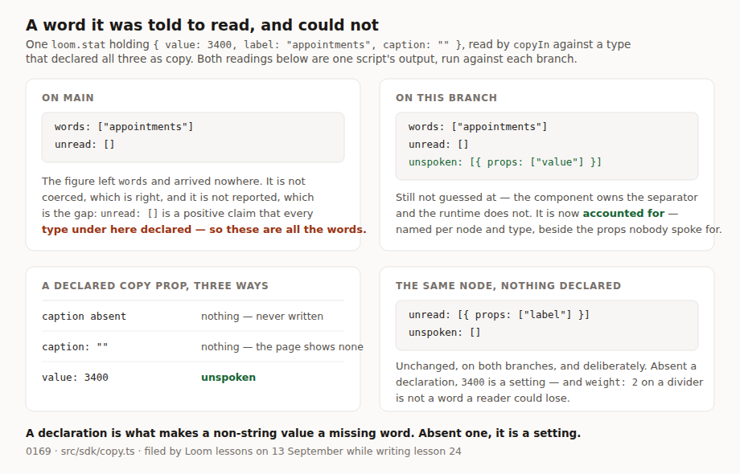

# A word it was told to read, and could not

**Date:** 2026-09-18
**Routine:** `Loom daily build` — the framework core, `src/` except `src/primitives/`
**Branch:** `framework-42-a-word-it-could-not-say`
**Section:** §2 — Composition Runtime, in the authoring SDK's copy seam

## What this was

One open finding owned by this lane, filed by `Loom lessons` on 13 September
while writing lesson 24 — which teaches this seam and prints its answers, which
is how the case was found.

`copyIn` exists to keep one promise, from
[0122](../decisions/0122-a-primitive-says-which-of-its-props-a-reader-reads.md):
a reading of a node's words never rounds *I cannot tell you* down to *there are
none*. It returns a shape rather than a list for that reason alone. There was a
case where it did exactly what it was built to prevent, reached by two rules that
are each individually right:

- a declared copy prop whose value is not a string is **skipped, not coerced** —
  `loom.stat` renders `3400` as *3,400*, the component owns the separator and the
  runtime does not;
- `unread` carries only types that declared **nothing**, because a declaration is
  trusted about its exclusions.

Composed: a `loom.stat` that has declared `value` as copy and holds the number
`3400` reads as `words: ["appointments"], unread: []`. The figure is gone, and
`unread: []` is not silence — it is a positive claim that every type under the
node declared, which a caller is entitled to read as *these are all the words*.

## The migration

**Nothing to do, and nothing half-done.** `apps/loom` has been on `main` with its
four route groups since 19 August; `apps/portal` and `apps/docs` are gone. The
brief this routine runs under still opens by naming the one-application migration
as the next unit, which is now the fourth run in a row to say so — #320 and #328
both flagged it. The tree is not half-migrated before or after this run and no
routine is waiting on its shape. The brief also lists the demo as this lane's,
where `docs/routines.md` has given `(demo)` to `Loom demo` since 20 August; I left
it alone.

## What landed

### A third answer, `unspoken`

`NodeCopy` has a third field. A declared copy prop holding a value that is not a
string is reported per node — the node id, its type, and the props in declaration
order. The value is still never coerced. What changed is that the gap is handed
back rather than dropped.

Measured, both readings one script's output run against each branch:

| | on `main` | on this branch |
| --- | --- | --- |
| `words` | `["appointments"]` | `["appointments"]` |
| `unread` | `[]` | `[]` |
| `unspoken` | — | `[{ type: "loom.stat", props: ["value"] }]` |

Three cases on the declared side and only the third is unspoken: a prop that is
not set reports nothing (a caption nobody wrote is not a word the reading lost);
a blank or whitespace-only string reports nothing (the page shows nothing there,
so the reading and the page agree); a value that is set and is not a string is a
word owed and not given.

### The asymmetry, decided rather than inherited

The finding called the undeclared side *the same hole from the other direction* —
a node under a type that said nothing reports `unread: ["label"]` and never names
`value`. **I did not close that half, and 0169 says why rather than leaving it
implied.**

`copy.test.ts` already pins that a `loom.divider` holding `weight: 2` reports
nothing at all, and with 0 of 96 primitives declaring copy today, *every* reading
in this repository takes the undeclared branch. Widening `unread.props` to every
prop would put a numeric setting from every layout primitive in the library into
a list a reader is shown as words a change might take away. And the two sides are
not equal: on the undeclared side **the node is named already**, so a caller
knows not to trust `words` for it; on the declared side the node appeared
nowhere. That is the record's title — a declaration is what makes a non-string
value a missing word; absent one, it is a setting.

It is one line either way, the argument is in 0169's alternatives, and the
finding's filer is told plainly in the ledger that their half was answered
against them.

## Decisions I made that nothing specified

**The name.** `unreadable` is the accurate English and matches the house `un-`
participle (`unread`, `unprobedProps`). I rejected it on collision:
`(portal)/_lib/proposal-effect.ts` already calls `copyIn`'s **`unread`** list
`UnreadablePart` on the screen a reviewer reads. A second concept one letter of
attention away from the first, in the seam and on the surface at once, is a
review nobody wins.

**A new field rather than a reason on `UnreadCopy`.** One list is fewer moving
parts and it is the more faithful-looking option. Rejected on what a caller does
with them: the portal groups `unread` by **type**, because *declare `copy` on
`loom.stat`* is the one thing somebody does about it. The remedy for an unspoken
prop is not a declaration — the declaration exists — it is a formatted string, and
it is per node. Two lists grouped differently and acted on differently are two
lists.

**Blank strings are not unspoken.** A declared prop holding `""` shows nothing on
the page and reports nothing here, which agree. Only a value the page renders and
the reading cannot is a gap.

## Records

[0169 — A declaration is what makes a value a missing word](../decisions/0169-a-declaration-is-what-makes-a-value-a-missing-word.md),
Accepted. Nothing superseded. 0167 and 0168 are claimed on two open branches
(#328 and #329), so this took the next free number after re-reading `main` and
both.

## Findings

**Closed two.**

- *13 September — a copy prop whose value is not a string vanishes from both
  halves of `copyIn`'s answer*, by this branch, with the undeclared half decided
  against the finding and the reason written into the ledger entry.
- *15 September — the capture half has no mouth*, which **was already closed and
  the entry outlived it.** Its two sibling entries of 14 September were marked
  closed by `framework-37-the-mouth`; this one was written a day later against
  the same gap and nobody came back to it. Both halves are on `main` —
  `apps/loom/app/api/reader-signals/route.ts` (#312, shaped by
  [0161](../decisions/0161-a-public-page-writes-to-one-application-endpoint-and-is-counted-by-a-key-that-outlives-nothing.md))
  and `apps/loom/scripts/signals-collect.ts` (`framework-35`). The entry's own
  evidence was `grep -rn "ingestReaderSignals" apps/` returning nothing; it
  returns three matches today. This lane built both halves and owed the
  correction.

**Filed two.**

- For `Loom portal` — the proposal card reads two of the seam's three answers, and
  `unspoken` wants a per-node shape rather than the per-type grouping `unread`
  has. Nothing on screen changes until the first primitive declares `copy`.
- For `Loom lessons` — lesson 24 teaches this seam and is one field short in three
  places. **No transcript breaks**: exercise G's `report` helper prints `words`
  and `unread` by name rather than the whole reading, so every printed line is
  the line it was. That is the lesson's own design doing its job.

## Still blocked, and not by me

[0166](../decisions/0166-a-level-the-scale-cannot-place-is-the-heaviest-one.md)'s
**decision 3 remains Proposed**: `rankOf` still answers `-1` for a level the
scale cannot place, so an unplaceable stake level ranks beneath `low` and the
Gate waves it through where it refuses `critical`. It is ten lines and it turns
`pnpm verify` red for four surfaces until lesson 25's worked example is rewritten,
which is `Loom lessons`' content and not this lane's. `lessons/25-exhaustiveness.md`
is unchanged on `main` as of today. `stake-level.test.ts` still pins the wrong
direction on purpose, with a comment saying so.

## Open questions

- **Should `unspoken` reach the reviewer's card as a count or as a list?** The
  portal's call, filed. A count keeps the card quiet; a list is what a person
  needs to go and fix a figure.
- **Is the undeclared side's string filter the right line?** I think so and 0169
  argues it, but the lane that filed the finding may have a case I have not seen,
  and it is one line to reverse.

## Test numbers

`pnpm install && pnpm verify` — **green, exit 0**, read from the file rather than
through a pipe. Nothing skipped, nothing weakened, no test deleted.

| suite | before | after |
| --- | --- | --- |
| runtime (`src/`, `tools/`) | 2,721 in 153 files | **2,730** in 153 files |
| application (`apps/loom`) | 4,756 in 271 files | 4,756 in 271 files |

`src/sdk/copy.test.ts`: **13 tests → 22**. The nine added cover the reported
prop, the node staying out of `unread`, `null` and object values, an unset
declared prop, a blank declared value, two stats reported separately, the
undeclared `weight: 2` case that pins the asymmetry, a declared name off `Object.prototype`, and the shared frozen
reading's identity.

The generated API reference was regenerated (`pnpm --filter @loom/app docs:api`)
because a new exported type, `UnspokenCopy`, is published from
`@loom/runtime/sdk`. That file is `Loom docs`' by content and the drift check
makes regenerating it part of any diff that changes an export — one line in this
report per `docs/routines.md`.
