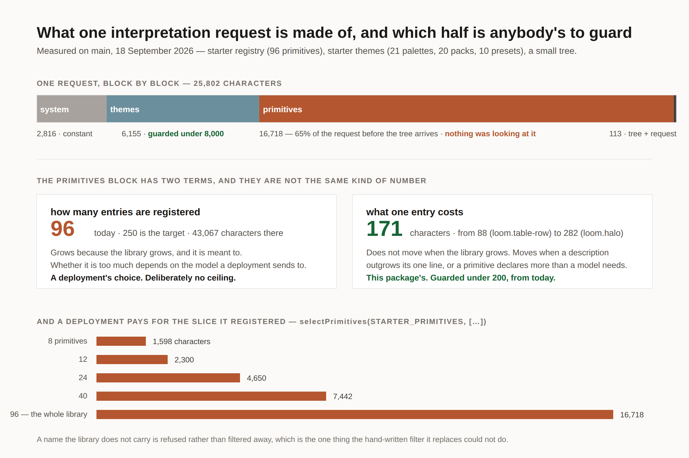

# What one entry costs

**Date:** 2026-09-18
**Routine:** `Loom daily build` — the framework core, `src/` except `src/primitives/`
**Branch:** `framework-43-what-one-entry-costs`
**Section:** §4 — Framework SDK, measured through the §2 interpretation prompt

## What this was

The one open finding in this lane's queue that the **maintainer** raised
personally: `Loom primitives` filed it on 13 September, against the instruction
that *"if increasing the number of primitives is producing a scaling issue with
the framework itself, we will have to figure this out."* The target is 250
starter primitives. The library was 92 entries when it was filed and is 96 today.

Measured again on `main` this run, so the numbers in the picture are this
morning's rather than last week's:

| block | characters per request | guarded before today |
| --- | --- | --- |
| system prompt | 2,816 | constant, and cacheable |
| themes (21 palettes, 20 packs, 10 presets) | 6,155 | **yes — under 8,000** |
| primitives (96 entries) | **16,718** | **no** |
| tree + request | 113 | — |

The primitives block is 65% of a request before the tree arrives, grows at about
171 characters an entry, and nothing was looking at it. At 250 entries it is
roughly 43,000 characters — about 11k tokens on every interpretation request.

## The answer, and why it is not the one that was asked for

The finding proposed three pieces. Two are built, one is declined and re-filed,
and the first is built **somewhere other than where the finding put it**. That
last part is the substance of the run, so it goes first.

### The obvious ceiling is the wrong ceiling

The finding's first piece is a budget over the primitives block, matching the
one the themes block already has. It is a five-line test and it would be a
mistake.

It would fire on exactly the growth the library is being grown for. `pnpm verify`
is now the merge gate for four surfaces, so it would fire as a red build in five
lanes that did not cause it, on a morning when somebody registered the
ninety-seventh primitive. And it would be raised, every time, without being read
— which teaches every lane that a budget is a number you edit. **A ceiling nobody
believes is worse than no ceiling.**

The finding also contains the thing that dissolves the problem, stated as an
aside:

> **The starter library is a set to choose from, not a set every deployment
> ships.**

That is true, and nothing in the package behaved as though it were. So the split
this run makes, recorded as
[0170](../decisions/0170-a-library-is-a-set-to-choose-from-and-a-vocabulary-is-priced-per-entry.md):

**How many entries a deployment registers is the deployment's.** It grows because
the library grows, and whether it is too much depends on the model that
deployment sends to and the latency it will accept. No ceiling here can know
that, so there is deliberately none — and no budget constant is exported either,
because a number shipped from this package would be a guess about somebody
else's model with a ceiling's authority.

**What one entry costs is this package's.** It does not move when the library
grows. It moves when a description outgrows the one line it is meant to be, or a
primitive declares more props than a model needs shown — which is the framework
getting more expensive rather than a host choosing to spend more. That is the
half worth guarding and the half nothing was watching.

### What landed

**`measureCatalogue(catalogue)`** — in the prompt seam, beside `measurePrompt`.
It reports the block as sent, what each entry costs, and the mean. An entry's
cost is its rendered line and the newline that ends it, taken through
`renderCatalogue` rather than counted from the fields, for the reason
`UserMessageParts` exists one function up: a second way of working out what an
entry looks like is a second thing to keep in step.

**`selectPrimitives(entries, types)`** — in `@loom/runtime/sdk`, the inverse of
`createStarterPrimitiveRegistry`'s `additional`. It returns the named entries in
the library's own order, or refuses, naming **every** type the library does not
carry rather than the first — because a selection is a list a person wrote in one
sitting, and all of its mistakes are mistakes now. That refusal is the whole
point of it existing: the hand-written `filter` it replaces answers a typo with a
smaller registry and no complaint, and the deployment finds out when a page fails
to draw.

It takes entries rather than reaching into `src/primitives/`, so it slices any
library including one a host wrote, and it stays out of another lane's directory.

**The guard, on `perEntry`.** Under 200 characters against today's 171. Its
failure message says what to look at. A second guard holds the instruction
wrapped around the list under 500, because that part is paid by every deployment
whatever it registered; it is 318 today.

### The piece that was declined

The finding's third piece is a wider `PrimitiveRole` — `band`, `item`, `leaf`,
`wrapper`, `control` — so a deployment could ask the registry for a coherent
slice instead of naming one. It is a good idea and this run did not build it.

Widening the vocabulary is five lines in `src/role.ts`, which is this lane's. The
**declarations** are `role: "band"` on ninety-six entries in `src/primitives/`,
which is not. A vocabulary landed on one side of that boundary and declared on
nobody's answers `[]` to every question about it for as long as that lasts, and
0114 set the bar for widening `PrimitiveRole` at *a consumer that cannot answer
its question from the registry* — a bar about consumers, not about how many
members a type has. Filed for `Loom primitives` with the two questions this lane
cannot answer from outside their directory, and an offer to land the vocabulary
in one run ahead of their declarations.

## Decisions taken that were not specified

- **The guard goes on the mean per entry, not on the block.** Argued above and in
  0170. The finding asked for the block; this is a considered refusal of its
  first piece rather than an oversight, and the record says so.
- **No `catalogueFits(cost, budget)` predicate.** It is `cost.characters > budget`
  written on the caller's side of a comparison the caller has both sides of.
  Worth adding the day something in this package would act on the answer.
- **A name given twice selects one entry.** A registry refuses a duplicate type,
  so passing a repetition through would turn a harmless one in a host's list into
  a refusal two calls later. Tested.
- **README gained a *Registering part of a library* section.** The `src/` doc
  comments reach the API reference automatically; the thing a host reads to
  decide what to register is the README, and a seam nobody knows about is a seam
  nobody uses.

## Records

- **Added:** [0170 — A library is a set to choose from, and a vocabulary is priced
  per entry](../decisions/0170-a-library-is-a-set-to-choose-from-and-a-vocabulary-is-priced-per-entry.md).
  Six alternatives recorded, including the ceiling this run declined to build and
  the role vocabulary it declined to land alone.
- **Superseded:** none.

## Findings

**Closed — five, and four of them needed no source change.**

- *the primitives block has no ceiling, the themes block does, and a deployment
  cannot register a slice* (13 September, maintainer-raised). Closed with the
  per-piece account above.
- *a hold store has no deployment-wide read* (1 September, `Loom portal`).
  **Already built.** `HoldStore.waiting(request?)` has been on `main` since #282,
  in the shape that entry asked for — bounded, cursored by `(heldAt, proposalId)`,
  in both implementations and under the contract suite. The status was never
  updated. The rail badge that entry says is *"worth adding the day this is
  taken"* is `Loom portal`'s, and the day has come.
- *a change nobody answered for three days is already dead* (7 September,
  `Loom docs`) and its 11 September second data point. **Already built.**
  `src/write/liveness.ts` is the recommended helper — `holdLiveness`, `markHolds`,
  `markHoldsFromStore` — landed with #282. The 11 September entry predicted that
  the helper landing would mean *Answering a held change* is rewritten rather than
  extended; that rewrite is now `Loom docs`' to make.

- *`docs/routines.md` gives the opposite instruction about a commit author twice,
  in two sections* (16 September, `Loom portal`). The entry recommends dating or
  deleting the earlier section and says only the file's owner should do it; this
  lane is the owner. Dated rather than deleted — the earlier section now opens
  with a note saying the later one is current, and why it is kept. Neither
  section's words were changed. `docs/routines.md` is the one file in this diff
  outside `src/`, the README and this report.

Three entries reading as open on a run eleven days after the code landed is worth
naming as a class: **a finding is closed by an edit somebody has to remember to
make, and the branch that fixes it merges without one.** No mechanism catches it,
and `pnpm findings:check` cannot — a status is prose and *open* is not a
falsifiable claim about a repository. This run found them by reading the source
before choosing work, which is luck rather than process. Not filed as a separate
entry because the remedy is a habit rather than a change, and the habit belongs
in every brief: *close the finding in the same branch as the fix.*

**Filed — two, both for `Loom primitives`.**

- *a deployment can now register a slice by name, and cannot ask for one by kind*
  — the role vocabulary, with what would make it worth landing.
- *the README says the starter library ships ten, and it ships ninety-six* — the
  sentence and its ten-row table under **The starter primitives**, stale by
  eighty-six. Filed rather than fixed because the honest replacement is a judgment
  about their library.

## The migration

**Nothing to do.** `apps/loom` has been on `main` with its route groups since
19 August; `apps/portal` and `apps/docs` are gone. The brief still opens by naming
the one-application migration as this lane's next unit, which is now the fifth
consecutive run to report it as already done — #320, #328 and #330 each said so.
The tree is not half-migrated before or after this run and no routine is waiting
on its shape. The brief also lists the demo as this lane's, where
`docs/routines.md` has given `(demo)` to `Loom demo` since 20 August; left alone.

## Tests

`pnpm install && pnpm verify` — **green, exit 0.** Read from the log rather than
through a pipe.

| | before | after |
| --- | --- | --- |
| `@loom/runtime` | 153 files / 2,761 tests | **154 files / 2,778 tests** |
| `@loom/app` | 276 files / 4,837 tests | 276 files / 4,837 tests |
| findings | 681, 0 malformed | **683, 0 malformed** |
| prerender | 107 pages, 855 junctions, 0 run together | unchanged |

**Seventeen tests added, none weakened, nothing skipped.** Eleven on
`selectPrimitives` — order, the empty selection, the whole library, a refused
name, every missing name rather than the first, a repeated name, and that the
slice builds a working registry. Six on `measureCatalogue` — that it measures the
block `measurePrompt` actually reports, that an empty catalogue costs nothing,
that it names every entry in order, the instruction guard, the per-entry guard,
and that a twelve-entry slice costs the twelve entries it registered and under a
quarter of the whole.

`apps/loom/app/(docs)/_lib/api/reference.generated.json` regenerated after the
build, as a new export requires: 16 entry points, 1,073 exports.

## Open questions

1. **Is the per-entry figure the right thing to guard, or does the maintainer
   want a hard ceiling on the block anyway?** This run argued no and built the
   alternative. If the answer is that a number nobody may exceed is worth the
   red builds, it is one test and the record gets superseded rather than edited.
2. **Should the role vocabulary land ahead of its declarations?** This lane can
   do it in a run. It needs `Loom primitives` to say the five members partition
   their library — a `loom.split` is arguably a band and a wrapper at once — and
   a closed vocabulary declared ninety-six times is not cheap to change.
3. **Nothing in this repository registers a slice.** Every surface takes the
   whole starter library, which is the right default for a demonstration. The
   seam is therefore exercised by tests and by nothing that runs, which is the
   weaker kind of evidence, and it is worth knowing that it stays that way until
   a deployment that is not ours has an opinion.
