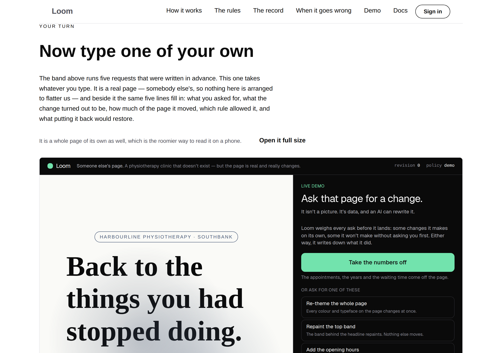
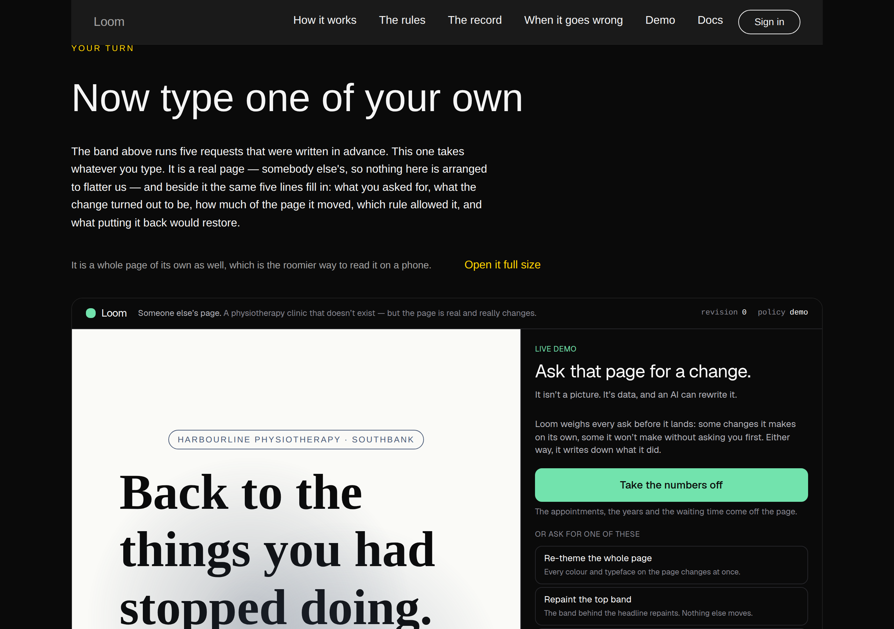
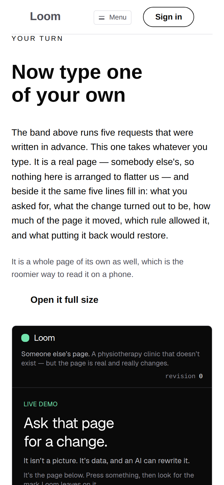

# 2026-09-18 — marketing: the site stops pointing at the demonstration and contains it

§4d has said since the plan was written that the marketing site **embeds the
demonstration rather than describing it**, and that this is the whole reason the
demonstration is public at all
([0056](../decisions/0056-the-demo-is-public-and-shares-nothing-but-the-deployment.md)).
For a fortnight it did not, and the reason was never a judgement about whether it
should.

**It was built on 4 September and withdrawn the same run.** The frame rendered
perfectly, the allowlist permitted it, and pressing the large green button inside
it did nothing at all: every control in `/demo` is a server action reached
through a form element, and `loom.embed`'s sandbox had no `allow-forms`. On a
site whose entire argument is that it can always tell you what happened, a button
that silently does nothing is materially worse than the link it would have
replaced. Nothing shipped, and two findings went to `Loom primitives` instead.

Both came back on 12 September —
[0135](../decisions/0135-a-same-origin-frame-is-granted-what-its-own-document-needs.md)
grants `allow-forms` to a frame the deployment's own registry resolved as its
own, and `aspect: "adaptive"` gives a framed application a different shape at a
different width. The entry closing the first of them ends *"§4d is unblocked, and
the band can be rebuilt."* This is the rebuild.



---

## What shipped

**One band, and the front door's oldest apology retired.**

The band above it runs five requests written in advance, and its closing line has
said so since 22 August: the hero promises *ask for a change in your own words*
and the band offers buttons. The reason is real and unchanged — a text box on the
most-loaded page the project has is a model call for every visitor and a dead
control on every deployment without a key — and the answer has always been *there
is a page for that*, one click away.

A visitor who has just watched the sequence run is the likeliest person on the
site to want a turn at it, and that is the worst possible moment to ask them to
leave. So the page for that is now the band directly below, framed, and the
sentence above it points down rather than away.

| file | what it is |
| --- | --- |
| `_lib/frames.ts` | the one origin this site frames — its own — and the split between a diagnostic that is a fault and one that is a disclosure |
| `_lib/pages/in-your-own-words.ts` | the band: a `loom.embed` of `/demo`, the way out, and the argument for both |
| `_lib/render.ts` | `renderTree(page, { addressed, origin })`, so the allowlist is built from the origin the tree was built for |
| `_lib/pages/see-it-happen.ts` | *"there is a page for that"* → *"the next band down is a page you can type into"* |

**Nothing was added to the primitive library and nothing in `src/` was opened.**
The band is `loom.section`, `loom.prose`, `loom.stack`, `loom.action` and
`loom.embed` — the fifth of which had never been rendered anywhere in this
repository until today.

---

## The thing that had to be checked in a browser, because it is the thing that failed last time

A screenshot would have passed on 4 September. So the measurement is a press,
in Chromium, against `next start` on the built application, inside the frame on
the front door:

```
pressing: "Take the numbers off"
changed:  true          (3,924 → 4,873 characters of framed document)
new:      “Take the numbers band off the page.”
          Loom will not make this change until you say yes.
          asked by a demo visitor
          WHAT LOOM WEIGHED — Some risk. Worth a look before you say yes…
```

The server action ran, the Gate held the change, and the record filled in beside
it — inside a box on the landing page. That is the sentence this surface has been
trying to make true since 4 September.

And what the browser is served, which is where the difference lives:

```html
<iframe src="http://localhost:3000/demo"
        sandbox="allow-scripts allow-same-origin allow-presentation allow-forms"
        loading="lazy" …>
```

`allow-forms` is granted by the seam because the registry resolved the URL as
`self` — a host decision, in code, never a prop a model can set (0135).
`allow-top-navigation` is still withheld, and `frames.test.ts` asserts both.

---

## Two things that cost the hour, and neither is a defect anywhere

Filed for the three lanes the 1 September `loom.embed` entry still names.

**The origin has to reach the render from the same place the tree got it.** This
site builds absolute URLs from a `context.origin`, and the render was consulting
`siteOrigin()` for the allowlist. Every page test renders a tree built for
`https://loom.example`, so every one of them refused the site's own frame. It is
a signature change rather than a lookup, and it is the shape any surface with a
per-deployment origin will need.

**`frame-same-origin` is a diagnostic and is not a fault.** Every page test here
asserted `diagnostics` is empty, which was the same sentence as *nothing the
runtime could not honour* right up until the site framed something. Fifteen tests
went red on a render that had done nothing wrong.

`unhonoured` is the split, and it is the strict reading rather than the lenient
one: the original claim is held exactly, and the disclosure is **required** rather
than tolerated. `frames.test.ts` asserts the front door emits exactly one, naming
the node and the origin, and that the site's other nine pages emit none.

---

## Measured: the frame, at three widths

Against the built application, on the shipping band.

| viewport | frame | the demonstration's first control, inside it |
| --- | --- | --- |
| 1440 | 1078 × 673 | **470px in** — in view, nothing to scroll |
| 1280 | 1078 × 673 | **470px in** — in view |
| 390 | 348 × 465 | **778px in** — 313px below the fold of the box |

`adaptive` is exactly right on a laptop and not enough on a phone, which is a
measurement rather than a complaint: no fixed ratio ships this band at all, and
the alternative it replaced (`square`) showed the same thing with 115px less
room. It is filed for `Loom primitives` with the numbers.

**What this lane did about it is the half that is ours: the *Open it full size*
link is above the frame rather than below it.** Below, it sits behind 465px of
box on exactly the device that cannot use the box. Above, it is the first thing
the reader who needs it meets — and it reads correctly on a laptop too, because
it is written as an offer rather than as a reaction to a frame the reader has not
seen yet.

| | |
| --- | --- |
|  |  |

`scrollWidth 1280 / innerWidth 1280` and `390 / 390` — no overflow at either
width, in either palette. No colour is named anywhere in the diff.

---

## Found while building: the front door can contain a copy of itself

`DemoBar` links its wordmark to `/`, which was right when the only way to meet
that bar was to open `/demo` directly. Clicked inside the frame, with the top
page at `/`:

```
top url:  http://localhost:3000/        (unchanged — allow-top-navigation is withheld)
frames:   http://localhost:3000/        ← the front door, inside the frame
          http://localhost:3000/demo    ← and its own embed, inside that
```

The sandbox behaves correctly and the top-level page does not move, which is the
grant that matters. What a visitor gets is the front door rendered inside a box,
one click deep, with a working back button — cosmetic, and not something this
lane can fix: the `src` is mine and the bar inside it is `Loom demo`'s.
`target="_top"` is not the answer either, because it would be blocked and the
wordmark would become the silently-dead button the whole demonstration argues
against.

Filed for `Loom demo` with a recommended shape — the bar reading
`window.self !== window.top` and rendering the wordmark as plain text when it is
framed, which needs no coordination with this lane and is right for any host that
frames the demonstration.

---

## What the band costs the deployment, which is nothing until it is scrolled to

Three properties, all of them recorded before this run and all of them the reason
this was safe to put on the front door at all:

- **The frame is `loading="lazy"`**, set by the primitive. A visitor who never
  reaches the fourth band never fetches `/demo`.
- **A demonstration page view allocates nothing on the instance.** Its store is
  created on first change, not on arrival (0056), so framing it does not mint a
  session for every front-door visitor.
- **It works with no model configured.** The presets need no key
  ([0057](../decisions/0057-a-preset-is-a-deterministic-interpreter.md)), which
  is what the press above exercised.

---

## Tests

`pnpm install && pnpm verify` — **green, exit 0. Nothing failed, nothing skipped,
no test weakened or deleted.**

| suite | `main` at `e97b88b` | this branch |
| --- | --- | --- |
| `@loom/runtime` | 153 files / 2,721 tests | **153 / 2,721** — `src/` was not opened |
| `@loom/app` | 271 files / 4,756 tests | **272 / 4,782** |
| marketing, within it | 36 files / 1,557 tests | **37 / 1,583** |

The `main` numbers were measured by checking `main` out into a worktree and
running the suites, not quoted from a report.

`findings:check` reads 670 entries, 0 malformed. `prerender:check` reports 107
pages and 850 junctions, 0 run together — the marketing route group contributes
none of those, because every page of it reads `searchParams` and so has never
been in that count.

**26 tests are new**, 24 of them in one new file. `frames.test.ts` covers the
registry (4), the framed band (7 — including the sandbox, which is the assertion
the withdrawn band needed and did not have), a frame this deployment did not
register (2), and the other nine pages framing nothing (9). Two more are in
`pages.test.ts`: the fragment link landing on a band that is actually there, and
the demonstration being framed rather than pointed at.

### Mutations

Eleven defects restored one at a time against a committed baseline. **All eleven
were caught.**

| mutation | result |
| --- | --- |
| `self` dropped from the registration — the frame renders and cannot be used | **5 red** |
| the render is given no allowlist at all | **21 red** |
| the render reads the environment instead of the caller's origin | **21 red** |
| a fixed shape instead of the adaptive one | **1 red** |
| the way out moved back below the frame | **1 red** |
| the band loses its anchor | **2 red** |
| the frame points at a third-party origin | **22 red** |
| the disclosure treated as a failure | **15 red** |
| every diagnostic treated as a disclosure | **1 red** |
| the band dropped from the page | **13 red** |
| the link above points at `/demo` again | **1 red** |

The first is the one worth the space: dropping `self` is exactly the September
failure — a frame that is permitted, renders perfectly, and ignores every press —
and it is now five failing tests rather than a thing a screenshot cannot show.

---

## Decisions and findings

**No record written.** Nothing here is constrained outside this route group and
no Accepted record is touched: 0056 already says §4d embeds the demonstration,
0095 already puts the allowlist with the deployment, and 0135 already grants a
same-origin frame what its own document needs. This is those three being used.

**One finding closed** — the 1 September trap, *nothing renders `loom.embed`, so
nothing wires `origins`, and the first surface that tries will think it is
broken*, for this lane. It behaved exactly as filed: the first render was the
grey box, and the fix was the three lines the entry printed.

**Two findings filed.** The nested wordmark, for `Loom demo`. And `adaptive`'s
narrow shape, for `Loom primitives`, with the three measurements — recorded
because the number is only obtainable by framing an application and this is the
first one that ever has been.

## Needs your input

- **The band's heading and its opening sentence are mine**, and they are the only
  new copy on the site. They claim nothing about who the product is for, what it
  costs or who it is sold to. Re-word freely.
- **The licence line** (#96, on every marketing PR since #134). Still the site's
  one placeholder.
- **Positioning, audience and pricing.** Untouched, as always.

Nothing scheduled and nothing armed.
