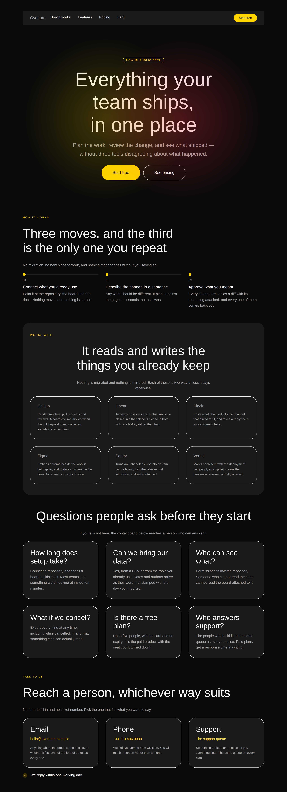

# The page points at itself — nineteen anchors, and nothing that pointed at one

**Routine:** `Loom primitives` · **Date:** 2026-09-18 · **Branch:**
`primitives-38-the-page-points-at-itself` · **Section:** §4b



## What this run chose, and why that

The queue decided it rather than the plan. The oldest open finding owned by this
lane was filed by **the maintainer**, on 12 September, building
`prototypes/ski-apparel`:

> Found building `prototypes/ski-apparel`, a single long page with a nav bar
> across the top. `href: "#helmets"` is refused, so the page uses
> `href: "/#helmets"` instead — which works here only because the page *is* the
> site root.

Reading `src/primitives/url.ts` to size the work turned up that **it was already
fixed** — shipped on #294 on 14 September, with a careful header explaining
exactly why a fragment is the one href the scheme allowlist has no opinion about.
Nobody had moved the finding's Status, so it sat in the queue for four days
looking like work.

That is a two-minute correction and it is not what this run is about. What the
two minutes bought was the question *fine — so who uses it?*, and the answer was
**nobody**:

| | |
| --- | --- |
| bands in the catalogue | 27 |
| bands carrying an `anchor` | 19, unique over the page since [0165](../decisions/0165-an-anchor-belongs-to-the-part-and-is-unique-over-the-assembled-page.md) |
| links in the catalogue pointing at one of them | **0** |

`navBand` — the band whose entire job is to be the page's own navigation, and
the band `anchor.ts` names in its own header as *the* reason anchors exist
(*"the bands a page's own navigation points at, and nothing else"*) — pointed at
`/product`, `/pricing`, `/docs` and `/changelog`. Four routes of a site that does
not exist, on a page that has a section for each of them.

So the run is that, plus the breadth half the brief also asks for: **three
second designs, catalogue 27 → 30.**

## The part that could not have been noticed by reading

This is the bit worth the reviewer's attention, because the defect was not an
oversight. `compositions.test.ts` asserted this of every href in every band:

```ts
expect(href.startsWith("/")).toBe(true)
```

The catalogue was **structurally barred** from using the mechanism the maintainer
had asked for and been given. A fragment would have turned the build red.

The test's doc comment gives its reason, and the reason is right — *"a live
outbound link in it is a link this library chose on a host's behalf"*. The rule
is not that reason. It is a **proxy** for it, and the proxy excludes one
destination the reason has no objection to. A path reaches this origin;
`#pricing` reaches **no origin at all**, which is a stronger form of the same
property, not an exception to it.

What makes this a category rather than a slip is how it fails. A test that is too
loose ships a defect and somebody eventually gets bitten. A test whose rule is
narrower than its reason makes **a capability unreachable and produces no failure
at all** — a schema and a test disagreed for four days about what was legal, and
the one that disagreed by being narrower wins silently. It is filed with that
framing and without a proposal I believe in, because the honest instrument for it
is a reviewer reading an assertion against the prose above it, which is what
happened here only by accident.

## What is now checked, and where

[0168](../decisions/0168-a-band-links-into-the-page-it-is-assembled-into.md).
Two assertions replace the one:

**Every fragment on the assembled page names an anchor that exists on it.** This
is the whole-tree walk `url.ts` asked for in writing and correctly declined to
fake:

> **It does not check that the anchor exists.** That is the same fact about a
> tree rather than about a node that `anchor.ts` records for uniqueness, and it
> belongs to whatever walks the whole tree. A schema that pretended to enforce
> it would be enforcing nothing.

It is made of `PAGE_SEQUENCE` and not of `STARTER_COMPOSITIONS`, which is the
load-bearing detail: **a band may legitimately link to an anchor it does not
carry** — that is what a nav bar *is* — so a per-band version would fail on the
one band it was written for. It pairs with 0165's uniqueness check, which is made
of the same list for the same reason. One refuses two bands answering to one
name; this one refuses a name nothing answers to. A page can fail either while
passing the other, and both failures are equally silent.

**The link rule becomes *reaches this origin, or reaches none*** — a path, a
fragment, or `mailto:`/`tel:`, two schemes [0053](../decisions/0053-a-url-in-the-tree-is-checked-against-a-scheme-allowlist.md)
has allowed since it was written and the catalogue had never used. That widening
is bounded by a second assertion rather than by good intentions, because *reaches
no origin* is a fact about the scheme and says nothing about the address: every
mail and telephone address the catalogue ships must sit in a **reserved**
namespace that provably resolves nowhere. It is the mechanism `url.ts` already
uses one layer down, where `SAME_ORIGIN_PROBE` is `https://loom.invalid`.

## Which Hermes fields became nodes, and which stayed props

Nothing was ported from Hermes this run — all three designs are second designs of
parts the catalogue already has, so the granularity questions are about the
*catalogue's* own content model rather than about a block's fields. Answered in
0052's terms anyway, because that is the question the brief asks:

| | became nodes | stayed props |
| --- | --- | --- |
| **`faq-grid`** | the question and the answer, which are a `loom.heading` and a `loom.prose` inside a `loom.card` where the canonical has them as two props of one `loom.faq` | `columns`, `gap`, `align` on the grid — none changes the set of children |
| **`contact-details`** | each route: card, link, prose. A `loom.contact` with `email`/`phone`/`address` props would be 0052's mistake in its purest form, and *add a fourth way to reach us* is the edit this band gets most | `tone`, `padding`; and the reply promise stays a single `loom.perk`, because it is one claim about all three rather than a fourth route |
| **`integrations-grid`** | each integration: card, wordmark, sentence | `tone: "outline"` on the cards, which is the one prop that differs from `faq-grid`'s and changes no node |

**The near-miss, and it is a real one.** `loom.faq-list` already takes
`columns: "one" | "two"`, so *the FAQ in two columns* is **one `configure`** and
shipping that as a catalogue entry would be exactly what
[0162](../decisions/0162-the-catalogue-is-a-phrasebook-and-the-page-is-one-path-through-it.md)
refuses. `faq-grid` is not that: it builds a `loom.grid` of `loom.card` where the
canonical builds a `loom.faq-list` of `loom.faq`, and there is no `<details>` in
the output at all. What changes for a reader is not the column count but whether
there is anything to click. The two-column variant of the canonical remains one
`configure` and is still the right way to get it.

**0162 also bit its author, which is the first evidence it is load-bearing.** The
obvious way to ship the nav fix was a *second* nav design that used fragments,
leaving the original alone. That is forbidden, and correctly: the same four
`loom.link` nodes with different props is a `configure`, not a design. So the
band had to be fixed in place and the decision argued rather than sidestepped.

## The three designs

| design | part | why this one |
| --- | --- | --- |
| **`integrations-grid`** | integrations | the orbit answers *does this fit my stack* and has nowhere to put a sentence. The reader one question further on — *does it open pull requests, or just post a link?* — is the one who converts |
| **`faq-grid`** | faq | a disclosure list says *there is a lot here, pick yours*; a grid of open answers says *this is all of it, and it is short*. The second is the stronger claim when it is true |
| **`contact-details`** | contact | the only contact band that needs no deployment behind it — and therefore the only one that photographs at full strength |

That last one is worth a paragraph, because it is a property of the *pair*.
`contactBand` ships without a submission endpoint, correctly, and so renders
**dimmed with a notice above it** in every shot this lane has taken since it
shipped. A `mailto:` needs no registry. So the pair is not *form versus
not-form*, it is **the band that needs a deployment behind it and the band that
does not**, and a catalogue with only the first has one part that cannot be
finished without leaving the catalogue.

The honest half of that, which is in the band's header: an address this catalogue
ships is **exactly as unfinished as the untargeted form**, and the form has the
better of it in one respect — it prints a notice, and a live-looking `mailto:`
prints nothing. What closes the gap is `overture.example` being legible as a
placeholder at a glance, without anything having to say so.

## The photograph, and the thing it cannot show

| | |
| --- | --- |
| [editorial, 1280](2026-09-18-primitives-the-page-points-at-itself-editorial-wide.png) | the bar, then `hero`, `steps`, and the three new bands |
| [bold, 1280](2026-09-18-primitives-the-page-points-at-itself-bold-wide.png) | the same, dark ground |
| [editorial, 390](2026-09-18-primitives-the-page-points-at-itself-editorial-phone.png) | `scrollWidth 390 / innerWidth 390` |
| [bold, 390](2026-09-18-primitives-the-page-points-at-itself-bold-phone.png) | `scrollWidth 390 / innerWidth 390` |

**A screenshot cannot show a destination.** The nav bar after this change is
pixel-identical to the nav bar before it — four menu items reading the same four
words, pointing at four sections in one and at four routes of a site that does
not exist in the other. Navigation is the one property a photograph has no access
to, because the picture is the same on both sides of the click.

So the weight in this run is carried by the assertion and the image carries the
three new bands, whose subject really is how they look. It is the adjacent case
to the marquee limit filed on 16 September — there a still cannot show motion,
here it cannot show a destination — and it is filed beside it with the same
recommendation of *nothing*, for a sharper reason: a harness *could* click a
fragment and photograph the target, and what it would produce is a picture of a
band the sheet already contains. There is no image that demonstrates *this link
arrives there*.

The sheet also shows `#top`, `#how-it-works`, `#integrations` and `#faq` as bands
under the bar. **`#features` and `#pricing` are not on it**, and a reader should
know that rather than infer it — on the assembled page they resolve, and the test
is what says so.

## The one thing the first photograph got wrong

`faq-grid`'s answers shipped at `size: "small"`, copied from the other card grids
in the catalogue. `loom.heading` couples its level to its size on purpose —
*"its level sets both the document outline and the size"* — so the question is
step 6 at **32px** and cannot be made smaller without lying about the outline.
Against a 13px answer that is a ratio of nearly three, and the card read as a
question with a footnote under it.

The answer is the content here, so it is body text. In `integrations-grid` the
small size is right, because the thing above it is a 14px wordmark and the
proportion holds — the rule is about the **pair**, which is why two bands built
in the same run differ on it.

## Checks

- `pnpm install && pnpm verify` green, **exit 0**, read from a file rather than
  through `tail` (`docs/routines.md`). Framework 153 files / **2,726** tests;
  application 271 files / **4,756** tests; **669 findings, 0 malformed**; 106
  prerendered pages. Nothing failed, nothing skipped, **no test weakened**.
- Every new band renders under both starter palettes with **no diagnostics** —
  the per-band test the suite already generates, which is what proves a node was
  not silently dropped.
- **Three defects restored, three caught**, each by the assertion that should and
  each with a legible message:

  | restored | what said so |
  | --- | --- |
  | a nav link to `#questions` | *`#questions` names no band on this page* |
  | `mailto:hello@overture.com` | *contact-details mails a real domain* |
  | `href: "https://support.github.com"` | *contact-details links to https://support.github.com* |

- **The restoration was done against a commit this time**, which is the lesson
  #313 recorded and #321 hit anyway. Commit first, then `sed` the defect in, then
  `git checkout HEAD -- <file>`. `git status` came back clean after all three.
- One citation defect caught by a test rather than by me: both new band modules
  linked `0162` to `…-a-design-earns-a-catalogue-entry-only-by-building-a-different-set-of-nodes.md`,
  which is the name the record had **before `Loom merge` renumbered it** on
  #313. `tools/decisions/decisions.test.ts` named both files and the wrong
  target. Worth knowing: a renumbered record leaves a plausible-looking dead link
  in anything written from memory of the old PR.
- No literal colour anywhere in the diff; every value is a token or a length.

## Open questions and what is still missing

**`21st.dev` re-verified blocked**, from this lane, which by the demo lane's
count makes it the fifteenth time it has been checked. `EGRESS_BLOCKED` from the
proxy, not a timeout. The existing findings cover it and this run did not file a
new one — the brief names it as the visual standard and it has never once been
reachable from a routine session.

**The 250 question has now gone unanswered for three runs** (#313, #321, and
this one). The target date was **yesterday**. This run took the catalogue 27 → 30
against a second row `docs/primitive-gap-inventory.md` sized at ~140 by 19
September. The lane's recommendation has not changed and is not repeated at
length here: a smaller catalogue that is uniformly good is the better thing to
put in front of a demo. It is in the pull request comment because it is the
maintainer's call, not buried in a report.

**What the library still cannot express.** Unchanged from #321 and worth
restating because neither moved:

- `COMPOSITION_PARTS` is closed at nineteen, so a newsletter strip, a careers
  band or a gallery needs the tuple widened first. Two runs have now judged that
  the right bar; this one did not re-decide it.
- Tier B — tabs, tooltip, dialog, dropdown, toast, lightbox, a pricing toggle —
  is nine primitives behind one framework decision about the behaviour
  vocabulary, and is still `Loom daily build`'s to open.
- The specimen harness photographs and cannot assert. Filed on 17 September and
  still the cheapest instrument available, because the expensive half exists.

## Outside the lane

Two generated files, neither edited by hand (0139):
`apps/loom/app/(docs)/_lib/api/reference.generated.json` and
`decisions/README.md`, regenerated with `pnpm decisions:index`.

Everything else is `src/primitives/` and `FINDINGS.md`. Nothing under `apps/` and
nothing in `src/` outside `src/primitives/` was edited.

**On the commit author.** `docs/routines.md` still gives two opposite
instructions — §"Commit identity" says to set it to `jonathanbravecredit`,
§"Commit identity, and the preview that goes missing" says not to set one at all.
`Loom portal` filed the contradiction on 16 September and #321 reported it again;
it is not this lane's to resolve. This run followed the second section, as #321
did: the session was already configured as `Claude <noreply@anthropic.com>`,
which both sections name as a known-good deploying identity.
