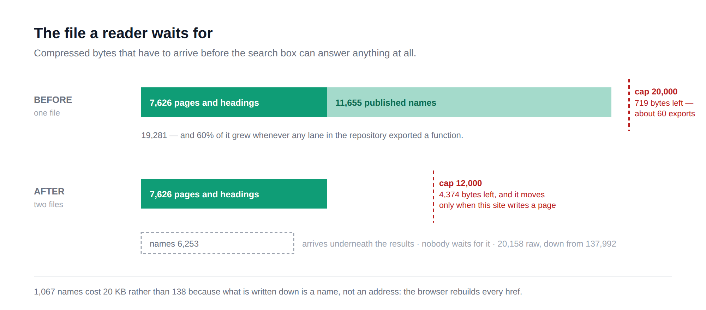
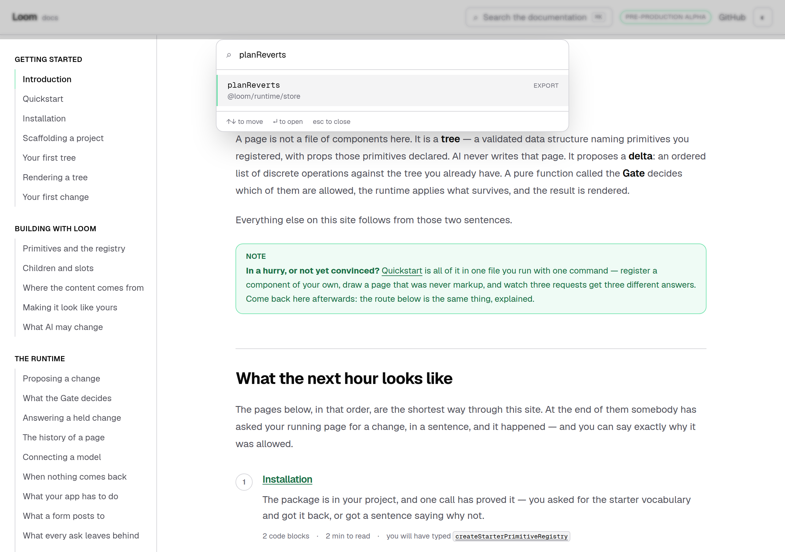
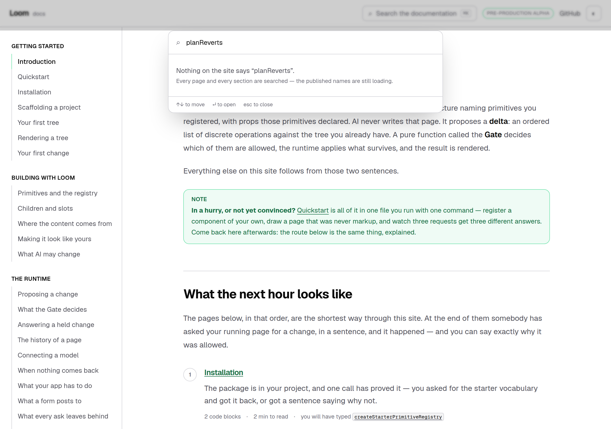
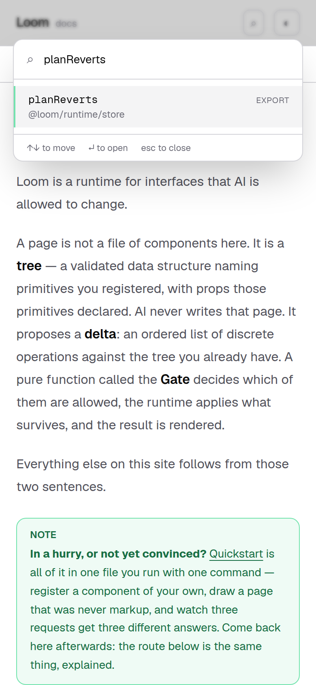

# 19 September 2026 — the half a reader waits for, and the thousand names that were in it

**Routine:** `Loom docs` · **Branch:** `docs-29-the-half-a-reader-waits-for` · **Section:** §4c

**Preview:** the pull request's Vercel deployment. Published unverified, as every
routine run's has been: `*.vercel.app` is off this sandbox's egress allowlist and
the proxy answers `403 CONNECT tunnel failed`. That is the standing 15 September
finding and is not re-filed. Every picture below is a production build of this
commit (`pnpm build && next start`), photographed in Chromium.

## What this run was

Not the plan. Two lanes had filed the same thing at this one, six days apart, and
this morning it was 719 bytes from turning `pnpm verify` red for four surfaces.

`Loom primitives`, 13 September:

> A composition costs about 167 characters of index. So the repository had five
> bands of room left this morning, has **one** now, and the sixth band anybody
> adds — in any lane, composition or page or export — turns `pnpm verify` red for
> everybody. […] **splitting the docs search index is `Loom docs`' architecture**
> — which file shards, on what axis, and what the client loads for a query. This
> lane cannot make that call.

`Loom daily build`, 14 September, having raised the raw ceiling from outside this
lane to keep the build green and said so plainly:

> **And the real one is closer than it looks.** Gzip went 17,863 → 18,408, so one
> subsystem spent a quarter of the remaining 2,137. Two more and the ceiling that
> matters is the one that fires.

Two more arrived. Measured on `main` at `ee9cb30` this morning: **19,281 bytes
against a 20,000-byte compressed cap.** About sixty more exports, for the whole
repository, and three of the four open pull requests were adding some.

Both findings are closed by this branch.

## The number was never about this site

The file a reader waits for carried 1,273 entries. **1,067 of them were published
export names** — 78% of it raw, 60% compressed. So the payload somebody sat in
front of before the search box could answer anything grew every time any lane in
this repository exported a function, which is a thing this surface does not do,
does not decide, and cannot see coming.

That is what made every previous remedy feel wrong. Raising the number is
forbidden by the test's own comment and by every lane's rule against weakening a
test to get green. Holding the number is worse: it fires on exactly the growth
the library is being grown for, as a red build in five lanes that did not cause
it, on the morning somebody publishes the sixty-first export.

The comment had the answer written in it since the prose was split off, in June's
words rather than today's:

> The headroom is deliberate and finite: five more pages fit under it, fifty do
> not, and **the run that hits it should split the index rather than raise the
> number.**

Nothing here is new except which line to split along, and the line was sitting in
the entries themselves. A page arrives when somebody writes one. A name arrives
when somebody in another part of the repository exports something. Those are two
different things growing at two different speeds, and one number over both is a
number that tells nobody which.

## What a reader gets

| | `main` | this branch |
| --- | --- | --- |
| **waited for** | 19,281 gzip · 176,785 raw | **7,626 gzip · 38,806 raw** |
| headroom under its cap | 719 bytes (3.6%) | 4,374 bytes (36%) |
| what grows it | any lane exporting anything | this surface writing a page |

The box opens on the site's own table of contents — 206 pages and headings — and
answers by title, section and summary while the other three files are still in
flight. The names land underneath and turn on the band that finds a published
name; the words and the blocks follow as they always have.

## The thing that made the names file small, which was not the split

1,067 names cost **20,158 bytes** here. The same thousand entries cost **137,992**
in the file they left, and the difference is not compression: it is that what is
written down is **a name and not an address**.

An export's address is its entry point and its own name, put through two
functions the reference pages already use. Both are pure and both run in a
browser, so the names file is sixteen entry points and a list of strings under
each, and `namesToEntries` rebuilds every href on arrival. The 118 KB that went
away was `/docs/api-reference/runtime#s-` written out a thousand times.

That is also the run's one new way to break the site, and it is a bad one: the
browser now *computes* every export result's address, so an anchor scheme that
changed on the reference pages and not here would be a search box where a
thousand results 404 — with nothing red anywhere, because a link in an index is
just a string. `build.test.ts` holds every rebuilt address against the reference
itself, and the component test asserts the href on a rendered row is the one the
page really serves. The builder and the browser also use **the same function**:
`exportEntries()` expands `searchNames()` rather than walking the reference a
second time, so the two cannot disagree without being one change.

## The sentence that stopped being true

The empty state has said this since the prose was indexed:

> Nothing on the site says “planReverts”.
> *Every page, every section, the words in them, the code in them and every
> published name are searched.*

The second line is an account of how much was looked at, written because the
first line is a strong claim. It named the published names among the things it
had *already* searched, which was safe while they were in the file the box waits
for — they were always there by the time anybody could read it.

They are not any more, and this is the worst of the four files to be wrong about.
The words and the code *rank* rows that are already in the list; the names
*bring* rows. A reader who types a name they read in a stack trace, gets nothing,
and is told every published name has been searched will believe the site has
never heard of it.

> Nothing on the site says “planReverts”.
> *Every page and every section are searched — the published names are still
> loading.*

Photographed against a real build with that one response held open. The phrases
are plural so one verb serves any number of them, and a test holds the
all-three-missing case, which is the one a sentence like this quietly stops
handling.

## Which cap is whose, which is the part worth reviewing

Four files, four caps, and they are not the same kind of number.

**Contents — 12,000 compressed, 60,000 raw.** This lane's in both directions: it
moves when this surface writes a page, and this surface is the one that would
raise it.

**Names — two numbers rather than one.** The per-name figure (under 24 raw
characters; 18.9 today) is the one this lane can defend and the one a regression
shows up in — a summary creeping back in, an anchor scheme getting longer — and
it does not move when the runtime publishes more. The total (12,000 compressed,
40,000 raw) is a **shard trigger and nothing else**: when it fires, the file is
already grouped by entry point and the browser already knows which entry point a
reader is looking at, so the answer is to serve them per entry point.

The split between *how many entries there are* and *what one entry costs* is the
framework lane's argument on #336, one file over, and I have deliberately not
cited its record number here because that record is claimed by an open pull
request and would resolve to nothing until it lands.

**Prose and code — unchanged**, and the prose one is now the closest to firing at
**91%**. Filed, with the measurement and why it was not done in this run.

## Decisions taken that were not specified

**No decision record.** Nothing here is constrained outside this route group, no
Accepted record is touched, and the split is the remedy the test's own comment
has prescribed since the prose was split off. The finding did name one outcome
that *would* have wanted writing down — *"if the answer is 'the raw cap should
track the compressed one', that is a change to a test's rationale"* — and that is
not the answer this run took. The rationale is unchanged; what changed is which
entries are in which file.

**The raw ceiling raised from outside this lane is gone rather than re-judged.**
It was 240,000 over a file that no longer exists in that shape. What replaces it
is 60,000 over the contents, which is a number about this site.

**`searchIndexWithoutText` is now `searchContents`.** The old name described what
had been taken out of it; it now carries one of three kinds of entry and the name
should say which.

**One dead comment line removed** — an orphaned *"How many results the dialog
shows"* left above `SEARCH_CODE_PATH`'s own doc comment when the code file was
added.

## Found while writing

**Filed — two.**

- For `Loom daily build`: a shot list can `click` and `wait` and cannot type, so
  `pnpm shoot` can photograph an empty search box and not a search box answering.
  Both pictures above needed a scratch Playwright script, and the in-flight one
  needed `page.route` as well. `Loom demo` filed the neighbouring gap on 18
  September and worked around it the same way — two lanes, four pictures, two
  days. A `{ fill, text }` step beside the two that exist would close it.
- For this lane: the prose file is at **91%** of its compressed cap — 5,155 bytes,
  about two more written pages. The remedy is in its own comment and is a bigger
  job than today's, because sharding prose by section means the browser deciding
  which sections to ask for.

**Closed — two**, both named above.

## Tests

`pnpm install && pnpm verify` at the repository root: **green, exit 0**, read
from a log file rather than through a pipe.

| | `main` at `ee9cb30` | this branch |
| --- | --- | --- |
| `@loom/runtime` | 153 files / 2,761 tests | **153 / 2,761** — `src/` was not opened |
| `@loom/app` | 276 / 4,837 | **276 / 4,844** |
| findings ledger | 681 entries, 0 malformed | 683, 0 malformed |
| prerender | 107 pages, 853 junctions, 0 run together | 107, 853, 0 |

**+7 tests**, none weakened, nothing skipped. The `main` figures were measured in
a worktree running the same gate, not quoted from a report. `/docs/search-index/names`
prerenders static alongside the other three and serves 20,158 bytes.

Green is not evidence on its own, so **five defects were restored one at a time**
and every one was caught by the test written for it:

| what was broken | what went red |
| --- | --- |
| exports put back in the file a reader waits for | *stays small enough to send*, *keeps the runtime's surface out of the file a reader waits for*, and both reassembly tests — 4 |
| the names file writes the address out again | *writes down names rather than addresses*, *rebuilds an address a reference page really serves*, *points at an export the reference really publishes*, the caps — 4 |
| the anchor scheme drifts from the reference pages | the two address tests, and *finds a published name … at an address it built itself* — 3 |
| the dialog never folds the names in | *finds a published name once the names have landed* — 1 |
| the empty state claims the names were searched | *does not claim to have searched the names until it has*, *names all three of the files still in flight* — 2 |

Each file was restored from a byte-for-byte copy afterwards rather than with
`git checkout`, which is the 16 September finding about a checkout quietly
reverting two files. `git status` is clean of everything but this change.

## At 390 pixels

`document.documentElement.scrollWidth` is exactly 390 at a 390px viewport and
1280 at 1280, measured on the built application with the dialog open and a query
typed.

The pictures are light. That is the standing gap recorded on 14, 15 and 16
September — the harness photographs an address, the theme lives in
`localStorage`, and there is no way to set one before the shutter. Not re-filed.

## Scope

`apps/loom/app/(docs)/` only, plus `FINDINGS.md` and this report. Seven files
under `(docs)`: one new — `docs/search-index/names/route.ts` — and six touched:
`_lib/search/model.ts` and `build.ts` and their test, `_components/search.tsx`
and its test, and `docs/search-index/route.ts`.

**No file in another lane was opened.** `git diff main -- src/` is empty. The API
reference was not regenerated, because the runtime's published surface did not
move — this change is about how that surface travels, not what is in it.

## What I would write next

Unchanged from yesterday and still small, and now with a second thing beside it:

- The arrival route on *Introduction* describes six steps beginning at
  *Installation* and does not acknowledge a reader who arrives there having
  already run the quickstart. One paragraph in `_lib/arrival/route.ts`.
- **Whether a reader searching a name should be told which page it is on before
  the names land.** The interval this run created is honest and it is still an
  interval. The contents file could carry the sixteen entry-point *pages* — it
  already does — which means `@loom/runtime/store` is findable immediately and
  `planReverts` is not. Whether the gap is worth closing by other means, or is
  simply the shape of a site that indexes a thousand names, is an editorial
  question rather than a technical one.
