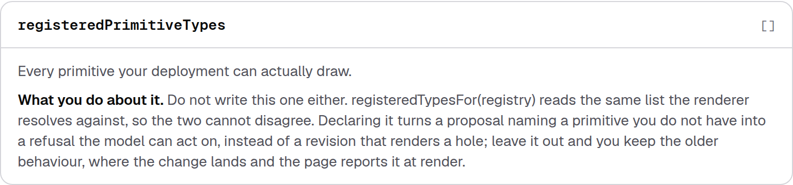
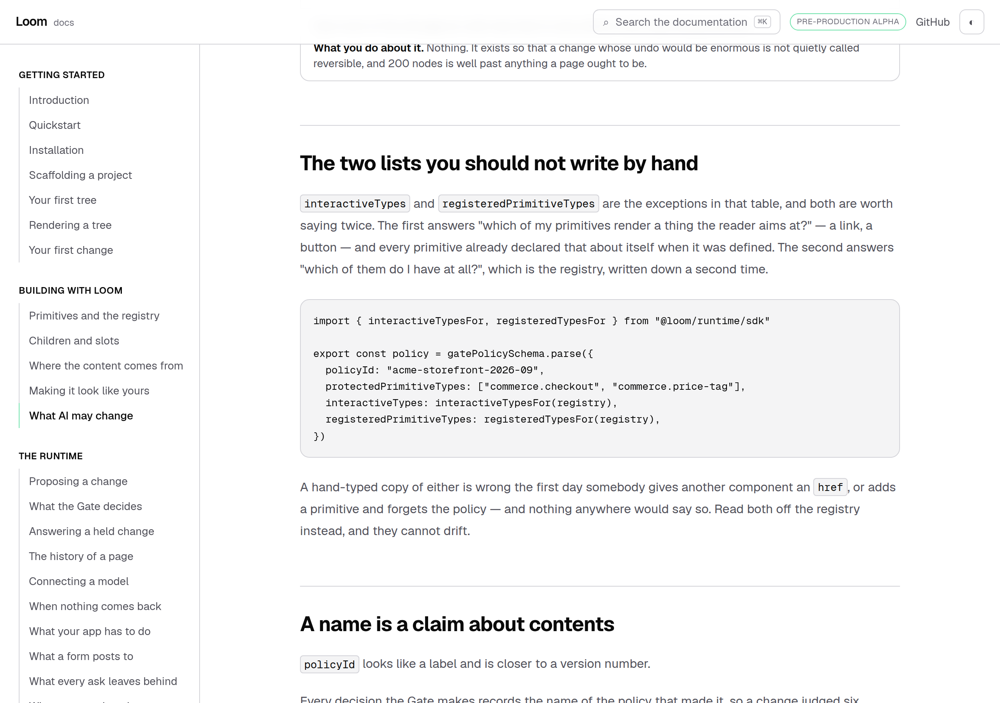

# A word nobody registered, refused before the log keeps it

**Date:** 2026-09-19
**Routine:** `Loom daily build` — the framework core, `src/` except `src/primitives/`
**Branch:** `framework-42-a-word-nobody-registered`, cut from `main` at `1abfbd7`. Not stacked.
**Section:** §2 — Composition Runtime, at the Gate's inputs



## What this was

One open finding owned by this lane, filed by `Loom docs` on 17 September and
found by **running** the quickstart rather than by reading it. Two deltas, both
ending `committed`:

- an `insert` naming `app.nonesuch`, a primitive type nothing registered —
  revision appended, page drawn with an `unknown-primitive` diagnostic, the node
  absent from the output;
- an `insert` carrying a `text` prop 200 characters long against a schema whose
  maximum is 160 — revision appended, node drawn **without its props**.

Neither reached a refusal and neither could have. `CompositionRuntime` is an
interpreter, a policy source, events, a clock, an id factory and an optional
repairer. There is no resolver and no validator anywhere on the write path, so
nothing between the interpreter and `store.append` had the means to ask whether
the word the model used means anything.

What that costs is not a crash. It is that a revision nothing can draw becomes
the current one, and the hole is served to every reader on every request until
somebody looks at a page rather than at a test. The one party positioned to
catch it — the model that invented the word — has already gone.

**The first defect is closed. The second is not, and cannot close this way.**

## The migration

**Nothing to do, and nothing half-done.** `apps/loom` has been on `main` with its
four route groups since 19 August; `apps/portal` and `apps/docs` are gone, and
`(lessons)` and `(demo)` are filled by their owners. This is the sixth
consecutive run to report that, and the brief this routine runs under still opens
by naming the migration as the next unit. The tree is not half-migrated before or
after this run, and no routine is waiting on its shape. The brief also lists the
demo as this lane's; `docs/routines.md` has given `(demo)` to `Loom demo` since
20 August and PR #344 is that lane working today, so I left it alone.

## What landed

A declared library is now a Gate vocabulary, along the route
[0064](../decisions/0064-a-primitive-says-whether-it-is-a-target-and-the-gate-derives-the-nesting.md)
established for the last fact of this kind. Recorded as
[0173](../decisions/0173-a-change-may-not-add-a-node-the-deployment-cannot-draw.md),
`Accepted`.

| where | what |
| --- | --- |
| `GatePolicy.registeredPrimitiveTypes` | every primitive this deployment can draw — host vocabulary, empty by default |
| `ChangeAnalysis.unknownPrimitives` | the nodes an `insert` would add whose type the vocabulary does not hold, each by node and type |
| `unknown-primitive` stake factor | `critical`, which under the default refusal floor is a refusal |
| `registeredTypesFor(registry)` (SDK) | the list read off the registry the renderer already resolves against |

So, end to end, on a deployment that has declared its library:

```
rejected — stakes-at-refusal-floor:
adds a node no primitive is registered for, so it draws nothing: app.nonesuch at n_an1
```

and the repairer is handed that sentence and gets one chance to name a primitive
that exists. `pipeline.test.ts` runs all three of those: the applied case with no
vocabulary, the refusal with one, and the repair.

Three decisions carry it, and each could have gone the other way.

**Empty means undeclared, not empty.** `primitiveVocabularyFor([])` answers
`true` for every type, so a host that leaves the field out gets exactly
yesterday's runtime. This is the asymmetry with `NOTHING_INTERACTIVE`, which
answers `false` by default, and it is the only way a check whose natural reading
is an allowlist ships as an additive change. It is asserted rather than assumed.

**Measured on what a change introduces, never on the tree it found.** Only
`insert` contributes: `move` carries nodes the tree already had, `configure`
cannot change a type. A page may legitimately name a primitive a later deployment
withdrew — that is why `renderLoomTree` reports instead of throwing — and an
ordinary edit to such a page is untouched. What it does refuse is putting one
**back**, and that refusal is the honest answer: the primitive has to return
before the page can.

**Critical, so a refusal, so a repair.** It joins `nested-target` as the second
factor measuring a change that is wrong however it was meant; every other factor
measures a change that might be right. And *that type does not exist* is the most
actionable thing a model can be told, because the catalogue it was handed already
lists what does — while only a refusal reaches a repairer at all. A confirmation
would put an invented word to a person who can only answer no.



## Unspecified decisions, and why they went this way

**The `validator` seam the finding proposed was not built, and the reason is the
repairer.** An optional `ChangeValidator` on `CompositionRuntime` with a sixth
`CompositionOutcome` kind reaches the props half, which this does not. It costs
two things. A sixth outcome kind is a compile error in every exhaustive `switch`
and every `Record<CompositionOutcomeKind, …>` across `(portal)`, `(docs)`,
`(marketing)` and `(demo)` at once — the merge gate is four surfaces wide now and
that is a change to make deliberately. And `RepairRequest` carries a
`Disposition`, which a validation failure has none of, so a validator's refusal
reaches no repairer until that type widens and every host-written repairer
breaks. Losing the repair was the larger loss. The door is explicitly left open
in 0173 and the remainder is filed.

**No ninth rung on the ladder.** `redirected-submission` and `repointed-binding`
each have one, so they never auto-apply whatever the origin's ceiling. Here
`critical` already sits at the default refusal floor, so a rung would only change
behaviour for a host that had *lowered* its floor — and such a host has said, in
the one place the runtime asks, that this much damage is somebody's to approve.
It would also add a `DispositionReasonCode`, which is two more exhaustive maps in
two more lanes for no behaviour.

**`analyzeDelta` kept two trailing predicates rather than gaining a record**,
which is not the shape `StakeInput` argues for. That was decided by a failing
test, not by reasoning: `analyzeDelta` is published and **lesson 22 calls it by
hand**, so the tidier signature produced `TypeError: isInteractive is not a
function` in a worked example — and would have done the same to every host
calling it. A published signature is not tidied on the way past. What keeps the
pair honest instead is that `assessChange` is the only caller that reads a
policy, and passes both in one expression.

**The policy fingerprint's shape half moves**, which is designed behaviour rather
than a cost: dispositions written before this version read as `incomparable` to
ones written after, not as `changed`. That is the whole reason 0033 split the
digest — an honest *cannot tell* across an upgrade beats a confident report that
every host edited a policy it never touched.

## What this run changed outside its lane, and why

Every one was a compile error or a red test, not a choice. The guard rails other
lanes built for exactly this are what produced the list.

| file | lane | why |
| --- | --- | --- |
| `(marketing)/_lib/adapt/record.ts` | marketing | `satisfies Record<StakeFactorCode, string>` — one clause, written to the site's register (no reserved word; "piece" is the word that page already uses for a primitive) |
| `(docs)/_lib/policy/knobs.ts` | docs | `Record<keyof GatePolicy, Knob>` — one row, plus `KNOB_ORDER`, plus three counts in its own comments |
| `(docs)/…/what-ai-may-change/page.mdx` | docs | `claims.test.ts` holds the page's arithmetic to `KNOB_ORDER.length`: "Thirteen settings" → "Fourteen", "twelve of thirteen" → "thirteen of fourteen". The *one* list you should not write by hand is two lists now, so that section names both |
| `(docs)/_lib/policy/claims.test.ts` | docs | its own `WORDS` table had no word for 14 |
| `(docs)/_lib/api/reference.generated.json`, `_lib/fences/compiled/*` | docs | regenerated with `pnpm docs:api` and `pnpm docs:fences`; not hand-edited |
| `lessons/25-exhaustiveness.md` | lessons | exercise F counts the knobs from the schema and prints the number: 13 → 14, and the sentence under it |
| `lessons/13-refusal-and-repair.md` | lessons | three transcript lines carry a `policyFingerprint` literal, and the shape half moved: `71ff452d:4a4030b86d65a438` → `b22582aa:1d7136abcac79bfd` |

Nothing in another lane's judgement was touched — no row reworded for taste, no
prose rewritten beyond the sentence the number broke. The one place I went a
sentence further than the compiler forced is the *two lists* heading in
`(docs)`: leaving it at *the one list* would have had the page call
`interactiveTypes` "the exception" on the same screen as a second exception. It
is a candidate for that lane's own pass, and it is an open question below.

## Records

- **0173** — *A change may not add a node the deployment cannot draw.* `Accepted`.
  Nothing superseded. `pnpm decisions:index` regenerated.

## Findings

**Closed, in half.** `Loom docs`, 17 September — *the write path has no registry,
so a proposal may insert a word nobody registered and the log keeps it*. The
first experiment is closed by this branch; the second is not, and the entry says
which is which with the original status kept below it. **Both of that page's
experiments still end `committed` and `quickstart.test.ts` is untouched**,
because a host that declares nothing is unchanged — so the page's claim about
what is true stays true and stays checked.

**Filed.** *The write path can refuse a word nobody registered and not props no
schema accepts, and the gap is a policy's shape.* Owned by this lane. It sets out
why the props half needs a function rather than a knob, what the two
policy-shaped alternatives would and would not catch, and what the seam would
cost — so the next run does not rediscover the wall.

## Open questions

- **Is the props half worth a sixth outcome kind?** It is the larger of the two
  defects by damage — a node drawn stripped of its props looks like a working
  page — and it cannot be reached without the seam. If it is worth it, the
  outcome and `RepairRequest` want designing together rather than one riding on
  the other.
- **`(docs)` may want its own pass on *The two lists you should not write by
  hand*.** I kept it true; making it good is that lane's.

## Tests

`pnpm install && pnpm verify` — **green, exit 0**, on the second run. The first
run is what produced the cross-lane list above, and every failure in it was a
guard rail firing rather than a defect.

| | `main` | this branch |
| --- | --- | --- |
| framework test files | 154 | **156** |
| framework tests | 2,807 | **2,833** (+26, all new) |
| application test files | 280 | 280 |
| application tests | 4,905 | 4,905 |
| findings | 701 | 702, 0 malformed |
| prerendered pages | 107 | 107, 859 junctions, 0 run together |

The 26 are: 8 on the vocabulary itself, 6 on the analysis, 3 on the stake factor,
4 end to end through `composeChange` (including the repair), 3 on the SDK
derivation, 2 on the fingerprint. **Nothing failed, nothing was skipped, and no
test was weakened** — the application tests that went red were updated to the
number or the literal they now measure, which is exactly what they were written
to force.
