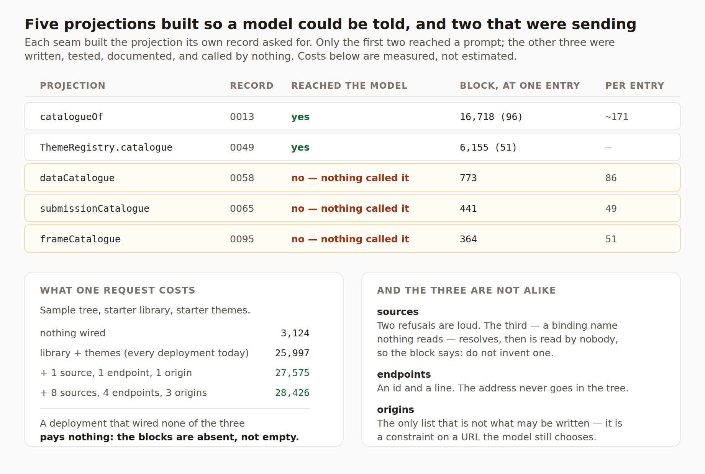

# Three vocabularies built for a model that was never shown them

**Date:** 2026-09-19
**Routine:** `Loom daily build` — the framework core, `src/` except `src/primitives/`
**Branch:** `framework-44-three-vocabularies`
**Section:** §2 — Composition Runtime, at the interpretation seam; reaching §4d, §5 and §6
**Pull request:** [#338](https://github.com/jam-overture/loom/pull/338) ·
**Preview:** https://loom-git-framework-44-three-481666-jpizzolato36-6341s-projects.vercel.app
— there is nothing to look at for this change beyond the figure below; it is a
runtime seam whose only surface is the string sent to a model, and no page in
the repository wires one of the three registries into an interpreter yet.

## What this was

One open finding owned by this lane, filed by `Loom docs` on 12 September while
writing *Where the content comes from* — and, once I went looking beside it, the
same defect twice more.

Every seam Loom has built since [0013](../decisions/0013-the-registry-is-what-the-model-is-told-it-may-build.md)
settled the principle has built the projection that implements it: a model may
name what a deployment registered, and it is told what that is. Five projections
exist. **Two of them reached a prompt.**

| projection | record | reached the model |
| --- | --- | --- |
| `catalogueOf` | 0013 | yes |
| `ThemeRegistry.catalogue` | 0049 | yes |
| `dataCatalogue` | 0058 | **no — nothing called it** |
| `submissionCatalogue` | 0065 | **no — nothing called it** |
| `frameCatalogue` | 0095 | **no — nothing called it** |

The three were written, tested, documented in their own module comments, and
called by nothing. `dataCatalogue`'s own file quotes 0058 at itself — *"a source
a model was never told about is one it can only guess at"* — which is exactly
what was happening to it.

Each one produces the same class of failure, and it is the quiet class. A model
asked to put somebody's services on a page could not know `catalogue.services`
exists, so any binding it proposed was invented and refused as `no-such-source`.
A model asked for a contact form could not name an endpoint, so it could not
point one anywhere. A model asked for the product video picked a host at random,
and the frame rendered a refusal where the document should have been. In all
three the seam behaves correctly, the page is wrong, and nothing connects the
two.

## The migration

**Nothing to do, and nothing half-done.** `apps/loom` has been on `main` with its
four route groups since 19 August; `apps/portal` and `apps/docs` are gone. This
is the fifth run in a row to say so — #320, #328, #330 and #336 all flagged it,
and the brief this routine runs under still opens by naming the migration as the
next unit. The tree is not half-migrated before or after this run and no routine
is waiting on its shape. The brief also lists the demo as this lane's, where
`docs/routines.md` has given `(demo)` to `Loom demo` since 20 August; I left it
alone.

## What landed

### One value, five vocabularies

`PromptVocabularies` has one optional field per projection.
`ModelInterpreterConfig` **composes** it rather than restating it, so a host
writes the same field names it always did and a sixth vocabulary added later
arrives in the wiring and the prompt in one change. `buildUserMessage`,
`measurePrompt`, `buildRepairMessage` and `measureRepairPrompt` take it in place
of the two trailing positional optionals they had.

### Three blocks, and three different instructions

Each renders on the rules the primitive and theme blocks already follow: absent
when the host wired none, ahead of the tree where a cache can hold it, and
closed by the instruction that makes the list usable — because the standing
prompt tells the model to set only props a primitive declares, and `loom:data`
and `loom:submit` are keys no primitive declares.

The three instructions are not interchangeable, and that is the part worth
reading rather than the plumbing:

- **Sources** close with *do not invent a binding name*. Two of this seam's three
  refusals are loud; the third is silent — a binding name nothing reads resolves
  cleanly and is then read by nobody — and the catalogue cannot enumerate the
  legal names, because a name belongs to the primitive that reads the answer
  rather than to the source that gives it.
- **Endpoints** say `to` is the only key the declaration accepts and that an
  address never appears in the tree. 0065 made that schema strict on purpose, so
  a model that has not been told will be wrong loudly.
- **Origins** say out loud that the list is origins **rather than addresses**.
  This is the one vocabulary that is not the whole of what the model may write:
  which video belongs on a page is a content decision and the URL stays in the
  tree. A model shown three lists and no word about which kind each one is would
  reasonably read the third as the only values it may write, and stop choosing
  the video — the one decision in that seam that is the model's to make.

### What it costs

`PromptMeasurement` gains `sources`, `endpoints` and `frames`, so each block is a
number on the same terms as the two that already had one. Measured on the sample
tree with the starter library and starter themes registered — an actual run of
`measurePrompt`, not an estimate:

| wired | primitives | themes | sources | endpoints | frames | total |
| --- | --- | --- | --- | --- | --- | --- |
| nothing | 0 | 0 | 0 | 0 | 0 | **3,124** |
| library + themes (every deployment today) | 16,718 | 6,155 | 0 | 0 | 0 | **25,997** |
| + 1 source, 1 endpoint, 1 origin | 16,718 | 6,155 | 773 | 441 | 364 | **27,575** |
| + 8 sources, 4 endpoints, 3 origins | 16,718 | 6,155 | 1,375 | 588 | 466 | **28,426** |

The instruction dominates and the entries are cheap: 86 characters for another
source, 49 for another endpoint, 51 for another origin. That is 0170's per-entry
shape arriving again in three more places. **A deployment that wired none of the
three pays nothing** — the blocks are absent rather than empty, so the request is
byte-identical to what §2 sent.

## Decisions I made that nothing specified

**An options object rather than three more positional parameters.** Forced
rather than chosen: `buildUserMessage(intent, tree, undefined, undefined,
sources)` cannot be read, and a call site that changes meaning when an argument
is inserted in the middle is a defect waiting for the eighth vocabulary.

**The keys are the config's names, not prettier ones.** `sources` reads better
than `dataCatalogue`, and I rejected it: a second spelling needs a mapping
function between two shapes that must stay in step, and that function is
precisely where a sixth vocabulary would be forgotten. The short names survive
where they belong, as the block names inside `PromptMeasurement`.

**The framing block is in, although it is the odd one.** The other two are
allowlists of everything the model may say; this is a constraint on a value the
model still chooses. It is in because the odd one fails most visibly — a refused
frame is a hole in the page — and the difference costs one sentence in the block
rather than another month of carrying a projection nothing sends.

**I wired no surface.** `(docs)` registers a source and two endpoints,
`(marketing)` registers framable origins, and none of them passes one to an
interpreter. Each is one line and each is somebody else's composition root.
Filed for both, with the line.

**I did not build the declaration that would close the silent refusal properly.**
A primitive saying which binding names it reads would make an invented name as
refusable as an invented source id. It has no user: no primitive in
`src/primitives/` reads a binding, so it would be a field on ninety-six
definitions and a projection nobody calls — which is the shape of the defect
this change was fixing. Filed with the argument already made, for whoever writes
the first primitive that reads one.

## Records

[0172 — What a deployment can offer a model is one value, and three more
vocabularies go in it](../decisions/0172-what-a-deployment-offers-a-model-is-one-value.md),
Accepted. Nothing superseded. 0170 and 0171 are claimed on open branches (#336
and #337), so this took the next free number after re-reading `main` and both.

## Findings

**Closed:** 12 September, *"`dataCatalogue` is projected for a model that is
never shown it"* — closed wider than filed, and with one departure from the
recommendation (the *do not invent a binding name* sentence), said plainly in the
ledger.

**Filed:**

1. *The three registries a surface already wires can now reach the model, and
   none of them does* — `Loom docs`, `Loom marketing`. One line each, with the
   measured cost of taking it.
2. *Five files in three other lanes changed so `pnpm verify` would pass* —
   `Loom docs`, `Loom marketing`, `Loom lessons`. Four mechanical; the fifth is
   a change of meaning and is the next paragraph.
3. *Lesson 12 says `buildUserMessage` assembles four blocks, and it now assembles
   seven* — `Loom lessons`. Prose only; the fence was updated and its transcript
   is byte-identical.
4. *A primitive still cannot say which binding names it reads, and the prompt now
   has to warn about it in prose* — this lane and `Loom primitives`, with the
   argument for the version that would actually close it.

## The one thing in somebody else's lane that is not mechanical

`(marketing)/_lib/pages/what-you-run.ts` holds a guard I did not know about and
which did its job: the page names every part `PromptMeasurement` reports, and
`partsOf` throws if the two disagree. It fired on this change, which is how I
found it.

Three of the eight parts are absent unless a host wired that registry, and the
marketing site has wired none of them. Naming them would have put three rows
reading *0 characters* under a heading about what leaves your server — and that
lane's own assertion, `parts.every(part => part.characters > 0)`, says the band
does not do that. So the guard now reads *every part this deployment actually
sends*, and there is a new test in their file holding both halves: a zero part is
not listed, and a part that starts costing something and has no sentence still
refuses to build. **I wrote no copy on their page**, which was the alternative and
the worse one.

## Open questions

- **Should a primitive declare the binding names it reads?** It is the honest fix
  for the one silent refusal in the data seam, and it has no user until a
  primitive reads a binding. Filed rather than built.
- **Should any surface here wire one of the three?** The seam is exercised by
  tests and by nothing that runs, which is the same thing #336 said about
  `selectPrimitives` yesterday. Two runs in a row is a pattern worth a
  maintainer's opinion rather than mine.

## Tests

`pnpm install && pnpm verify` **green**, twice — once before any change, to have
a baseline, and once at the end.

| | before | after |
| --- | --- | --- |
| root suite | 153 files, 2,761 tests | 153 files, **2,783** tests |
| application suite | 276 files, 4,837 tests | 276 files, **4,838** tests |
| findings ledger | 681 entries, 0 malformed | 685 entries, 0 malformed |
| prerender | 107 pages, 853 junctions, 0 run together | 107 pages, 854 junctions, 0 run together |

**+23 tests.** Nothing was skipped, nothing was weakened, and nothing failed at
the end. Three intermediate failures are worth recording because each was a real
instrument working: `(marketing)`'s parts guard (above), `(docs)`' generated API
reference (regenerated with `pnpm --filter @loom/app docs:api`), and
`(lessons)`' transcript recogniser, which noticed exercise E's fence had stopped
compiling before any human could have.

**One post-push failure, and it was mine rather than the code's.** The first
push produced no Vercel preview: *"Git author jpizzo must have access to the
project"*. The commit was authored from the session's own note giving the
maintainer's email for identifying the user, which is precisely the trap
`docs/routines.md` records under **Commit identity** and which seven runs hit
before it was written down. Amended to
`jonathanbravecredit <60827135+…@users.noreply.github.com>`, force-pushed to this
branch, and the preview built. Eighth time; the rule is written and I did not
read it until the status came back red.

The live API smoke test ran and passed against a real model, so the assembled
request is one a provider accepts.
