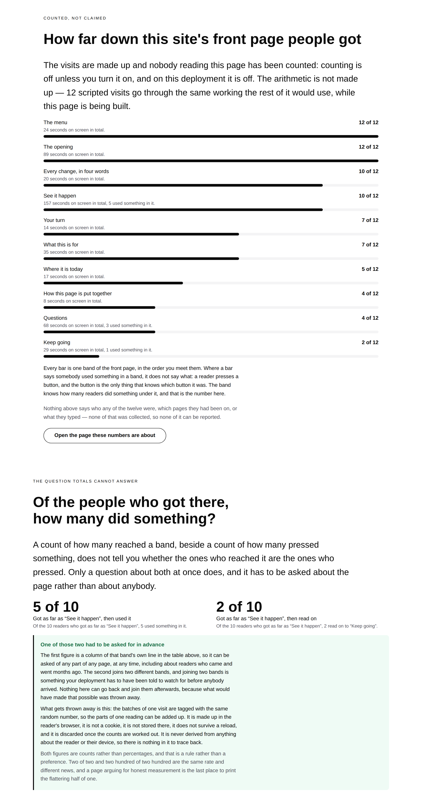
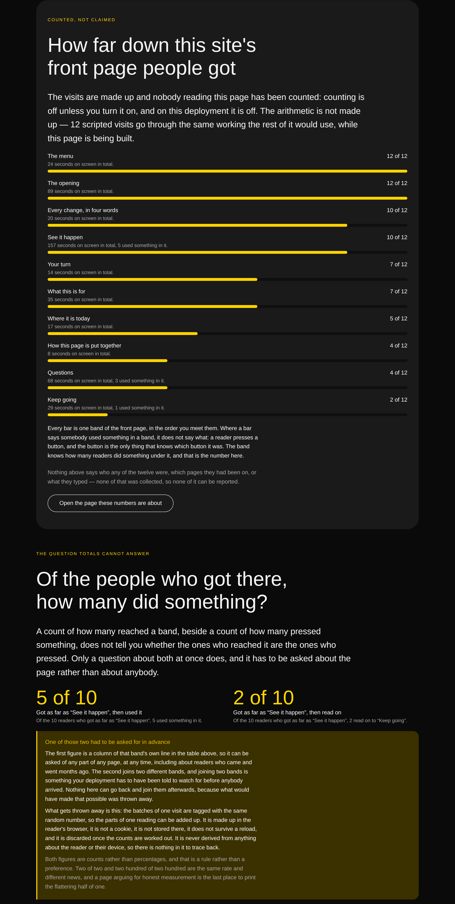
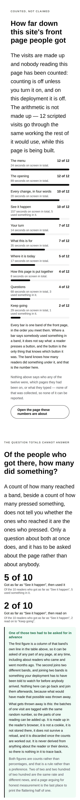

# 2026-09-19 — marketing: a press lands on a button, not a band

`/what-readers-do` has said since 16 September that the visits on it are made up
and the arithmetic is not. Both halves were true. What neither said is that the
made-up half was the **wrong shape** — not wrong in its numbers, wrong in a way
that meant the real half was being exercised over input no browser will ever
send.

A reader never aims at a band. They press a button, follow a link, open a
question, and every one of those is an addressed node several levels down inside
the band it happens to sit in. This fixture filed the press against the band. So
the page was computing, correctly and from the real function, over a delivery
that cannot occur.

The framework lane closed the runtime half of this on 17 September
([0167](../decisions/0167-a-delegated-signal-names-the-regions-it-happened-inside.md)),
filed the rest for this lane with the recipe, and named the thing it was filing:
*"`visits.ts` mints `activated` against band ids. That was the only way to make
the arithmetic demonstrate anything and it is a thing no browser will ever
send."* This is that.



---

## What shipped

**One module, two figures re-sourced, and a question that stopped being a
funnel.**

| file | what it is |
| --- | --- |
| `_lib/readers/aim.ts` | **new** — where a press or an open actually lands on a page, and the regions above it |
| `_lib/readers/visits.ts` | mints against the control, carries `within`; `BandReading.engaged`; `BAND_QUESTION` |
| `_lib/pages/what-readers-do.ts` | the band caption, and the two-shapes band |

**Nothing was added to the primitive library and nothing in `src/` was opened.**
No new primitive type appears on the page; the band that changed is the same
`loom.stat-grid` of two `loom.stat`s it was yesterday.

### Which control, asked rather than listed

The interesting half of `aim.ts` is that it does not contain a list of type
strings. A primitive declares whether it renders a target a reader aims at, and
declares it **conditionally where the truth is conditional**:

```ts
// src/primitives/loom.card.ts
interactive: { whenProps: ["href"] }
```

So *what would a reader have pressed in this band* is answered by
`interactiveTypesFor(siteRegistry)` and `isInteractiveWith(when, node.props)`,
node by node, against the props each node actually has. The same `loom.card` is a
target in one tree and scenery in another, and only the tree can say which. A
list written in my lane would have been right for this deployment and wrong for
every other, which is the failure `PrimitiveRole` exists to end.

### The ancestry is the element chain, and that is not an approximation

Every element node renders carrying `data-loom-node`, and the broadcaster walks
*elements* from the target upward keeping each addressed one. Slots carry no
address; text is not an element. So the chain `aim.ts` builds — element
ancestors, nearest first, up to and including the page root — is the list the
browser reports rather than a stand-in for it. `aim.test.ts` holds that directly:
a control in a hero's `actions` slot reports the hero, not the slot.

What the fixture now mints, printed out of the shipping code:

```json
{ "kind": "activated", "nodeId": "n_home43", "type": "loom.action",
  "within": [ { "nodeId": "n_home52",  "type": "loom.stack" },
              { "nodeId": "n_home57",  "type": "loom.stack" },
              { "nodeId": "n_home77",  "type": "loom.section" },
              { "nodeId": "n_home244", "type": "loom.page" } ],
  "at": 1 }

{ "kind": "disclosed", "nodeId": "n_home134", "type": "loom.faq",
  "within": [ { "nodeId": "n_home139", "type": "loom.faq-list" },
              { "nodeId": "n_home143", "type": "loom.section" },
              { "nodeId": "n_home244", "type": "loom.page" } ],
  "open": true, "at": 5 }
```

The two stacks are the point rather than noise: a press inside *See it happen*
is three regions deep before it reaches the band, and every one of them is an
addressed node a deployment could ask about. The old fixture had **one** entry
here and it was the band, which is neither where the press happened nor anywhere
above it.

---

## The figures did not move, and that is the result

This is the part worth the space. Every number the page prints is the number it
printed yesterday:

| band | seconds | used something in it, before | after |
| --- | --- | --- | --- |
| See it happen | 157 | 5 (`activations` on the band) | **5** (`engaged` on the band) |
| Questions | 68 | 3 (`opens` on the band) | **3** (`engaged`) |
| Keep going | 29 | 1 (`activations`) | **1** (`engaged`) |

Same figures, produced from a delivery a browser could have sent, through the
counter a region is actually reported by. A run that changed the numbers would
have been a run that changed the fixture; this one changed only what the fixture
claims about how a page is used.

### One number where there were two, and the page says why

The band's caption read *157 seconds on screen in total, 5 used something in it*
and, on the questions band, *3 opened something*. Both of those were the band's
**own** `activations` and `opens`, and a band's own press and open counts are
**zero on every real deployment there will ever be** — the band is not the thing
anybody aimed at. What a region can honestly report is one number: how many
readers did something under it, at any depth, presses and opens alike.

So the caption is one clause, and a sentence went under the bars saying what was
lost and why, in words a visitor with no context can follow:

> Where a bar says somebody used something in a band, it does not say what: a
> reader presses a button, and the button is the only thing that knows which
> button it was. The band knows how many readers did something under it, and that
> is the number here.

`what-readers-do.test.ts` now asserts the absence as well as the presence — a
caption reaching for the split again is a red test rather than a column of zeroes
on a live page.

---

## The funnel that was not a funnel, and the band that got better for losing it

The page asked two questions and drew both as funnels:

1. *Of the readers who got as far as "See it happen", how many used something in
   it?* — a pair whose far end asked for `activated` **on a band**
2. *Of the readers who got as far as "See it happen", how many read on to "Keep
   going"?*

The first answered `5 of 10` here and would answer **`0 of 10`** on any real
deployment, for the same reason as everything above. It was not a wrong question
— it is the question the front door actually cares about — it was the wrong
*instrument*. It is now `reached` and `engaged` on that band's own row.

And the band is stronger for it, because the two figures beside each other are no
longer two of a kind. They are the two shapes, and the difference is the thing
somebody deciding what to measure needs most:

> **One of those two had to be asked for in advance.** The first figure is a
> column of that band's own line in the table above, so it can be asked of any
> part of any page, at any time, including about readers who came and went months
> ago. The second joins two different bands, and joining two bands is something
> your deployment has to have been told to watch for before anybody arrived.

That sentence could not be written while both were funnels, and it is a real
product distinction rather than a nicety: a question you can ask retrospectively
of data you already have costs nothing, and one that needs the correlation
arranged in advance is the only reason a page view carries a key at all.

`FunnelQuestion` lost its `did` field and gained a test refusing a pair that names
one band twice — the shape that was quietly answering zero.

---

## Both palettes, and a phone

| | |
| --- | --- |
|  |  |

`scrollWidth 1280 / innerWidth 1280` wide and `390 / 390` on the phone, measured
by the harness on the built application under `next start`. **No colour is named
anywhere in the diff.**

Whole-page shots at all three are beside this file as
`2026-09-19-marketing-where-a-press-lands{,-bold,-phone}.png`.

---

## Tests

`pnpm install && pnpm verify` — **green, exit 0**, read from a log file rather
than through a pipe. Nothing failed, nothing skipped, **no test weakened or
deleted**.

| suite | `main` at `ee9cb30` | this branch |
| --- | --- | --- |
| `@loom/runtime` | 153 files / 2,761 tests | **153 / 2,761** — `src/` was not opened |
| `@loom/app` | 276 files / 4,837 tests | **277 / 4,861** |
| marketing, within it | 37 files / 1,583 tests | **38 / 1,607** |

The `main` numbers were measured by checking `main` out into a worktree and
running the suites, not quoted from a report.

`findings:check` reads 683 entries, 0 malformed. `prerender:check` reports 107
pages and 853 junctions, 0 run together — the marketing route group contributes
none of those, because every page of it reads `searchParams`.

**24 tests are new**, 13 of them in `aim.test.ts`. The rest split between the
fixture's own shape (`what a press is filed against` — five assertions that had
no home before, because nothing in this repository had ever asked whether a
fixture was a shape a browser could produce) and the page's two-shapes band.

### Mutations

Ten defects restored one at a time against a committed baseline.

| mutation | result |
| --- | --- |
| the press filed against the band again — the exact September shape | **4 red** |
| `within` dropped from every delegated signal | **2 red** |
| `within` reversed — furthest region first | **4 red** |
| the band allowed to answer as its own control | **1 red** |
| a disclosure accepted as a press target | **1 red** |
| interactivity read as unconditional — a card with no link is a target | **1 red** |
| the band's line stops saying how many readers used it | **1 red** |
| the funnel's far end asked for a press on a band again | **1 red** |
| the band question answered off a different band's row | **1 red** |
| the band question printed as a rate | **3 red** |

**Two escaped the first pass, and both were worth the round.**

*A disclosure accepted as a press target* survived because `loom.faq` is not
declared interactive at all, so the guard excluding it was **dead** — right in
intent and unreachable in fact. The repair was to stop hard-coding the disclosure
question where the registry can answer it: a type declaring the `disclose`
behaviour is one, and the registry *requires* such a type to declare `interactive`
too, so the guard became load-bearing and testable in the same edit. The
hard-coded part shrank to the one type the registry genuinely cannot name.

*The band allowed to answer as its own control* survived because the front door's
only band that is itself a control is the menu — a `loom.nav`, which the
disclosure guard already covers. The sharp case is a band that is a **link**, and
the test now builds one: a `loom.card` band with an `href`, holding an action.
Both were caught on the re-run.

---

## Decisions and findings

**No record written.** Nothing here is constrained outside this route group and
no Accepted record is touched. 0167 already says a delegated signal names the
regions it happened inside, and 0146 already says a funnel is correlated inside
one page view; this is those two being used where they were filed to be used.

**One finding closed, half of one.** The 17 September entry from `Loom daily
build` — *"`/what-readers-do` can stop minting a press no browser sends"* — for
this lane. Its `Loom portal` half stays open and is named in the status line:
`StoredTally.engaged` is on that screen's rows and nothing reads it yet.

**Two findings filed.**

- **For `Loom primitives`** — a registry can say which primitives a reader
  presses and cannot say which ones a reader **opens**. `loom.nav` declares the
  `disclose` behaviour and is discoverable twice over; `loom.faq` is a native
  `details` and declares nothing, so a host asking the registry that question is
  told about its menu and misses the only thing on the page anybody opens. The
  workaround here is one string with a throw under it. Two shapes of fix are
  written out; I recommend the second (a declaration, changing nothing about what
  `loom.faq` renders) because the first would take the native `details` away, and
  that primitive's own header records why it should keep it.
- **For `Loom daily build`** — `SignalAddress`, the type of a member of `within`,
  is not exported from `@loom/runtime/signals`: the schema is, `ledger.js` is not
  in the barrel, and there is no inferred alias. Everything assembling a delegated
  signal outside a browser re-declares the pair. Two lines.

## Needs your input

- **No new claim was made.** The one genuinely new sentence on the page is the
  one about a band knowing how many readers did something under it and not what,
  and it is a statement about the machinery rather than about the product's
  audience or worth. Re-word freely.
- **The licence line** (#96, on every marketing PR since #134). Still the site's
  one placeholder.
- **Positioning, audience and pricing.** Untouched, as always.

Nothing scheduled and nothing armed.
