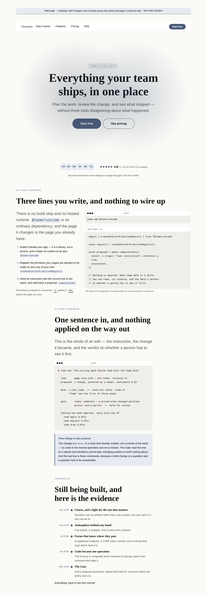

# The half the catalogue could not say — forty-four primitives nothing could reach, and the two page parts nobody had a rule for

**Routine:** `Loom primitives` · **Date:** 2026-09-19 · **Branch:**
`primitives-39-the-half-it-could-not-say` · **Section:** §4b

## What this run chose, and why that

Not from the plan, and not from the queue. From a measurement that had never
been taken.

The brief says *breadth at the quality bar*, and the last three runs read that
as **more designs of the parts the catalogue already has** — 27 bands, then 30.
That is real work and it was the right work, but it answers only one of the two
questions a phrasebook can be short on. The other is *how much of the
vocabulary can the phrasebook say at all*, and nobody had asked it.

Asked, on `main` this morning:

| | |
| --- | --- |
| primitives registered in the starter library | **96** |
| primitive types some band in the catalogue builds | **52** |
| **registered, described in every interpretation request, and unreachable by dropping in a band** | **44 — 46%** |

Forty-four primitives that a deployment pays for on every request and cannot
get onto a page except one node at a time. `loom.code`, `loom.code-span` and
`loom.kbd` among them — which means **the catalogue could not draw the landing
page of the product that owns it.**

So the run is that gap: measure it, classify it, and close the largest slice
that needed nothing but the work. **Catalogue 30 → 34 bands, page vocabulary
19 → 21 parts, reach 52 → 63.**

## Why a hole this size stayed open, which is the part worth reading

Nothing was wrong and nobody missed anything. Every run before this one ported
**content models** — a pricing table, a testimonial wall, a team grid — and a
content model is a shape *a page* holds. A code panel is not that. It is a
shape a **developer product's** page holds, and no Hermes block was one,
because Hermes' users are creators rather than developers.

The gap is in the **provenance of the queue**, not in anybody's judgement. The
work has been sourced from `docs/hermes-port-map.md` for a month, and the port
map is a complete ledger of Hermes — which is exactly why it cannot see this:
a ledger tells you what is left of the thing it lists and says nothing about
what was never on the list.

That reframing is the finding, and it covers the rest of the forty-four too.

## The forty-four, classified — because the number on its own is misleading

A list of unused primitives reads as forty-four pieces of work. It is not, and
the difference matters more than the count:

| | how many | what they are | is it work? |
| --- | --- | --- | --- |
| **needs an asset** | 5 | `media`, `embed`, `before-after`, `carousel`, `overlay` — every one needs an image or a URL, and the catalogue **ships no image source at all** (there is a test) | **no, and correctly so.** A gallery band is unbuildable here by design, not by omission |
| **not a landing page** | 16 | `book`, `event`, `listing`, `product`, `offering`, `recording` and their grids; `message`/`message-list` | **not for this catalogue.** These are creator- and marketplace-site content models. They want a *second page sequence*, not a band on this one |
| **a state, not a band** | 3 | `empty-state`, `waiting-state`, `link-pager` | **no.** These are what a *bound region* says (0058); they belong to a page with data behind it |
| **structural** | 1 | `page` | never a band's root — it is the root |
| **genuinely missing** | **19** | `code`, `code-span`, `kbd`, `callout`, `banner`, `avatar`, `avatar-row`, `rating`, `list`, `list-item`, `emphasis`, `divider`, `table`, `table-row`, `table-cell`, `spec`, `pin`, `halo`, `backdrop`, `reveal` | **yes — and eleven of them shipped today** |

So the honest number is **nineteen, not forty-four**, and this run closed
eleven of them. The remaining eight are named at the end.

**This is deliberately not turned into a ceiling.** A test demanding that every
registered primitive be reachable would fire on the ordinary order of work — a
primitive is registered before a band uses it, always.
[0170](../decisions/0170-a-library-is-a-set-to-choose-from-and-a-vocabulary-is-priced-per-entry.md)
declined a character budget over the primitives block for exactly that reason
on the same day, and the reasoning transfers without a change of a word. What
landed instead is `CATALOGUE_TYPES`, an export that makes the measurement one
`filter` from any registry, so the next run can say **which way it moved**
rather than re-deriving it in a scratch directory the way this one did.

### What #336 landing the same day turned this into

0170's other half is `selectPrimitives(entries, types)`: a deployment registers
a **slice** of the starter library, because the library is a set to choose from
rather than a set everybody ships. That function needs a list of types and has
no opinion about which. `CATALOGUE_TYPES` is the list a host wanting the
phrasebook should hand it, and the pairing measures well:

| | entries | characters per interpretation request |
| --- | --- | --- |
| the whole starter library | 96 | **16,718** |
| `selectPrimitives(STARTER_PRIMITIVES, CATALOGUE_TYPES)` | **63** | **10,432** |

**38% off every request, losing nothing the catalogue could reach anyway** —
and the call cannot hit 0170's `unregistered-types` refusal, because the
assertion above would have gone red first.

Neither lane could have written that alone, and it sharpens *why measure reach*
past a tidiness argument: the 33 unreachable entries are not merely surface
nobody can use, they are surface **every deployment pays for on every
request**. It is also the concrete form of this report's closing argument — a
ninety-seventh primitive costs 171 characters forever, and a band that makes
eleven existing ones reachable costs nothing.

## The rule that had to be written first

Two of the four bands could not land under the existing rules, and the blocker
was named — three times, by three runs, in three reports:

> `COMPOSITION_PARTS` is closed at nineteen, so a newsletter strip, a careers
> band or a gallery needs the tuple widened first. **Two runs have now judged
> that the right bar; this one did not re-decide it.** — #329

That caution was right while the question was open, because the expensive
mistake is obvious: a part per content model, and `PAGE_SEQUENCE` stops being a
document. But *hold it closed until somebody argues otherwise* is the absence
of a bar rather than a bar, and its cost had arrived — the catalogue could not
express a strip above the navigation or a band showing code, and neither had
been judged and declined. Nobody had a rule to judge them against.

[0171](../decisions/0171-a-page-part-is-earned-by-the-region-it-occupies.md)
is that rule, and the axis it picks is the whole of it:

> **A part earns a member of `COMPOSITION_PARTS` when there is a region of a
> page it occupies that no existing part occupies.** The test: swap the
> candidate for the part it most resembles, in both directions. If either swap
> loses nothing the page needed, it is a **design** of that part and belongs in
> the catalogue under 0162 without touching this list.

Content is the wrong axis and it fails in both directions. *Careers* and *team*
hold different content and are one region. A logo wall and a cluster of faces
hold nearly the same content and are one region drawn for two different
readers — which is 0162's job, not this list's.

The third band in this run is what makes the rule worth having rather than
worth stating. `proof-faces` looks most like a new part by the content test —
faces and a score share **not one node type** with six wordmarks — and is most
clearly a design by this one.

## The four bands

| band | part | why this one |
| --- | --- | --- |
| **`code`** | `code` *(new)* | the single most conspicuous absence. A framework's page has to show the integration in the only notation that can settle *how much of my repository does this touch* |
| **`code-session`** | `code` | the same region for the other reader — the one evaluating the idea, not the integration. A four-line install snippet says nothing about whether what comes back is reviewable, and reviewability is the product |
| **`banner`** | `banner` *(new)* | the first part the catalogue has ever had **above the navigation**, and the first thing a visitor sees |
| **`proof-faces`** | `proof` | the same region as the logo wall, for a product sold to the person using it rather than to their procurement department |

`code-session` is the one I would defend hardest. It prints a whole Loom edit —
the instruction, the `move` it became, the Gate's verdict, and the three
commands that answer it — and then a `loom.callout` says what to notice, because
a transcript is evidence and evidence does not interpret itself. It is the only
band in the catalogue that shows what the product *does* rather than describing
it.

## Which fields became nodes and which stayed props

Nothing was ported from Hermes this run — the port map has no developer-product
blocks, which is the finding above. The 0052 questions are about the
catalogue's own content model, answered in 0052's terms because that is what
the brief asks:

| | became nodes | stayed props |
| --- | --- | --- |
| **`code`** | every snippet: `loom.code` takes its code as a **text child**, so the code on a page is editable by the same operations as any other text. Every numbered step is a `loom.list-item`, so a fourth is an `insert`. Every identifier named in a sentence is a `loom.code-span` | `language`, `tone`, `density`, `wrap` — four renderings of one panel, none of which changes the set of nodes. `ratio` on the split: an arrangement, not a count |
| **`code-session`** | the transcript, and the commentary as a separate `loom.callout`, so a deployment can print its own session without touching the words about it | `tone: "accent"` on the callout, `title` — one label for one aside, 0052's fixed-field half |
| **`banner`** | the sentence (children, not a `message` prop) and the link (a node in the `action` region, so a banner with nothing to click is that node removed) | `tone`, `align`, `label` |
| **`proof-faces`** | every face, and **the rating as a sibling of the row rather than a `score` prop on it** — with a prop, a page that wants faces and no score, or a score and no faces, would need a `configure` meaning *hide the thing*; as two nodes it is a `remove` | `spacing: "overlap"` on the row, `score`, `caption`, `size` |

**The near-miss, and it is the interesting one.** `loom.code` has a
`tone: "source" | "terminal"` prop, and *a band showing a terminal* against *a
band showing a listing* is therefore one `configure` — shipping both as
catalogue entries would be exactly what 0162 refuses. `code-session` is not
that: it has no `loom.split`, no `loom.list`, no `loom.kbd`, and it has a
`loom.callout` the other does not. The difference a reader sees is not the
window bar, it is that one band argues from a listing and the other from an
event log.

## What the photographs changed, which was three things

Every one of these passed every test, rendered clean under both palettes, and
was wrong.

**The split was the wrong way round.** `code` shipped at `ratio: "start-wide"`,
reasoned as *the left column is sentences and deserves the room*. The first
shot showed the source panel's opening line cut mid-identifier at
`createStarterPrimitiveRegistr`. **Prose reflows and a code listing does not**,
so the column that cannot reflow is the column that needs the width. It is
`end-wide`.

**At 390 no ratio helps**, because the split has collapsed and there is no
wider column to give. So the source panel takes `wrap: true` — against
`loom.code`'s default and against the reason for that default, argued in the
band's own header: a wrapped statement can be misread as two statements, and a
truncated one is worse. The cost is paid down rather than accepted — every line
of the snippet is under 63 characters, so at 1280 nothing wraps and the prop
does nothing. It is there for the phone. This is the first band to use the prop
`Loom marketing` filed for on 3 September.

**`proof-faces` was one row and is now a column holding a row.** At 1280 the
three items spread across the full width with the sentence stranded at the far
right, reading as three unrelated things. The faces and the score are the same
assertion measured two ways and belong on one line; the sentence is what both
are *of* and belongs under them, centred. Nothing failed and nothing could
have — a row of three renders exactly as well as a column of two, and on a
phone they stack identically. **This is the class of defect only a picture
reaches**, and it is the third run in a row where the camera corrected the
prose rather than the other way round.

## What is now checked, and where

Three assertions, each earned by something in this run.

**The page never skips a heading level.** One level-one heading was already
asserted; the run of levels under it was not. Every band written before today
opened at level 2 because every band began with a `loom.section` and the
convention travelled with the copy — a part whose region is *above the
navigation* inherits no such convention, and the most natural mistake in
writing one is to give the strip a heading. That produces a level-3 above the
page's level-1, breaks a screen reader's outline, and is invisible in every
palette. Restored as a defect, it fails by name: *heading 0 on the page jumps
from level 3 to level 1*. Descending is unconstrained on purpose — a level-4
back to a level-2 is a section ending.

**Every code panel has something to print.** `loom.code` takes its snippet as a
**child**, so a band that builds the panel and forgets the text satisfies every
schema, produces no diagnostic, and draws a titled empty box. Rendering is
total (0008); nothing is refused. The same shape as the plotted-figure check
beside it, and written over the catalogue rather than over the two bands that
ship a panel today, because the failure belongs to the primitive's shape and
will outlive both.

**`CATALOGUE_TYPES` is exactly the union of the bands' `uses`.** The
measurement made an artifact instead of a number in a report. Not a ceiling —
see above.

## Checks

- `pnpm install && pnpm verify` green, **exit 0**, read from a file rather than
  through a pipe (`docs/routines.md`). Framework 153 files / **2,768** tests;
  application 276 files / **4,837** tests; **681 findings, 0 malformed**; 107
  prerendered pages, 855 text junctions, 0 run together. Nothing skipped, **no
  test weakened**.
- Every new band renders under both starter palettes with **no diagnostics**.
- Overflow measured by the harness: 1280 / 1280 wide, 390 / 390 phone, both
  palettes.
- **Two defects restored, two caught**, each against a commit first, then
  `git checkout HEAD -- <file>`, with `git status` clean after each.
- No literal colour anywhere in the diff; every value is a token or a length.
- **One citation defect caught by a test rather than by me.** The
  `CATALOGUE_TYPES` header cited `0170` for the ceiling argument while #336 was
  still **open**, so the link resolved to nothing on this branch and
  `tools/decisions/decisions.test.ts` named the file and the number. Second
  time in three runs a citation to a record not yet on `main` has been the
  thing a test caught. **#336 merged later the same day**, the base was brought
  in, and the citation is live now — which is the happier ending and does not
  change the lesson: the branch was correct at the moment it was pushed, and
  the check is what made that true rather than lucky.
- **A model identifier nearly shipped into the repository.** The session
  transcript in `code-session` printed `authored by claude-opus-5` as
  illustrative output. It is `authored by a model` now. Worth recording because
  the band's whole subject is a realistic printout, which is precisely the
  context in which that string looks like content rather than like a slip.

## Outside the lane

Two generated files, neither edited by hand (0139):
`apps/loom/app/(docs)/_lib/api/reference.generated.json`, regenerated with
`pnpm --filter @loom/app docs:api` because `CATALOGUE_TYPES` is a new export,
and `decisions/README.md` with `pnpm decisions:index`.

Everything else is `src/primitives/`, `docs/primitive-gap-inventory.md`,
`FINDINGS.md` and this report. Nothing under `apps/`, and nothing in `src/`
outside `src/primitives/`.

**A small change to how a sheet is named.** `the-half-it-could-not-say.specimen.ts`
names itself `2026-09-19-primitives-the-half-it-could-not-say`, so `pnpm
specimen` writes exactly the filenames that are committed. Every sheet before
this one was named undated and **renamed by hand** on the way into `reports/`,
which means re-running the command on any of them produces files that are not
the ones in the repository. A date in a string is a cheap price for a
reproducible picture.

**On the commit author.** `docs/routines.md` still gives two opposite
instructions and it is not this lane's to resolve — filed by `Loom portal` on
16 September, reported again by #321 and #329. This run followed the second
section, as both did: the session is configured as
`Claude <noreply@anthropic.com>`, which both sections name as a known-good
deploying identity.

## What the library still cannot express

**The eight genuinely-missing primitives this run did not reach**, in the order
I would take them:

| | what a band would be | why not today |
| --- | --- | --- |
| `table` / `table-row` / `table-cell` | a specification table — the band a hardware or API product has where a SaaS product has a pricing grid | a real band and a real afternoon; `comparison-table` covers the *comparison* shape and nothing covers the plain one |
| `halo` / `backdrop` / `reveal` | the treatments that make a page **pop**, which is the maintainer's own word. Zero bands use any of them | this is the most demo-relevant thing left and it is not a band, it is a pass over the bands that exist — which is a different kind of run and wants its own |
| `divider` | page furniture between bands | arguably belongs to the page sequence rather than to any band, which is a question 0171 does not answer |
| `spec` / `pin` | a key-value strip; an annotated product shot | `pin` needs a shot to annotate, so it is really in the *needs an asset* row |

**Unchanged and still not mine:**

- **Tier B** — tabs, tooltip, dialog, dropdown, toast, lightbox, a pricing
  toggle — is nine primitives behind one framework decision about the behaviour
  vocabulary, and is still `Loom daily build`'s to open. Four runs have now
  reported it.
- **The specimen harness photographs and cannot assert.** Filed 17 September.
- **`21st.dev` re-verified blocked**, `EGRESS_BLOCKED` from the proxy rather
  than a timeout. By the demo lane's count this is the sixteenth check from a
  routine session and it has never once been reachable. The brief names it as
  the visual standard. No new finding filed; the existing ones cover it.

**The 250 question has now gone unanswered for four runs** (#313, #321, #329,
this one) and the target date was **yesterday**. This run's position is the gap
inventory's, updated with today's measurement and not restated at length here:
the vocabulary is at 96 and should stop near 110; the phrasebook is at 34 and
is the row that scales. What this run adds to that argument is the reach
number — **a catalogue that can only say two thirds of its own vocabulary is
a weaker demo than one with fewer primitives and no gap**, and closing the gap
costs nothing per request while a ninety-seventh primitive costs 171 characters
on every one.
