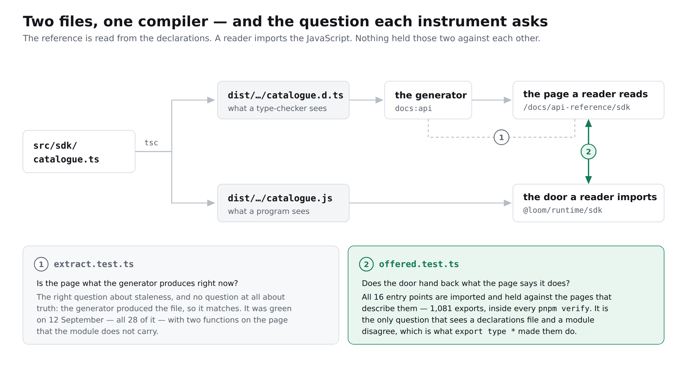
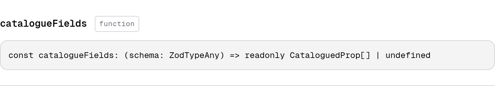

# 20 September 2026 — the door the reference describes, and the one question nothing was asking

**Routine:** `Loom docs` · **Branch:** `docs-30-the-door-the-reference-describes` · **Section:** §4c

**Preview:** the pull request's Vercel deployment. Published unverified, as every
routine run's has been: `*.vercel.app` is off this sandbox's egress allowlist and
the proxy answers `403 CONNECT tunnel failed`. That is the standing 15 September
finding and is not re-filed. The photographs below are production builds
(`pnpm build && next build && next start`), taken in Chromium.



## What this run was

The findings queue, not the plan. `Loom daily build` filed this on 12 September,
owned it to this lane, named the two possible remedies and said which was worth
having. It has sat open eight days while the API reference went on being the
thing this site stakes the most on.

> The second is the one worth having. `extract.test.ts` already pins the
> reference to what the generator produces *right now*, which is exactly the
> property that did not help here: the generator produced it, so it matched.

That last sentence is the whole finding, and it is worth saying plainly, because
it is a failure mode that a generated artefact invites and a hand-written one
does not.

## The bargain a generated reference makes, and the hole in it

This section of the site exists on one argument: **nobody maintains it, so it
cannot drift.** A hand-written reference is wrong the first time somebody adds an
export and forgets this file. A generated one is regenerated, and a stale
regeneration is a red test.

That argument is sound about *staleness* and it says nothing about *truth*. The
reference is read from `dist/*.d.ts` — the declarations, which is what a
consumer's **type-checker** sees. It is not what their **program** sees. Those
are two files produced by one compiler from one source, and the only reason
nobody thought to check them against each other is that they agree almost always.

On 12 September they did not. `export type * from "../catalogue.js"` is correct
TypeScript: it re-exports the target's types and, by the `type` modifier, none of
its values. Whatever resolved that star for the generator walked into the target
module and reported everything it found there, `export const` included.

So the page told a reader to import two functions from `@loom/runtime/sdk`. Here
is what shipped, photographed today on a real build with the defect put back:



A name, a kind badge reading **function**, and a full signature. On that entry
point `catalogueFields` is `undefined`. The same page carried `closedChoices` the
same way.

**And every test in this repository was green.** That is not a guess — it was
measured this morning, which is the next section.

## The experiment

`src/` is not this lane's and is not touched by this branch. The defect was
restored locally, measured, and put back from a byte-for-byte copy.

1. `export type *` restored in `src/sdk/catalogue.ts`.
2. `pnpm build`, then `pnpm --filter @loom/app docs:api`.
3. The reference regained 21 lines: `catalogueFields` as a **function**,
   `closedChoices` as a **function**, `ClosedChoice` as a type.
4. `extract.test.ts` — the test that guards this section — **passed, 28 of 28.**
5. `offered.test.ts` — this branch's — went red:

```
the reference lists catalogueFields under @loom/runtime/sdk as a function, and
importing catalogueFields from @loom/runtime/sdk gives nothing. The declarations
promise it and the built module does not carry it.
```

6. Both files restored from copies taken beforehand; `md5sum` matches on both,
   and `git diff main -- src/` is empty.

Step 4 is the finding's argument, and it is the reason this was worth a run. A
false page is not caught by asking the generator whether it wrote the page.

## What shipped

**`_lib/api/offered.ts`** — imports every published entry point and holds what it
hands back against the page that describes it. Four disagreements, each stated as
a fact about a reader rather than about a type system:

| | what it means |
| --- | --- |
| `not-offered` | the page offers it; the door hands back nothing under that name |
| `not-a-function` | the page says function; the door hands back something else |
| `not-listed` | the door offers it; no page mentions it |
| `offered-as-a-value` | the page says type; the door hands back a value too |

The last is the one that is easy to leave out. A name declared twice — a type and
a `const` under one name — reaches the generator as two declarations and is
described as whichever came first. Nothing on the page is then *false*; something
is simply missing from it, permanently and invisibly.

**`_lib/api/offered.test.ts`** — twelve tests. Eight drive the rules over
invented pages and invented modules, including a reconstruction of the 12
September defect. Four open the real doors: all sixteen, 1,081 exports, inside
`pnpm verify`.

Splitting it that way is the point rather than tidiness. **A guard that can only
be exercised by introducing the defect it guards against is a guard nobody
exercises.** The real check is green today and will be green for a long time; the
day it goes red, somebody will want to know that the thing going red understands
what it is looking at.

**`_lib/api/extract.ts`** — `PublishedEntry` gains `runtime`, the `default`
condition beside the `types` one it already read. Nothing in the reference is
read from it. It is carried so that something can hold the two files against each
other, and its doc comment says so.

## Why the other remedy was refused

The finding offered honouring the `type` modifier in the generator. It was not
taken, and this is deliberate rather than deferred.

Reading the modifier correctly fixes that one morning's defect and nothing else.
A value the build drops, a subpath whose conditions point at the wrong file, a
re-export of a module that was deleted — each still produces a confident page.
**Opening the door catches the class**, including the members of it nobody has
thought of, because the question it asks is the one the reader is really asking:
*if I type this import, do I get something?*

The consequence is worth stating plainly for the lane that will meet it: the
generator still mis-resolves a `type` star. The day somebody writes one in
`src/`, they get a red test naming the symbol and the door, rather than a page
that quietly lies. The workaround in `src/sdk/catalogue.ts` is now held up by
something rather than by memory.

This is not a replacement for reading the declarations. The declarations are
where the types are, and types are most of what a reference is for — a running
module cannot tell you what `TreeDelta` is. The two are held against each other,
which is the only arrangement in which either can be trusted.

## Decisions taken that were not specified

**No decision record.** Nothing here is constrained outside this route group, no
Accepted record is touched, and the change is the remedy the finding itself
prescribed and ranked. The same call the 19 September run in this lane made, for
the same reason. It also avoids a fourth claim on a decision number while
0173, 0174 and 0175 are all held by open pull requests. The full argument is in
`offered.ts`'s opening comment, which is where somebody who hits the test will
look.

**A schema is asked only that it is there, not that it is callable.** Zod objects
are not functions; a rule that forgot this would have failed the entire
reference. A `class` sits with `function`, because a class is a function once the
types are gone and the reader's question — is there something to call — has the
same answer for both.

**One test, not one per door.** A failure here is about the reference as a whole,
and a reader who hits it wants the whole list rather than whichever door sorted
earliest.

**A floor under the comparison.** Everything here compares two lists, and two
empty lists agree perfectly. A door that failed to import, a reference that
parsed to nothing, or a `publishedEntries` that returned `[]` would each produce
a green run with nothing compared. So the run is required to have opened at least
sixteen doors and found names behind them. This was not a precaution taken on
principle — it is the mutation that proved it, and it is in the table below.

## Found while writing

**Filed — one, for this lane.** Opening all sixteen doors turned up a page that
is missing the sentence a reader needs before their import will run.

Every published entry point is a barrel. The reference groups a page by the
module that *declares* each symbol, and a barrel declares nothing — so **an entry
point's own opening paragraph reaches no page, on any of the sixteen.** For
fifteen that costs little. For `@loom/runtime/testing/contracts` it costs the
reader this, which is paragraph five of that barrel's own comment:

> **These import `vitest`, and that is why they are not in `index.js`.**

None of it reaches `/docs/api-reference/testing-contracts`, which carries four
module paragraphs and says nothing anywhere about a test runner. Importing that
door from a plain Node script — which I did, by accident, writing this — gives:

```
Error: Vitest failed to access its internal state.
```

The door is honest in `src/`, the page is honest about its four modules, and the
one sentence that would have explained the crash is homeless between them. Not a
finding for another lane: the sentence in `src/` is already written and already
correct. Filed rather than fixed, because the fix I would take changes what the
reference is allowed to lift from a comment, and deciding that in the branch
whose whole subject is the reference telling the truth about what a door *offers*
would be two architectures in one pull request.

**Closed — one.** The 12 September entry, by its own second remedy.

## Tests

`pnpm install && pnpm verify` at the repository root: **green, exit 0**, read
from a log file rather than through a pipe.

| | `main` at `1abfbd7` | this branch |
| --- | --- | --- |
| `@loom/runtime` | 154 files / 2,807 tests | **154 / 2,807** — `src/` was not opened |
| `@loom/app` | 280 / 4,904 | **281 / 4,916** |
| findings ledger | 701 entries, 0 malformed | 702, 0 malformed |
| prerender | 107 pages, 858 junctions, 0 run together | 107, 858, 0 |

**+12 tests, one new file**, none weakened, nothing skipped. The delta is exact
from the diff itself: one test file is added and no existing test file is
touched, and the new file's twelve were counted in isolation. The `main` figures
are the worktree measurements two other lanes took of the same base commit today
on #346 and #348; my own counts reconcile to them exactly, so I did not spend a
third build re-measuring a number two runs had already measured.

Green is not evidence on its own, so **one real defect and four mutations of the
rules themselves were restored one at a time**, and every one was caught by the
test written for it:

| what was broken | what went red |
| --- | --- |
| `export type *` put back in `src/`, rebuilt, regenerated | *hands back exactly what its page says it does* — naming both symbols and the door |
| a schema is required to be callable | *asks of a schema only that it is there*, *says nothing about a page and a door that agree*, and the real check — 3 |
| a class is required to have nothing behind it | *is content with a class the door hands back as a function* |
| the sweep for what the door offers and no page mentions is dropped | *catches a door handing back something no page mentions*, and the reconstruction of the 12 September defect, which ends on exactly that row — 2 |
| `publishedEntries` returns nothing, so no door is opened at all | *was really opened, and really had names on it* and *offers applyDelta from the root* — 2 |

The last one is the reason the floor is there, and it earned its place: with no
doors published, **the real check passed** — it compared nothing against nothing
and was perfectly satisfied. Only the two tests that demand the run have actually
opened something saw it. That is the same class of mistake this lane recorded on
19 September, when a test read `node.text` on a node whose field is `value` and
compared every gloss against an empty string.

Each file was restored from a byte-for-byte copy afterwards rather than with
`git checkout`, which is the 16 September finding about a checkout quietly
reverting two files.

## Scope

`apps/loom/app/(docs)/_lib/api/` only, plus `FINDINGS.md` and this report. Three
files under `(docs)`: two new — `offered.ts` and `offered.test.ts` — and one
touched, `extract.ts`, for the six lines that read the `default` condition.

**No file in another lane was opened.** `git diff main -- src/` is empty, and
`reference.generated.json` is byte-identical to `main` — the runtime's published
surface did not move, so there was nothing to regenerate. This change is about
whether what the reference says is true, not about what is in it.

## At 390 pixels

Not measured, and deliberately: no page changed. The photograph above is a clip
of one export's entry at 1280, which is where the defect was legible. The
pictures are light — the standing gap recorded on 14, 15 and 16 September, where
the harness photographs an address and the theme lives in `localStorage`. Not
re-filed. The diagram carries its own dark mode and will follow the reader's.

## What I would write next

The two from yesterday are unchanged and still small, and the barrel paragraph
filed today sits with them:

- The arrival route on *Introduction* describes six steps beginning at
  *Installation* and does not acknowledge a reader who arrives there having
  already run the quickstart. One paragraph in `_lib/arrival/route.ts`.
- Whether a reader searching a name should be told which page it is on before the
  names land — an editorial question rather than a technical one.
- **The prose file is still at 91% of its compressed cap**, about two more
  written pages, and sharding it by section means the browser deciding which
  sections to ask for. That is the one with real work in it, and it is the one
  that will stop a run cold if it is left until it fires.
