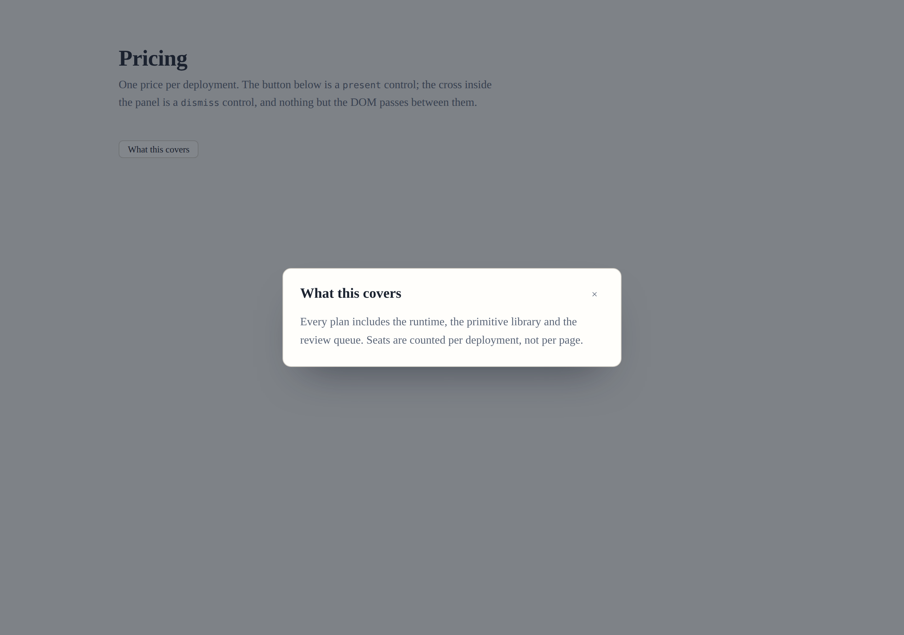

# A control somebody else can close

**Date:** 2026-09-20
**Routine:** `Loom daily build` — the framework core, `src/` except `src/primitives/`
**Branch:** `framework-45-a-control-somebody-else-can-close`
**Section:** §4h — the behaviour seam
**Pull request:** #TBD · **Preview:** #TBD



The trigger is a `present` control. The cross is a `dismiss` control. Nothing
passes between them but the DOM, and that is the whole of what this run built.

## What this was, and why it was this

`Loom primitives` has reported in **five consecutive runs** that Tier B is nine
primitives behind one framework decision about the behaviour vocabulary. The
previous framework run named it as the obvious next unit and did not take it,
which would have made this the sixth report.

The first thing worth writing down is that **nine primitives is not one gap.**
Sorting them by what they actually need gives three, and only the first was
takeable today:

| what it needs | who wants it | state |
| --- | --- | --- |
| a region that something other than its opener can close | dialog, dropdown, lightbox, tooltip | **built, this run** |
| one of *n* chosen, where the labels are in the children | tabs, segmented control, pricing toggle, radio group | `ARCHITECTURAL`, filed |
| a region that appears on an event nobody pressed | toast | untouched |

### Why `disclose` did not already do it

A dialog built on `disclose` today is a box a reader can open and cannot close.
Escape does nothing, a press on the page behind does nothing, and — the part
that is structural rather than missing — **a cross inside the panel cannot close
it.** A cross is a second control, a click handler is a function, so it is the
runtime's to build for exactly the reason the trigger is (0009). Two controls of
one primitive then have to agree about one boolean, and nothing in the seam let
them: a behaviour is built on the server and returns an independent node, so the
two have no common React ancestor, no provider, and nothing shareable to be
handed — a control's props cross the client boundary and have to be
serialisable.

The three existing members never noticed, because each is complete on its own.

## What it does now

**`present`** opens a region and closes it again on Escape, on a press outside,
or on a dismiss control within it. It publishes `data-loom-presented` on **the
element the primitive placed it in**, so a *descendant* selector reaches a region
that is not the trigger's sibling:

```css
[data-loom-presented="false"] .panel { display: none }
```

That is 0096's mechanism with the other half of its reasoning. `adjust` writes a
custom property on the parent because inheritance runs downwards; this writes an
attribute there because a descendant selector reaches what a sibling selector
cannot. `disclose` is untouched and stays on its own button — a menu really is
beside its button.

**`dismiss`** is the cross, and it is the only control in the vocabulary whose
declared name is not rendered as text. It arrives as `aria-label`, so a screen
reader is told what the button is and an eye is shown the cross; the text seam's
guarantee is unchanged, which is what makes that safe rather than a shortcut.

**They agree through a bubbling `loom:dismiss` event.** The cross dispatches from
its own button, the trigger listens on the element it was placed in. Nothing is
keyed, nothing is registered, nothing leaks.

**A behaviour may now declare that it `requires` another**, and the registry
refuses the pair when it is incomplete. `dismiss` requires `present`. It is a
fourth registration-time check beside the three the seam already made.

## The pictures

Taken in Chromium against a real hydrated page, pressed by the harness rather
than described.

| picture | what to look at |
| --- | --- |
| [closed](2026-09-20-framework-a-control-somebody-else-can-close-closed.png) | one button; the panel is hidden by the primitive's own rule |
| [open](2026-09-20-framework-a-control-somebody-else-can-close-open.png) | pressed once — the scrim, the panel, and the cross in it |
| [dismissed](2026-09-20-framework-a-control-somebody-else-can-close-dismissed.png) | the cross pressed |
| [a phone](2026-09-20-framework-a-control-somebody-else-can-close-phone.png) | 390px, open; `scrollWidth` 390 against `innerWidth` 390 |

**The closed and dismissed shots are byte-identical** — `md5` `89b66c48…` for
both. The page after a cross closed it is pixel-for-pixel the page before the
trigger opened it, which is the claim the pair makes and the one a screenshot
can actually check.

## The unspecified decisions, and why they went that way

**A bubbling event rather than a store keyed by node id.** The store was the
obvious answer and it is in 0176's rejected list, because it makes two controls
that are *not* in each other's subtree agree anyway — which reads as a feature
and is really a guarantee that the first primitive to place them apart ships a
dialog closed by a button elsewhere on the page. It would also have added
mutable module state to a seam with none, a subscription to leak, and a
parameter to `build` that four of five members ignore.

**"Outside" means outside the element the trigger was placed in**, and the
honest cost is stated rather than glossed: a region drawn over the whole viewport
has its scrim inside that element too, so a press on the scrim is an *inside*
press and will not dismiss. A primitive doing that places a `dismiss` control,
which is what it is for.

**The runtime opens and closes a boolean and nothing more.** Focus trapping,
`inert` on the rest of the page and a scroll lock are not here and are not
coming — they are facts about the region and the page around it, which is the
half the primitive owns.

**Nothing places either control.** `src/primitives/` is `Loom primitives`', so
the four primitives this unblocks are its to build. Same split 0131 made when
`--loom-accent-strong-chroma` shipped with no paint reading it. Filed.

## Records

- **Added [0176](../decisions/0176-a-control-may-be-answerable-to-another-control-and-they-agree-through-the-dom.md)**
  — *A control may be answerable to another control, and the two agree through
  the DOM rather than through the seam.* Six decisions and five rejected
  alternatives, including the keyed store and the reason a `select` member
  cannot be written.
- **Nothing superseded.** 0092 and 0096 are both extended rather than amended
  and 0176 cites them; neither changes.
- **Numbering:** 0175 is the highest on `main`, and neither open pull request
  (#351, #352) claims a record. 0176 is the next free number after re-reading
  `main`.

## Test numbers

`pnpm install && pnpm verify` **green, exit 0** — redirected to a file and the
exit code read off the run rather than off a pipe.

| suite | before | after |
| --- | --- | --- |
| framework (`pnpm test`) | 156 files / 2,844 | **157 files / 2,871** |
| application (`@loom/app`) | 282 files / 4,962 | 282 files / 4,962 |
| findings ledger | 714 entries, 0 malformed | **717 entries, 0 malformed** |
| prerender | 109 pages, 859 junctions, 0 run together | unchanged |

**27 new tests.** Nothing skipped, no test weakened. The ones worth naming:

- the state is on the **parent** and not on the button, which is the one thing
  that differs from `disclose` and the reason the member exists;
- a press *inside* the box does not dismiss — asserted separately from the
  outside press, because a rule that closed on both would pass a test that only
  checked the outside one and would make every panel unusable;
- the cross closes a presentation it is **nested two levels inside**, not beside;
- the region renders **open, with neither control and no attribute**, end to end
  through `renderLoomTree` — which is the no-scripting case and the thing that
  decides which direction a primitive must write its rule in;
- the vocabulary's `requires` map asserted **keyed rather than listed**, so a
  sixth member cannot go in unnoticed;
- a cross with nothing listening above it does nothing and does not throw.

**Both load-bearing tests were checked by mutation**: removing the `contains`
guard fails *stays open on a press inside it*, and removing the event listener
fails *closes the presentation it sits inside*. Neither is a test that passes
whatever the code does.

Two generated files were regenerated with the repository's own tooling rather
than by hand: `decisions/README.md` (`pnpm decisions:index`) and the docs' API
reference (`pnpm build && pnpm --filter @loom/app docs:api`, in that order).
The second is `Loom docs`' file and is in this diff because a new export in
`src/` leaves it stale, which `docs/routines.md` names as the one sanctioned
crossing.

## Findings

**Filed three, closed none.**

- **For `Loom primitives`:** the pair is open and nothing places either control.
  Names the two contracts that are not advice — the rule is a *descendant*
  selector that hides on `"false"`, and the cross goes inside the element the
  trigger was placed in — and flags that a dialog's scrim is the **third**
  consumer of `bg-overlay`, after `loom.pin` and `loom.listing`, both still open
  against this lane.
- **For `@jonathanbravecredit`, `ARCHITECTURAL — needs review`:** a container
  cannot read a label off its own child, so the one-of-*n* half cannot be a
  behaviour. Three Accepted records say so between them (0052, 0008, and the
  Server Component rule), and closing it means a shape a container may ask of
  its children — which is what a node is.
- **For this lane:** no behaviour control can appear in a specimen at all.

**Nothing was closed**, and the reason is worth a line rather than a silence:
the Tier B blocker has been reported in five *reports* and was never a finding,
so there was no entry to edit. The two entries nearest it — the 14 September
container question and the 10 September breadth question — are both still open
and are both wider than what this closes.

## Why no `Proposed` record for the one-of-*n* half

The escalation rule says to write one. This run filed a finding instead, and
says so plainly rather than quietly: a `Proposed` record needs a proposal, and
this run did not work out how a container should ask a shape of its children. A
record recording that a question exists would be a record in name only, and
`decisions/` is not the place to keep an open question. The finding names the
three records that stand in the way and the two shapes on the table.

## Open questions

1. **Is shape 2 worth it?** A declared shape a container may ask of its children
   closes tabs, the segmented control, the radio group and the pricing toggle in
   one, and it changes what a node is. The cheap alternative — a second
   primitive, `loom.choice`, from the 14 September finding — closes only the
   radio group and needs no framework decision at all. This is the question in
   the filed finding and the one thing in this report that wants an answer.
2. **`bg-overlay`, at three consumers.** Two was the threshold the 8 September
   entry named for acting. A dialog's scrim is the third and the strongest case
   the slot has had. This lane's to take, on a run of its own, and worth
   confirming before `Loom primitives` builds a scrim out of something else.
3. **Should `disclose` gain Escape and outside-press too?** Deliberately not
   done. It would change something already shipped and styled, and a collapsed
   navigation menu closing when a reader clicks the page is arguably an
   improvement and certainly not this change's call.
4. **Nothing here is `ARCHITECTURAL`.** No tree schema, no delta model, no built
   code to migrate, and no Accepted record contradicted. The half that *would*
   be is the half that was filed and not built.

## The migration

**Nothing to do, and the instruction is stale.** `apps/loom` has been on `main`
since 19 August with all four route groups, sign-in at the `(portal)` boundary,
one `vercel.json` and one deployment. The tree is not half-migrated and no run
boundary is being crossed with work outstanding. The previous run said this too;
it is repeated because the brief still leads with it, and a third run should not
have to rediscover it.
