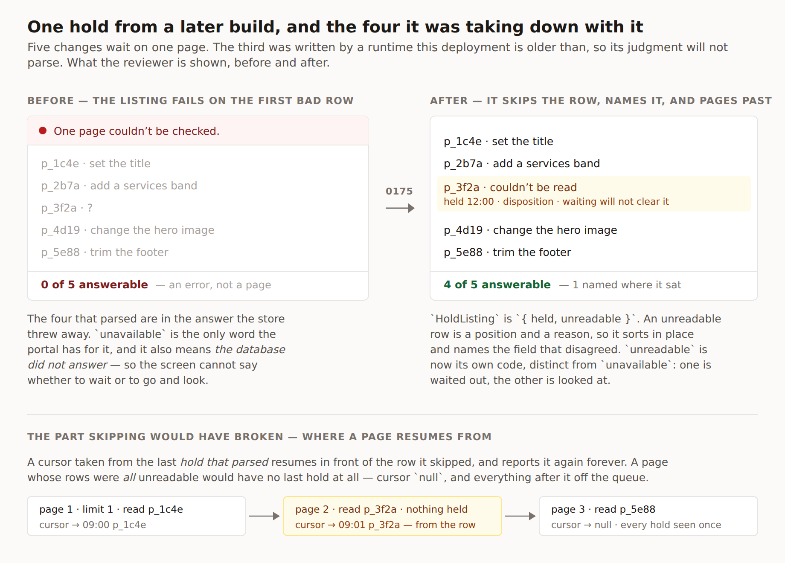

# One row it could not read, and the four it was taking down with it

**Date:** 2026-09-20
**Routine:** `Loom daily build` — the framework core, `src/` except `src/primitives/`
**Branch:** `framework-43-one-row-it-could-not-read`
**Section:** §5 — the hold store; reaching §2 and the portal's front door
**Pull request:** #347 ·
**Preview:** _added to the pull request once Vercel reports it._ There is nothing
new to look at beyond the figure below: this is a store seam, and the one screen
that will show the difference is the portal's, whose own pass is filed as a
finding rather than taken here.

## What this was

Two open findings owned by this lane, both filed by `Loom portal` on 18
September, one directly under the other. They read as a naming question and a
policy question. They are one fault seen from two sides, and neither closes
without the other.

**A page with five changes waiting on it could show none of them.**
`postgresHoldStore.parseAll` failed the whole listing on the first row that did
not parse, so one hold written by a runtime the deployment is older than took
that page's entire queue off the front door — and every other change waiting on
that page went unmentioned with it. A new `DispositionReasonCode`, a new field
on a judgment, a schema widened in either direction: any of those makes a
deployment mid-rollout stop listing some of its own pages.

**And the screen could not say what had happened**, because `HoldError` had one
word for two facts. *The database did not answer* and *a stored hold did not
parse* both arrived as `unavailable`, and they want opposite next moves — wait,
or go and look. The portal's note said so in as many words: *"the honest
sentence is the one that does not guess."*

## What it does now

**`HoldError` gains `unreadable`.** `unavailable` is a store that did not
answer and may answer in a minute. `unreadable` is a store that answered with
something this build cannot parse — a fact, not a blip. `parseHeldProposal`
returns the second; every `catch` in the Postgres store still returns the first.

**Both listings answer `HoldListing`** — `{ held, unreadable }` — rather than an
array. An `UnreadableHold` is a `HoldPosition` and a reason: the row's primary
key, the instant beside it, and which field disagreed. It sorts in
`compareHolds` order with the holds that parsed, so a queue can render it in
place rather than re-joining two lists by id.

**A row the listing can place is skipped and named. A row it cannot place fails
the listing.** The split is the two columns the index orders by, and it is the
part of this that took the thinking.

## The unspecified decision, and why it went that way

The finding asked for *skip the row, count it, report it*, and stopped there.
Implemented literally that introduces a worse bug than the one it removes, and
it took writing the paging test to see it.

The cursor was taken from the last **hold that parsed**. Once rows can be
skipped, that is no longer the last row read. A page whose final rows were all
unreadable resumes in front of them and reports them again forever; a page whose
rows were *all* unreadable has no last hold at all, so the cursor comes back
`null` and every hold after them drops off the queue — the original fault, moved
one page along and harder to see. `pageEnd` now takes the position from the
window's last row, readable or not.

That works only if the row can be positioned. So a row whose own `(heldAt,
proposalId)` will not parse is the one case that still fails the listing: there
is no cursor that steps over it, and skipping it would send the next request
back to the beginning to page forever. That is the narrow residue of the old
behaviour, and it is now the only thing left of it.

**The other judgement call** is that `forTree` changed shape rather than gaining
a sibling method. Eight call sites across four lanes broke, each mechanically
(`.value` → `.value.held`). That is the seam working as intended: a caller that
went on silently reading an array would be a caller that never learned a row had
been skipped.

## Records

- **Added [0175](../decisions/0175-a-listing-skips-the-row-it-cannot-read-and-fails-the-one-it-cannot-place.md)**
  — *A listing skips the row it cannot read and fails the one it cannot place,
  and a store that did not answer is a different word from a row that did not
  parse.* Four decisions and five rejected alternatives, including the
  simpler *skip everything* rule and the reason it pages forever.
- **Nothing superseded.** The behaviour this replaces lived in a source comment
  and in no record. 0138 had already decided the same question one layer up —
  `markHoldsFromStore` returns `{ marked, unreadable }` and never fails — and
  0175 is the hold store catching up with it; 0175 cites it rather than
  amending it.
- **Numbering:** 0173 is claimed by this lane's open #345 and 0174 by
  `Loom primitives`' open #346, both unmerged at the time of writing. 0175 is
  the next free number after re-reading `main`.

## Findings

**Closed two, both `Loom portal`'s, both 18 September:**

- *`HoldError` cannot tell a store that did not answer from a hold this
  deployment cannot read* — closed. `unreadableQueue` failed to compile exactly
  as the finding predicted, and this branch filled in its fourth sentence.
- *One hold a deployment cannot parse removes a whole page from the review
  queue* — closed. Noted in the entry that the finding's own account was missing
  the cursor half, since that is the part a future reader will need.

**Filed one, for `Loom portal`:** the listing now hands back the rows it could
not read and nothing on any screen renders them. Three portal screens take
`.held` and drop the rest — this branch's edit, and the smallest one that
compiles, not a judgement about what those screens should show. The one worth a
decision is the *waiting* count on the pages index, which can now be confidently
short. Recommended `held.length` with a mark, because a reviewer acts on what
they can answer; it is their sentence and the framework has no view.

## Test numbers

`pnpm verify` **green, exit 0**, with nothing skipped and no test weakened.

| suite | before | after |
| --- | --- | --- |
| framework (`pnpm test`) | 2,807 | **2,814** |
| application (`@loom/app`) | 4,904 | 4,904 |
| findings ledger | — | 702 entries, 0 malformed |
| prerender | — | 107 pages, 858 junctions, 0 run together |

Seven new tests, all against PGlite except two:

- the whole `HoldError` union, keyed rather than listed — the list it replaced
  could not tell covering the union from holding three distinct things, and a
  fourth code went in without it noticing;
- `unavailable` and `unreadable` do not describe themselves the same way;
- both stores report nothing unreadable when every row parses (contract, so it
  runs twice);
- a listing keeps its other four holds and names the one it skipped;
- a skipped hold says which field disagreed;
- a listing fails on a row it cannot place at all;
- a page steps past an unreadable row rather than resuming in front of it;
- a page that could read nothing still hands back a cursor.

Two generated files were regenerated with the repository's own tooling rather
than by hand: the docs' API reference (`pnpm --filter @loom/app docs:api`) and
the docs' code fences (`pnpm --filter @loom/app docs:fences`).

## The migration

**Nothing to do.** `apps/loom` has been on `main` since 19 August with all four
route groups, the sign-in proxy at the `(portal)` boundary, one `vercel.json`
and one deployment. The tree is not half-migrated and no run boundary is being
crossed with work outstanding. The prompt's standing instruction is stale, which
is worth one line here rather than a finding.

## Open questions

1. **Should a framework PR touch another lane's prose at all?** Five files
   outside `src/` changed here and every one was a compile error: three portal
   screens, a docs bench, a docs code fence and its MDX source. The sixth —
   `unreadableQueue`'s new sentence — was compile-forced as a key and
   *not* forced as a sentence, and I wrote the sentence rather than leaving a
   placeholder. Same question #345 raised; still worth a ruling.
2. **Does `waiting` want the same treatment as `forTree` in the portal's
   count?** Filed rather than decided — see above.
3. **Nothing here is `ARCHITECTURAL`.** No tree schema, no delta model, no
   built code to migrate, and no Accepted record contradicted.
