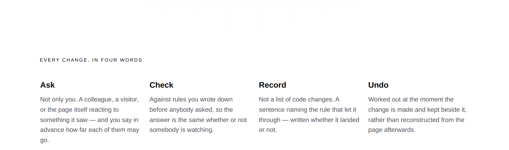
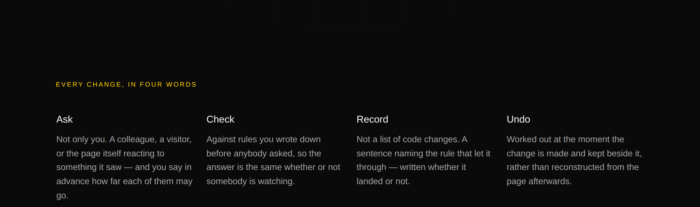

# 2026-09-20 — marketing: four words that say something, and two things a photograph found

This run began by opening the front door and looking at it, which is the
instrument this lane had not used for a while. Three things came back, and only
one of them was mine to fix.

---

## What shipped

**One band, rebuilt.** The second thing every visitor to this site meets — the
row of four plain words under the headline — was four grey nouns in a
`loom.logo-cloud` and is now four terms, each with the one line that makes it
mean something.

| file | what changed |
| --- | --- |
| `_lib/journey.ts` | `PLAIN_WORDS_GLOSSED` — the four words, each with its line. `PLAIN_WORDS` is derived from it |
| `_lib/pages/home.ts` | the band is a `loom.section` of four `loom.feature`s, not a logo cloud |
| `_lib/readers/asked.ts` | `BAND_TYPES` loses `loom.logo-cloud`, which nothing renders any more |
| `_lib/journey.test.ts` | four new assertions |

**Nothing was added to the primitive library and `src/` was not opened.** The
band is composed from `loom.section`, `loom.feature-grid` and `loom.feature`,
all three already registered and none of them new.

### What was wrong with it

`Ask · Check · Record · Undo`, in muted grey, under a small centred label. Four
verbs with no object. A stranger who reads them has been told nothing, and the
band photographed as an empty strip between the tallest band on the site and the
one it exists to introduce.

The words themselves were right and are unchanged — `journey.ts` records why
*Undo* is on the first screen, and that argument still holds. What nobody had
revisited was the rendering: `loom.logo-cloud` is the primitive for *the
companies who use us*, and this site is meant to be evidence for the library
rather than a catalogue of it being used wrongly.

### The constraint that did the work

Each line had to say something **the hero's paragraph does not already say**.
That is easy to state and easy to lose, because the paragraph directly above
this band already reads *ask in your own words · checked against your rules · a
record of who asked, what moved, and how to put it back* — which is these four
words in a row. A gloss that restates it is the same claim printed twice, one
screen apart.

So each line is the fact a competitor could not put under that word:

| | what the line adds |
| --- | --- |
| **Ask** | who may — not only you, and you decide in advance how far each may go |
| **Check** | whose rules, and that they were written before anybody asked |
| **Record** | what the record is made of: a sentence, not a list of code changes |
| **Undo** | *when* the reversal is worked out — at the same moment, not afterwards |

**My first draft of *Record* failed that constraint**, and it failed it the way
that is hardest to catch by reading: *who asked, what moved, and which of your
rules let it through* against a hero promising *a record of who asked, what
moved, and how to put it back*. Both sentences are true and each is good on its
own. The test below is what caught it.

### Three things the suite said, and it was right all three times

The first version of this band was a `loom.stack` holding a paragraph and the
grid. `pnpm verify` refused it, and not for a reason I had thought about:

- **`outline.test.ts`** — *has a row for every band except the rules between
  them*. A bare stack carries no `eyebrow`, no `label` and no heading, so
  `outline.ts` could not name it and dropped it. The page's own record would have
  shown the front door with a hole in it. That assertion's comment says it exists
  for exactly this and it had never fired before.
- **`readers/asked.ts`, twice** — the band type a reader signal counts, and the
  set of band types the site renders, both still named `loom.logo-cloud`.

The fix for all three was the same and is better than what I had: the band is a
**`loom.section` with an eyebrow and no heading slot**. The words are the
headings, the label is the eyebrow every other band on this page wears, and
everything that reads this page as a page — the outline, the reader signals, the
planner that finds the band a request is about — finds it the ordinary way.

It also **shortened a pinned list**: `BAND_TYPES` was three entries because one
band wore the wrong primitive, and is two now. The paragraph explaining the odd
third one went with it.

---

## Found by looking, and neither is mine to fix

### The hero paints its backdrop on top of its own headline

The grid's 1px lines cross *components,* and *Loom creates* and read as a
strikethrough, and they cross the primary button too. Every paint in
`backdrop.ts` is `position: absolute` with **no `z-index`**, and `loom.hero`'s
text column is `static` — and a positioned element with `z-index: auto` paints
above non-positioned content whatever the DOM order.

`loom.backdrop` already carries the fix, one line, under a comment saying why:
`createElement("div", { style: { position: "relative", zIndex: 1 } }, children)`.
`loom.hero` composes the same layers and has no such wrapper.

**Nothing in the repository could see it.** The layers are `pointerEvents:
"none"`, so hit-testing still answers `H1`, every click lands, and every
assertion about markup, colour, order and width passes. All ten marketing pages
use a painted hero backdrop and so does the demonstration's own page.

Filed for `Loom primitives`. I am **not** working around it here: swapping the
front door to an unpainted backdrop would hide one page's symptom and leave the
other ten.

### There is nothing to press on the first screen

Measured in Chromium against `next start`, three palettes:

| palette | headline | first control | 1280×900 | 1366×768 |
| --- | --- | --- | --- | --- |
| `minimal` | 72px, **4 lines** | top 857, bottom 923 | sliced by the fold | 89px below it |
| `bold` | 88px, 4 lines | top 912 | **entirely below the fold** | below it |
| `editorial` | 72px, 3 lines | top 746 | visible | below it |

At 390×844 the first control is at 1078 — 234px below the fold.

The cause is one constant. `loom.hero` caps its text column at `TEXT_MEASURE =
"44rem"`, covering the heading slot and the prose alike, and **a measure written
as a length is a measure only at one font size**. The maintainer's 48-character
headline is being set at 10, 11, 12 and 12 characters a line in a 704px column
inside a 1280px page.

What a separate heading measure would buy, measured by lifting the cap on the
heading's own ancestors and leaving the prose at 44rem:

| heading measure | `minimal` | `bold` |
| --- | --- | --- |
| 44rem (today) | 4 lines, control at 857 | 4 lines, at 912 |
| 52rem | 3 lines, at 775 | 3 lines, at 811 |
| 58rem or wider | **2 lines, at 692** | 3 lines, at 811 |

Also filed: `stature: "tall"` sets `minHeight: 78vh` and nothing else, and this
page's hero content is 880px against a 702px floor — so **the prop is a no-op on
the front door.** The composition asks for a tall hero and every pixel of the
height comes from the primitive's padding and from the copy.

I did not spend the site's core promise to buy part of this back. The levers in
this lane — the paragraph's length, the prose size, the action scale — are worth
at most 80px of the 150–250 needed, and the paragraph they would come out of is
the one sentence on the site that says what the product does.

---

## Both palettes, and a phone

| | |
| --- | --- |
|  | on a phone the grid collapses to one column, four terms down the page |

`scrollWidth 1280 / innerWidth 1280` wide and `390 / 390` on the phone, measured
by the harness on the built application under `next start`. **No colour is named
anywhere in the diff.** Whole-page shots are beside this file as
`2026-09-20-marketing-four-words-that-say-something{,-bold,-phone}.png`.

### What the band costs

| | before | after |
| --- | --- | --- |
| front door, 1280 | 7,692px | **7,893px** (+201) |
| front door, 390 | 12,814px | **13,397px** (+583) |

The phone figure is the honest cost: `columns: "four"` is a floor rather than a
count, so a phone stacks the four and the visitor passes ~580px more before
reaching *See it happen*. Four sentences is what the band is for, and a phone
reader who wanted four words had been given four words that said nothing.

---

## Tests

`pnpm install && pnpm verify` — **green, exit 0**, read from a log file rather
than through a pipe. Nothing failed, nothing skipped, **no test weakened or
deleted**.

| suite | `main` at `1abfbd7` | this branch |
| --- | --- | --- |
| `@loom/runtime` | 154 files / 2,807 tests | **154 / 2,807** — `src/` was not opened |
| `@loom/app` | 280 files / 4,904 tests | **280 / 4,908** |
| marketing, within it | — | 38 files / 1,612 tests |

`findings:check` reads 703 entries, 0 malformed. `prerender:check` reports 107
pages and 858 junctions, 0 run together.

The `main` numbers were measured by checking `main` out into a worktree and
running the suite, not quoted from a report. One test failed there —
`(docs)/_lib/api/extract.test.ts`, which reads `dist/` — and it is an artefact of
a worktree that has no `dist/` of its own rather than anything wrong with `main`.

**Four tests are new**, all in `journey.test.ts`.

### Mutations

Four defects restored one at a time against a committed baseline.

| mutation | result |
| --- | --- |
| the *Record* draft that restated the hero, word for word | **1 red** |
| a gloss that calls the words steps and counts them | **1 red** |
| the features go back to `surface: "card"` | **1 red** |
| the lines dropped, the words left bare | **1 red** |

One more is worth recording because it was not a mutation. The *does not repeat
the band above it* test first read `node.text` on a node whose field is `value`,
so it compared every gloss against an empty string and passed. It was caught by
the floor under it — `expect(aboveRuns.size).toBeGreaterThan(20)` — which is the
only reason the test is a test. It reads the site's own `wordsOf` now, which also
picks up prose props, so the hero's eyebrow counts as the band above.

Five words is the window: long enough that an ordinary shared phrase — *your
rules*, *the page* — passes, short enough that a clause carried over from the
hero does not.

---

## Decisions and findings

**No record written.** Nothing here is constrained outside this route group and
no Accepted record is touched.

**Two findings filed, both for `Loom primitives`**, both above, both with the
measurements. The first is one line and the sibling primitive already carries it.

**No finding closed.** Nothing in this lane's queue was open.

## Needs your input

- **The four lines are new copy and they are the only copy I wrote.** Each is a
  statement about the machinery rather than about who this is for or what it
  costs, but they are on the first screen and a half, which is where positioning
  lives. Re-word freely — `PLAIN_WORDS_GLOSSED` is one list in one file.
- **The licence line** (#96, on every marketing PR since #134). Still the site's
  one placeholder.
- **Positioning, audience and pricing.** Untouched, as always.

Nothing scheduled and nothing armed.
