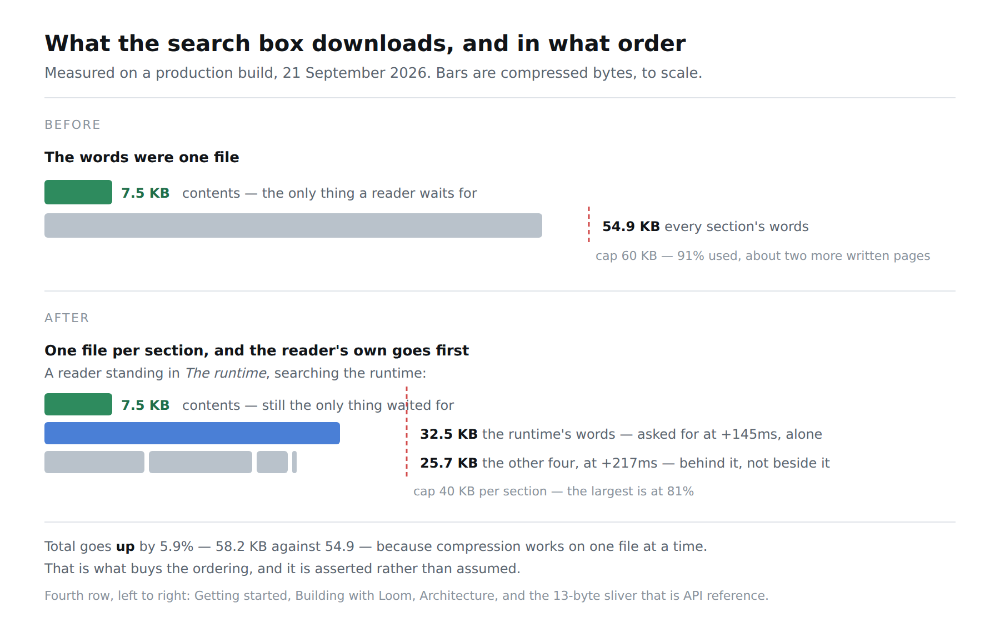

# 21 September 2026 — the words of the section you are in, and the cap that stopped being one number

**Routine:** `Loom docs` · **Branch:** `docs-31-the-words-of-the-section-you-are-in` · **Section:** §4c

**Preview:** the pull request's Vercel deployment. Published unverified, as every
routine run's has been: `*.vercel.app` is off this sandbox's egress allowlist and
the proxy answers `403 CONNECT tunnel failed`. That is the standing 15 September
finding and is not re-filed. Everything measured below is a production build
(`pnpm build && next build && next start`), fetched over real HTTP and driven in
Chromium.



## What this run was

The findings queue. This lane filed it on 19 September and yesterday's report
named it as *the one with real work in it, and the one that will stop a run cold
if it is left until it fires.* It had two written pages of headroom for the whole
site, and this lane writes about one a week.

## The plain version

The search box downloads the site's words so that a reader who searches for
something a page **says** — rather than something a heading is **called** — is
not told the site has never heard of it. Those words were one file. It was 55 KB
compressed, under a 60 KB cap, and nothing else was near its own.

Two things were wrong with that, and only one of them was the number.

- A reader standing on a page about the runtime, searching the runtime, waited
  for the words of every other section before the words of the one they were
  standing in.
- The cap was one number over four sections, so it moved for four unrelated
  reasons and told nobody which.

**The words are now one file per section, and the reader's own is asked for
first.** Same idea as the two splits before it — the words left the table of
contents in September, the runtime's published names left on the 19th — applied
along the line these actually grow on: somebody writes a page, and one section's
file moves.

## What it buys, and what it does not

It buys **ordering**. Measured in Chromium against the production build, from
`/docs/the-runtime/what-the-gate-decides`:

```
+145ms  /docs/search-index
+145ms  /docs/search-index/names
+145ms  /docs/search-index/code
+145ms  /docs/search-index/prose/the-runtime      ← the reader's own, alone
+217ms  /docs/search-index/prose/getting-started
+217ms  /docs/search-index/prose/building-with-loom
+217ms  /docs/search-index/prose/api-reference
+217ms  /docs/search-index/prose/architecture
```

From `/docs/getting-started/introduction` the first prose request is
`prose/getting-started` and the other four follow 24ms behind it. The band most
likely to answer a reader turns on before the rest of the site's words have been
asked for.

**The `alone` is the whole design and it is not free.** Four requests leaving
together and arriving in whatever order a connection gives them is not an
ordering, it is a hope. So the rest wait for the reader's own to *settle* —
settle, not arrive, because a section whose file 404s must not hold the other
four hostage. There is a test for exactly that.

It buys **a number that means something**. One cap per section, which moves when
this lane writes a page into that section, plus a bill over all of them. They
have different remedies, which is the point of their being two: the per-section
cap says *shard this section by page*, and the bill says *sharding is finished
as an answer; the question is now whether a browser should be sent the whole
site's prose at all.*

**It does not buy fewer bytes.** A reader who leaves the box open receives every
section's words and receives 5.9% **more** of them — 58.2 KB across five files
against 54.9 KB as one — because compression works on one file at a time and a
smaller file compresses worse. That is the price of the ordering. It is
asserted rather than assumed: a test holds the sum of the parts against the
whole and fails above 10%, which is the difference between a split that costs
what a split costs and one that has quietly started repeating itself.

## What shipped

**`_lib/search/shards.ts`** — two functions and the argument for them.
`docsSectionOfPath` is the inverse of `docsHref` and the only one; `proseSectionsIn`
reads which sections exist off the table of contents the browser already holds.
Both run in the browser and in the builder, deliberately: the builder decides
which file a body is written into and the browser decides which file to ask for,
and if those were two statements of what a docs address looks like, the symptom
of their drifting would be a search box whose every prose fetch 404s while every
test in this repository stayed green.

**`docs/search-index/prose/[section]/route.ts`** — one static file per section,
replacing the single one. `dynamicParams` is off and `generateStaticParams`
offers **every** section rather than only the written ones: the API reference has
no words and answers `{"bodies":[]}`, which is 13 bytes and one fewer place for
the browser to keep its own idea of which sections somebody has written in.

**`_components/search.tsx`** — the reader's own section is asked for off the
address bar alone, without waiting for the table of contents; the rest go out
once it settles. The prose is held as a list of parts and folded one after
another, which needs no special case, because each carries one section's bodies
and no two carry the same address.

**Three new test files' worth of guard**, and one honesty fix described below.

## The honesty fix, found by fetching the files

Serving the shards over HTTP and measuring them disagreed with the test by about
1%: 31,074 bytes for *Getting started* against the 30,724 the cap had been
reading. The cause is that `"…".length` is 1 and what goes down the wire is 3,
and this site's prose is full of ellipses, em-dashes and curly quotes.

The gzip caps were always honest, because `gzipSync` encodes before it
compresses. The four **uncompressed** caps were not: they had been counting
UTF-16 code units and calling them bytes since the day they were written. They
now use `Buffer.byteLength`. No cap went red — the largest is at 82% — but every
one of these numbers is supposed to be a bill, and three of them were about 1%
kinder than the bill.

Fixed rather than filed because it is four lines in a file this branch was
already rewriting, and leaving three of four caps measuring the wrong unit while
correcting the fourth would have been worse than either.

## Decisions taken that were not specified

**No decision record.** Nothing here is constrained outside this route group, no
Accepted record is touched, and the change is the remedy the finding itself
prescribed and the cap's own comment has prescribed since the first split. Same
call as the 19th and the 20th in this lane, for the same reason.

**Sharded by section, not by page.** A page is the finer line and the browser
knows which page a reader is on. It was not taken, for two reasons that are
about cost rather than taste: twenty-odd files pay the 5.9% compression
overhead again and harder, and a reader would make twenty-odd requests to get
the words they already have in five. Section is the coarsest line that
separates *this lane writes a page* from *this lane writes a page over there*,
which is what the cap needed. The per-page split is filed, with its trigger
named — see below.

**The rest go out together rather than one at a time.** Once the reader's own
section has landed, the four left have no order worth choosing between, and
sending for them one at a time to honour one would make the rest of the site's
words arrive much later to settle a question nobody is asking. I wrote a
`proseShardOrder` that ranked them and **deleted it**: the mutation run showed
that breaking it failed no test that was about the browser, which is the correct
way to be told that a function is not doing anything.

**A section with no words answers with none.** The alternative was the browser
holding a list of which sections are written, which is a second statement of
something `nav.ts` already says, to save one request for 13 bytes.

## Found while writing

**Filed — one, for this lane.** The five files are not the same size: *The
runtime* is 56% of the site's words on its own, at 81% of the per-section cap,
where every other section is under 30%. So the split bought this lane about
twenty more pages in any section except the one it is most likely to write in,
where it bought about three. The next line — one file per page within a section
— is named in the finding along with the thing to measure when taking it.

**Not re-filed:** the screenshot harness still cannot type into a box (19
September), which is why the photograph beside this report shows the dialog open
and empty rather than answering. The search box driven with a query is in the
measurements above instead, taken with a throwaway script rather than a second
harness.

**Closed — one.** The 19 September prose-cap entry, by its own remedy.

## Tests

`pnpm install && pnpm verify` at the repository root: **green, exit 0**, read
from a log file rather than through a pipe.

| | `main` at `0aa38ef` | this branch |
| --- | --- | --- |
| `@loom/runtime` | 156 files / 2,844 tests | **156 / 2,844** — `src/` was not opened |
| `@loom/app` | 282 / 4,962 | **284 / 4,977** |
| findings ledger | 714 entries, 0 malformed | 715, 0 malformed |
| prerender | 109 pages, 859 junctions, 0 run together | 109, 859, 0 |

**+15 tests, two new files**, none weakened, nothing skipped. The `main` figures
were measured on this machine in a worktree at `origin/main`, not carried over
from another run's report.

Green is not evidence, so **seven mutations were introduced one at a time** and
every one was caught:

| what was broken | what went red |
| --- | --- |
| a docs address's section read from the page segment | 14 tests across all four files |
| a section's file carries every section's words | the partition, the split's cost, the cap, and both route checks — 5 |
| the rest of the sections asked for beside the reader's own, not behind it | *asks for the reader's own section before any other* |
| the route prebuilds only the written sections | *is prebuilt for every section the browser will ask for* |
| the section list skips a section whose pages carry no words | 5, including all three browser checks |
| a shard that has been asked for is not recorded as asked for | *asks for each file once* — the refetch loop |
| the reader's own section ordered last rather than first | **nothing** — which is how `proseShardOrder` was found to be doing no work, and deleted |

The last row is the one worth keeping. The first version of the ordering test
also caught nothing when the `ownSettled` gate was removed, because it held
*every* file pending — and a browser that has not received the table of contents
cannot know which sections exist, so one request and four look identical in that
state. Holding only the words, and letting the contents land, is the arrangement
in which the two differ. The test was wrong in the direction that passes.

Files were restored from byte-for-byte copies rather than with `git checkout`,
which is the 16 September finding, and `diff` against the copies is empty on all
four.

Beyond the unit tests, the five addresses were fetched from a running production
build: `200` and the expected bytes on each of the five, `404` on a sixth that
does not exist, and 13 bytes on the one section with nothing written in it. Four
real queries were typed into the box in Chromium and returned results drawn from
three different sections, which is the folding working across files rather than
in a fixture.

## Scope

`apps/loom/app/(docs)/` only, plus `FINDINGS.md` and this report. Seven files
under `(docs)`: three new — `search/shards.ts`, `search/shards.test.ts` and the
route's `route.test.ts` — one moved, `docs/search-index/prose/route.ts` becoming
`prose/[section]/route.ts`, and three touched: `search/model.ts`,
`search/build.ts` and `_components/search.tsx`, with their tests.

**No file in another lane was opened.** `git diff main -- src/` is empty, and
`reference.generated.json` is byte-identical to `main` — nothing about the
runtime's published surface moved.

## At 390 pixels

Photographed, and unchanged: this run altered no page. `scrollWidth 390 /
innerWidth 390` — nothing overflows. The pictures are light; the standing gap
recorded on 14, 15 and 16 September is that the harness photographs an address
and the theme lives in `localStorage`. Not re-filed. The diagram carries its own
dark mode and will follow the reader's.

## What I would write next

Yesterday's three are unchanged, minus the one this run closed:

- The arrival route on *Introduction* describes six steps beginning at
  *Installation* and does not acknowledge a reader who arrives there having
  already run the quickstart. One paragraph in `_lib/arrival/route.ts`.
- Whether a reader searching a name should be told which page it is on before
  the names land — an editorial question rather than a technical one.
- **An entry point's own opening paragraph reaches no page** (20 September), and
  the door that needs it most is `testing/contracts`, which crashes without
  `vitest` and says so nowhere on its page. That is the one with a reader on the
  end of it.
