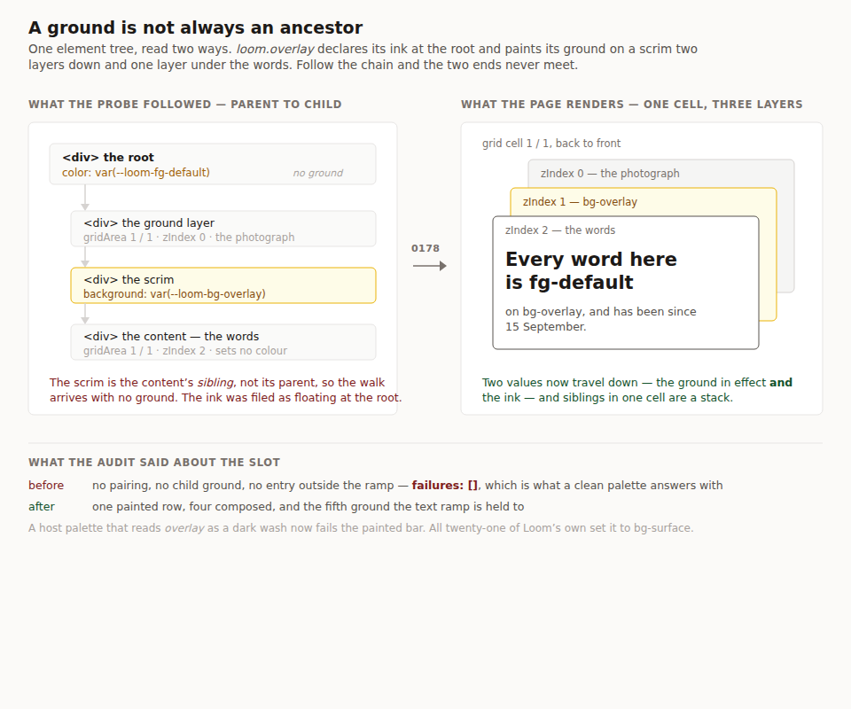

# A ground is not always an ancestor, and the slot nobody was measuring

**Date:** 2026-09-21
**Routine:** `Loom daily build` — the framework core, `src/` except `src/primitives/`
**Branch:** `framework-46-a-ground-is-not-always-an-ancestor`
**Section:** §4b — the palette contrast bar and the derivation behind it
**Pull request:** [#355](https://github.com/jam-overture/loom/pull/355) ·
**Preview:** https://loom-git-framework-46-a-grou-aaad51-jpizzolato36-6341s-projects.vercel.app
— published unverified: `*.vercel.app` is off this sandbox's egress allowlist,
the standing 19 August limit #349–#354 all cite. **There is nothing new on it to
look at** in any case: this is the contrast derivation and a palette ground, and
no page renders differently. The picture below is a diagram rather than a
screenshot, and it is the whole of the argument.

## What this was

The previous run of this lane ended its pull request comment with a
recommendation: `bg-overlay` has three would-be consumers, two was the threshold
the second finding named for acting, **take it next run**. This is that unit,
and it turned out to be about something else.

Two open findings owned by this lane, both filed by `Loom primitives`, four days
apart in early September:

- **4 September** — `bg-overlay` is a slot every palette must declare and
  nothing paints, so `loom.pin` cannot use it and shipped on `bg-surface`. Two
  ways out offered: add the pairing row, or retire the slot. No preference.
- **8 September** — a second would-be consumer. `loom.listing`'s flags sit over
  a photograph with nothing behind them.

**Both are wrong about the premise, and have been since 15 September.**
`loom.overlay` shipped that day and paints `bg-overlay` on the scrim behind
every headline it sets over a photograph. So did the recommendation this run
started from. Nobody noticed for six days, and the reason is the interesting
part.

## The instrument that exists to notice had a blind spot exactly this shape

`registryPairings` derives what the library paints by calling every primitive
and walking what comes back, and `pairings.test.ts` fails the build when the
declared list falls behind it. It was written in August precisely because a
hand-kept list had gone nine pairings stale, and *an audit reports no failure
for a pairing it never measured*.

Its walk carried **one** value down the tree: the ground in effect. It recorded
a pairing at the element that set `color`, against the nearest background
painted **above** it. That reads an ancestor chain, and CSS is two walks:

- `color` **inherits down**, so the ink over a ground may have been declared
  several levels above it;
- a background is painted on **the box behind the glyphs**, which is an ancestor
  only when nothing is stacked in between.

`loom.overlay` breaks both halves at once — the picture at the top of this report
is its four elements, read each way. The ink is `fg-default` on the root, which
paints no ground and was filed as *floating*. The ground is `bg-overlay`, on a
scrim in grid cell `1 / 1` at `zIndex: 1`. The words are in the same cell at
`zIndex: 2` and declare no colour. Read down the chain the two ends never meet.

So on `main` this morning, `bg-overlay` appeared in **no** pairing, **no** child
ground and **no** `groundsOutsideTheRamp` entry. `auditPalette` answered
`failures: []` about a surface the library writes on — and an empty `failures`
is exactly what a clean palette answers with.

## What it does now

**Two values travel down: the ground in effect and the ink in effect.** A
pairing is recorded wherever either arrives under the other.

**Siblings that declare the same `gridArea` are one stack ordered by `zIndex`,
and an element's ground is the nearest member below it that paints one.**
Nearest rather than bottom-most: a scrim over a photograph over a card is three
layers and the words sit on the scrim.

**A ground answers for an *inherited* ink only where something can be written on
it**, which is the condition that took two attempts — see below.

**`bg-overlay` joins `PALETTE_TEXT_GROUNDS`**, which now holds five. Of the two
ways out the 4 September finding offered, this takes the first, and it is no
longer a preference: retiring the slot would mean deleting a surface the library
renders.

| | on `main` | here |
| --- | --- | --- |
| pairings naming `bg-overlay` | 0 | **5** — one painted, four composed |
| grounds the text ramp is held to | 4 | **5** |
| what `auditPalette` says about a dark `bg-overlay` under a light page | nothing | **one painted failure, named at `loom.overlay`** |

## Three decisions worth reviewing

**Stacking is read from `gridArea` and from nothing else.** An absolutely
positioned sibling also lies under its neighbours, and whether it covers *all*
of them is a question about an arbitrary length expression — `loom.halo`'s
actual value is `inset: calc(-1 * 4px)`, and no reading of that string says what
it covers. A grid area is a name two elements either share or do not. Neither
`loom.halo` nor `loom.backdrop` paints a palette slot under its content today
(both draw gradients, which the probe declines rather than parses), so the
narrow rule costs nothing real and the wide one would have been a guess. Filed
as an open limit rather than left to be rediscovered.

**An empty box is a shape, not a surface — and the first draft got this wrong.**
Carrying the ink down produced three pairings that are false:
`fg-default on fg-muted`, `fg-muted on fg-default`, `fg-muted on fg-muted`. They
come from `loom.frame`'s camera notch and `loom.message`'s typing dots — empty
`span`s filled with an *ink* slot to draw a shape, inside a card that set
`fg-default` above them. The last of those is 1.00:1 in every palette that will
ever be written, for a pair no reader can meet, and declaring it would have
failed the whole library on a bar chosen by an accident of how a dot is drawn.
An element with no children now does not answer for an inherited ink; an ink a
component *declares* is still recorded either way, because the component said it.

**Painted, not composed.** Both ends of `fg-default on bg-overlay` are
`loom.overlay`'s own and no container can change either, which is the definition
`painted` carries — so it goes in `failures`, which a host asserts empty, rather
than in the reported tier. The scrim is drawn at 0.78 or 0.92 opacity over a
photograph the author supplied, so clearing the bar is necessary and not
sufficient; an unreadable photograph is `loom.overlay`'s own standing finding
and not a thing a palette can answer.

## What is honestly weak about this

**The new bar measures nothing against Loom's own palettes.** All twenty-one
starter palettes set `bg-overlay` to the same string as `bg-surface` — the three
hand-written ones by hand, the eighteen derived ones in one line of
`derive.ts` — so each new row measures what its `bg-surface` twin already
measured. The bar can only ever be earned by a **host** palette. That is the
case the contrast bar exists for and *overlay* is the slot name most likely to
be filled in with a dark wash by somebody who has written a modal, so the rows
are worth having; but whether the slot is *supposed* to differ from `bg-surface`
is a question this run did not answer and filed instead.

## Tests

`pnpm install && pnpm verify` **green, exit 0** — redirected to a file and the
exit code read off the run rather than off a pipe, per `docs/routines.md`.

Framework 156 files / **2,853** tests, against 2,844 on `main` — **+9, all
new**; application 282 files / **4,962** tests, unchanged; **718 findings, 0
malformed**; 109 prerendered pages, 859 text junctions, 0 run together. Nothing
skipped, **no test weakened**.

Nine new tests. The ones worth naming: the overlay's shape asserted **against the
real `loom.overlay` through the starter registry**, not only against a fixture;
the nearest ground in a three-layer stack, asserted separately from the
two-layer case, because taking the bottom looks correct whenever the stack is
two deep; two siblings in **different** grid cells asserted to produce nothing,
because inferring a stack from adjacency would put every table row on the ground
of the row beside it; and a palette whose `bg-overlay` is a dark wash asserted to
produce exactly one named failure — the defect that was unmeasurable this
morning.

**Every one of the eight load-bearing behaviours was checked by restoring its
defect**, on the two suites this unit touches (43 tests):

| defect restored | tests failing |
| --- | --- |
| sibling stacking removed | 5 |
| inherited ink removed | 5 |
| the empty-box rule removed | 5 |
| bottom of the stack taken instead of the nearest | 1 |
| grid-cell identity ignored (every sibling a stack) | 1 |
| `bg-overlay` taken out of `PALETTE_TEXT_GROUNDS` | 2 |
| the painted row deleted from `PALETTE_TEXT_PAIRINGS` | 4 |
| a string `zIndex` read as no depth at all | 1 |

**One red run that was the repository catching me**, and worth recording because
it is a rule a routine only meets by breaking it: `documentation.test.ts` refuses
a doc comment that makes a decision-record number the subject of a published
sentence — *"the casual reader would not know what those are"* — and my first
draft of the `PALETTE_TEXT_GROUNDS` comment opened with *"0089 was written
when…"*. Rewritten so the number appears only as a citation.

## Records

**Added [0178](../decisions/0178-a-ground-is-not-always-an-ancestor-and-bg-overlay-is-the-fifth-ground-the-text-ramp-is-held-to.md)**
— five decisions, five rejected alternatives. **Nothing superseded.** 0089 is
extended rather than amended: its title counts four grounds, and its own
mechanism says in as many words that a new ground turning up in
`groundsOutsideTheRamp` means the declared list has fallen behind the library.
This is that case, arriving thirteen months of commits later. 0175 is the
highest on `main`; #353 claims 0176 and #354 claims 0177, so 0178 is the next
free number.

## The lane boundary this crossed, and why

`transcripts.test.ts` runs every lesson's exercises and compares what they
print. **Lesson 21 prints a count of pairings**, so adding five rows turned two
of its transcript lines red, and `apps/loom/app/(lessons)/` and `lessons/` are
`Loom lessons`' — not this lane's.

Green verify is the merge gate for four surfaces, so the choice was to edit
another lane's file or to ship nothing. I edited it, in six places, and filed
the whole list as a finding for its owner rather than leaving it to be found.
Five of the six are counts read off an actual run. **The sixth is prose** — the
lesson taught *four grounds are declared* and now teaches five — and that one is
flagged for its owner's judgement rather than presented as mechanical.

Nothing the lesson argues changed. `painted failures: 8` is still eight, the
seven printed failure lines are byte-identical, and the `hsl()` half of its
Exercise F gets stronger rather than weaker: one unparseable colour now takes
five pairings out of the measured set instead of four.

One file in my own lane was stale in the same way and is fixed here rather than
filed: `src/sdk/pairings.ts` said *declare the four grounds* in prose beside a
list that is a value.

## Findings

**Closed two, filed four.**

- **Closed** — the 4 September entry, with the premise correction: the slot was
  being painted six days after the finding was written, and the finding could
  not have known.
- **Closed for the half this lane owns** — the 8 September entry. A listing that
  paints `bg-overlay` behind its flags now has a ground every ink in the ramp is
  guaranteed on. Painting it is `Loom primitives`' call and is not done here.
  The second way out that entry offered — a badge that refuses `outline` where
  it is floating — still cannot be built, and still for 0008's reason.
- **Filed, for this lane (`src/theme/`)** — `bg-overlay` is the same colour as
  `bg-surface` in all twenty-one starter palettes, so the bar it just gained
  measures nothing here. Three readings of what the slot is *for*, and the one
  that makes it carry its own weight is a change to nineteen derived palettes.
- **Filed, for this lane** — the derivation still cannot see a ground painted by
  an absolutely positioned sibling. Nothing is hidden by it today; the day a
  halo's light is a flat slot rather than a gradient, it will be.
- **Filed, for `Loom lessons`** — the six edits made to lesson 21 from outside
  its lane, itemised, with the one that is prose rather than a number called out
  and two suggestions its owner may take or leave.
- **Filed, for @jonathanbravecredit** — the 4 September entry is in `FINDINGS.md`
  **twice, character for character**, including its Status line. Closing it
  meant making the same edit in two places, and a run that edited only the first
  copy would have left an open finding behind contradicting the closed one.
  Cosmetic, and cheap to know before it costs somebody an hour.

## Open questions

1. **Is `bg-overlay` supposed to differ from `bg-surface`?** The filed finding
   lays out three readings. The second — *a surface lifted off the page* — is
   the only one under which the slot carries its own weight, and it changes what
   nineteen derived palettes contain.
2. **Should `loom.pin` take the token now?** The row it waited two and a half
   weeks for exists. It is one token in `src/primitives/`, which is not this
   lane's.

## Cross-lane files in this diff

**Two.** `decisions/README.md`, generated with the repository's own tooling; and
`lessons/21-appearance.md`, for the reason set out above and filed as a finding
for its owner.

Nothing in `src/` gained or lost an export, so the docs' API reference is
**unchanged** — the first framework run in a while where that is true.
