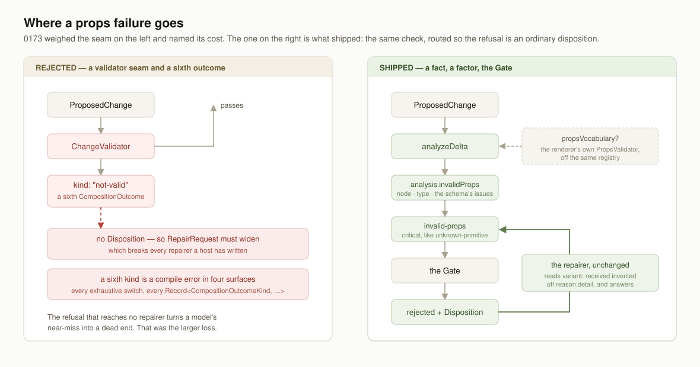

# §2: the props no schema accepts — the half 0173 could not reach

**Date:** 2026-09-21 · **Lane:** `Loom framework` · **Branch:**
`framework-46-the-props-no-schema-accepts` · **Section:** §2



## What was built, in plain language

Since 17 September, a model could ask Loom for something the site could not
draw, and Loom would write it down and serve it. `Loom docs` found it by running
the quickstart rather than by reading it, and there were two experiments. 0173
closed the first on 19 September: a change that adds a *piece your site does not
have* is now refused.

The second was still live on `main` this morning. A change that adds a piece
your site *does* have, set up in a way that piece will not accept — a heading
two hundred characters long against a schema that stops at a hundred and sixty —
was committed, the revision appended, and the page served. The renderer looked
at the node, found the props did not satisfy the primitive's own schema, and did
the only safe thing: drew nothing, and reported it. So what a reader got was a
hole, on every request, until somebody looked at a screen rather than at a test.
The one person positioned to catch it — the model that wrote the props — had
already gone.

That is now refusable, on any deployment that says what its primitives accept.

## The thing that made it hard, and how it got easy

Everything the Gate knows about a host's primitives reaches it through
`GatePolicy`, and a policy is a Zod-parsed, fingerprinted, serialisable value. It
can hold a list of type names — that is what 0173 added. It cannot hold a hundred
prop schemas, and 0173 wrote out why the two shallower shapes that *would* fit
are both worse than nothing: prop names and required-ness catches an invented
key and still misses `max(160)`, and a serialised schema language is the second
schema language `catalogue.ts` deliberately refused to maintain.

So the check needs a **function**, which means a seam, and 0173 costed the
obvious one — an optional `ChangeValidator` beside `repairer`, and a sixth
`CompositionOutcome` kind for what it refuses — and declined it on two counts. A
sixth outcome kind is a compile error in every exhaustive `switch` across four
surfaces. And a validator's refusal would reach no repairer, because
`RepairRequest` carries a `Disposition` and a validation failure has none.

`Loom daily build` filed the follow-up on 19 September and said which of the two
mattered: *a seam that cannot be repaired from is a seam that turns a model's
near-miss into a dead end.* That judgement is what decided this run's design,
and it decided it **against the shape it was defending**.

If losing the repair is the fatal cost, then the fix is not to widen
`RepairRequest` so a non-disposition can travel through it. The fix is to stop
producing a refusal that has no disposition. And the runtime already has a route
for exactly that: a fact in `ChangeAnalysis`, a factor in the stakes, and the
Gate. Put the props check there and the refusal **is** a disposition, with the
schema's own words in its `reason.detail`, offered to the repairer by the path
that already exists.

So: no sixth outcome kind, no widened `RepairRequest`, no exhaustive switch in
any of the four surfaces moves. The diagram above is the two shapes side by side.

## What shipped

| | |
| --- | --- |
| `PropsVocabulary` | `(type, props) => PropsVerdict` — the render seam's own signature and its own verdict |
| `EVERY_TYPE_UNDECLARED` | the default; answers `undeclared` for everything, which is today's behaviour |
| `ChangeAnalysis.invalidProps` | node, type, and the issues the declaring schema raised |
| stake factor `invalid-props` | `critical`, which under the default refusal floor is a refusal |
| `CompositionRuntime.propsVocabulary` | optional, absent by default, threaded into `composeChange` **and** `confirmChange` |
| `propsVocabularyFor(registry)` | in the SDK, so a host reads it off the registry the renderer already validates against |

Three of those are choices that could have gone the other way, and each is
argued in [0179](../decisions/0179-what-a-primitive-accepts-is-a-vocabulary-the-write-path-is-handed-not-a-field-on-a-policy.md).

**The verdict is the renderer's, not a second vocabulary of failure.** A boolean
would have kept `runtime/` free of any import from `render/`. It would also have
thrown away the issues, and a refusal that cannot say *which prop* and *why* is
precisely the one a repairer can do nothing with. The cost is one type-only
import of a leaf module holding no React and no logic. What it buys is a
guarantee neither seam's own tests can make: what the renderer would decline to
draw is, by construction, what the write path declines to write.

**Measured on the tree the change produces, less the tree it found.** This is
`nestedTargets`' measurement rather than `unknownPrimitives`', and props force
the difference. A type is fixed when a node is inserted, so only an `insert` can
introduce an unknown one. Props are the one thing two operations in a delta can
argue about — a delta may insert a node and configure it, or configure a node
another operation just put there — so only the tree at the end says what a reader
will be served. The subtraction is keyed by **node id alone**, so a node that was
already failing and fails differently afterwards counts as inherited. That is
deliberate: a page can hold a node a later schema tightened past, and counting
the near-miss would mean the only way out of such a node is one change that
repairs it completely.

**`critical`, the same level as `unknown-primitive`.** Not by analogy — by
measurement. `renderElement` returns `null` for both, and the reader meets the
same hole. A level that ranked them differently would be ranking the explanation
rather than the harm.

## Unspecified decisions, and why they went this way

**No policy field, so no fingerprint change and no knob.** The tempting middle
road was a `checkDeclaredProps` boolean on the policy with the function on the
runtime: it keeps the policy fingerprint honest and lets a host vary the check
per tree. It was rejected because the pair does not compose — a host that sets
the flag and wires no vocabulary gets silence, and a flag whose meaning depends
on a wiring it cannot see is the kind of knob discovered to have been off for a
month. `render/props.ts` faced this exact choice for this exact validator and
answered it the same way: a renderer handed no validator cannot validate, so the
*wiring* is the visible choice. Two seams checking one thing should not disagree
about how a deployment turns it on.

**The honesty cost of that is stated rather than glossed**, in the record's
Consequences and as a finding of its own: a props vocabulary is not in the policy
fingerprint, so two dispositions either side of a host wiring one read as
identical. That is already true of the interpreter, the repairer, the registry
and the renderer's own validator. What makes this one worth writing down is that
it is the first unfingerprinted input that can turn an `accepted` into a
`rejected`.

**Nothing in this repository is wired**, deliberately, and it is filed rather
than done. Four composition roots exist — three in `(marketing)`, one in
`(portal)`, one in `(docs)` — and wiring them changes what a live surface does
with a real ask. A framework PR that also changes four surfaces' behaviour is
unreviewable, and the first screen on which any of this is *visible* is the
portal's refusal card, which is `Loom portal`'s to draw.

## Tests

`pnpm install && pnpm verify` — **green, exit 0**, redirected to a file and the
exit code read off the run rather than off a pipe.

| | |
| --- | --- |
| Framework suite | 156 files, **2,893** tests, all passed |
| Application suite | 287 files, **5,064** tests, all passed |
| Findings | 727 findings, 0 malformed |
| Prerender check | 109 pages, 859 text junctions, 0 run together |

**36 new tests** across five files, measured against `main` rather than
estimated:

| file | before | after |
| --- | --- | --- |
| `runtime/vocabulary.test.ts` | 8 | 17 |
| `runtime/analysis.test.ts` | 46 | 56 |
| `runtime/stakes.test.ts` | 42 | 45 |
| `runtime/pipeline.test.ts` | 47 | 56 |
| `sdk/vocabulary.test.ts` | 3 | 8 |

**Nothing failed, nothing was skipped, and no test was weakened or rewritten.**
One fixture line was added — `invalidProps: []` to `stakes.test.ts`'s
`analysisOf` — which is a compile error being answered, not a test being
changed.

### The two load-bearing properties, checked by mutation rather than trusted

Both are about the *measurement*, and both are invisible unless a test puts the
tree in a state a single-press case never reaches.

| mutation | what fails |
| --- | --- |
| drop the inherited subtraction | **4 tests** — three in `analysis`, and the pipeline's *does not refuse an edit to a page that was already carrying a refused node* |
| measure the operations instead of the tree | **2 tests** — *names a node a configure broke*, and *says nothing about a node a later operation in the same delta repaired* |

The second mutation is the shape a reasonable implementation would have had, and
it is the one `unknownPrimitives` actually uses. It passes 54 of 56 tests.

### The test that is the whole argument

```ts
const repairer = scriptedRepairer(ok(mended))
const outcome = await composeChange({ ...base, repairer }, tree, intentFor(tree))

expect(repairer.requests).toHaveLength(1)
expect(repairer.requests[0]?.disposition.kind).toBe("rejected")
expect(outcome.kind).toBe("applied")
```

A props refusal is offered to a repairer, which answers it, and the change
lands. That is the property the sixth-outcome shape would have cost, asserted
end to end rather than argued.

Beside it, the one that keeps this additive: **a runtime with no props
vocabulary commits the same change**, so a deployment that wires nothing is
bit-for-bit what it was.

## Records

**Added [0179](../decisions/0179-what-a-primitive-accepts-is-a-vocabulary-the-write-path-is-handed-not-a-field-on-a-policy.md)**
— *What a primitive accepts is a vocabulary the write path is handed, not a
field on a policy*. Status `Accepted`: it contradicts no `Accepted` record (0173
left this door open in as many words), touches neither the tree schema nor the
delta model, and no built code migrates. Four decisions, five rejected
alternatives, each recorded with what it would have cost.

**Nothing superseded.** 0173 is extended and cited, not amended — its analysis
of why no policy shape answers the question is what this record builds on, and
it is still correct.

`0179` is the next number free everywhere: `0178` is highest on `main`, `0176`
is claimed by #353 and `0177`–`0178` by #358 and #359.

## Findings

**Closed one, filed two.**

- **Closed:** the 19 September *the write path can refuse a word nobody
  registered and not props no schema accepts*, with the design that came out of
  its own argument, and the one thing its account did not have — that the
  measurement cannot be operation-shaped.
- **Filed, for `Loom marketing` / `Loom portal` / `Loom docs`:** nothing here
  wires a props vocabulary, so the check is off on all four surfaces. One line
  per composition root, each lane's to write, with the caution about a registry
  whose schemas are stricter than its catalogue.
- **Filed, for this lane:** the fingerprint gap above, as a stated limit rather
  than a gap waiting on a fix.

## Cross-lane files in this diff

**Two, both required by the compiler or by the repository's own tooling.**

- `(marketing)/_lib/adapt/record.ts` — `RAISED_BY` is
  `satisfies Record<StakeFactorCode, string>`, so a new factor is a compile
  error until the site has a sentence for it. That guard rail is why the check
  could be added without auditing four surfaces by hand.
- `(docs)/_lib/api/reference.generated.json` — regenerated with
  `pnpm --filter @loom/app docs:api`, which `docs/routines.md` names as the one
  sanctioned crossing when a new export lands in `src/`.

## Open questions

1. **Should the check also be measured against the catalogue a model was
   shown?** A registry whose schemas are stricter than its catalogue
   descriptions will refuse changes that read as perfectly reasonable, and the
   fault is in the pair rather than in the Gate. `sdk/conformance.ts` is the
   place that could notice; whether it should is not this run's to decide.
2. **Should a disposition carry a second fingerprint, over the runtime's wired
   seams?** It would close the honesty gap above and it is a new field on a
   recorded type, which 0173 warns costs four lanes a compile error. Filed, not
   taken.

## What is not in this run

**Nothing was left out of the unit**, and nothing was escalated. No part of this
touches the tree schema, the delta model, or an `Accepted` record.

**On the standing migration instruction at the top of this lane's brief:** it is
stale, and this is the third framework run to say so. `apps/loom` exists on
`main` with `(marketing)`, `(docs)`, `(lessons)`, `(portal)` and `(demo)`;
`apps/portal` and `apps/docs` are gone; `apps/` holds one package. The three
routines said to be blocked on its shape are not blocked. It is worth editing
out of the brief so a fourth run does not spend its opening on rediscovering it.
