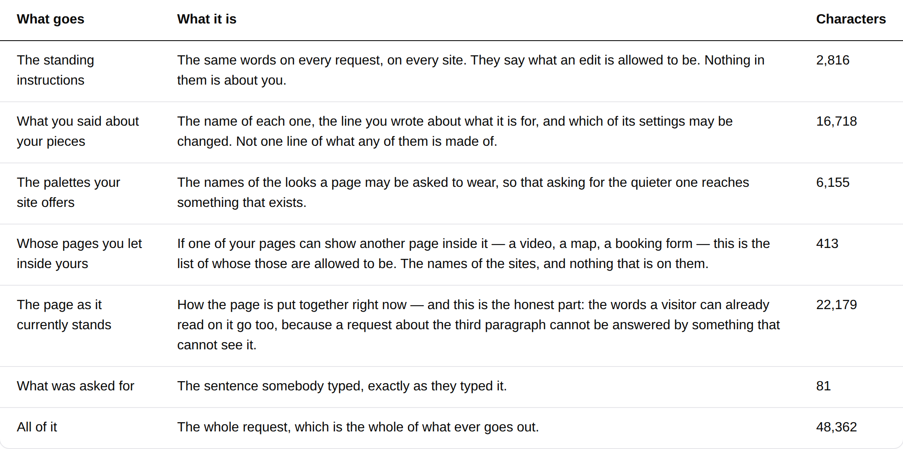
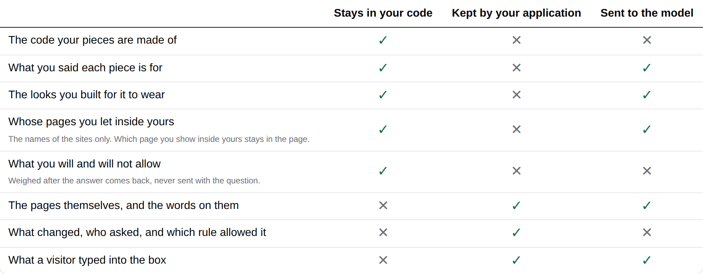

# 2026-09-21 — marketing: the origin it never mentioned, and the column that was two rows short

This lane's queue had one entry in it, filed by the framework routine on 19
September and worth one line by its own estimate. The line took a minute. What
the line uncovered took the run, and one of the two things it uncovered was not
in the finding at all.

---

## What shipped

**The one registry this site has, handed over at last.** `frames.ts` has
registered exactly one framable origin since 12 September — this deployment's
own, so the front door may put the running demonstration inside itself — and the
request `/what-you-run` measures was never told about it.

| file | what changed |
| --- | --- |
| `_lib/pages/what-you-run.ts` | `frameCatalogue` wired into `measurePrompt`; the `frames` part named; `CRITERIA` declared; `bandsAgree` |
| `_lib/pages/what-you-run.test.ts` | seven new tests |

**Two files, both in this route group. `src/` was not opened and no primitive
was added.** Every band on the page is the same composition of registered
primitives it was yesterday; the comparison is the same `loom.comparison-table`
built from a list instead of from six hand-written calls.

### Why an unwired registry is worth a run

It is not a broken page — nothing on this site renders differently, and that is
what made it invisible. It is a **model that cannot name your origin**, and the
failure mode is the one [0172](../decisions/0172-what-a-deployment-offers-a-model-is-one-value.md)
was written for: a frame a model proposes without being told the allowlist
renders a *refusal* where the document should have been. The site's whole
argument is that it can say in advance what will happen, and it was withholding
from the model the one list that decides whether a frame works.

The list is also the odd one of the five vocabularies, and the page now says so.
The other four supply the only values a model may write. This one **narrows a
value the model still chooses** — which document belongs on a page is a content
decision and its URL stays in the tree (0095) — so it is the difference between
a good page and a wasted turn rather than between a page and a refusal to build
one.

### The alarm the code had promised, firing on schedule

Wiring it made the request grow a sixth part, and `partsOf` refused to build the
page. That guard was narrowed on 19 September to ignore a part costing nothing,
and the comment explaining the narrowing ends:

> *so the day this site registers one of the three, the page refuses to build
> until it says so, which is the same alarm one step later and at the moment it
> becomes true.*

**The site had already registered one of the three.** The alarm fired on the
first run that gave it something to fire on, which is the strongest evidence
available that the narrowing was the right call — and it is the second opinion
the finding explicitly asked for. Both findings are updated with it.

So the band has a sixth row:

| | |
| --- | --- |
| **Whose pages you let inside yours** | *If one of your pages can show another page inside it — a video, a map, a booking form — this is the list of whose those are allowed to be. The names of the sites, and nothing that is on them.* |

**412 characters** of a 48,319-character request, or 0.85%. The finding
estimated 364 + 51 for a one-entry origins block; the difference is the length
of the origin itself.

---

## What the wiring found, which the finding did not mention

The two bands on this page are a pair. The comparison says where each thing a
reader owns ends up; the measured band is the last column of it, counted. The
comparison opens by telling a reader:

> *Read along a row to find out where yours is, and down the last column to see
> the whole of what ever leaves.*

**That column was two rows short of the measurement directly beneath it.** There
was no row for the palettes — 6,155 characters, sent since the band was
written — and none for the origins. A reader who did what the sentence told them
and then read the table below it would have found two things in the second that
the first said nothing about, on the one page of this site that exists to be
checked by somebody suspicious.

Nothing could see it. The two bands agreed by the author's intention and by
nothing else.

### So they are held to each other now

`CRITERIA` is a declared list the band is built from. Each `LEAVING` part that
is a thing a reader owns carries `owned`, the heading of its row. `bandsAgree`
fires in both directions and the page does not build:

| | |
| --- | --- |
| **leaves with no row** | the comparison under-reporting, which is the one that costs a reader's trust |
| **row with nothing leaving** | the comparison over-reporting, which is merely wrong |

One part has no row and the absence is asserted: **the standing instructions**
are the same words on every request on every site, so there is nothing of the
reader's for a row about where their things end up to be about. A row saying so
would be the page inventing a possession to reassure somebody about.

---

## Both palettes, and a phone

`scrollWidth 1280 / innerWidth 1280` wide and `390 / 390` on the phone, measured
by the harness against the built application under `next start`. **No colour is
named anywhere in the diff.** Whole-page shots are beside this file as
`2026-09-21-marketing-the-origin-it-never-mentioned{,-bold,-phone}.png`, and the
measured band under `bold` as `…-what-leaves-bold.png`.

### What the three rows cost

| | before | after |
| --- | --- | --- |
| `/what-you-run`, 1280 | 5,592px | **5,765px** (+173) |
| `/what-you-run`, 390 | 10,978px | **11,774px** (+796) |

Measured by photographing the built page under `next start` on both sides — the
previous page restored from `main`, rebuilt and re-served, not estimated from
row heights. The phone figure is the honest one and it is the usual shape: a
comparison row that is three marks wide on a laptop is a stacked block on a
phone, so two of them cost more there than the whole change costs at 1280.

---

## Tests

`pnpm install && pnpm verify` — **green, exit 0**, read from a log file rather
than through a pipe. Nothing failed, nothing skipped, **no test weakened or
deleted**.

| suite | `main` at `0aa38ef` | this branch |
| --- | --- | --- |
| `@loom/runtime` | 156 files / 2,844 tests | **156 / 2,844** — `src/` was not opened |
| `@loom/app` | 282 files / 4,962 tests | **282 / 4,969** |
| `what-you-run.test.ts`, within it | **31 tests, measured** | **38** |

The `main` figure for `what-you-run.test.ts` was measured rather than inferred:
that file and the page it tests were restored from `origin/main` and the file
run. It is the only file in this branch with a test in it, so the suite total
follows from it.

`findings:check` reads 714 entries, 0 malformed. `prerender:check` reports 109
pages and 859 junctions, 0 run together.

**Seven tests are new**, all in `what-you-run.test.ts`. One existing test changed
meaning rather than being weakened: it asserted
`[sources, endpoints, frames] === [0, 0, 0]`, and frames is 412 now. It holds
`[sources, endpoints] === [0, 0]`, still asserts neither appears in the band, and
still requires the guard to fire on a doctored `sources`.

### Mutations

Six defects restored one at a time against a committed baseline.

| mutation | result |
| --- | --- |
| the frame catalogue is not passed — the state before this branch | **29 red** |
| the frames part loses its sentence | **30 red** |
| the origins row taken off the comparison | **29 red** |
| the palettes row taken off the comparison — the gap this run found | **29 red** |
| the standing instructions given a row of their own | **29 red** |
| the catalogue names an origin this site does not serve | **all 37 green** |

**The sixth survived, and it is the failure this test file's own header warns
about.** The test that checks the origin reaches the model builds its own
catalogue out of `frames.ts` and asserts the runtime prints it — which is a test
of `frames.ts` and of the runtime, and passes whatever the *page* passed to
`measurePrompt`. Pointing the page's catalogue at `https://somewhere-else.example`
left every assertion green.

A count cannot name an origin, so the count is pinned to one: the origins block
is a single line carrying the address, so measuring the same page at an address
eighteen characters longer must cost exactly eighteen more. A block built from
anything but `context.origin` does not move when the context does, and a
hard-coded one does not move at all. Re-run with that test present: **1 red.**

---

## Decisions and findings

**No record written.** Nothing here is constrained outside this route group, and
nothing touches an Accepted record — 0172 is applied rather than amended.

**Two findings updated, both closed for this lane and both still open for
others:**

- *the three registries a surface already wires can now reach the model* — the
  `Loom marketing` row is closed. The two `Loom docs` rows are untouched, with a
  note for whoever takes them: wiring is one line and **naming it is the rest of
  the run**, if your surface has a band that enumerates what leaves.
- *five files in three other lanes changed so `pnpm verify` would pass* — the
  third row asked for a second opinion on narrowing `partsOf`. Given, with this
  run as the evidence: the narrowing was right and the alarm fired exactly where
  it was promised.

**None filed.** Nothing this run needed was missing from the library, and
nothing in another lane got in the way — which is the first run in a while that
can say so.

## Needs your input

- **One sentence of new copy**, and it is a description of machinery rather than
  a claim about who this is for: *Whose pages you let inside yours*, with the
  line under it. Re-word freely — it is one entry in `LEAVING` and one heading in
  `CRITERIA`, and a test holds them equal.
- **The two new comparison rows** are the same kind of thing. The note on the
  origins row — *the names of the sites only; which page you show inside yours
  stays in the page* — is the distinction 0095 draws, said without naming it.
- **The licence line** (#96, on every marketing PR since #134). Still the site's
  one placeholder, and it is at the foot of every page in the screenshots.
- **Positioning, audience and pricing.** Untouched, as always.

Nothing scheduled and nothing armed.
