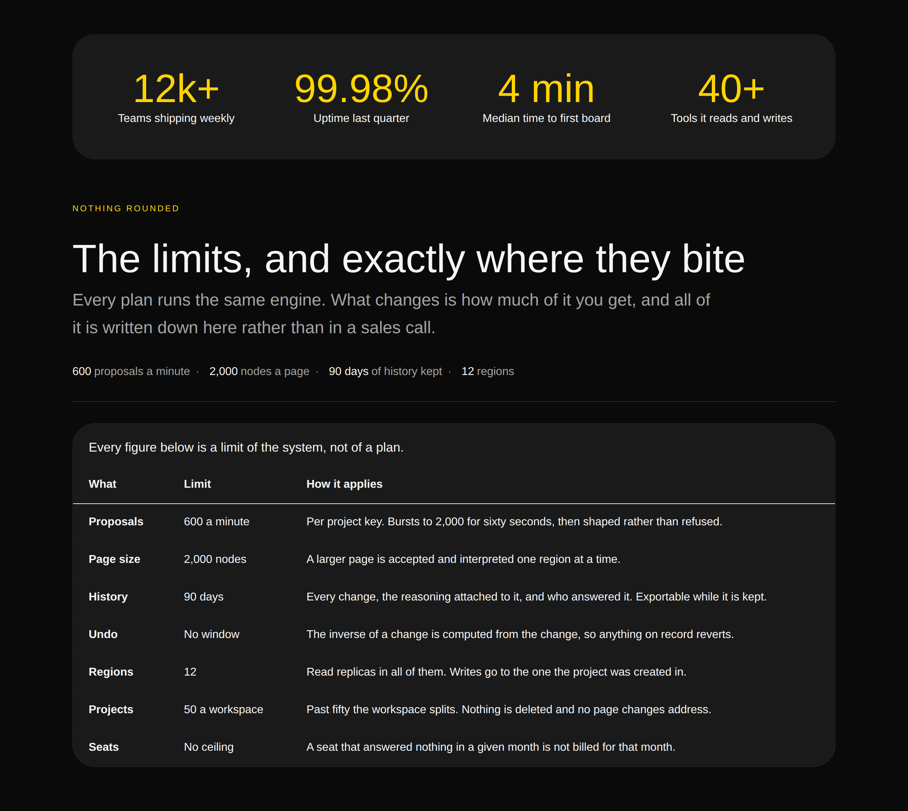

# The numbers it could not print — a page part for the specification, and the day the page stopped calling itself two names

**Routine:** `Loom primitives` · **Date:** 2026-09-21 · **Branch:**
`primitives-41-the-numbers-it-could-not-print` · **Section:** §4b ·
**Pull request:** [#354](https://github.com/jam-overture/loom/pull/354) ·
**Preview:** https://loom-git-primitives-41-the-n-2e44a0-jpizzolato36-6341s-projects.vercel.app
— deployment **Ready**. Published unverified: `*.vercel.app` is off this
sandbox's egress allowlist, the standing 19 August limit. Everything below was
driven against a local render and the specimen harness.

## What this run chose, and why that

Two things, and only the first was on the plan.

**The first is the top of the queue.** The 19 September gap inventory ranked what
the catalogue genuinely could not draw, and the 20 September run re-ranked it
after clearing the treatments. Both put the same item first:

> The eight left, in priority order: `table`/`table-row`/`table-cell` (**a
> specification band** — a real afternoon, and the largest single piece left),
> `divider`, `spec`, `pin`.

`loom.table` and its two children were built on 22 August and **no band in the
catalogue had ever built one**. A month registered, tested, and described in
every interpretation request a deployment sends — which is not merely absent
from the phrasebook but surface a host pays for on every request
([0170](../decisions/0170-a-library-is-a-set-to-choose-from-and-a-vocabulary-is-priced-per-entry.md)).

**The second was found by assembling the page and reading it**, which is the
only instrument that could have. It is below, under *what the page was calling
itself*.

## The part had to be earned before the band could be built

[0171](../decisions/0171-a-page-part-is-earned-by-the-region-it-occupies.md)
opened `COMPOSITION_PARTS` on 19 September and set the bar: a part earns a
member when it occupies a region no existing part occupies, and the operational
test is that **two parts cannot stand in for each other**. This is the second
time that rule has been run and the first time by a routine that did not write
it, which is the useful thing about it — the rule was written with three worked
candidates and this is a fourth it had never seen.

[0177](../decisions/0177-the-specification-is-a-page-part-and-it-sits-between-the-figure-and-the-price.md)
runs the swap in four directions:

| swap | what the page loses |
| --- | --- |
| `specs` for `metrics` | **the break.** `metricsBand`'s own comment says what it is for: a page that is five bands of cards on one ground reads as a list, and a full-width surface with four large figures is the break. A table is not a break, it is the densest thing on the page |
| `metrics` for `specs` | **the precision.** Four round figures are claims. *Bursts to 2,000 for sixty seconds, then shaped rather than refused* is not a claim and cannot be made into one |
| `specs` for `comparison` | the answer to *why not the thing I already use*, which is about somebody else's product |
| `comparison` for `specs` | the same precision. A comparison cell holds a verdict from a closed set of three marks, by construction |

Four swaps, four losses. **The position is part of the decision**, which is
0171's first consequence: the band goes in exactly one place, and the argument
is an escalation of precision a reader walks down — `metrics` rounds a figure to
be believed, `specs` unrounds it to be checked, `pricing` says what it costs.
After `pricing` was considered and is worse: a specification read *after* a price
is a page asking somebody to commit and then telling them where the edges are.

**The cheap option was available and is the one 0177 names as the trap.** Ship it
as a design of `comparison`, touch no tuple, keep the canonical page at
twenty-one. 0171 already wrote down why not: *"The failure mode of this option is
not a refused band — it is a band shipped under the wrong part, where 0165 then
forces it to answer to that part's anchor."* A specification anchored
`#comparison`, reached from a link that says *Compare*, gets harder to undo with
every page assembled from it.

## What shipped

**One part, one band, seventy nodes, and five primitives that a page can now
have.**

| | |
| --- | --- |
| `COMPOSITION_PARTS` | 21 → **22**, `specs` between `metrics` and `pricing` |
| the phrasebook | 34 → **35** bands |
| **primitive types some band can reach** | 66 → **71** of 96 |
| registered and unreachable by dropping in a band | 30 → **25** |

The five: `loom.table`, `loom.table-row`, `loom.table-cell`, `loom.spec` and
`loom.divider`, **from one band and at the cost of no new primitive and nothing
per request.** For scale rather than for a superlative: `CATALOGUE_TYPES` has
moved 52 → 63 → 66 → 71, so +11, +3, +5. The +11 is still the largest and it took
eleven bands; the commit message on this branch calls this one *the largest
single movement* and that is wrong — corrected here and in 0177 rather than
force-pushed over.

### The band, in two registers

A specification says the same thing twice on purpose, at two sizes, and the
whole design of the band is that argument.

The **run of `loom.spec` nodes** is the version a reader takes away if they read
nothing else — four figures at reading size, run together behind middots, in the
register `loom.spec` was written for: *a detail attached to something else, never
the loudest thing in its card*. It is deliberately **not** `loom.stat`, and that
is the swap test made visible: the band two places up this page already spends
four stats, and two bands of big numbers in a row is the page saying one thing
twice and looking louder each time.

The **table** is the version somebody scrolls back to. Seven rows, three columns,
and the third column holds whole sentences — which is the whole reason the band
is a table rather than a second grid of cards. A card per limit is the standard
responsive fallback and it loses the column-wise scan that made the figures worth
tabulating, which is the defect `loom.table` was built to end.

## What the photographs changed

**The column heading no longer fitted its own column, and only a picture said
so.** The first draft's last two rows were *Model access — Bring your own* and
*Self-hosting — From day one*, which are the most interesting rows editorially
and are **things you get rather than edges you meet**. The heading above them
read *Where it lands*, a phrase chosen to cover both kinds, and the caption under
the table said *every figure below is a limit of the system, not of a plan*.

Rendered, the contradiction is on one screen: a column headed with a hedge, over
a table whose caption makes a claim two of its rows do not keep. Both rows
render clean, pass every palette assertion, and are valid trees. The fix was to
make the band mean one thing — seven limits, the heading `Limit`, and two of the
seven being *that there is not one*, which is a thing a specification has to be
able to say.

**The divider survived its first real use, and it was a real question.** No band
in the catalogue had ever drawn a `loom.divider`. A hairline between the figure
run and a bordered panel could easily have read as a second border forty pixels
above the first — the class of thing that is invisible in the source and obvious
in a photograph, and the reason the 20 September run's backdrop went back to what
it was. Shot under both palettes at both widths, it reads as a separator: the
rule is full-width and flat, the panel below it is inset and rounded, and there
is a band of ground between them. It ships.

## What the page was calling itself

**On `main` this morning the assembled page called itself two different names,
and named itself as one of its own customers.**

| band | what it said |
| --- | --- |
| `nav` | wordmark: **Overture** |
| `integrations` | the mark in the middle of the orbit: **Overture** |
| `comparison` | the steered column: **Overture** |
| `footer` | wordmark, and the copyright line: **Northwind** |
| `proof` | first of six customer logos: **Northwind** |

Scroll from the bar at the top to the line at the bottom and the product changes
its name; scroll past the logo wall on the way and it is listed among the
companies that bought it.

**Nothing could have caught it and nothing was anybody's fault.** Every band is
correct read on its own. Each renders clean under both palettes. The two names
are in modules a thousand lines apart, written on different days by runs with no
memory of each other, and no test in this repository had ever read them together.
It is the defect a phrasebook acquires *by construction* — and the only
instrument that sees it is the assembled page, which this file already builds for
the heading outline and the anchors and had never been asked this.

Fixed: the footer's wordmark and copyright now say **Overture**, which is what
three bands already said and what the repository is called; the customer wall's
first name is **Fairwater**, invented like the five beside it.

## Which fields became nodes and which stayed props

Nothing was ported from Hermes. `docs/hermes-port-map.md` cannot see a
specification band — Hermes' users are creators, and a limits sheet is a
developer-product shape — which is the 19 September finding about the provenance
of the queue, still holding and now with a second instance.

| | became nodes | stayed props |
| --- | --- | --- |
| **the rows** | **all seven**, one `loom.table-row` each. Dropping the regions row is one `remove`; adding a fourth column is an `insert` into every row, which is [0084](../decisions/0084-in-a-two-dimensional-band-rows-are-nodes-and-columns-are-positions.md) paid for rather than argued about | `rules: "rows"`, `density: "comfortable"`, `tone: "panel"` — three renderings of however-many rows, none of which changes a node |
| **the cells** | **twenty-one**, three per row. The value is `text` children rather than a `value` prop, so a cell that has to say *600 a minute, per key* can hold two nodes instead of one string with the markup burnt in — 0052's third clause | `role`, `align`, `numeric`. `role` is the closed set of three renderings that makes this a table and not a grid of boxes; `numeric` is typography and nothing here parses a cell |
| **the column headings** | a `loom.table-row` **inside** the `columns` slot, holding three cells. The region is a slot rather than the first child because *the first row is the header* is a rule no schema states and every `move` breaks (0051) | — |
| **the figure run** | **four `loom.spec` nodes**, so a fifth figure is an `insert` and the shortest one is a `remove`. Hermes' `PropertyListing` is the case 0052 was read on for this primitive and the reasoning transfers unchanged | `value` and `label` on each: exactly one figure and exactly one unit, changing either is exactly a `configure` |
| **the rule** | the `loom.divider` itself, so a band that wants the halves run together is one `remove` | `ornament: "rule"`, `spacing: "tight"` — three renderings and a length |

**Seventy nodes is the cost and it should be said plainly.** This is the
second-largest band in the catalogue, and a table is the shape where
decomposition is most expensive: twenty-one cells and twenty-one text nodes for
seven facts. The bargain is 0084's and it is the same one the pricing band
makes — a column added is an `insert` into every row, and a row dropped is one
`remove` — but a run reaching for a second table band should weigh it against
the grammar budget
([0014](../decisions/0014-the-reply-schema-must-fit-a-grammar-budget.md)) rather
than assume a table is free because this one shipped.

**The near-miss, and it is the one worth reading.** `prose: true` on the table
looks like a layout switch and is not: it says *these cells hold sentences*, which
is the one fact about a table's content that no rule in `stylesheet.ts` can see.
[0160](../decisions/0160-a-prop-that-unblocks-a-rendering-names-the-content-and-never-the-layout.md)
is why it is spelled that way — `narrow: "stack"` would read better at the call
site and would pin every tree that set it to the rendering the library had in
September.

**`numeric` with `align: "start"` is the other one.** The limit column holds
`600 a minute` and `90 days` beside `No window` and `No ceiling`, so it is a
column of *limits* rather than a column of figures. `numeric` defaults a cell to
the trailing edge, which would set five numbers and two phrases hard right under
a heading that is not, so the alignment is stated — and what `numeric` still buys
is the thing it is for: `600` and `2,000` line up digit under digit. The
primitive's comment says a cell holding "3 seats" is as entitled to tabular
figures as one holding "1,204"; this column is that sentence's first real use.

## What is now checked, and where

Three assertions in `compositions.test.ts`, each earned by something here, and
**every one of them was checked by putting its defect back.**

- **A row, not a bare cell, in every table's region of column headings.** A
  heading region is placed in a `<thead>` and a `<thead>` holds rows.
  `comparisonBand` recorded in August what the absence of this looks like in a
  photograph — every mark one column right of its heading, with the steered tint
  on the competitor instead of the subject — and until today there was one band
  it could go wrong in. There are now two, and the rule is held over both.
- **The page calls itself the same name at the top and at the bottom.** Read off
  `loom.logo` in the navigation rather than declared, so the assertion is about
  the two agreeing and never about which word they agree on.
- **It names itself in no wall of customer logos.** The second half of the same
  defect and a separate assertion, because the two fail independently: fixing the
  footer leaves the wall naming the site.

**The second of those was wrong on its first draft and the mutation run is what
found it.** Written against everything the footer band says, it **passed with the
wordmark put back to `Northwind`** — because the copyright line under it still
carried the other name. A test that goes green on the exact defect it exists for
is worse than no test, so it now reads the footer's `brand` region and compares
one string to one string. The correction is in the test's own comment, because
the next person to widen it will be tempted by the same shortcut.

## Checks

- `pnpm install && pnpm verify` **green, exit 0**, redirected to a file and the
  exit code read off the run rather than off a pipe (`docs/routines.md`).
  Framework 156 files / **2,848** tests (+3, all new); application 282 files /
  **4,962** tests; **715 findings, 0 malformed**; 109 prerendered pages, 859 text
  junctions, 0 run together. Nothing skipped, **no test weakened**.
- **The first run was red on the one thing it should have been**: a new export in
  `src/` leaves the API reference stale, which `docs/routines.md` names as the
  one sanctioned cross-lane file. `pnpm build && pnpm --filter @loom/app
  docs:api`, in that order, and green on the second run.
- One existing assertion changed and it is the reason it exists: the catalogue's
  own band count, 34 → 35.
- Every band renders under both starter palettes with **no diagnostics**.
- Overflow measured by the harness: 1280 / 1280 wide, 390 / 390 phone, both
  palettes, no horizontal overflow anywhere. The table scrolls sideways *inside
  its own panel* on a phone, which is the behaviour `loom.table` was built to
  have and the thing the phone shots are for.
- No literal colour anywhere in the diff; `reads every colour from the palette
  and names none of its own` passes over the whole catalogue.

## Outside the lane

Two generated files, neither edited by hand (0139): `decisions/README.md`,
regenerated with `pnpm decisions:index`, and
`apps/loom/app/(docs)/_lib/api/reference.generated.json`, regenerated with the
repository's own tooling because `COMPOSITION_PARTS` gained a member and
`specsBand` is a new export.

Everything else is `src/primitives/`, `decisions/0177`, `FINDINGS.md` and this
report. Nothing under `apps/` that a generator did not write, and nothing in
`src/` outside `src/primitives/`.

**On the commit author.** `docs/routines.md` still gives two opposite
instructions and it is not this lane's to resolve — filed by `Loom portal` on 16
September and reported by four runs since. This run followed the later section:
no author is set, so the session default applies.

## What the library still cannot express

**A page with a picture on it.** This is now the single largest remaining block
and it has been [filed](../FINDINGS.md) with the three options a next run has to
choose between. Six registered primitives — `media`, `embed`, `before-after`,
`carousel`, `overlay` and `pin` — are behind one question nobody has asked, and
`compositions.test.ts` asserts *ships no image source at all*, correctly and
deliberately. The finding also corrects the inventory: **`pin` was filed in the
wrong row**. It was listed as *genuinely missing* with a parenthetical saying it
really belonged in the image row, and then left in the first row anyway — which
is how it stayed on a queue of cheap work for two weeks while being none.

With that correction, **the 19 September queue of genuinely-missing primitives is
closed.** Reach went 52 → 63 → 66 → **71** of 96 over four days, and two of those
three movements cost no new primitive at all.

**The page-spanning backdrop** and **a paint that works in a short band** are
unchanged, both filed, and neither was touched.

**Unchanged and still not mine:**

- **Tier B** — tabs, tooltip, lightbox, a pricing toggle — was nine primitives
  behind one framework decision and is now fewer: #353 is open with `present` and
  `dismiss`, which covers the dialog/dropdown/lightbox half, and files the
  one-of-*n* half as `ARCHITECTURAL`. **Six runs have reported this row; this is
  the first one that can say it moved.** Nothing here places either control —
  #353 is not on `main` and the seam is another lane's.
- **The specimen harness photographs and cannot assert.** Filed 17 September. The
  sharpest case in this run is `loom.table-cell`'s sticky row heading, which is a
  fact about a table mid-scroll photographed at rest.
- **`21st.dev` re-verified blocked**, `EGRESS_BLOCKED` from the proxy.
  **Eighteenth consecutive check from a routine session and it has never once
  been reachable.** The visual standard for this run was `loom.hero`,
  `loom.feature-grid`, and the four photographs beside this file.

**On the 250 question**, unanswered for six runs: this run's position is the gap
inventory's and is unchanged. The vocabulary is still at 96 and should stop near
110; the phrasebook is at 35 and is the row that scales; reach is the third axis
and the cheapest, now at 71 of 96. What this run adds is that **the remaining
gap is no longer a list of jobs.** Twenty-five types are unreachable and they sit
in exactly three rows — an image source, a second page sequence, and a bound
region — each of which is one decision rather than several. That is a better
place to be than a queue, and it is the first time the inventory's own
classification has come out clean.
