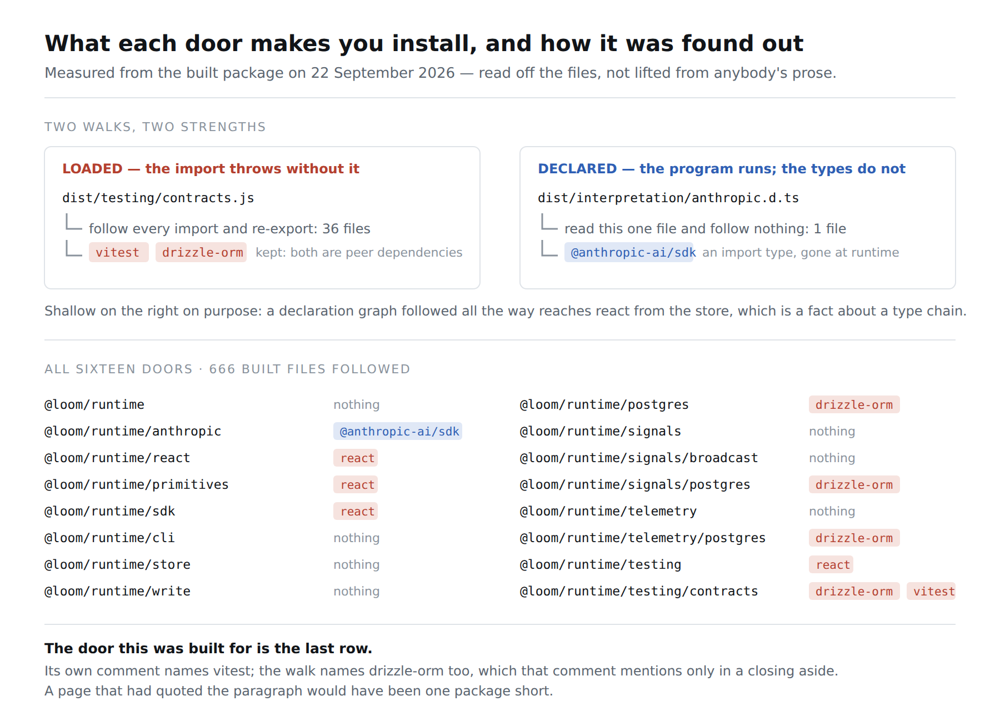
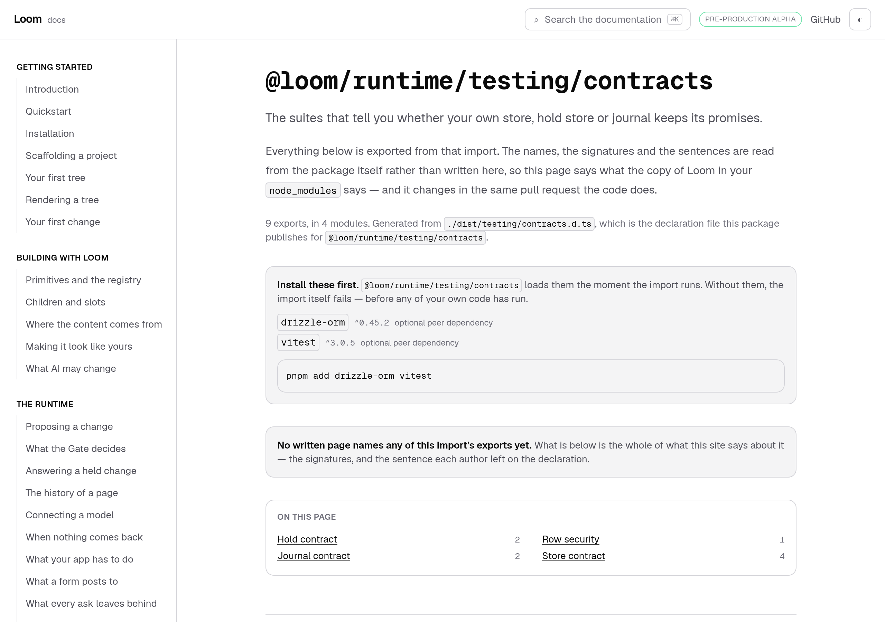
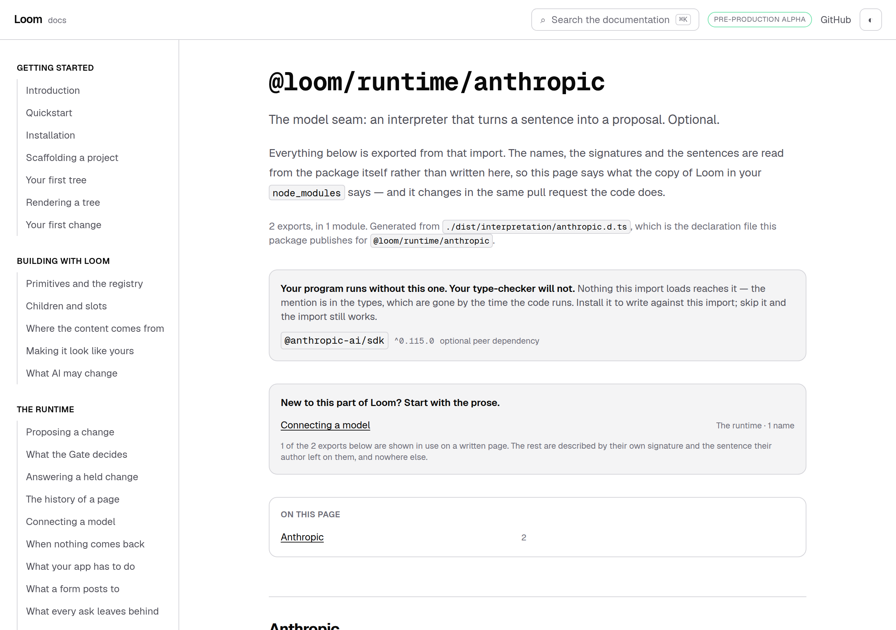
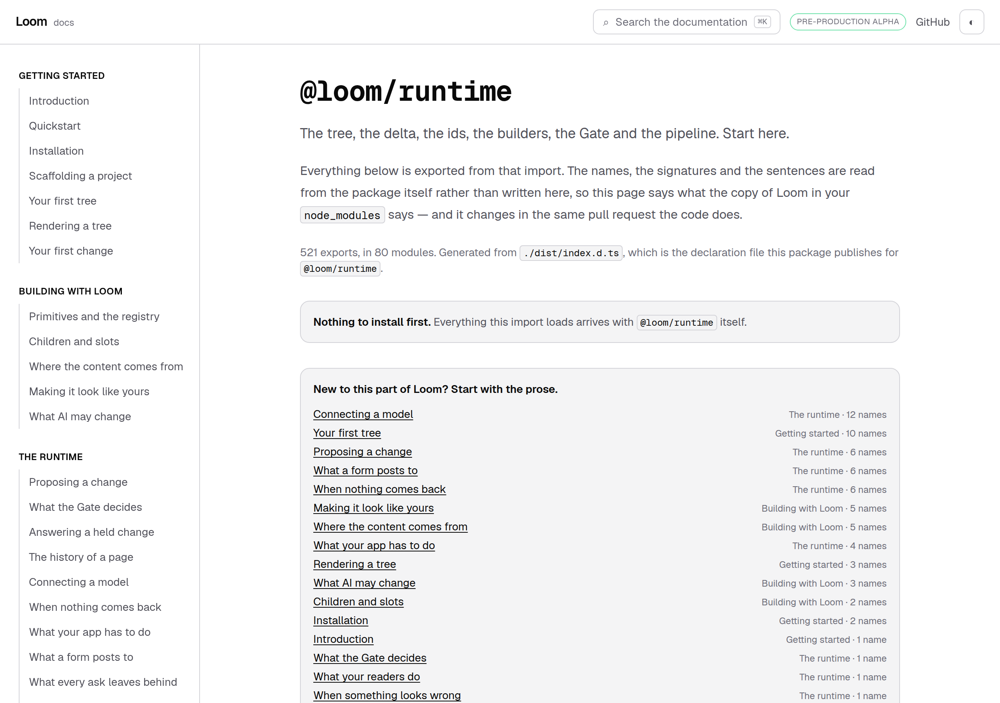

# 22 September 2026 — before the import will run, and the sentence that was never going to be enough

**Routine:** `Loom docs` · **Branch:** `docs-32-before-the-import-will-run` · **Section:** §4c

**Preview:** the pull request's Vercel deployment. Published unverified, as every
routine run's has been: `*.vercel.app` is off this sandbox's egress allowlist and
the proxy answers `403 CONNECT tunnel failed`. That is the standing 15 September
finding and is not re-filed. Everything measured below is a production build
(`pnpm build && next build && next start`), fetched over real HTTP and driven in
Chromium.



## What this run was

The findings queue, and the one entry in it with a reader on the end.

On 20 September this lane opened all sixteen published doors and found that a
person importing `@loom/runtime/testing/contracts` from a plain Node script gets

```
Error: Vitest failed to access its internal state.
```

and that nothing on this site told them why. The finding named two possible
fixes, both of them about **lifting a paragraph** out of the package's source
onto the page. Neither was taken. The reason is the most useful thing this run
found out, and it is in *What I declined, and what the measurement said* below.

## The plain version

Every entry-point page now opens with the packages you have to install before
that import will work — and it is **measured from the built package**, not
quoted from anybody's prose.

`/docs/api-reference/testing-contracts` now says, above everything else on the
page:

> **Install these first.** `@loom/runtime/testing/contracts` loads them the
> moment the import runs. Without them, the import itself fails — before any of
> your own code has run.
>
> `drizzle-orm` `^0.45.2` · optional peer dependency
> `vitest` `^3.0.5` · optional peer dependency
>
> ```
> pnpm add drizzle-orm vitest
> ```



## Two strengths, and why a page must not state them the same way

A door needs a package in one of two ways, and telling a reader the same
sentence about both would make the strong one mean nothing.

**Loaded.** The door's JavaScript reaches the package, so importing the door
imports it. Without it installed, the import throws. This is transitive: the
walk follows every `import` and every `export … from` through the built files —
36 of them for the contracts door, 666 across all sixteen.

**Declared.** Only the door's own declaration file names the package, as a type.
`@loom/runtime/anthropic` is the whole of this case: `import type Anthropic from
"@anthropic-ai/sdk"` is gone by the time the code runs, so the adapter runs fine
in a project that never installed the SDK — and cannot be *used* in one, because
the client it adapts is the thing a host passes in. Its page says so:

> **Your program runs without this one. Your type-checker will not.** Nothing
> this import loads reaches it — the mention is in the types, which are gone by
> the time the code runs.



**The declared walk is deliberately one file deep.** Followed all the way, a
declaration graph reaches every package any type in its neighbourhood mentions
— `@loom/runtime/store`'s declarations arrive at `react` that way, through a
chain of type references. That is a fact about a type chain and not about what a
reader must install, and printing it would cost the band the only thing it has,
which is that every line in it is something to act on. The limit that comes with
that choice: a peer named type-only by a file one level *below* a door would not
be reported. Nothing in the package is in that shape today; if one ever is, the
symptom is silence rather than a wrong sentence.

**Seven doors need nothing, and say so.** Same rule as the band below them,
which announces when no written page names anything: a reader told that this
import needs nothing stops wondering, and a reader shown no band at all cannot
tell that from a site that never checked.



## What I declined, and what the measurement said

The finding proposed lifting prose. Measuring beat lifting **on the very door
the finding was about**, which is the part worth keeping.

The comment in `src/testing/contracts.ts` names `vitest`. The walk names
`vitest` **and `drizzle-orm`** — the second appears in that file only as a
closing aside about `rowSecurityOn` needing a live Postgres, which no reader
would take as an install instruction. A page that had lifted the paragraph would
have been one package short, and would have looked right.

**Shape 1, an entry summary, was declined on a number the original finding did
not have.** Fifteen of the sixteen doors open with a paragraph that restates the
hand-written line already at the top of the page — `@loom/runtime/react` opens
*"Turning a tree into React elements"* under a summary that already reads
*"Rendering: a tree to React elements, theme mounting, addressing, render
diagnostics."* Six would have printed it twice on one page, because their own
module forms a group and the group carries it already. The sixteenth,
`@loom/runtime/signals/postgres`, opens *"The Drizzle tables are **not**
re-exported, unlike the journal's"* — an excellent sentence and a poor page
summary.

**Shape 2, a bolded lead read as a marked precondition, was declined on the same
kind of evidence.** A bolded lead is not a precondition convention in this
repository; it is how the runtime's authors begin a paragraph.
`@loom/runtime/primitives` alone opens with **eighteen** of them — the
registration log of a library in three layers. That is what would have gone onto
a reference page.

This is the §4c rule doing its work in a place I did not expect it: *the
reference is generated from the published entry points, not written* turns out
to cover quoted prose too. A quoted paragraph is a hand-maintained reference
with one more step in front of it.

## The overflow the screenshot found

Photographing the contracts page at 390 pixels reported `scrollWidth 559 /
innerWidth 390`. The cause was not the new band: it is the page's `h1`, which is
an import specifier. `@loom/runtime/testing/contracts` is one unbroken word to a
line-breaker — CSS offers no break opportunity after a slash — so the four
longest doors pushed the whole document 169 pixels wide and every reader on a
phone scrolled sideways to read any of them.

One class, `break-words`, on a heading in this lane's own page file. After:
`scrollWidth 390 / innerWidth 390`. Fixed rather than filed because it is one
line in my lane on the page this branch is about, and reporting a phone overflow
I could have fixed in the same breath would have been worse than either.

## What shipped

**`_lib/api/requires.ts`** — the walk and the rule, new. Two exported functions
do the reading (`packagesReachedFrom`, transitive; `packagesNamedIn`, one file)
and both take a `read` function rather than touching the filesystem, so the
tests state a package's shape instead of arranging for one to exist in `dist/`.
A relative import that resolves to nothing **stops the generator** rather than
being skipped: a missing file means the build is incomplete, and the answer this
would otherwise give — *fewer packages than the door really needs* — is the one
shape of wrong a reader would act on.

**`_lib/api/model.ts`** — `ApiRequirement` and `ApiEntry.requires`. Only peer
dependencies are carried: a `dependency` arrives with the package and telling a
reader to install `zod` would be noise in the one band whose whole job is to be
short and actionable.

**`_lib/api/extract.ts`** — reads the manifest once and asks it two questions
instead of parsing it twice, and hands the walk a reader that reports absence
rather than throwing, because one caller treats a missing file as a fault and
the other treats it as an answer.

**`_lib/api/reference.ts`** — the generated file is checked on the way in, as
everything else in it is. A requirement reached in a way nobody knows is a build
that stops with a sentence naming it.

**`_components/api-reference.tsx`** — the band, first on the page, above the
prose links and the contents. It is the only thing on a reference page that can
stop a reader before they have started, and a reader who pastes an import and
gets a stack trace does not scroll down looking for a paragraph; they conclude
the package is broken.

**`docs/api-reference/[entry]/page.tsx`** — the one-class heading fix above.

## Decisions taken that were not specified

**No decision record.** Nothing here constrains anything outside this route
group, no Accepted record is touched, and the change is the §4c rule applied to
a fact the reference did not previously carry. Same call as the three runs
before it, for the same reason.

**The install line is `pnpm add`, with no `-D`.** Whether a package belongs in
`devDependencies` is a judgement about the reader's project that the package
cannot make — `vitest` for the contract suites is a dev dependency and `react`
for the renderer is not, and the site already writes `pnpm add` on the
installation page.

**A package on both lists is reported once, as `loaded`.** The stronger claim is
the true one.

## Found while writing

**Filed — one, for this lane.** `@loom/runtime/signals` opens by telling a
reader to import the broadcaster from `@loom/runtime/signals/broadcast` in a
browser bundle instead, because this door also carries the schemas and a bundler
cannot drop them once imported — about 60 KB. Neither page mentions the other.
That is a precondition about **weight**, which the band measured here cannot
carry, because `zod` is a dependency and nobody has to install it. The finding
names what would measure it and the one pair that qualifies today.

**Closed — one.** The 20 September entry, by a different instrument than either
of the two it proposed, with the measurements above written into it.

**Not re-filed:** the preview URL cannot be verified from this sandbox (15
September), and the screenshot harness photographs an address while the theme
lives in `localStorage`, so the pictures are light (14–16 September).

## Tests

`pnpm install && pnpm verify` at the repository root: **green, exit 0**, read
from a log file rather than through a pipe.

| | `main` at `b10a9ab` | this branch |
| --- | --- | --- |
| `@loom/runtime` | 156 files / 2,857 tests | **156 / 2,857** — `src/` was not opened |
| `@loom/app` | 287 / 5,063 | **288 / 5,096** |
| findings ledger | 725 entries, 0 malformed | 726, 0 malformed |
| prerender | 109 pages, 859 junctions, 0 run together | 109, **941**, 0 |

**+33 tests, one new file**, none weakened, nothing skipped. The `main` figures
were measured on this machine in a worktree at `origin/main`, not carried over
from another run's report.

The 82 new text junctions are the band's own sentences: `prerender:check` reads
every place a JSX expression sits beside a word and fails when they run
together, so the 20 September finding about exactly that defect is guarded here
rather than hoped about.

Green is not evidence, so **six mutations were introduced one at a time**, and
the fifth of them is the one worth keeping:

| what was broken | what went red |
| --- | --- |
| the walk stops at the door's own file instead of following re-exports | 4 — *follows a re-export as far as it goes*, *reports a package once however many files reach it*, *stops the generator when a relative import is not there*, and the regeneration check |
| a package named only in the types is reported as `loaded` | 3 — *calls a package only the declarations name `declared`*, *reads the declarations of a door that publishes no implementation*, and the regeneration check |
| a missing relative import is skipped rather than raised | 1 — *stops the generator when a relative import is not there* |
| the band renders nothing when a door needs nothing | 1 — *says a door needs nothing rather than showing a reader an empty band* |
| **the declared walk follows the files it reads** | **nothing, the first time** |
| the band is placed after the prose links | 1 — *comes before the prose and the list of names* |

**The shallow walk had no test behind it.** The mutation that made the declared
side transitive passed every test in the repository — which is the correct way
to be told that a paragraph of reasoning is not a guard. The reason it survived
is worth writing down: on *this* package the two walks happen to agree, because
a `.d.ts` importing `"./client.js"` resolves to the JavaScript, which is the
same graph the loaded side already follows. The distinction only shows up when
something two steps down names a package the door's own file does not.

So that is now a test — *leaves a package alone that only something the
declarations point at names* — and re-running the mutation fails it and nothing
else. The two contracts assertions did not catch the first mutation either, and
for a related reason: they read the **committed** generated file, which a broken
generator does not change. What caught it was the regeneration check, which is
the test that exists for exactly that.

Files were restored from byte-for-byte copies rather than with `git checkout`,
which is the 16 September finding, and `diff` against the copies is empty on
both.

Beyond the unit tests, all sixteen pages were fetched from a running production
build and their band read out of the HTML: two packages and a `pnpm add` line on
the contracts door, the types-only sentence and no install command on the
adapter, *Nothing to install first* on the seven that need nothing.

## Scope

`apps/loom/app/(docs)/` only, plus `FINDINGS.md` and this report. Twelve files
under `(docs)`: two new — `_lib/api/requires.ts` and its test — and ten touched.
Four of the ten are the change itself (`_lib/api/model.ts`, `extract.ts`,
`reference.ts`, `_components/api-reference.tsx`), one is the entry page's
heading, one is the regenerated `reference.generated.json`, two gained tests
(`extract.test.ts`, `api-reference.test.tsx`), and two are one-line fixtures in
`mentions.test.ts` and `offered.test.ts` that gained the new field.

**No file in another lane was opened.** `git diff main -- src/` is empty. The
generated reference did change, and it changed only by gaining a `requires`
array on each of the sixteen entries, nine of them non-empty. Held against
`main`'s copy with that one field stripped out, the two files are identical:
no name, signature, kind or summary in it moved.

## At 390 pixels

`scrollWidth 390 / innerWidth 390` on the contracts page, which was 559 before
this branch. The band itself wraps: the package name, the range and the
*optional peer dependency* note are one flex row that becomes three lines when
it has to, and the `pnpm add` line scrolls inside its own box rather than
widening the page. The pictures are light; the standing gap recorded on 14, 15
and 16 September is that the harness photographs an address and the theme lives
in `localStorage`. The diagram carries its own dark mode and will follow the
reader's.

## What I would write next

- The arrival route on *Introduction* describes six steps beginning at
  *Installation* and does not acknowledge a reader who arrives having already
  run the quickstart. One paragraph in `_lib/arrival/route.ts`. Unchanged from
  the last three reports, and it is the oldest thing on this list.
- Whether a reader searching a name should be told which page it is on before
  the names land — an editorial question rather than a technical one.
- The narrower-door finding filed today, once its rule states which way round it
  points. The parts are now in this lane's hands: the walk already collects
  every package a door reaches, and no two doors have ever been compared.
