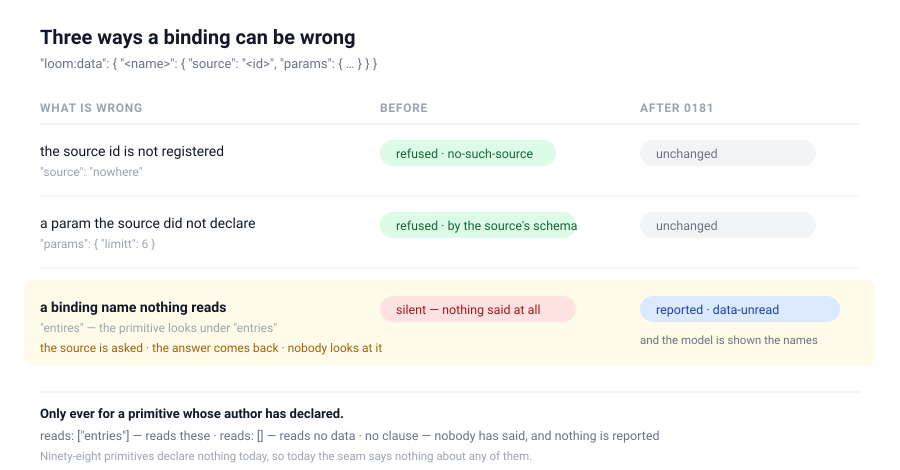

# A binding name nothing reads — the one of three that said nothing

**Date:** 2026-09-22
**Routine:** `Loom daily build` (framework core)
**Section:** §2 — the data seam, reaching the catalogue, the interpreter's prompt and the render walk
**Branch:** `framework-47-a-binding-name-nothing-reads`

## What was completed, in plain language

A Loom page asks a host for data by writing a **binding** on a node: a name, a
registered source, and the params to ask with. The name is how the primitive
reading the answer finds it — a feed looks under `entries`, and the tree has to
have written `entries`.

Three things can be wrong in that declaration. Two of them were refused. The
third — **a name nothing reads** — was answered perfectly and then dropped on
the floor: the source was asked, the round trip was paid for, the primitive
looked under a different key and drew its empty state, and nothing anywhere said
a word.

A primitive can now declare which names it reads. The registry checks them, the
catalogue carries them, the model is shown them in the same block that lists the
sources, and the render walk reports a binding asked under a name the primitive
says it does not read.

**This closes a finding this lane filed against itself on 19 September**, which
named its own trigger and declined to build until it fired:

> A declaration nothing declares is a field on ninety-six definitions and a
> projection nobody reads, which is the shape of the defect this very change was
> fixing. **The moment the first primitive reads a binding is the moment to build
> it.**

`loom.feed` and `loom.tally`, on #361, are that moment. They are the first
primitives in the library's history that read an answer rather than drawing what
somebody typed.

## The shape

| | |
| --- | --- |
| `PrimitiveDefinition.reads` | `readonly string[]`, optional — the binding names it reads |
| `RegistryError` | one new code, `invalid-binding-name` |
| `CataloguedPrimitive.reads` | the three-way answer, projected |
| the catalogue line | ` reads: entries` · ` reads: none` · *(silence)* |
| the data block | the workaround sentence replaced by one that names where to look |
| `RenderDiagnostic` | one new code, `data-unread` |
| `BindingReader` | duck-typed off the resolver, like `FrameResolver` — nothing to wire |

### Absence is not emptiness, and that is what let this ship today

`undefined` means *nobody has said*. `[]` means *this primitive reads no data*.
There is no default.

This is [0122](../decisions/0122-a-primitive-says-which-of-its-props-a-reader-reads.md)'s
bargain made a second time one seam along, and it is load-bearing rather than
tidy: ninety-eight primitives declare nothing, so the new seam is **silent about
every one of them**. A deployment that upgrades and declares nothing gets
byte-identical prompts and an identical diagnostic list. A default of `[]` would
have made the runtime assert something no author said, and the assertion would
be false for every bound primitive written before the declaration existed —
pages would start reporting bindings that work.

### The clause a model reads writes absence by writing nothing

`props` renders `props: not declared` when a schema cannot be enumerated.
`reads` does the opposite and renders nothing at all, because which answer is
common is different: every primitive declares a props schema, so *not declared*
is the rare line and earns its words, while `reads` is absent on nearly every
primitive there is. Ninety-eight consecutive lines of `reads: not declared` on
every proposal and every repair would spend real tokens to say nothing.

The distinction survives because the absence of the clause **is** the third
answer, and the data block now teaches the reading.

## Unspecified decisions, and why they went the way they did

**Measured on the answers, not on the raw declaration.** A binding whose source
could not answer is already reported as `data-unavailable`. Reporting both of
the same name is two true things about one mistake, in the order they would be
fixed — and measuring the declaration instead would have made the unread check
go missing exactly when the first one fired. There is a test that asserts both
codes on one node for this reason.

**A diagnostic, not a refusal.** The finding asked for a name to be *"as
refusable as an invented source id"*, and a render diagnostic is one layer later
than the write path. The route that makes it a refusal is the one `0179` opened
on #360 — a fact in the analysis, a factor in the stakes — and taking it here
would have meant stacking two framework branches, which the brief forbids. Filed
with the shape named, and the ordering argued: a refusal belongs in the run that
lands the second or third declaration, not the tenth.

**The registry checks the grammar and nothing else.** Unlike `frames` and
`copy`, there is no second list for a binding name to drift against — a binding
name is not a prop name, so nothing can be renamed out from under it. The
grammar check is worth making anyway because it fails in the *worst* direction:
a declared name no tree could write matches no binding, so the primitive would
report **every** binding it was ever handed rather than none.

**`BindingReader` is structural.** A registry built by the SDK satisfies it; a
host resolving from a plain map has registered nothing that could declare a
binding name. There is nothing for a host to wire and nothing that can go
missing — the same deal `frames` and `behaviours` already make, and there is a
test that a plain resolver reports nothing.

## Records

**Added [0181](../decisions/0181-a-primitive-declares-the-binding-names-it-reads-and-saying-nothing-is-not-saying-none.md)**
— five decisions, six rejected alternatives. **Nothing superseded.** 0058 and
0122 are extended and cited; 0172's workaround sentence is replaced and the
replacement is argued rather than dropped.

`0180` is claimed by #361 and `0179` by #360, both unmerged, so `0181` is the
next free number. 0179 is cited by number and deliberately **not linked**,
because the file is on #360's branch and `pnpm verify` refuses a record link
that does not resolve on this one.

## Findings

**Closed one, filed two.**

- **Closed:** the 19 September entry, *a primitive still cannot say which binding
  names it reads*, with both remainders filed as their own entries rather than
  left inside the closed one.
- **Filed, `Loom primitives`:** nothing declares `reads` yet, so the whole seam
  is quiet. It is one line per primitive on `loom.feed` and `loom.tally`, and it
  carries one warning — do not reach for `[]` as a tidy default on the
  ninety-six that read nothing, because `[]` is a claim and the seam reports
  against it. It also carries one question back: if `loom.feed` reads under a
  name the **tree** chose, `reads` cannot describe it, and this lane should hear
  that.
- **Filed, this lane:** the refusal half, behind 0179 landing, with the ordering
  argument.

## Cross-lane files in this diff

One: `apps/loom/app/(docs)/_lib/api/reference.generated.json`, regenerated with
`pnpm --filter @loom/app docs:api`, because `src/render/reads.ts` puts new names
on the package boundary. `docs/routines.md` names this as the one sanctioned
crossing. `src/primitives/` was not opened.

## Open questions

1. **Does `loom.feed` read under a fixed name or a name the tree chose?** #361's
   description says it reads `loom.data[binding]`, which reads like the binding
   name is a *prop*. If that is right, `reads` cannot describe it honestly, and
   the seam is built for a shape its first two consumers do not have. Filed for
   `Loom primitives`, and the answer decides whether this lane needs a second
   form of the declaration.
2. **Should the walk report a binding a primitive reads that the tree never
   bound?** The mirror of what shipped. Not built and not filed: a primitive
   declaring `entries` and getting none is an ordinary unbound region, which is
   what its empty state is for.
