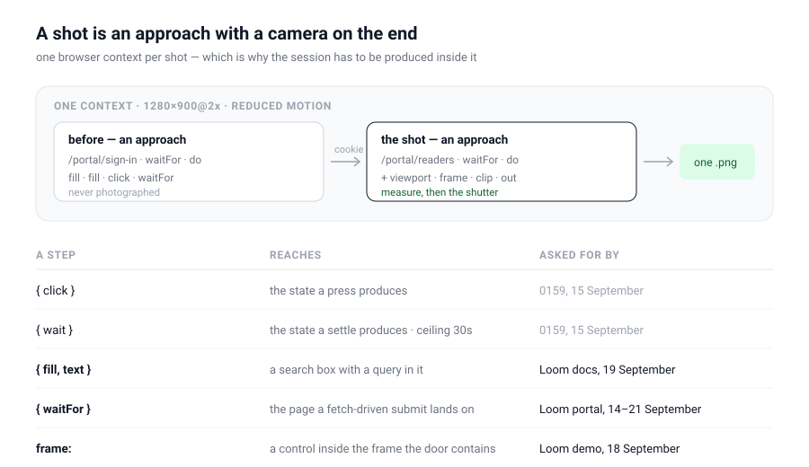

# A harness that can reach — the sign-in, the query and the frame, taken by `pnpm shoot`

**Date:** 2026-09-22
**Routine:** `Loom daily build` (framework core)
**Section:** §1 — process, the screenshot harness
**Branch:** `framework-49-a-harness-that-can-reach`



## What was completed, in plain language

Three lanes have filed four findings in four days, all of them the same
sentence: *the harness can photograph a page and cannot reach the state on that
page worth photographing.* Each was worked around by a Playwright script written
inside the run and deleted at the end of it — the portal lane has now done that
**six consecutive runs** in a row.

The pictures were never the problem. What is lost each time is that **none of
them can be retaken from anything in the repository**, which is the one property
the harness exists to give.

A shot list can now do four things it could not do yesterday:

| | |
| --- | --- |
| `{ fill: <selector>, text }` | type into a field. `""` clears it |
| `{ waitFor: <selector> }` | wait for something to appear, mid-sequence |
| `frame` on an approach | resolve its selectors inside a browsing context |
| `before` on a shot | an address visited, and never photographed, first |

`before` is the one that mattered and it is **not** a `signIn` step. It is an
approach — a path, a `waitFor`, a `frame` and a `do` list — made in the shot's
own browser context before its own address is opened. Sign in with it and the
cookie is still there when the shot loads. The harness does not know what a
password is, so a lane that signs in with a magic link writes a different
`before` and changes nothing in `tools/`.

That makes `Shot` a small type again: **an approach with a camera on the end.**
The `before` and the shot itself go through one function in the capture loop,
because they are the same thing done twice and only one of them ends in a
photograph.

## The evidence, taken by the harness itself

Seven shots against a fixture served on `127.0.0.1`, through `pnpm shoot`, with
no private script anywhere. The fixture and the shot list are at the bottom of
this report, so every picture here can be retaken.

| picture | what to look at |
| --- | --- |
| [`session-none`](2026-09-22-framework-a-harness-that-can-reach-session-none.png) | *Sign in to see this.* — the only picture of this screen the harness could take before today |
| [`session-raced`](2026-09-22-framework-a-harness-that-can-reach-session-raced.png) | signed in, and **not waited for**. Read the next paragraph |
| [`session-reached`](2026-09-22-framework-a-harness-that-can-reach-session-reached.png) | the numbers behind the session, photographed by a shot list |
| [`search-empty`](2026-09-22-framework-a-harness-that-can-reach-search-empty.png) | a combobox with nothing in it — the only state a `click` could reach |
| [`search-answering`](2026-09-22-framework-a-harness-that-can-reach-search-answering.png) | `planRevert`, two of eight pages, the state the box exists for |
| [`frame-untouched`](2026-09-22-framework-a-harness-that-can-reach-frame-untouched.png) | a framed demonstration, waiting |
| [`frame-pressed`](2026-09-22-framework-a-harness-that-can-reach-frame-pressed.png) | the control inside the frame, pressed |

**`session-none` and `session-raced` are byte-identical** — same `md5`
(`59c87d5be7cb4929fc0e8605a9e928e8`), both 1280×900@2×. The second one signed in
with two `fill`s and a `click` and then navigated without waiting, so the
press resolved, the shot loaded the next page, and the cookie was set 700ms
later against a page nobody was looking at. **A sign-in that is performed and
not waited for produces exactly the picture you get from not signing in at
all** — and nothing anywhere says a word. That is the trap `docs/routines.md`
has warned about in prose since 8 September, photographed both ways, and it is
why `{ waitFor }` is a step rather than a nicety.

## The defect this run found in its own change, by using it

The first full run of the shot list failed on one shot:

```
locator.waitFor: Error: strict mode violation: locator('#results li') resolved to 2 elements
```

Moving every selector onto a locator is what makes `frame` one field instead of
a second code path beside each call — but `page.waitForSelector` is **not**
strict and `locator().waitFor()` is, so the move had quietly turned *wait until
the results appear* into an error the moment two results appeared. It was a
regression in the existing shot-level `waitFor` as much as in the new step.

The rule now, and it is deliberate rather than a shrug at the driver:

- **a wait takes the first match.** Waiting for `#results li` with two results
  on the page is the ordinary case, and the shot-level `waitFor` has always
  behaved this way.
- **a press and a keystroke stay strict.** Which of two buttons was pressed is a
  coin flip whose outcome ends up in the picture, and there the ambiguity is the
  lane's to resolve.

There is a test pinning both halves, and the behaviour is in the adapter's own
comment where the next person to touch it will read it.

## Unspecified decisions, and why they went the way they did

**A `before`, not a `signIn` step.** The portal lane asked for either. A
`signIn` step would put one deployment's authentication shape inside the shared
instrument — a selector for the email field, one for the password, one for the
button, and a guess about what to wait for — carried by every other lane and
used by none, and the first magic link would need a second member beside it.

**One `before`, not a list of them.** One address is what all four findings
need. A field that is a list from the start is a field every reader has to
reason about being empty, being one, or being many.

**`frame` on the approach, not on each step.** The finding that asked offered
both. Per-step is strictly more expressive and the expressiveness is not
wanted: a shot list that presses one thing in the top document and the next
inside a frame is a journey rather than a picture, and `waitFor` would still
have needed its own field. One field, applied to `waitFor`, to every step and to
`clip` — a rule with an exception in it is a rule a lane has to remember.

**`frame` does not apply to `fullPage` or to the viewport shot**, and that is
the rule rather than an omission: a frame is not a page, and *all of the page*
means the page. Only a selector can be resolved somewhere else.

**The shot object is now `strict`.** A misspelled `frame` or `before` on a
permissive object is dropped in silence and what comes back is a correct picture
of the wrong thing — which is exactly what the step union has been strict about
since it was written, now reachable one level up because there are fields up
there worth misspelling.

**Navigation stays pinned in the top document only.** The capture-phase listener
that refuses anchor navigation is added by `page.evaluate` and does not reach
inside a frame, so a link pressed in a framed approach still navigates that
frame. Stated in the record and in the code rather than fixed, because fixing it
means reaching into frames the seam deliberately does not model. A `waitFor`
step is the way back in sync.

## Records

**Added [0182](../decisions/0182-a-shot-may-reach-a-state-it-does-not-photograph-and-may-name-the-document-it-reaches-into.md)**
— five decisions, six rejected alternatives. **Nothing superseded.** 0159 is
*extended and cited*, not amended: it drew the line — *an instrument may reach a
state and may never assert one* — and closed by naming typing and a wait for a
condition as reaches it had not been asked for yet. All four additions here are
on the reach side of that line, and the one thing on the other side of it (a
script a shot is handed) is refused for the third time.

0181 is the highest number on `main`; 0176 is claimed by #353 and neither other
open pull request claims a record, so 0182 is the next free one.

## Findings

**Closed three, filed one.**

- **18 September, `Loom demo`** — a shot list cannot reach inside a frame.
  Closed, including the half the entry said could not be worked around: a
  framed page's readiness is now a `waitFor` rather than a guessed duration.
- **19 September, `Loom docs`** — a shot list can press a button and cannot type
  into it. Closed. The one thing that entry asked for and did **not** get is
  `page.route` holding a response open: that is the harness asserting something
  about a network and it stays on the far side of 0159's line.
- **19 September, `Loom portal`** — the harness half is closed; the `pkill` half
  is that lane's and is untouched.
- **Filed for `Loom portal`, `Loom docs` and `Loom demo`**: the recipe, the two
  traps above, and what is still not offered.

The 21 September entry — *the portal has been photographed by a private script
for the sixth consecutive run* — is `Loom portal`'s own and is not mine to
close. Its staging half stays theirs: putting stores on `globalThis` before the
server's route modules evaluate is a recipe for running an application, and
`pnpm shoot` has never started anybody's.

## Open questions

**The 17 September entry stays open, and it is the interesting one.** A state
the browser holds *before* the page loads — a seeded cookie, a `localStorage`
key — wants an `initScript`, which runs code it is handed. That is the
shot-list-as-program 0159 rejected, and it is the one ask on the table with a
posture problem rather than a design problem. `before` covers a good deal of
what that entry wanted, by reaching the state through a page rather than by
writing it, and I do not know yet whether what is left is worth the seam.

**Hover and scroll-to-a-position are reaches and are still not asked for.** They
would fit 0182 the day a lane files for one.

## Tests

`pnpm install && pnpm verify` — **green, exit 0**, redirected to a file and the
exit code read off the run rather than off a pipe.

| | |
| --- | --- |
| Framework suite | 158 files, **2,949** tests, all passed |
| Application suite | 290 files, 5,202 tests, all passed |
| Findings | 745 findings, 0 malformed |
| Prerender check | 109 pages, 943 text junctions, 0 run together |
| Overflow, measured | 1280 against 1280 on all seven shots |

**22 tests are new** — the harness suites go from 198 to 220. Nothing was
skipped, weakened or rewritten.

**Four load-bearing tests were checked by mutation rather than trusted**, each
one restored and then reverted from a copy rather than by `git checkout`:

| defect restored | what fails |
| --- | --- |
| the `before` approach is never made | 2 |
| `frame` is dropped when resolving a selector | 3 |
| `fill` types an empty string instead of the text | 2 |
| a clipped capture ignores the frame | 1 |

The fifth defect was not restored, because the harness found it live: the strict
mode violation above, caught by running the tool against a real browser and a
real page with two search hits in it.

## Reproducing the pictures

The fixture is five static files served with `python3 -m http.server 8321
--bind 127.0.0.1`; nothing in it is committed, because it is a page that exists
to be photographed rather than anything Loom ships. The shot list is the
artefact worth keeping:

```json
{
  "baseUrl": "http://127.0.0.1:8321",
  "outDir": "reports",
  "shots": [
    { "path": "/readers.html", "out": "…-session-none", "waitFor": "[data-signed-out]" },
    { "path": "/readers.html", "out": "…-session-raced",
      "before": { "path": "/sign-in.html", "waitFor": "#email", "do": [
        { "fill": "#email", "text": "reviewer@example.com" },
        { "fill": "#password", "text": "a-password" },
        { "click": "button[type=submit]" } ] } },
    { "path": "/readers.html", "out": "…-session-reached", "waitFor": "[data-readers]",
      "before": { "path": "/sign-in.html", "waitFor": "#email", "do": [
        { "fill": "#email", "text": "reviewer@example.com" },
        { "fill": "#password", "text": "a-password" },
        { "click": "button[type=submit]" },
        { "waitFor": "[data-signed-in]" } ] } },
    { "path": "/search.html", "out": "…-search-empty", "do": [ { "click": "[data-search]" } ] },
    { "path": "/search.html", "out": "…-search-answering", "do": [
      { "click": "[data-search]" },
      { "fill": "#q", "text": "planRevert" },
      { "waitFor": "#results li" } ] },
    { "path": "/front-door.html", "out": "…-frame-untouched",
      "frame": "iframe#demo", "waitFor": "[data-stage]" },
    { "path": "/front-door.html", "out": "…-frame-pressed",
      "frame": "iframe#demo", "waitFor": "[data-stage]", "do": [
        { "click": "[data-yes]" }, { "waitFor": "body[data-changed]" } ] }
  ]
}
```

The two session shots differ by one step and nothing else. That is the report.
