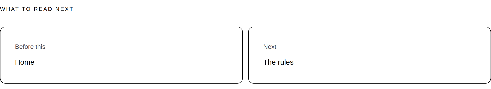
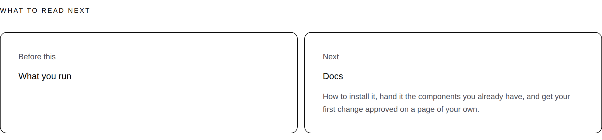

# 2026-09-22 — marketing: the way on, and the reading order this site had been keeping to itself

`SITE_ROUTES` has been a **reading order** since the third page of this site was
written. The comment above it is the longest in `site.ts` — which page earns
which, why the objection arrives seventh rather than second, why the page about
counting readers closes a group instead of opening the site. Every sentence of
it is a decision about what a stranger should read next.

The only thing that read it was the footer's map, which renders it as ten links
in a column, where being third and being ninth look exactly alike.

---

## What was actually wrong, measured

Not a judgement about polish. I walked the ten page builders on `main` and
extracted every `internalHref` to another page of this site — the onward links
each page hand-picks in the middle of its own argument:

| page | offers, from its own body |
| --- | --- |
| `/` | how-it-works, what-you-run, your-components |
| **`/how-it-works`** | **nothing at all** |
| `/the-rules` | how-it-works, who-can-ask |
| `/the-record` | home, how-it-works |
| `/when-it-goes-wrong` | home, the-record, the-rules |
| `/what-you-run` | the-record, the-rules, your-components |
| `/who-can-ask` | the-record, the-rules, when-it-goes-wrong |
| `/putting-it-back` | the-record, the-rules, when-it-goes-wrong |
| `/your-components` | how-it-works, the-rules |
| `/what-readers-do` | home, the-record, the-rules |

Read the other way, two pages are the destination of **nobody's**:
**`/putting-it-back`** and **`/what-readers-do`**. Both are also `inMenu:
false`, so the bar does not carry them either — the footer's map was the only
way to either page on the whole site.

And the worst one is at the top of that table. **`/how-it-works` ends pointing
nowhere**, and it is the page the front door's own closing band sends every
visitor to: *See how a change travels* is the primary action of the last band
on `/`. A reader who follows the front door's main call to action lands on a
page with no way forward in it.

The screenshot above is `/the-record` at 1280, and its *Next* card is
`/putting-it-back` — one of the two pages that, before this branch, no page's
body offered at all.

None of the hand-picked links are wrong. They are made where the reason for
going somewhere is fresh, which is the best place to make one. They are just
not a sequence, and nothing was ever going to make them one.

---

## What shipped

**Every page of this site but the front door now closes with `What to read
next`:** the page before it and the page after it, as two cards.

| file | what changed |
| --- | --- |
| `_lib/site.ts` | `readingNeighbours` — the page before and after, derived from `SITE_ROUTES` |
| `_lib/chrome.ts` | `siteReadingBand`, beside the header and the footer |
| `_lib/pages/*.ts` | ten builders, one line each |
| `_lib/readers/asked.ts` | `loom.card` added to `CONTROL_TYPES` |
| three test files | 31 new tests |

**Nothing outside `apps/loom/app/(marketing)/`.** `src/` was not opened, no
primitive was added, and every node in the band is a registered starter
primitive this site already renders elsewhere.

### The order is derived, never written down twice

`readingNeighbours` reads `SITE_ROUTES` and returns what is on either side. No
page builder knows which page follows it, and there is no second list to keep in
step — a route inserted into the order is a route the pages around it start
offering on the same commit. `site.test.ts` holds the relation to being the same
read from either end: if this page says that one is next, that one says this one
is before.

### The last page hands the reader to the documentation

The tenth page asks *what do I have to hand it*, and the honest answer to *what
now* at the foot of it is not another page of argument. `onward` is `DOCS`, on
exactly one page — a pager whose `next` were *Docs* on all ten would be a menu
item pretending to be a sequence.

**That one card carries the surface's blurb and no other card does**, and the
asymmetry is the point. Every other card names a page of an argument the reader
is in the middle of. A reader who has read all nine and meets a card saying
*Docs* has been handed a fourth navigation link; the same card saying *how to
install it, hand it the components you already have* has been handed the next
thing to do.

### The front door does not carry the band, and that is the one exception

It is the one page with nothing before it. The guarantee is that a reader **in
the middle of an argument** is told where they came from and where they go, and
the front door is not in the middle of one — it is the way in. It also already
carries the two strongest onward offers on the site one screen apart: the *Keep
going* band's four destination cards, and a closing band whose primary action is
the next page. A third, headed *What to read next* and holding a single card
spanning the whole column, was the same invitation made a third time and made
worst. I built it, photographed it, and took it out.

Nothing becomes unreachable: `/how-it-works` is offered by `/the-rules`' own
*Before this* card, and the front door by `/how-it-works`'. `chrome.test.ts`
holds **every page of this site to being offered by some page's band**, which is
the guarantee the whole run exists for, and it is asserted rather than argued.

The rule is read off the order (`before === undefined`) rather than off a path
compared against `HOME`, so whatever is first is the page that does not carry it.

---

## The primitive this band was built for twice and is not built from

`loom.link-pager` is written for exactly *previous page, next page* and is the
one thing in the starter library this site had never used. It was built on the
pager twice during this run, photographed both times, and neither version is in
the branch — the measurements are what survived. **Filed as one finding for
`Loom primitives`; this lane is not asking for a fix on any schedule.**

1. **`spread` gives the whole slack to the part that is empty.** The two end
   regions are `flex: 0 0 auto` and the numbers between them are `1 1 auto` — so
   a pager with no numbers puts its two ends at the band's edges with ~900px of
   nothing between them that neither may take. The primitive's own note predicts
   it: *"at 1280px it is a long way between Newer and Older."*
2. **A card in an end region has no width at all.** `loom.card` sets
   `container-type: inline-size`, so an element whose parent hands it no width
   computes to zero. Region and card each wait for the other. **It rendered as
   two vertical 1px lines, and every test in this repository passed** — the
   nodes, the props and the href are all right, and the only instrument that
   sees it is a photograph.

The second is worth knowing whichever way the first is decided, because it is
the rule for every container in the library that sizes from its contents: a card
may only go where something else has already said how wide it is. A grid track
has. A flex item at `0 0 auto` has not.

So the band is a `loom.section` holding a `loom.grid` at `columns: "two"` with a
`loom.card` in each track — the shape the front door's own *Keep going* band has
proved since 25 August. The one thing genuinely lost is the navigation landmark
the pager announces itself as; the cards still read *Before this, How it works*,
which is the fact a reader needs and the landmark was only going to label.
`chrome.test.ts` pins the current shape with the reasoning attached, so a run
that reaches for the pager meets the measurement instead of repeating it.

---

## A decision taken that was not asked for

**`loom.card` is now in `CONTROL_TYPES`**, which is what this site asks to be
told about the people reading it.

It follows from the band rather than being a separate errand: the only question
a *what to read next* band can answer is *did the reader go on*, and a press is
filed against the control rather than the band it sits in — so without this the
band would be unmeasurable on the one site that sells measurement. A card given
an `href` renders an anchor and is registered `interactive` for it, so it is a
control by the library's own definition.

It closes a gap that was already there and that nobody had filed: **the front
door's four destination cards were a press counted nowhere.** Two bands are
answerable now that were not. Nothing is switched on by it — the endpoint
answers 404 until `LOOM_SIGNAL_INTAKE` is set, which is the maintainer's to set.

---

## Both palettes, a third, and a phone

`scrollWidth 1280 / innerWidth 1280` wide and `390 / 390` on the phone, measured
by the harness against the built application under `next start`. **No colour is
named anywhere in the diff.**

| | |
| --- | --- |
| the band, `minimal` and `editorial` | `…-band.png`, `…-band-editorial.png` |
| the band, `bold` | `…-band-bold.png` |
| the band, phone | `…-band-phone.png` |
| the hand-off | `…-handoff.png`, `…-handoff-bold.png` |
| `/how-it-works`, whole page | `…the-way-on{,-bold,-phone}.png` |
| the band in context, at the foot of `/the-record` | `…-in-context.png` |

### What it costs a page

Read off the live page in Chromium rather than estimated from row heights:

| | band | the page's own gap | added |
| --- | --- | --- | --- |
| 1280 | **196px** | 48px | **244px** |
| 390 | **334px** | 48px | **382px** |

The hand-off band is taller because of the blurb: **253px** at 1280, 262px under
`bold`. The full-page photographs of `/how-it-works` with the band on it are
11,987px tall at 1280 and 16,401px on the phone; the figures without it follow
by subtraction rather than from a second build of `main`, and I am saying so
rather than presenting them as measured.

The phone figure is the usual shape: two cards side by side on a laptop are two
stacked blocks on a phone.

---

## Tests

`pnpm install && pnpm verify` — **green, exit 0**, read from a log file rather
than through a pipe. Nothing failed, nothing skipped, **no test weakened or
deleted.**

| suite | this branch |
| --- | --- |
| `@loom/runtime` | 156 files / **2,857 tests** — `src/` was not opened |
| `@loom/app` | 287 files / **5,094 tests** |
| `(marketing)`, within it | 38 files / **1,651 tests** (1,620 on `main`) |

The `main` figure for the marketing suite is measured rather than inferred: the
first run of this branch had the band wired into all ten builders and not one
new test, and it reported 1,620. **31 tests are new**, in three files.

`findings:check` reads 726 entries, 0 malformed. `prerender:check` reports 109
pages and 859 junctions, 0 run together.

### Mutations

Eight defects restored one at a time against the committed branch, each reverted
before the next.

| mutation | result |
| --- | --- |
| the order skips a page — `after` is `at + 2` | **3 red** |
| no hand-off to the documentation | **3 red** |
| one builder forgets the band | **1 red** |
| the hand-off card loses its blurb | **1 red** |
| the band is never built at all | **24 red** |
| the front door carries it after all | **2 red** |
| the palette is carried into the documentation | **2 red** |
| a `loom.link` inside the card, which the Gate would refuse | **1 red** |

**None survived.** The two worth naming are the last two: carrying `?theme=bold`
into a surface that does not read it is the failure mode the footer's map and
the front door's band were both written to avoid, and an anchor inside an anchor
is a tree the Gate refuses — a page that would not have built rather than one
that looked wrong.

---

## Decisions and findings

**No record written.** Nothing here is constrained outside this route group and
nothing touches an Accepted record. 0067 and 0070 are applied rather than
amended: the documentation is a step along the same origin, which is why the
hand-off is a card in a reading order rather than a link off the site.

**One filed**, for `Loom primitives`: *`loom.link-pager` cannot be a
previous/next pair* — both measurements above, both shapes it could take, and an
explicit note that this lane has no opinion on which and is not waiting on
either.

**None closed.** Nothing in this lane's queue was about navigation.

## Needs your input

- **Three pieces of new copy**, all descriptions of machinery rather than claims
  about anybody: the eyebrow **What to read next**, and the two card labels
  **Before this** and **Next**. Re-word freely — they are three constants in
  `chrome.ts` and a test holds each to the page.
- **The reading order itself is yours to disagree with.** I did not change it;
  I made it visible. A stranger now walks `SITE_ROUTES` in order, so if the
  argument is in the wrong sequence this is the run that makes it matter.
- **The hand-off to `/docs` on the last page** is the one navigation decision
  here that is about the product rather than about this site. It seemed the
  obvious end of the argument; say if the portal or the demonstration should be
  where the reading lands instead.
- **The licence line** (#96, on every marketing PR since #134). Still the site's
  one placeholder, at the foot of every page in the screenshots.
- **Positioning, audience and pricing.** Untouched, as always.

Nothing scheduled and nothing armed.
