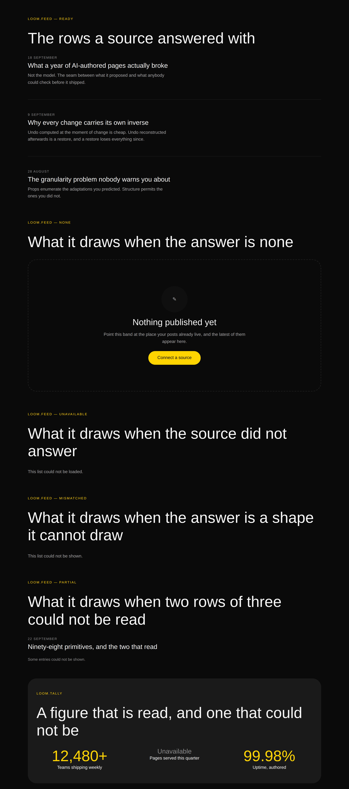

# The first answer — two primitives that read rather than are written, and the state this runtime is never in

**Routine:** `Loom primitives` · **Date:** 2026-09-22 · **Branch:**
`primitives-42-the-first-primitive-that-reads-an-answer` · **Section:** §4b →
§4e · **Pull request:** _filled in on the branch_ · **Preview:** _filled in on
the branch_

## What this run chose, and why that

**The row of the queue that needed nobody's permission.**

The 21 September inventory closed the list of genuinely-missing primitives and
left three rows, each *one decision rather than several*:

| row | what it waits on |
| --- | --- |
| an image source | **the maintainer.** Asked on #354, unanswered |
| a second page sequence | **the maintainer.** Asked on #354, unanswered |
| a bound region | **nothing** |

So the third one. It is also the largest single thing in the library that had
never been done:
[0058](../decisions/0058-a-binding-is-a-question-the-tree-asks-answered-before-the-walk.md)
gave the tree a way to ask a question of a registered source on **15 August**
and ended with the sentence that stayed true for five weeks —

> **No primitive in the starter library binds anything yet.** The seam exists
> and is proved by tests; what is not yet built is the authoring half.

Ninety-six primitives, and every word on every Loom page was a word somebody
typed into a tree. That is the gap between a demo and a product, and it is the
one thing on the list that is about what the framework *is* rather than about
what the catalogue can draw.

## What shipped

**Two primitives, one band, one record, four findings, and the first `loom.data`
read in the library's history.**

| | |
| --- | --- |
| `STARTER_PRIMITIVES` | 96 → **98** |
| the phrasebook | 35 → **36** bands |
| **primitive types some band can reach** | 71 → **73** of 98 |
| new tests | **17**, in a new file that drives the real data seam |

### `loom.feed` — a list that came from somewhere else

Reads `loom.data[binding]`, validates the answer against the shape it can draw,
and renders one of four things. Four of Hermes' five bound blocks — `services`,
`products`, `feed`, `marquee` — are this shape.

### `loom.tally` — one figure that is read rather than written

`loom.stat`'s content model with the number coming from a source. *Trusted by
12,480 teams* is a sentence a page is otherwise only allowed to print if
somebody remembers to go back and edit it.

### `feedBand` — the writing band, connected

A second design of the `articles` part, and the thing that makes
`loom.empty-state` reachable eight days after it was built. `articlesBand`'s own
comment predicted this band and got one thing wrong, which is the whole reason
it is a second design rather than a prop on the first:

> the same four `loom.article` nodes are what a binding would produce once it
> has one.

A binding does **not** produce `loom.article` nodes.

## Which fields became nodes and which stayed props

Nothing was ported from Hermes' registry — the content models here are Hermes'
`feed` and `about` read through 0052 rather than translated — so the table is
the other one this section is for.

| | became nodes | stayed props | and never a node at all |
| --- | --- | --- | --- |
| **`loom.feed`'s entries** | — | — | **the rows.** Title, detail, meta and address, read from the answer |
| **`loom.feed`'s empty region** | a `loom.empty-state` in the `empty` **slot**, so a band can offer whatever action would fill it, and 0051's test is met — the primitive places this region *instead of* the rows, whatever the tree's child order | `binding`, `density`, `separators`, `meta` — four renderings of however-many rows, none of which changes a node | |
| **`loom.feed`'s two failure lines** | — | declared `text` (0060) | |
| **`loom.tally`'s figure** | — | `label`, `caption`, `prefix`, `suffix` — exactly one of each, changing one is exactly a `configure` | **the figure**, read from the answer |

**The first row is the decision, and it is the one worth arguing with.** 0052
says repeated content becomes child nodes, and this run says a bound row does
not. The argument in
[0180](../decisions/0180-a-primitive-that-draws-an-answer-declares-the-shape-it-can-draw.md)
is that 0052's reasoning is *entirely* about what happens to content afterwards
— an FAQ item is a node so that adding one is an `insert` a reviewer weighs, and
whoever proposed it is attributed. **None of those operations exist for a row a
database returned.** No `move` addresses the third post, no `configure` re-words
it, nobody is attributed for it, and its inverse is not a change to this page.
Nodes would buy none of what nodes are for, and a tree holding them would be the
cache 0058 refused when it kept answers out of props.

**The near-miss is `meta: "above" | "inline"`**, which looks like it decides
something structural and does not: it is where the date sits relative to the
title, for however many rows there turn out to be. `does changing this prop
change the set of nodes?` — no, and it cannot, because no configuration of this
primitive makes a row into a node.

## The three renderings, and the one this runtime can never draw

0058 is explicit that *nothing to report* and *could not be reached* are
different answers and that collapsing them is the mistake a reader pays for. So:

| the answer | what is drawn |
| --- | --- |
| rows | the rows |
| `ready`, and empty | the `empty` region the tree placed |
| `unavailable`, or a shape it cannot draw | a declared line, announced `role="status"` |

**And there is no waiting state, which is the finding this run did not expect to
make.** Resolution happens before the walk — that is what keeps `renderLoomTree`
synchronous and pure — so by the time any component runs, every binding is
`ready` or `unavailable` and none of them is pending. A skeleton drawn from a
binding would be a picture of a state this runtime is never in, and one that
never resolves, because no second render is coming.

`loom.waiting-state` was shipped on 14 September as one of *the two states a
bound region is in*. It is correct, it is tested, and **a bound region is never
in it.** It is the right primitive for a region a *host* fills on the client,
and nothing in this library can place one. Filed, with the consequence that the
reach inventory's third row is two primitives rather than three.

## Two things the photographs changed

**The figure that failed was the loudest thing on the page.** `loom.tally`
reuses `.loom-stat-value`, which is the accent at the type ramp's seventh step —
right for `12,480` and, under `bold`, a **bright yellow `Unavailable`** twice the
size of anything near it, announcing a failure across the band. Nothing was
wrong in the source: the token did what it says, the palette did what it says,
and the two compose into a page shouting about the one thing it could not do.
Fixed with an inline override — `size(5)`, `fg-subtle` — which is the one
mechanic this library keeps for exactly this.

**An entry's title read as bold body text.** It was `weight("heading")` at
`size(4)`, matching `loom.article`. That is right in a card, where a border and
a ground do half the work of separating the title from its own excerpt, and
wrong in a run, where a hairline is doing all of it — and under `bold-sans`,
whose pack declares `headingWeight: 400` beside `bodyWeight: 400`, the weight
token buys nothing at all. `tokens.ts` warns about this in as many words. Raised
a step to `size(5)`, which is the difference the type has to carry alone.

**Neither is visible in a test and both are obvious in a photograph.** The
second is the trap `tokens.ts` documents, met by a primitive written after the
warning.

## What is now checked, and where

`bound.test.ts` is a new file rather than an addition to `library.test.ts`,
because these are the first primitives whose behaviour needs a **resolution** as
well as a tree. Every test drives the real seam — a registered source, a planned
question, an adapter that answers or does not — rather than a handwritten
`DataResolution`, which would prove the component's branches and nothing about
whether a binding a tree declares ever reaches the primitive that declared it.

**Four load-bearing behaviours, each checked by putting its defect back:**

| mutation | what fails |
| --- | --- |
| an unavailable answer collapses into empty | *says a source that could not answer is a different thing from one with nothing to say* |
| drop the *no row read* guard | *calls an answer where no row reads a shape it cannot draw, not a list with holes* |
| a bad address takes its row off the page | *refuses an address a row carried that is not a scheme this library links to* |
| skipped rows go unsaid | *skips a row it cannot read, draws the rest, and says that it did* |

Each fails exactly one test, and the restored file is green.

**The one worth reading is the third.** `href` is the first URL in this library
that arrives from a **host's data** rather than from a tree, so it is the first
one the Gate never saw — the scheme allowlist
([0053](../decisions/0053-a-url-in-the-tree-is-checked-against-a-scheme-allowlist.md))
is the only thing between a row and a `javascript:` address. It is
`linkUrlSchema.optional().catch(undefined)`, so a row whose address fails draws
as an entry that is *not a link* rather than vanishing: the words are still
worth reading, and dropping a post over a field nobody can see is a silent
omission of exactly the kind 0175 refuses.

Also held: both starter palettes, byte-identical markup, no literal colour, over
**all five** feed states and both tally states — which matters more here than
usual, because the failure line and the skipped-row note are drawn by the
primitive rather than by the tree and are therefore the two strings in this
library most likely to carry a colour of their own.

## Checks

- `pnpm install && pnpm verify` **green, exit 0**, redirected to a file and the
  exit code read off the run rather than off a pipe (`docs/routines.md`).
- **The first run was red on typecheck and green under the test runner**, which
  is worth a line: `vitest` transpiles without checking, so a source schema
  typed `z.unknown()` where the seam wants `ZodType<JsonValue>` passed
  seventeen tests and failed `tsc`. Fixed with the repository's own
  `jsonValueSchema`.
- Four existing assertions changed, all of them counts this run moved: the
  library's size 96 → 98, twice; the leaves list, twice (both new primitives are
  leaves, `loom.feed` for a third reason nothing else in that list has — its
  content is in neither its props nor its children); the catalogue's band count
  35 → 36. **No test weakened, none skipped, none rewritten.**
- Overflow measured by the harness: 1280 / 1280 wide and 390 / 390 phone, both
  palettes, on both sheets.
- No literal colour anywhere in the diff.

## Outside the lane

One generated file, not edited by hand (0139): `decisions/README.md`,
regenerated with `pnpm decisions:index`. The docs' API reference was
regenerated and **did not change** — neither primitive is a package-boundary
export, and bands are re-exported from `compositions/index.ts` into an empty
list at the top level.

Everything else is `src/primitives/`, `decisions/0180`, `FINDINGS.md` and this
report. Nothing under `apps/`, nothing in `src/` outside `src/primitives/`, and
nothing in `tools/` — see the third finding for what that cost.

**On the commit author.** `docs/routines.md` still gives two opposite
instructions and it is not this lane's to resolve — filed by `Loom portal` on 16
September and reported by five runs since. This run followed the later section:
no author is set, so the session default applies.

## What the library still cannot express

**Unchanged and still the maintainer's:**

- **A page with a picture on it.** Six registered primitives behind one question
  asked on #354 and not yet answered. Unchanged, unblocked by anything this lane
  can do, and still the largest row.
- **A second page sequence.** Also asked on #354. `feedBand` is a *design*
  rather than a part precisely so this run did not need it.

**New, and this run's own:**

- **The specimen harness cannot photograph a bound primitive in the state it
  exists for.** Every picture above of an answered feed was taken by serving a
  page and pointing `pnpm shoot` at it, which is the tenth private screenshot
  script this repository's lanes have written. Fifteen lines in `tools/` closes
  it and `tools/` is not this lane's. **This is the one to fix first**, because
  the next bound primitive will hit it on its first day.
- **The catalogue cannot say which binding a primitive wants**, and **the audit
  cannot probe a region placed only when a source failed.** The second is a real
  constraint on the shape of every bound primitive rather than an inconvenience:
  it is why `loom.feed` has one slot and two declared sentences instead of three
  slots.
- **A primitive cannot raise a render diagnostic**, so the count of rows a feed
  skipped can reach a reader or nobody.

**`loom.tally` is registered and deliberately unreachable from the phrasebook.**
A list has a designed absence and a figure does not: a band of four tallies on a
page nobody has connected is four words where four numbers go. It is reachable
the moment a surface binds one, which is one `configure`.

**On the 250 question**, unanswered for seven runs: the vocabulary is at 98 and
should still stop near 110; the phrasebook is at 36 and is the row that scales;
reach is at 73 of 98. What this run adds is that the third axis now has a
*fourth* kind of member in it — a primitive that is unreachable because it draws
something only a host can supply, which is different from unreachable because
nobody has written the band. `loom.tally` and `loom.waiting-state` are both in
that class, and counting them beside the others overstates the gap.

**`21st.dev` re-verified blocked**, `EGRESS_BLOCKED` from the proxy.
**Nineteenth consecutive check from this lane and it has never once been
reachable.** The visual standard for this run was `loom.hero`,
`loom.feature-grid`, `loom.article` — which is the primitive `loom.feed`'s
entries are deliberately *not* a copy of — and the eight photographs beside this
file.
