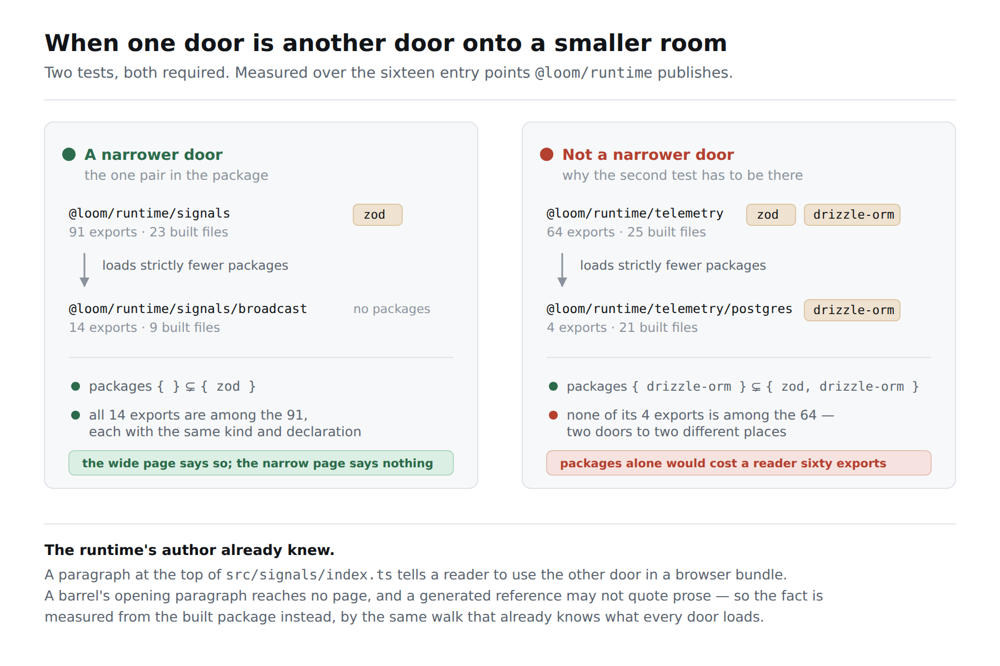
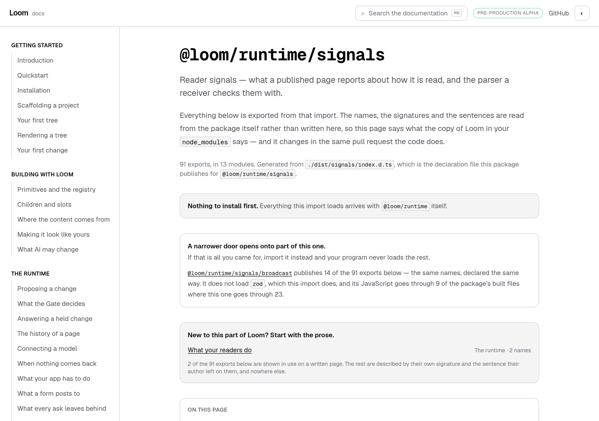
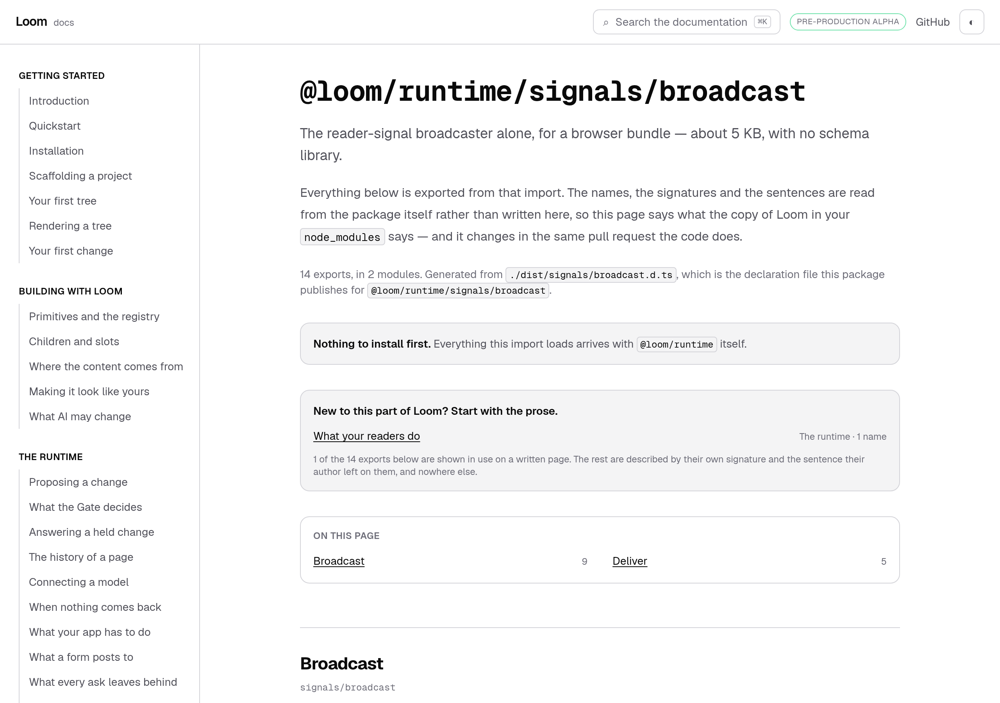

# 23 September 2026 — a narrower door, and the two tests it takes to say so without lying

**Routine:** `Loom docs` · **Branch:** `docs-33-a-narrower-door` · **Section:** §4c

**Preview:** the pull request's Vercel deployment. Published unverified, as every
routine run's has been: `*.vercel.app` is off this sandbox's egress allowlist and
the proxy answers `403 CONNECT tunnel failed`. That is the standing 15 September
finding and is not re-filed. Everything measured below is a production build
(`pnpm build && next build && next start`), fetched over real HTTP and driven in
Chromium.



## What this run was

The findings queue, and the entry this lane filed against itself yesterday.

## The plain version

Yesterday every reference page learned to say what its door makes you install.
That answers *will my import run*. It cannot answer the question a reader asks
straight after — **should I be importing this one at all** — and one of Loom's
sixteen doors is a case where the answer is no.

`/docs/api-reference/signals` now says, under the install band:

> **A narrower door opens onto part of this one.**
> If that is all you came for, import it instead and your program never loads
> the rest.
>
> `@loom/runtime/signals/broadcast` publishes 14 of the 91 exports below — the
> same names, declared the same way. It does not load `zod`, which this import
> does, and its JavaScript goes through 9 of the package's built files where
> this one goes through 23.



## Why this door and not a paragraph

The runtime's author already knew. There is a paragraph at the top of
`src/signals/index.ts` telling a reader to import the broadcaster from the other
door in a browser bundle, because this one also carries the schemas and a bundler
cannot drop them once they are in.

Neither page could say it, and that is the same wall the last three runs hit: a
barrel's opening paragraph reaches no page, because a barrel declares nothing and
the reference has nowhere to put it. Lifting the prose would have fixed one door
and left a hand-maintained sentence behind — which is the §4c rule's whole
subject.

So it is **measured from the built package**, by the walk that already knows what
every door loads. The fact was there the whole time; nothing was reading it.

## The rule, and the half the finding did not have

A door **B** is narrower than a door **A** when both of these hold:

1. **B's JavaScript loads a strict subset of A's packages.** Equal is not
   narrower. Two doors that load the same libraries cost a reader the same
   thing, and pointing from one to the other would be a recommendation about
   taste wearing a measurement's clothes.
2. **Every export B publishes, A publishes with the same kind and the same
   declaration.**

The finding proposed the second half as *B's exports are a subset of A's*. Names
alone is not enough, and the reason is the claim the band makes to a reader: *that
one gives you the same thing*. A name is not an identity across sixteen entry
points — two doors could each publish a `Journal` meaning different things — and a
reader who followed a band on that evidence would find out at their keyboard.
Matching on the declaration is what makes the sentence true rather than likely.

Both halves earn their place. `@loom/runtime/telemetry/postgres` loads
`{ drizzle-orm }` where `@loom/runtime/telemetry` loads `{ zod, drizzle-orm }` —
a strict subset, test one passed — and publishes four names, **none** of which
are among that door's sixty-four. A rule of packages alone would have sent a
reader looking for the journal to the Postgres journal and lost them everything
they came for.

**Measured over all 240 ordered pairs, exactly one qualifies.** That is in the
diagram above and it is also a test: *finds exactly one pair in the whole
package, so the band is rare rather than decorative*.

## The band says nothing when it has nothing, and that is the odd one out

The two bands around it announce an empty result. *Nothing to install first.*
*No written page names any of this import's exports yet.* Both are deliberate,
for the same stated reason: a reader arrives already wondering, and one shown no
band at all cannot tell that from a site that never checked.

This one does the opposite, and the difference is who is wondering. **Nobody
arrives asking whether a narrower door exists** — they have not met the idea yet.
Printing *no narrower door* on the fifteen pages that have none would teach a
reader a concept and withdraw it in the same sentence, fifteen times over. There
is a test holding that line, with the reasoning in it.

**It points one way only.** The wide door's page carries the band; the narrow
one's does not.



A reader standing at the narrow door already has the cheap import. Telling them a
wider one exists would be an invitation to pay for exports they have not asked
for — which is the exact cost this band was written to stop.

## What the number is, and what it is not

**9 built files against 23 is reach, not weight.** The walk follows every
`import` and every `export … from` and counts what it visited; a bundler then
drops what the reader's program never calls. Nine files is an upper bound on
nine files' worth.

The number the author's paragraph gives is **about 60 KB**, and this site still
cannot say it. Measuring it means bundling each door on its own and reading the
output size, and the cost that decides it is not the bundler — it is that the
answer would be about *our* bundler and be read as a promise about *theirs*. A
band that said 60 KB and delivered 41 would be worse than one that said nothing.
That is today's finding, with the shape that might resolve it.

## Found while writing

The sixteen doors barely overlap, and I had not expected that.

| door | names it shares with `@loom/runtime` |
| --- | --- |
| `@loom/runtime/signals` | **0** of 91 |
| `@loom/runtime/store` | **0** of 48 |
| `@loom/runtime/signals/broadcast` | **0** of 14 |
| `@loom/runtime/react` | 5 of 92 |

The root door is a superset of nothing. Every one of the fifteen subpath doors
publishes at least one name it does not, and three of the four above publish
*nothing* it does. This package is sixteen separate surfaces rather than one
surface with convenience subsets — which is a good property, and is also the
reason the rule fires exactly once: it can only compare two doors that overlap,
and almost nothing overlaps.

The reference presents the sixteen as a flat list and says nowhere that they do
not nest. A reader who imports `@loom/runtime` believing it is the door that has
everything behind it is wrong, and nothing on the site corrects them. That is the
next page I would write and it is not this branch's.

**Filed — two, both for this lane.** The saving is named in files and packages,
not in kilobytes, and what would measure the third is written down with both
reasons not to take it lightly. And the phone photograph found an orphaned
letter in the largest type on the page — *At 390 pixels*, below.

**Closed — one.** Yesterday's entry, by the rule it proposed plus the
declaration-matching half it did not have.

**Not re-filed:** the preview URL cannot be verified from this sandbox (15
September), and the screenshot harness photographs an address while the theme
lives in `localStorage`, so the page pictures are light (14–16 September). The
diagram carries its own dark mode and will follow the reader's.

## What shipped

**`_lib/api/narrower.ts`** — the rule, new. Whole-reference rather than
per-page, because whether a door is the wide one is a fact about it and all
fifteen others; the first of the sixteen cannot know it alone. Pure over data:
it takes what each door loads and what each door publishes and returns a map, so
the tests state a package's shape rather than arranging for one to exist.

**`_lib/api/requires.ts`** — the walk now returns what it reached *and* how many
of the package's own files it went through, as `reachFrom`. `packagesReachedFrom`
is kept as the thin wrapper for the callers that want only the first.
`requirementsFor` became pure over three sets — the peers, the loaded, the
declared — rather than performing the walk itself, because the generator has that
walk's answer already and a function that read it again would be walking sixteen
doors twice to print one number.

**`_lib/api/model.ts`** — `ApiNarrowerDoor`, and `ApiEntry.files` and
`.narrower`.

**`_lib/api/extract.ts`** — two passes now: the doors, then the comparison
between them.

**`_lib/api/reference.ts`** — the new fields are checked on the way in, as
everything else in it is. One check is worth naming: **a narrower door that
avoids nothing stops the build.** The rule cannot produce one — a strict subset
is missing at least one member — so a file carrying one was written by nobody's
generator, and the sentence it would render (*it does not load, which this import
does*) is true and empty.

**`_components/api-reference.tsx`** — the band, between the install band and the
prose links.

## Decisions taken that were not specified

**No decision record.** Nothing here constrains anything outside this route
group, no Accepted record is touched, and the change is the §4c rule applied to a
fact the reference did not previously carry. Same call as the four runs before
it, for the same reason.

**Declarations, not names.** Above.

**Strict subset, not subset.** Above. Its cost: a door that loads the same
packages as another and goes through far fewer files is not called narrower.
Checked over all 240 ordered pairs, **no such pair exists in the package today**,
so the choice costs a reader nothing yet. It is in today's finding so that the
silence is on the record rather than discovered.

**The narrower door's slug is the entry's own, not derived a second time.** A
link that computed its URL from a specifier could disagree with the page it
points at.

## Tests

`pnpm install && pnpm verify` at the repository root: **green, exit 0**, read
from a log file rather than through a pipe.

| | `main` at `b36adb0` | this branch |
| --- | --- | --- |
| `@loom/runtime` | 158 files / 2,927 tests | **158 / 2,927** — `src/` was not opened |
| `@loom/app` | 290 / 5,202 | **291 / 5,231** |
| findings ledger | 744 entries, 0 malformed | 746, 0 malformed |
| prerender | 109 pages, 943 junctions, 0 run together | 109, **954**, 0 |

**+29 tests, one new file**, none weakened, nothing skipped. The `main` figures
were measured on this machine in a worktree at `origin/main`, not carried over
from another run's report.

The 11 new text junctions are the band's own sentences: `prerender:check` reads
every place a JSX expression sits beside a word and fails when they run together,
so the 20 September finding about exactly that defect guards this band too.

Green is not evidence, so **nine mutations were introduced one at a time**:

| what was broken | what went red |
| --- | --- |
| the rule looks only at packages, not at what the doors publish | 4 — including both name-collision tests and the regeneration check |
| a door loading the same packages counts as narrower | 1 — *is not satisfied by two doors that load the same packages* |
| a door with no exports is offered as a way to save a package | 1 — *never offers a door with nothing behind it* |
| two doors match on the name alone, not on the declaration | 2 — *a shared name that means two different things*, and the same names under a different kind |
| `avoids` lists everything the wider door loads, not the difference | 1 — *names only the packages the wider door loads and the narrower one does not* |
| the walk counts only the files that import something | 3 — both file-count tests and the regeneration check |
| the relation is applied in the wrong direction | 5 — including *does not point the other way, from the narrow door to the wide one* |
| the band renders on a door that has no narrower one | 1 — *says nothing at all on a door that has none* |
| the band is placed before what a reader must install | 1 — *comes after what must be installed* |

Nothing survived. One result is worth reading rather than counting: **the
assertions against the real package did not catch the first mutation** — the
regeneration check did. `apiEntryAt("telemetry")?.narrower` reads the *committed*
generated file, which a broken generator does not change until somebody
regenerates it. That is the same lesson as yesterday's fifth mutation, and it is
why both kinds are here: the committed-file assertions say what the package's
shape is, and the regeneration check is what keeps the file honest.

Files were restored from byte-for-byte copies rather than with `git checkout`,
which is the 16 September finding, and `diff` against the copies is empty on all
three.

Beyond the unit tests, the three pages were fetched from a running production
build and their HTML read: the band present once on `/signals` with the numbers
above, and absent on `/signals-broadcast` and `/telemetry`.

## Scope

`apps/loom/app/(docs)/` only, plus `FINDINGS.md` and this report. Thirteen files
under `(docs)`: two new — `_lib/api/narrower.ts` and its test — and eleven
touched. Five of the eleven are the change itself (`_lib/api/requires.ts`,
`model.ts`, `extract.ts`, `reference.ts`, `_components/api-reference.tsx`), one
is the regenerated `reference.generated.json`, three gained tests
(`requires.test.ts`, `extract.test.ts`, `api-reference.test.tsx`), and two are
one-line fixtures in `mentions.test.ts` and `offered.test.ts` that gained the new
fields.

**No file in another lane was opened.** `git diff main -- src/` is empty. The
generated reference changed only by gaining `files` and `narrower` on each of the
sixteen entries. Held against `main`'s copy with those two fields stripped out,
the two files are identical: no name, signature, kind, summary or requirement in
it moved.

## At 390 pixels

`scrollWidth 390 / innerWidth 390` on `/docs/api-reference/signals`. The band
wraps: the specifier is a link inside a paragraph rather than a row of its own,
so it breaks like any other word, and the `break-words` class added to the
heading yesterday still holds the four longest specifiers.

**The photograph found something yesterday's fix did not cover**, and it is
filed rather than fixed. `break-words` stopped the page scrolling sideways and
says nothing about *where* the break lands, so the heading reads

```
@loom/runtime/signal
s
```

— an orphaned `s`, in the largest type on the page, as the first thing a reader
on a phone sees. The remedy is a break opportunity at each slash, which is where
a person would break it themselves. It is not in this branch because the heading
is a different subject from two doors compared with each other, and because a
`<wbr/>` is a junction `prerender:check` reads, so it comes with a test rather
than with a class.

## What I would write next

- **The sixteen doors do not nest**, and no page says so. The table above is the
  evidence and the reference is where a reader forms the wrong belief. This is
  now the strongest thing on this list.
- The arrival route on *Introduction* describes six steps beginning at
  *Installation* and does not acknowledge a reader who arrives having already run
  the quickstart. One paragraph in `_lib/arrival/route.ts`. Unchanged from the
  last four reports, and it is the oldest thing here.
- Whether a reader searching a name should be told which page it is on before the
  names land — an editorial question rather than a technical one.
