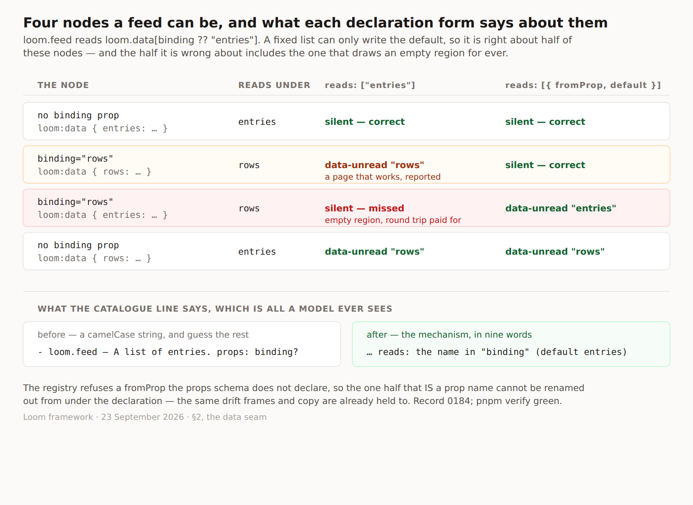

# A name a prop gives, which is the shape both bound primitives actually have

**Date:** 2026-09-23
**Routine:** `Loom daily build` — the framework core, `src/` except `src/primitives/`
**Branch:** `framework-50-a-name-a-prop-gives`
**Section:** §2 — the data seam, reaching the catalogue, the interpreter's prompt and the render walk
**Pull request:** https://github.com/jam-overture/loom/pull/371
**Preview:** https://loom-git-framework-50-a-name-beee2c-jpizzolato36-6341s-projects.vercel.app
— there is nothing to look at beyond the figure below. This is a declaration
seam whose surfaces are a string sent to a model and a diagnostic collected by
the render walk, and no page in this repository declares one yet.



## What this was

One open finding owned by this lane, filed by this lane on 22 September, which
named itself *this lane's next unit*. Yesterday's run shipped
[0181](../decisions/0181-a-primitive-declares-the-binding-names-it-reads-and-saying-nothing-is-not-saying-none.md)
— a primitive declares the binding names it reads — and then reading the two
primitives that would declare first showed that neither could.

`loom.feed` reads `loom.data[binding ?? "entries"]`. `loom.tally` reads
`loom.data[binding ?? "value"]`. Both take the name from an **optional prop**,
so a fixed list of names has nothing honest to say about either: it would have
to write the default and then be wrong about every node that set the prop.

The figure is the whole argument. Four nodes a `loom.feed` can be, and a fixed
list gets two of them right. One of the two it gets wrong is a false alarm — a
page that works, reported as a binding nobody reads. The other is the one that
matters: a node whose prop says `rows` and whose `loom:data` says `entries`
reads nothing, draws its empty region, pays for the round trip, and a static
declaration is **silent** about it. That is precisely the failure 0181 was
built to end, surviving inside the thing built to end it.

## What shipped

`reads` is now a list of **declarations** rather than of names, and a
declaration is either a name or `{ fromProp, default }`.

```ts
reads: ["entries"]                                  // unchanged, means what it meant
reads: [{ fromProp: "binding", default: "entries" }] // the second form
```

Four halves, all of which the finding predicted would work and all of which do:

- **The walk resolves before comparing.** `unreadBindings` now takes the node's
  own props, because a prop-named declaration means something different on
  every node carrying it. A declaration that is not a string resolves to the
  prop's value when that is a non-empty string, and to the default otherwise.
- **The seam still answers per type.** `bindingsReadBy` hands back the
  *declaration*, not the names. A registry is asked about a type and half of
  the answer is a question about a node, so the registry does not pretend to be
  able to answer it; the walk holds both halves. Nothing about the structural
  detection changes — a host resolving from a plain map still gets nothing and
  still has nothing to wire.
- **The registry refuses the new way of being wrong.** 0181 could note that
  `reads` had no second list to drift against. The prop-named form brings
  exactly that, so a `fromProp` the props schema does not declare is refused
  with a new `undeclared-reads-prop`, the same check `frames` and `copy` have
  always had. The `default` goes through `bindingNameSchema` as before.
- **The catalogue line writes it out.** ` reads: the name in "binding" (default
  entries)` rather than ` reads: entries`. Flattening to the default would have
  been cheaper and is the one rendering that would actively mislead: a model
  shown only `entries` can bind one thing and has no way to bind a second,
  because the prop is the entire mechanism by which two bindings on one
  primitive get different names. The data block gains one sentence saying how
  to act on the clause.

**Additive in the strict sense.** No declaration written against 0181 changes
meaning, and the diagnostic list for every tree in this repository is
unchanged — which is easy to be sure of, because nothing declares yet.

## Decisions I made that nobody specified

**One list with two member shapes, rather than one general form.** The finding
said to weigh replacing the list entirely with a prop-named form first, since a
primitive with fixed names could declare a prop-less variant of it — one
mechanism rather than two. I rejected it and 0184 records why: it makes the
common case pay for the rare one in every declaration and in every reading of
one, and the argument for a single mechanism is strongest when two shapes would
otherwise diverge downstream. These converge on one resolved name before
anything acts on them, so they diverge for exactly one `typeof` and nowhere
else.

**The prop's *type* is not checked.** The catalogue carries a prop's name and
whether it is required, deliberately not its type (0009), so "this prop holds a
string" is not knowable at registration. Rather than adding prop types to the
catalogue for one check, the walk falls back to the default for any value that
is not a non-empty string. The record states this as a decision rather than
leaving it as an omission a later reader has to infer.

**A schema whose props cannot be enumerated allows the declaration.** A union
of shapes reports `undefined` rather than an empty list, and refusing on the
strength of a list that was never built would refuse the honest declaration
along with the mistaken one. This is the answer `undeclaredCopyProp` already
gives; it is now given twice, the same way.

**The record extends 0181 rather than superseding it.** Decision 1 widens — the
list is still a list, and `["entries"]` is still checked exactly as it was.
Decisions 2 through 5 stand as written. Nothing is reversed, so nothing is
marked `Superseded`.

**Number 0184, not 0182.** 0182 and 0183 are claimed on open branches, so the
next free number after re-reading `main` and every open head is 0184.

## Records

- **Added:** [0184 — A primitive may read under whichever name a prop gives, and
  says so as a declaration rather than a name](../decisions/0184-a-primitive-may-read-under-whichever-name-a-prop-gives.md),
  `Accepted`. `pnpm decisions:index` regenerated.
- **Superseded:** none.

## Findings

- **Closed:** *"`reads` is a static list and the only two primitives that read a
  binding take the name from a prop, so neither can declare one"* (22 September,
  this lane, owned by this lane). Status edited in place, naming this branch,
  and the entry's own "alternative worth weighing first" is answered in the
  record rather than left open.
- **Filed:** *"`loom.feed` and `loom.tally` can now declare what they read, and
  the declaration is two lines"*, for `Loom primitives`. The two lines are
  written out in the entry. `src/primitives/` is their lane and two words in two
  definitions is not a thing to reach across a boundary for.

## Tests

`pnpm verify` green, **exit 0** — 158 files / 2,939 framework tests, 12 of them
new, and 290 files / 5,202 application tests. 745 findings, 0 malformed; 109
prerendered pages, 944 text junctions, 0 run together.

Three load-bearing tests were checked by mutation rather than trusted:

| mutation | what should fail | what failed |
| --- | --- | --- |
| walk compares against `{}` instead of the node's props | the two prop-resolution tests | 2 failed, 14 passed |
| drop the `fromProp`-is-declared check | the refusal test | 1 failed, 35 passed |
| flatten the catalogue line to its default | the catalogue-line test | 1 failed, 30 passed |

Nothing was skipped and nothing was weakened.

**One file outside this lane is in the diff**, and it is generated:
`apps/loom/app/(docs)/_lib/api/reference.generated.json`. The documentation
lane's own check failed on the first full run — *"the runtime's published
surface has moved"* — because `BindingDeclaration` is a new export and three
existing signatures changed. It was regenerated with the repo's own tooling
(`pnpm --filter @loom/app docs:api`), not edited; nothing in it was written by
hand and no page under `(docs)` was touched.

## Open questions

**The one-of-*n* question from #353 is still unanswered** and is still the only
thing genuinely blocking another lane. Unchanged recommendation: worth a
framework decision only if one mechanism serves all four primitives; if it is
really the pricing toggle that is wanted soon, the 14 September finding's cheap
option needs no framework decision at all.

**What I would take next, and why it is now the right order.** The refusal half
— a binding name nothing reads made refusable at the write path rather than
reported at the render — has been waiting on two things. `0179`'s route is on
`main` as of #360, and its own finding says it belongs in the same run as the
second or third declaration rather than the tenth. Once `Loom primitives` adds
the two lines filed for them, that is the second declaration, and the factor is
a small unit: one fact in `ChangeAnalysis`, one stake factor beside
`invalid-props`, and the analysis already walks the tree the change produces.

**Nothing is scheduled and nothing is armed.**
