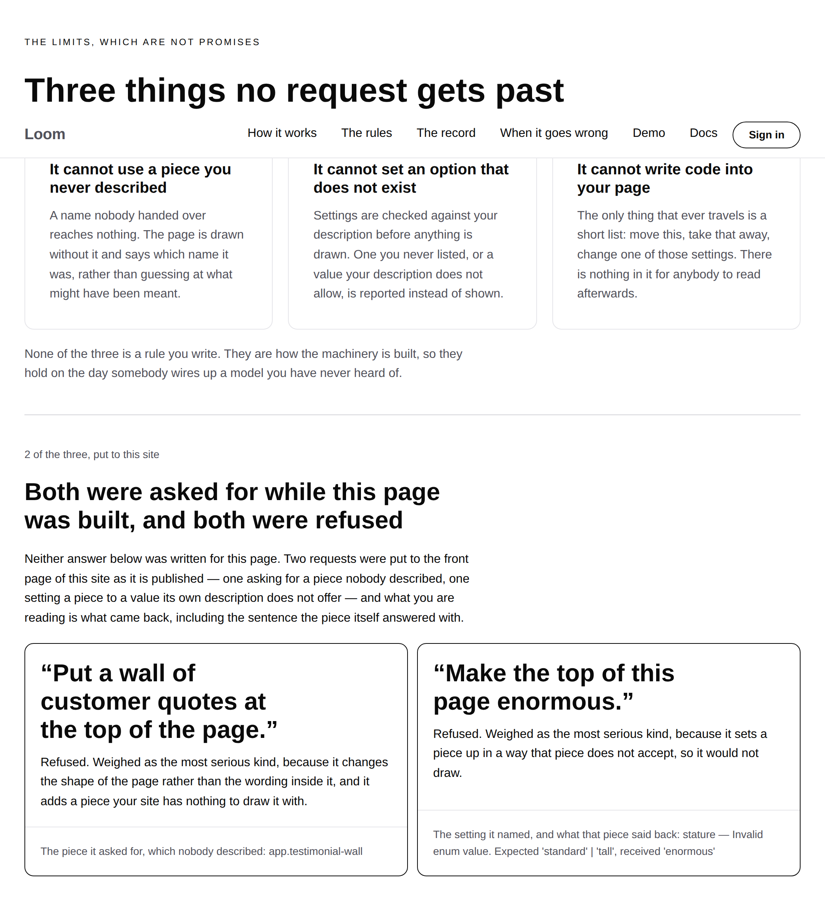

# 2026-09-23 — marketing: three things no request gets past, and two of them were not true of this site

`/your-components` has carried a band headed **Three things no request gets
past** since 11 September. Two of the three were things this deployment did not
do.

---

## What was wrong, and why nothing was red

Both floors exist in the runtime, and both are **wiring a host opts into** — on
purpose, so that the framework could ship them without migrating anybody:

| the claim on the page | the floor | the line |
| --- | --- | --- |
| *It cannot use a piece you never described* | 0173 | `registeredPrimitiveTypes: registeredTypesFor(registry)` on the policy |
| *It cannot set an option that does not exist* | 0179 | `propsVocabulary: propsVocabularyFor(registry)` on the runtime |
| *It cannot write code into your page* | — | a change is a list of operations and nothing else; no wiring, nothing to put to the test |

**Neither was set on this site.** `Loom framework` filed the second on
21 September — *nothing in this repository wires a props vocabulary, so the check
0179 built is off on all four surfaces* — with a row for this lane. Finding the
first one unset as well was this run's, and it is the older of the two: 0173
merged well before 0179 and nothing here ever went back to wire it.

What that means concretely, on the deployment as it stood this morning: a delta
inserting `app.anything` was **committed**. The revision was appended, the page
was served, and `renderElement` returned `null` — so the reader got a hole where
the piece should be, on every request, until somebody looked at a screen. A
setting given a value outside its own list did exactly the same, and is the
worse of the two because every name in it is real.

**Nothing in this repository could have reported it.** Not one test was red.
The band is the claim and there was no instrument between the claim and the
truth — which is the failure this site keeps finding in other forms: two
individually defensible things that nobody had read next to each other.
`site.ts` was counting the sixth instance of it on 11 September, the day this
band was written.

---

## What shipped

### The wiring, at four composition roots

| file | what it composes |
| --- | --- |
| `_lib/adapt/run.ts` | the front door's live ask — **and the policy**, which is where `registeredPrimitiveTypes` goes |
| `_lib/adapt/undo.ts` | the undo of it |
| `_lib/adapt/askers.ts` | the sixteen runs `/who-can-ask` prints |
| `_lib/adapt/floors.ts` | the two probes below, new today |

Both are read off `siteRegistry` — the same registry the renderer resolves
against — rather than kept beside it. A deployment whose rules and whose
renderer disagree about what can be drawn has a hole no test of either seam
alone would find, which is the argument the SDK's own `registeredTypesFor` makes
one layer up.

`SITE_PROPS_VOCABULARY` is one value in `run.ts` rather than a call per root,
for the same reason: four roots computing their own would be four answers to
*what can this site draw* with nothing holding them together.

**`front-door` keeps its name.** 0033 says a host that changes what a set of
rules *contains* owes it a new name. The three protected types are unchanged and
every answer the five buttons get is unchanged, byte for byte — what these two
add is a floor under every request, including the ones this site offers no
button for.

### The band, which is the reason the wiring is worth a run

Two requests are put to the front door **while `/your-components` is built**,
through the real sequence, and the band prints what came back:

| what was asked for | what came back | what it named |
| --- | --- | --- |
| *"Put a wall of customer quotes at the top of the page."* | Refused, weighed as the most serious kind | `app.testimonial-wall` |
| *"Make the top of this page enormous."* | Refused, weighed as the most serious kind | `stature — Invalid enum value. Expected 'standard' \| 'tall', received 'enormous'` |

Every word of both cards but the two labels is read off the run. The *why* is
the record's own clause — `RAISED_BY`, the same sentences the front door's panel
prints — rather than a second wording kept beside the band.

**The second request is deliberately the same setting the front door's fourth
button already changes.** A reader can press *Turn it down* on `/`, watch that
band's height change, and read here that the very same setting refuses a value
its description does not list. One band, one setting, the difference being the
value; a far smaller claim than two unrelated demonstrations, and a far more
convincing one.

**`probeFloors` throws rather than returning if either is not refused.** The
page says in as many words that no request gets past these, so a run in which
one did is a page that must not publish. That is the arrangement `ASKERS` and
`weighEachAsker` already have on this site, and it is stronger than a test: a
test finds it the next morning, this finds it while the page is being built.

### The evidence is printed in the machinery's own words, including the ugly one

`stature — Invalid enum value. Expected 'standard' | 'tall', received 'enormous'`
is written for a developer and it is printed verbatim. The band's claim is that
a refusal **names the setting and says why**, and a sentence this site had
rewritten into friendlier words would be that claim made about a translation of
the evidence rather than about the evidence. It is one of the questions below.

### One refactor, forced rather than chosen

`askInterpreter`'s body is now `plannedInterpreter`, which takes the plan, the
rationale, the nothing-to-change sentence and the interpreter's name. A floor
probe has no `AskId`, no button label and no place in the band, so the
alternative was a second copy of thirty lines whose whole job is to say *this was
computed, not guessed* — kept in step by hand. `askInterpreter` is now four lines
calling it, with the same error string it had before, so no existing test moved.

---

## One test changed its mind, and it is the change rather than a regression

`your-components.test.ts` asserted **"is the same page the builder produced"**.
That was true while nothing on the page was measured, and it is now false on
purpose: a request through the whole sequence is not something a synchronous page
builder can make, so the two runs are made in `render.ts` and handed in, exactly
as `/who-can-ask`'s sixteen and `/when-it-goes-wrong`'s refusal already are.

The assertion it became is the one worth having all along — the served page
carries evidence the builder alone cannot produce, and the builder's page is the
page as it stood, with the three claims and no cards under them. **No test was
weakened and none was deleted.**

---

## Both palettes, a third, and a phone

`scrollWidth 1280 / innerWidth 1280` wide and `390 / 390` on the phone, measured
by the harness against the built application under `next start`. **No colour is
named anywhere in the diff.**

| | |
| --- | --- |
| the band, `minimal` | `…-band.png` |
| the band, `bold` and `editorial` | `…-band-bold.png`, `…-band-editorial.png` |
| the band, phone | `…-band-phone.png` |
| the whole page, three palettes | `…-three-things-no-request-gets-past{,-bold,-editorial}.png` |
| the whole page, phone | `…-three-things-no-request-gets-past-phone.png` |

Measured off the photographs, in CSS pixels:

| | band | whole page |
| --- | --- | --- |
| 1280, `minimal` | **1,194px** | 6,458px |
| 1280, `bold` | 1,180px | 6,592px |
| 1280, `editorial` | 1,143px | 6,215px |
| 390, `minimal` | **2,738px** | 12,384px |

**I am not giving a "before" figure**, and would rather say so than subtract one.
The band shipped in the same build as the wiring, so there is no build of this
branch without it to photograph, and producing one honestly would mean a second
`next build` for a number nobody needs.

One before-and-after *is* measured, across two builds of this branch: the rule
between the claims and the evidence went `loose` → `normal` after the first
photograph, which took **112px** off the page at 1280. `loose` plus the section's
own gap left a hand's width of nothing where a reader needs a breath.

The phone figure is the usual shape — two cards side by side on a laptop are two
stacked blocks on a phone — and the cards wrap at three lines of heading rather
than clipping.

---

## Tests

`pnpm install && pnpm verify` — **green, exit 0**, read from a log file rather
than through a pipe. Nothing failed, nothing skipped, **no test weakened or
deleted**.

| suite | `main` | this branch |
| --- | --- | --- |
| `@loom/runtime` | — | 158 files / **2,927 tests** — `src/` was not opened |
| `@loom/app` | — | 291 files / **5,223 tests** |
| `(marketing)`, within it | 38 files / **1,652 tests** | 39 files / **1,672 tests** |

The `main` figure is measured rather than inferred: `main` was checked out into a
worktree and its marketing suite run on the same machine, which is where 1,652
comes from. **20 tests are new**, 17 of them in `floors.test.ts`.

`findings:check` reads 747 entries, 0 malformed. `prerender:check` reports 109
pages and 943 junctions, 0 run together.

### The test that is the whole point

`floors.test.ts` puts **the same two requests, through the same interpreters,
against the same page, to a runtime with neither floor wired** — and both come
back `applied`.

That is the measurement behind the band and the one thing `probeFloors` cannot
make: it refuses to return unless both were refused, so a suite built only on it
would pass identically on a deployment where the refusals came from a rule about
protected bands and had nothing to do with either floor.

### Mutations

Nine defects restored one at a time against the committed branch, each reverted
before the next.

| mutation | result |
| --- | --- |
| the policy stops naming the registered types | **12 red** |
| the probe runtime stops being handed the vocabulary | **11 red** |
| `undo.ts` stops being handed it | **1 red** |
| the floors run against a page with no opening band | **14 red** |
| the two floors swap which failure they claim | **12 red** |
| the band is never built | **4 red** |
| the card stops quoting the request | **1 red** |
| the card's evidence line is replaced with "Refused." | **1 red** |
| `probeFloors` tolerates a request that was not refused | **1 red** |

**None survived**, and the last one is worth the paragraph. It survived the first
pass: on the site as it stands both requests are always refused, so nothing in
the suite reached that branch and deleting it changed nothing. The test that
kills it hands `probeFloors` a page with no opening band — neither plan finds
anything to change, so neither request reaches the rules, which is the one shape
that is **not** a refusal and must never be printed as one.

The `undo.ts` mutation is caught by the only assertion in this change that reads
a source file rather than a rendered page, and it is honest about why: three of
the four roots run requests that could never carry a bad setting, so a root that
quietly dropped the seam would pass every behavioural test in the repository.
`globals.test.ts` established that idiom here for exactly this shape — a fact
nothing imports and nothing renders — and the assertion counts runtimes rather
than naming files, so a fifth root is covered by the same line.

---

## Decisions and findings

**No record written.** Nothing here is constrained outside this route group,
nothing touches the tree schema or the delta model, and nothing contradicts an
`Accepted` record. 0173 and 0179 are **applied** rather than amended — both say
in as many words that wiring is the host's explicit call, and this is a host
making it.

**One row closed.** `Loom framework`'s 21 September entry, for this lane. The two
rows for `Loom portal` and `Loom docs` are untouched and theirs to take; the
entry filed today tells them what wiring it cost here, that it is **two lines
rather than one**, and that the schema's sentence is developer-facing on whatever
screen prints it.

**Two filed.**

- *Two clauses of this site's own record vocabulary described failures the
  deployment could not produce.* `RAISED_BY` is total over `StakeFactorCode` and
  the compiler proves it — but total over the *runtime's* union is not the same
  as reachable on *this* deployment, and nothing can tell a translation waiting
  for a state from one waiting for nothing. Closed by this branch; recorded
  because the shape belongs to every lane that translates a union it does not
  own.
- *`npx prettier` is not this repository's formatter*, for `Loom daily build`.
  There is no config and no `format` script, the house style is unmistakable and
  written down nowhere, and running prettier over the files this change touched
  put a semicolon on every statement in eight of them. Cost this run a full
  revert and a re-application. Either a devDependency with a config, or one
  sentence under *Standards*.

## Needs your input

- **The schema's own sentence, printed verbatim on a marketing page.**
  `stature — Invalid enum value. Expected 'standard' | 'tall', received
  'enormous'` is the strongest evidence on the band and the least friendly
  sentence on the site. I think quoting it is right — the claim is about what the
  refusal *says*, and a reworded one is a claim about a translation — but it is a
  judgement about voice and voice is yours.
- **Three pieces of new copy**, all descriptions of machinery: the line *N of the
  three, put to this site*, the heading *Both were asked for while this page was
  built, and both were refused*, and the two labels *The piece it asked for,
  which nobody described* and *The setting it named, and what that piece said
  back*. Re-word freely; each is one constant with a test on it.
- **Whether the two requests should be pressable.** They are run at build time
  and reported, not offered as buttons, because nobody would make either request
  on purpose. A sixth and seventh button would put two guaranteed refusals on the
  front door's band, which I think weakens it. Say if you would rather see them.
- **The licence line** (#96, on every marketing PR since #134). Still the site's
  one placeholder, at the foot of every page in the screenshots.
- **Positioning, audience and pricing.** Untouched, as always.

Nothing scheduled and nothing armed.
