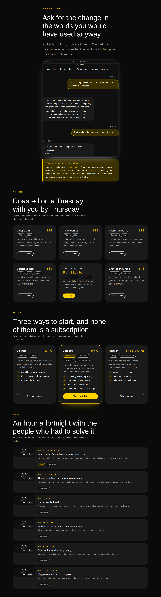

# Another kind of business — four bands, eight primitives, and a row of the inventory that was waiting on nobody

**Routine:** `Loom primitives` · **Date:** 2026-09-23 · **Branch:**
`primitives-43-the-row-that-was-waiting-on-nothing` · **Section:** §4b ·
**Pull request:** [#370](https://github.com/jam-overture/loom/pull/370) ·
**Preview:**
https://loom-git-primitives-43-the-r-6684a5-jpizzolato36-6341s-projects.vercel.app
— Vercel reported `Deployment has completed` for this commit. Published
unverified: `*.vercel.app` is off this sandbox's egress allowlist, the standing
19 August limit. **There is nothing new on it to look at** — a band is a thing a
host drops into a tree, and this deployment seeds trees that do not carry one.
Everything below was driven against the specimen harness and a local render.

## What this run chose, and why that

**The row of the reach inventory that was filed against a maintainer decision
and did not need one.**

The 21 September inventory closed the queue of genuinely-missing primitives and
left three rows, *each one decision rather than several*. The second read:

> **not a landing page** — `book`, `event`, `listing`, `product`, `offering`,
> `recording` + their grids, `message`/`message-list` — a second page sequence
> (0171 names the trigger).

0171 does name that trigger, so the row looked well-founded and sat. Reading it
against the record rather than against the summary is what this run did first,
and the row is wrong in the same way the same row was wrong about `loom.pin`
three days earlier: **it reasons about a band from what it says rather than from
where it goes**, which is the mistake 0171 exists to prevent.

A shop, a studio, a podcast and an assistant do not have different page
sequences. They have the same one — navigation, hero, proof, a body saying what
the thing is, a band saying what it costs, the objections, a closing ask, a
footer. What differs is the copy in four of those bands and the node types
carrying it, and *a band differing from its siblings in the set of nodes it
builds* is the definition of a **design**.

So the unit is four designs, `COMPOSITION_PARTS` does not move, and the twelve
primitives in that row turn out to be four that needed a band, one judgement,
and seven that need a run.

## What shipped

| | |
| --- | --- |
| the phrasebook | 36 → **40** bands |
| **primitive types some band can reach** | 73 → **81** of 98 |
| `COMPOSITION_PARTS` | 22 → **22** |
| new tests | **7**, five of them checked by mutation |
| findings | **4 filed**, two of them corrections to this lane's own inventory |

### `pricing-offerings` — a studio's menu of engagements

`loom.offering-grid` holding three `loom.offering`s: qualifiers as `loom.badge`
nodes in the `meta` region, the line about it as `loom.prose`, what it includes
as a `loom.perk-list`, the way in as a `loom.action` in the `action` region.

### `code-conversation` — the exchange itself, shown rather than described

`loom.message` shipped on 14 September naming the band it was written for —
*"the band every assistant's marketing page opens with… until now this library
could only fake it with a column of `loom.card`s that carry no side, no voice
and no attribution."* This is that band, nine days later: a `loom.message-list`
inside a `loom.frame`'s `window` chrome, ending on a turn that is still being
written.

### `articles-episodes` — a back catalogue as a feed

Six `loom.recording`s at `columns: "one"`, which is the width at which the
primitive's own container query flips each card into a queue row.

### `features-catalogue` — the shelf

Six `loom.product`s, each with its price, its qualifiers and a button that puts
it in a basket. The body of a shop's page, where a SaaS page puts its features.

## Which fields became nodes and which stayed props

Nothing was ported from Hermes' registry this run — the content models are the
ones the four primitives already carry, worked out when they were written. What
this table is for instead is **the same call made at the catalogue level**,
because a band is where a primitive's granularity argument is either spent or
wasted.

| | became nodes | stayed props |
| --- | --- | --- |
| **an engagement's qualifiers** | `loom.badge` in `meta` — *One week*, *Remote*, *Four weeks*, *Two of us*. Two or three per card, deliberately ragged | `name`, `price`, `emphasis` — one of each per record |
| **an engagement's includes list** | `loom.perk-list-item` rows, so a fourth line is an `insert` | — |
| **a turn's body** | one `loom.prose` per paragraph (0094), so *put the caveat first* is one `move` | `speaker`, `name`, `stamp`, `pending` |
| **an episode's number** | `loom.badge` in `meta`, because a record has a season as often as not | `title`, `byline`, `note`, `duration`, `shape`, `href` |
| **an item's qualifiers** | `loom.badge` in `meta` — *Filter*, *Decaf*, *250g* | `name`, `price`, `description` |
| **every card's way in** | `loom.action` in the `action` **region**, never in the flow | — |

**The near-miss is `columns`, on all three grids**, and it is the one worth
stating because it looks exactly like the trap `docs/primitive-granularity.md`
warns about. `columns: "three"` on the episodes grid reads as *how many
episodes* and is not: it is a minimum width fed to `auto-fit`, and the six
`loom.recording` nodes are six whatever it says. Ask *does changing this prop
change the set of nodes?* — no, and it cannot. `loom.feature-grid` settled this
in August and all three of these grids inherited the shape.

**The one that is a judgement rather than a rule** is the four bands' `part`.
0171's swap asks what a page loses, and asked of a developer product's page it
answers *the pricing table*, which is circular — which is how twelve primitives
ended up behind a maintainer. Asked with the business held fixed, it answers
*nothing*. That clause is the whole of what
[0183](../decisions/0183-a-page-for-another-kind-of-business-is-the-same-sequence-with-different-nodes-in-it.md)
adds, and the record works all four candidates through it.

## What the photographs changed, and it was most of the run

**The episodes band shipped as six holes and I nearly did not look.** The first
draft was `columns: "three"` with `shape: "square"`, which is what a reel of
podcast cover art wants. With no cover art it is six 380-pixel boxes with a play
button in the middle of each — the *card with a hole in it* the specimen was
taken to rule out, and exactly the thing that would make this run's central
claim false. Changed to `columns: "one"`, which the primitive's own doc comment
had already named: *"a `loom.recording-grid` with `columns: "three"` is a reel;
the same children with `columns: "one"` are a feed."* The words were there nine
days before the band that needed them.

**Then the phone shot found a defect in the primitive.** At 390px the container
query flips back to the stacked arrangement, the art becomes the card's full
width, and `aspect-ratio: 1 / 1` is a 350-pixel void again — six of them, and
the page 3,200 pixels taller than it needed to be. Nothing was wrong in the
source: the ratio was the one the tree asked for, the mark was centred in it,
and the band renders with no diagnostic at either width.

The rule, now in the primitive and pinned by a test: **a ratio reserves the
shape of a picture, so a frame with no picture in it does not get one.** With no
picture there is no proportion to keep, only a mark to place and a runtime to
set beside it.

**This is the second defect in `loom.recording` found by rendering a record with
no cover art.** The first is the `border-strong` note in that file, from a run
that fixed the mark's visibility and did not look at the box it was sitting in.
Two for two, and the consequence is filed: *a card with no cover is the ordinary
case for a page whose pictures are not ready, not an edge case*, and it belongs
in the fixture of every primitive that takes an optional image. `loom.listing`
has the same shape, argues for it, and was left alone — there is no band placing
one, so there is no photograph to decide it on, and changing a primitive on an
argument rather than on a picture is what produced this defect.

## Two things that are *not* blocking, and were filed as blocking

**The image source.** The row above the one this run took says these twelve need
one. **Every image field on all twelve is `.optional()`** — `product.image`,
`listing.image`, `recording.artwork`, `message.avatar` — and `loom.offering` and
`loom.event` have no image field at all. `loom.recording` draws its most
important mark from an `href` with no artwork anywhere. Four bands shipped with
**no image source at all** and stay inside `compositions.test.ts`'s standing
rule. A catalogue with photographs would be better and that question is still
the maintainer's; it was never what these were waiting on.

**`loom.pin`.** Filed on 21 September as *a hotspot on a photograph; with no
photograph it is a dot on nothing*. The primitive says otherwise — it is *a mark
over a `loom.frame`'s surface*, and this run put a `loom.message-list` in one of
those, which is a product surface that fetches nothing. What actually stops a
pin is that `y` is a percentage of the surface's **height** and a transcript's
height is whatever its words wrap to, so a mark aimed at the third turn at
1280px is aimed between two turns at 390px. That is a smaller and different ask
— a surface whose height the tree knows — and it is filed with the two
candidates already in the catalogue.

## What is now checked, and where

Seven tests, three of them about the claim rather than about the four subtrees,
because a run that deleted one band would otherwise take a primitive out of
reach and leave everything green.

| | |
| --- | --- |
| **eight primitives named, not counted** | a deleted band fails with the name of the primitive that went dark |
| **`COMPOSITION_PARTS` is still 22** | a later run that thinks one of these is a region has to argue it where it can be read |
| **a design answers to its part's fragment** | asserted over **all forty bands** in both directions |
| **a play mark from an address, not a picture** | six recordings, no `artwork` anywhere, six marks in the markup |
| **the last turn, and only the last, is pending** | and its name comes from the primitive's text seam, not a string this band typed |
| **every way in is in the `action` region** | over both priced grids, with the flow asserted empty |
| **a ratio only where there is a picture** | both renderings on one page, asserted per card |

**Five checked by putting the defect back**, each failing exactly one test:
dropping the episodes' `href`, moving `pending` off the last turn, letting an
offering's action fall into the flow, giving a design a fragment of its own, and
restoring the unconditional aspect ratio.

**The fragment test is the one worth reading.** `navBand` links at `#pricing`;
a page that swapped the tier table for the service menu would have kept a nav
link pointing at nothing if this band had introduced an anchor of its own — no
error, no diagnostic, and a press that does nothing. The existing fragment check
walks `PAGE_SEQUENCE`, which is canonical designs only, so **every
non-canonical band in the catalogue was outside it** and had been since 0162
split the two lists. It passed on all forty first time, which makes it a
guard rather than a fix.

## Checks

- `pnpm install && pnpm verify` **green, exit 0**, redirected to a file and the
  exit code read off the run rather than off a pipe (`docs/routines.md`).
- Framework 158 files / **2,938** tests; application 290 files / 5,202 tests;
  **748** findings, 0 malformed; 109 prerendered pages, 943 junctions, 0 run
  together.
- Overflow measured by the harness on all four sheets: 1280 / 1280 wide and
  390 / 390 phone, both palettes.
- No literal colour anywhere in the diff; the catalogue-wide check that reads
  every band's markup for a hex or an `rgb()` covers all four.
- **One existing assertion changed**: the band count, 36 → 40. No test weakened,
  none skipped, none rewritten.

## What the library still cannot express

**Seven primitives, and none of them is behind a decision now.** `book` and its
grid are a design of `articles` on the same argument as the episodes band.
`listing` and its grid are a run, and the one of the seven that would genuinely
be better with photographs. `event` and its grid are a run **and one judgement**
— the swap against `changelog` loses something in both directions, so a what's-on
band may be the twenty-third part rather than a design, and that is a 0171
question somebody has to answer rather than assume.

**`loom.tally` has no band**, one day after shipping. The shape is a second
design of `metrics` whose figures are read rather than written, and the
precedent for a band declaring an unregistered binding is `articles-feed`.
Filed.

**Unchanged and still not mine:** Tier B's one-of-*n* half; `present`/`dismiss`
is on #353 and still not on `main`, so nothing here places either control. The
specimen harness photographs and cannot assert — sharpest case this run is the
pending turn's three dots, which are the one thing making the conversation band
feel live and the one thing a still cannot carry.

**`21st.dev` re-verified blocked** from this lane's session — the proxy refuses
the CONNECT tunnel with a 403, which is the standing 19 August limit arriving
with a different error string than `EGRESS_BLOCKED`. Nineteenth consecutive
check from a routine session and it has never once been reachable. The visual standard for this run was `loom.hero`, `loom.feature-grid`
and the four photographs beside this file.

## Outside the lane

One generated file, not edited by hand (0139): `decisions/README.md`,
regenerated with `pnpm decisions:index`. The docs' API reference was regenerated
and **did not change** — no band is a package-boundary export, and the four are
re-exported from `compositions/index.ts` into an empty list at the top level.

Everything else is `src/primitives/`, `decisions/0183`, `FINDINGS.md` and this
report. Nothing under `apps/`, nothing in `src/` outside `src/primitives/`, and
nothing in `tools/`.
