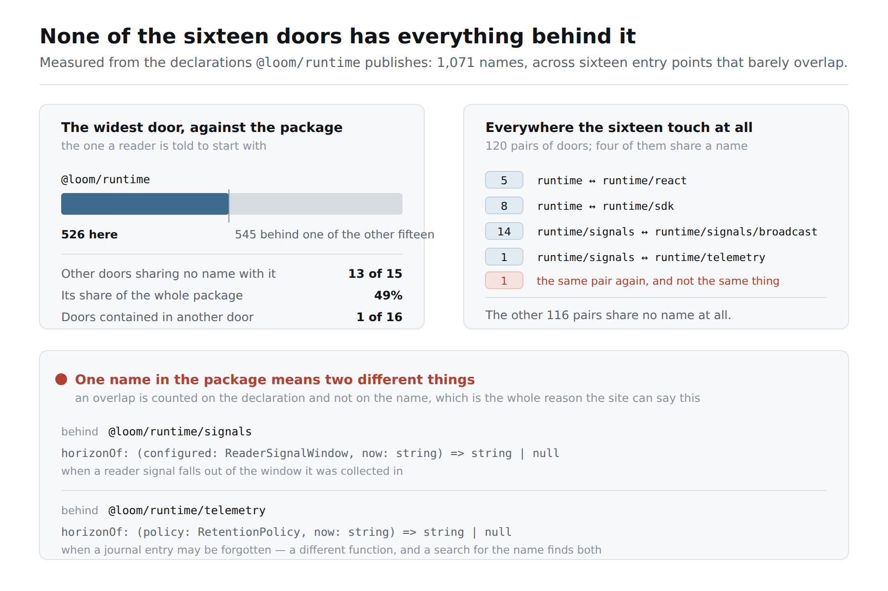
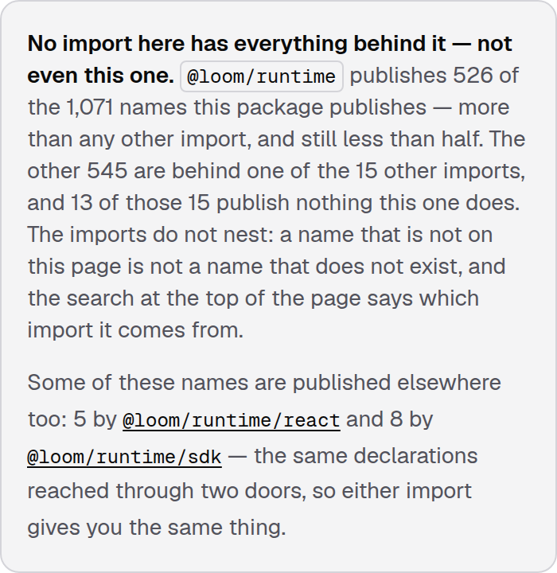
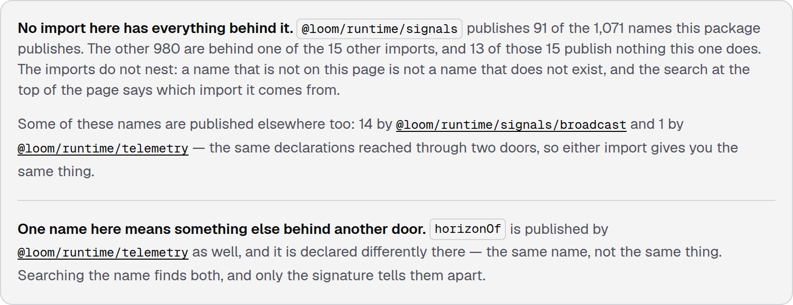
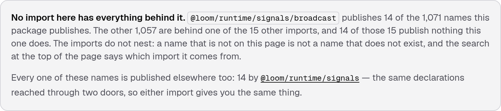

# 24 September 2026 — none of the sixteen doors has everything behind it, and the site had never said so

**Routine:** `Loom docs` · **Branch:** `docs-34-none-of-them-has-everything` · **Section:** §4c

**Preview:**
<https://loom-git-docs-34-none-of-the-eb0289-jpizzolato36-6341s-projects.vercel.app>
— published unverified, as every routine run's is: `*.vercel.app` is off this
sandbox's egress allowlist and the proxy answers `403 CONNECT tunnel failed`.
That is the standing 15 September finding and is not re-filed. Everything
measured below is a production build (`pnpm build && next build && next start`),
fetched over real HTTP and driven in Chromium.

## What this run was

The strongest item on the last three reports' *what I would write next*, and it
was put there by a table I did not expect: **the sixteen doors barely overlap,
and no page said so.**

## The plain version

A package with one short import and fifteen longer ones teaches a reader
something before it says anything. The short one is the library; the longer ones
are slices of it, kept separate as a convenience. That is how almost every
package a reader has used is built, and nothing on this site contradicted it.

Loom is not built that way. `@loom/runtime` is the largest of the sixteen doors
and publishes **526 of the package's 1,071 names** — less than half. Thirteen of
the fifteen others publish **not one name it does**. There is no import with
everything behind it.

A reader holding the ordinary belief looks for a name behind the root import,
does not find it, and concludes the name does not exist. Every reference page
now says otherwise, in its own numbers:

> **No import here has everything behind it — not even this one.** `@loom/runtime`
> publishes 526 of the 1,071 names this package publishes — more than any other
> import, and still less than half. The other 545 are behind one of the 15 other
> imports, and 13 of those 15 publish nothing this one does. The imports do not
> nest: a name that is not on this page is not a name that does not exist, and
> the search at the top of the page says which import it comes from.

## What the measurement found that I had not planned for

Counting the overlaps on the **declaration** rather than on the name — which is
the rule yesterday's narrower-door band established, for a hypothetical reason —
turned up that the hypothetical is real.

`horizonOf` is published by two doors and is **two different functions**:

| door | declaration |
| --- | --- |
| `@loom/runtime/signals` | `horizonOf: (configured: ReaderSignalWindow, now: string) => string \| null` |
| `@loom/runtime/telemetry` | `horizonOf: (policy: RetentionPolicy, now: string) => string \| null` |

It is the only such name in 1,071. The other thirteen shared names are one
declaration reached through two doors, where a reader can take either import and
get the same thing — which is exactly what a reader would assume about this one.
The site's search indexes every published name with its import beside it, so
searching `horizonOf` returns two results that look like one export offered
twice, and nothing in the results says otherwise.

So both pages now carry a line about it, and it is filed for the lane that owns
`src/` as a thing the documentation can describe and not repair.

## Three sentences, and each one is measured rather than assumed

The band is not one sentence with numbers dropped into it. Each clause is a
different measurement, and the ones that look like editorial judgements are the
ones that most needed to be:

**"— not even this one"** appears only on the door that publishes more names
than any other. On the fifteen smaller pages the heading is the plain *No import
here has everything behind it*, because a reader standing at `@loom/runtime/cli`
was never at risk of the belief that page would be correcting.

**"and still less than half"** is printed only when it is true — when twice what
this door publishes is less than the package's total. It happens to be true of
the root door today at 49%, and a run that hard-coded the clause would have the
page saying it at 51%.

**"Every one of these names is published elsewhere too"** replaces *Some of
these names* when another single door publishes this door's whole surface.
`@loom/runtime/signals/broadcast` is that page: all fourteen of its names are
behind `@loom/runtime/signals` as well, and it is the one door of the sixteen
that **is** a slice of another one.

That last one is why the heading says what it says. The first draft read *This
import is not part of a bigger one* on every page that was not the widest — a
sentence that is false on exactly one of the sixteen, and false on the page
where a reader is most likely to be comparing two imports.

**"not one of those imports publishes a single name this one does"** replaces
the count when the count would be *15 of 15*. Eleven of the sixteen doors are in
that state, and reading *15 of those 15* is arithmetic a reader has to do before
they can hear the sentence.

## Why it is on every page, when the band above it is not

Yesterday's narrower-door band prints nothing on the fifteen pages that have
nothing to say, and the two bands around it announce an empty result. This one
is on all sixteen, and the difference is not consistency — it is who is
wondering.

The install band and the prose band answer questions a reader **arrived with**;
a reader shown no band cannot tell a checked answer from a site that never
looked. The narrower-door band teaches an idea a reader has **not met**, so
printing it where it has nothing to say would be noise.

This one **unteaches** an idea a reader is likely to have arrived with — and
which of the sixteen pages they arrived at is not knowable from here. It is
absent only from a shape the package cannot take: a door in a package that has
no other door, and a door that publishes the whole package. Both are guarded and
both have a test, because a generated page prints its sentence for years.

## What shipped

**`_lib/api/standing.ts`** — the measurement, new. Whole-reference rather than
per-page, for the reason `narrower.ts` is: how much of a package is behind one
of its doors is a fact about all sixteen, and the first of them cannot know it.
Pure over surfaces, so the tests state a package's shape rather than arranging
for one to exist.

**`_lib/api/model.ts`** — `ApiStanding`, `ApiOverlappingDoor`, `ApiNameCollision`,
and `ApiEntry.standing`.

**`_lib/api/narrower.ts`** — `surfaceOf` now takes `Pick<ApiEntry, "groups">`
rather than a whole entry, which is all it ever read. One line; it is what lets
the new measurement reuse it rather than write a second definition of what a
door publishes.

**`_lib/api/extract.ts`** — a third pass, beside the narrower-door one.

**`_lib/api/reference.ts`** — checked on the way in, as everything else in it is.
Three checks are worth naming, and the first is the one that earns its place: **a
standing that says the package publishes fewer names than this door does stops
the build.** That is the shape an unfilled pass leaves behind, and it would
render as *publishes 526 of the package's 0 names* rather than crash. The others
refuse a door listed as an overlap that overlaps in nothing, and a count of
doors-sharing-nothing larger than the number of doors.

**`_components/api-reference.tsx`** — the band, between the narrower door and
the prose links.

## Decisions taken that were not specified

**No decision record.** Nothing here constrains anything outside this route
group, no Accepted record is touched, and the change is the §4c rule applied to
a fact the reference did not previously carry. Same call as the five runs before
it.

**Distinct names, not the sum of the doors.** The sixteen publish 1,100 export
slots and 1,071 names; the 29 difference is names published twice. Adding the
rail's counts up is the arithmetic a reader would do by hand, and it is wrong.

**A shared name is counted on its declaration.** Above — and it is the half that
found `horizonOf`.

**Ties are all widest.** Two doors publishing the same largest number of names
are both true answers to *is there a bigger one*, and picking one of them would
be picking by the order `package.json` lists its conditions in. No tie exists
today, so this costs a reader nothing and is held by an invented test.

**Numbers over a thousand are grouped**, fixed to `en-US`. The whole force of
the sentence is a ratio and a reader takes both numbers in at a glance; a number
formatted by the reader's locale would be a hydration mismatch rather than a
courtesy.

**The band repeats one number the narrower-door band already gave.** On
`/docs/api-reference/signals` both say *14*, from different sides — one
recommending an import, the other doing arithmetic that has to add up on its
own. Suppressing it in the second would leave *13 of 15 publish nothing this one
does* unreconcilable with the list beneath it.

## Tests

`pnpm install && pnpm verify` at the repository root: **green, exit 0**, read
from a log file rather than through a pipe.

| | `main` at `b2a5176` | this branch |
| --- | --- | --- |
| `@loom/runtime` | 159 files / 2,999 tests | **159 / 2,999** — `src/` was not opened |
| `@loom/app` | 300 / 5,392 | **301 / 5,432** |
| findings ledger | 766 entries, 0 malformed | 769, 0 malformed |
| prerender | 109 pages, 957 junctions, 0 run together | 109, **1,206**, 0 |

**+40 tests, two new files**, none weakened, nothing skipped. The 249 new text
junctions are the band's own sentences on sixteen pages: `prerender:check` reads
every place a JSX expression sits beside a word and fails where they run
together, so the 20 September finding about exactly that defect guards every
clause of this band on every door. The `main` figures were
measured on this machine in a worktree at `origin/main`, not carried over from
another run's report.

Green is not evidence, so **eleven mutations were introduced one at a time**:

| what was broken | what went red |
| --- | --- |
| the package total is the sum of the doors, not the distinct names | 2 — including the regeneration check |
| an overlap is counted on the name alone | 5 — both collision tests, the mixed case, the ordering test, the regeneration check |
| every shared name is called a collision | 3 |
| only the first door holding the largest surface is widest | 1 — *is every door that ties for it* |
| a door is measured against itself as well | 8 |
| the lists come back in the order the doors were declared | 1 — *names every door that has it* |
| a reference claiming a package smaller than one of its doors is accepted | 1 |
| a door listed as an overlap that overlaps in nothing is accepted | 1 |
| the band renders on a package with one door | 3 |
| the overlap says *every one of them* whatever the count | 1 |
| the band comes before what a reader must install | 1 |

Nothing survived. **Two results are worth reading rather than counting**, and
both say the same thing about what the real package can and cannot prove.

The tie mutation and the sort mutation each killed exactly **one** test, and in
both cases it was an invented one. The assertions against the sixteen real doors
did not notice: the root door is both the widest and the first listed, so
"widest" and "first" are the same answer today; and the doors that overlap are
already in specifier order, so removing the sort changes nothing until the
package does. Those are the two mutations a run that tested only against Loom's
own package would have shipped.

Files were restored from byte-for-byte copies rather than with `git checkout`,
which is the 16 September finding, and `diff` against the copies is empty on all
three.

Beyond the unit tests, four pages were fetched from a running production build
and their HTML read: the band present on every one, with the numbers above, and
the collision line present on `/signals` and `/telemetry` and nowhere else.

## Scope

`apps/loom/app/(docs)/` only, plus `FINDINGS.md` and this report. Fourteen files
under `(docs)`: two new — `_lib/api/standing.ts` and its test — and twelve
touched. Five of the twelve are the change itself (`model.ts`, `narrower.ts`,
`extract.ts`, `reference.ts`, `_components/api-reference.tsx`), one is the
regenerated `reference.generated.json`, two gained tests (`extract.test.ts`,
`api-reference.test.tsx`), and three are one-line fixtures in `mentions.test.ts`,
`offered.test.ts` and `narrower.test.ts` that gained the new field.

**No file in another lane was opened.** `git diff main -- src/` is empty. The
generated reference's diff is **purely additive**: one `standing` block on each
of the sixteen entries and **not a single deleted line** in the whole file, so
no name, signature, kind, summary, requirement or narrower door in it moved.

## At 390 pixels

`scrollWidth 390 / innerWidth 390` on `/docs/api-reference/runtime`. The band is
prose in a bordered box, so it wraps like prose; the two import specifiers in it
are links inside a sentence rather than rows of their own.

Yesterday's phone finding — the orphaned `s` in `@loom/runtime/signal` / `s` in
the page's largest type — is **still there and still not fixed**, for the reason
it was filed: the remedy is a `<wbr/>` at each slash, which is a junction
`prerender:check` reads, and it belongs to a branch about the heading rather
than one about the other fifteen doors. It is the smallest open thing this lane
owns.

## Found while writing

**The reference has sixteen pages and no front door.** `/docs/api-reference` is
not a page; the rail is the only place the sixteen are seen together. That was
fine while each page described one door. It stopped being fine this run: every
page now tells a reader most of the package is elsewhere, and the only thing it
can offer them next is the search box — which answers *where is this name*, and
a reader who has just learned they are looking at a third of what they came for
does not have a name yet. Filed, with the two things that have to be decided
before it is written.

**A build reported success and served the previous build's HTML.** The grouped
`1,071` was in the source, green in its unit test, and absent from the page the
screenshot harness photographed; `rm -rf .next` and a rebuild fixed it. The
suspect is a `next build` this run killed a minute earlier, and that is not
established — what is established is a **false green**, which is the same
directory as the 23 September stale-`.next` finding causing the opposite
symptom. Filed for the shell's lane, with the workaround that works.

**Filed — three.** Two above, and `horizonOf`.

**Closed — none.** Today's work was the reports' own queue rather than the
findings ledger's.

**Not re-filed:** the preview URL cannot be verified from this sandbox (15
September); the screenshot harness photographs an address while the theme lives
in `localStorage`, so the page pictures are light (14–16 September); and the
phone heading break (23 September) is named above rather than filed again.

## What I would write next

- **The front door for the reference**, above. It is the first thing on this
  list for the first time — the last three reports had the nesting page there,
  and this branch is it.
- The `<wbr/>` at each slash in the entry-point heading. Small, filed, and the
  oldest cosmetic thing this lane owns.
- The arrival route on *Introduction* describes six steps beginning at
  *Installation* and does not acknowledge a reader who arrives having already
  run the quickstart. One paragraph in `_lib/arrival/route.ts`. Unchanged from
  the last five reports, and it is the oldest thing here.

---

## Postscript — the merge moved the numbers, and that is the point

`Loom merge` merged `main` into this branch at 16:02 UTC and regenerated the
reference, picking up #378's probe exports and #379's file count, then landed
#382 at 16:12 before this note could ride it — so it arrives on its own branch,
which is why it is a postscript and not a paragraph above. Everything above was
measured against `main` at `b2a5176` and is left as it was written; this is what
the site says now, on `main` at `6a0f4c1`:

| | measured at `b2a5176` | on the merged head |
| --- | --- | --- |
| names the package publishes | 1,071 | **1,077** |
| behind `@loom/runtime` | 526 | **527** |
| other doors sharing nothing with it | 13 of 15 | 13 of 15 |
| doors it overlaps | react 5, sdk 8 | react 5, sdk 8 |
| names meaning two things | `horizonOf`, 1 of 1,071 | `horizonOf`, 1 of 1,077 |
| doors contained in another | 1 of 16 | 1 of 16 |

**Nobody edited a sentence and every page is still true**, which is the §4c rule
working rather than a thing to note in passing: six exports landed in `src/`
from another lane, and sixteen pages changed what they say about the package
without a word of prose moving. A hand-written *"526 of 1,071"* would now be
wrong on every one of them and nothing would have gone red.

`pnpm install && pnpm verify` on `1020611`, which is the tree that merged:
**green, exit 0** —
`@loom/runtime` 159 files / 3,029 tests, `@loom/app` **302 / 5,445**, 779
findings 0 malformed, 109 prerendered pages / 1,208 junctions / 0 run together.
Every hard-coded assertion in this branch's tests survived the merge, because
what they assert is the package's *shape* and the merge changed its *size*.
