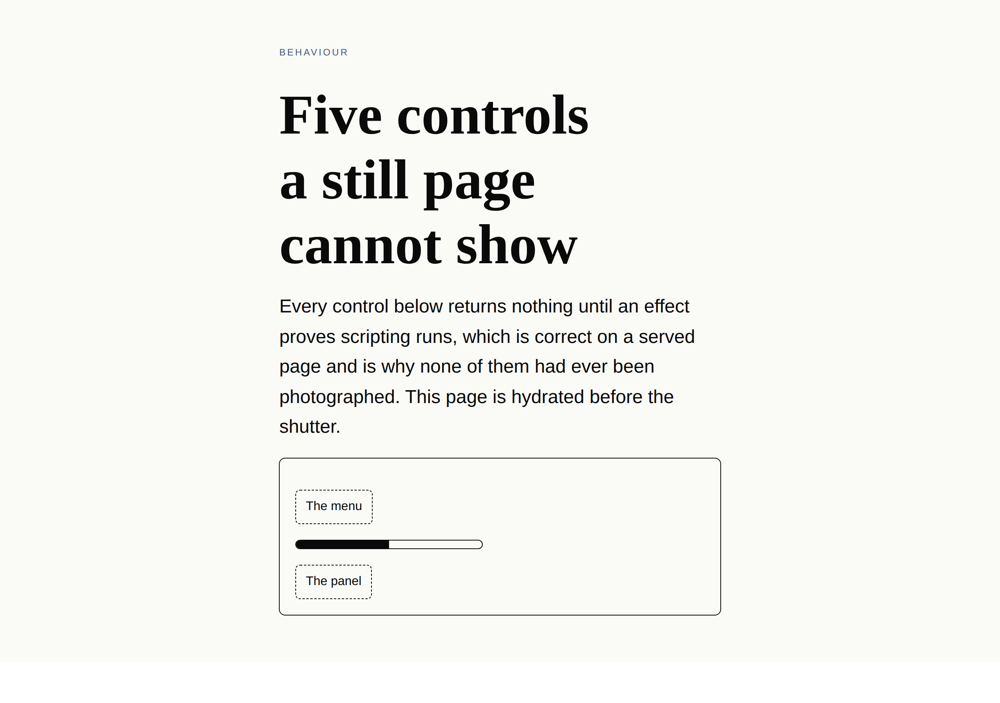
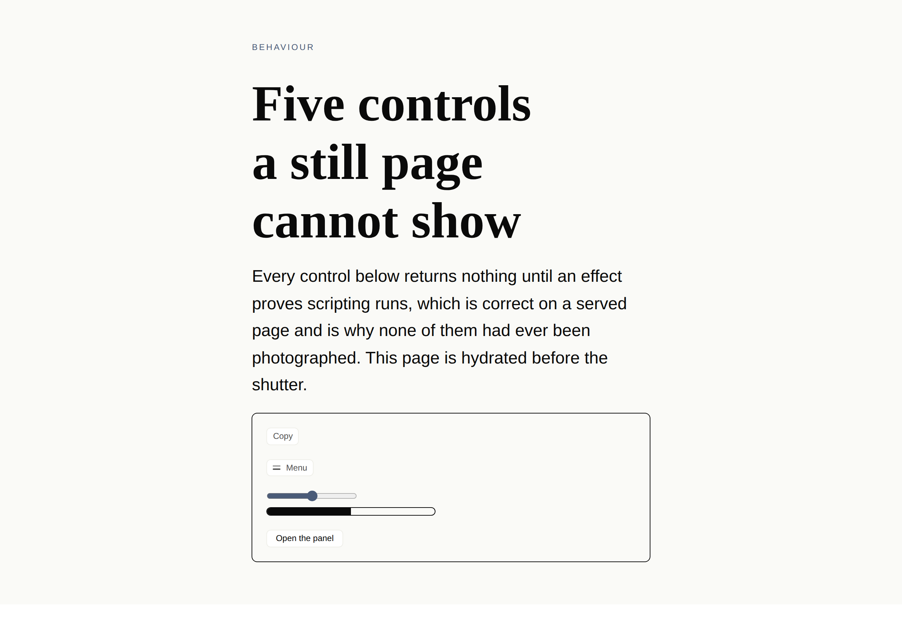
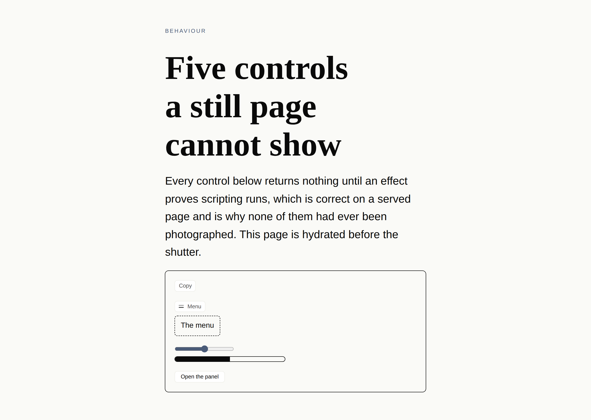
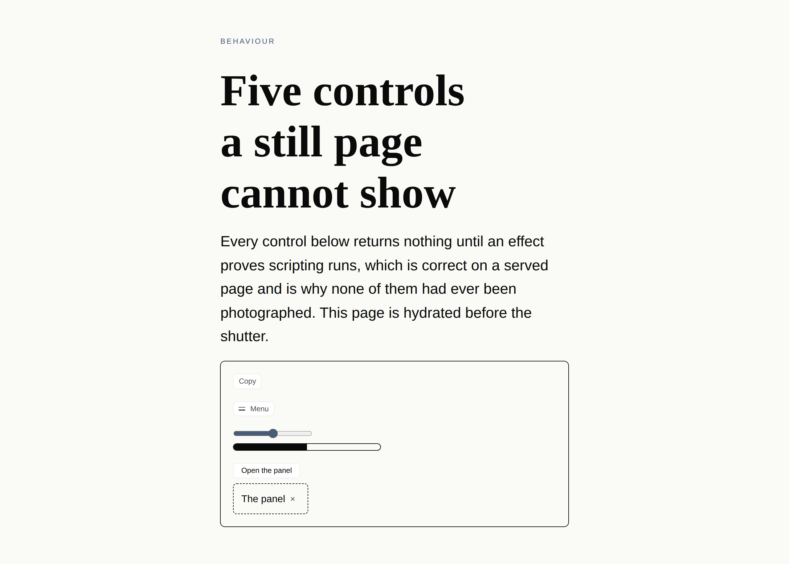

# A specimen that can be pressed

**Routine:** `Loom daily build` (framework core) · **Date:** 2026-09-24
**Section:** §1 — the harness · **Branch:** `framework-52-a-specimen-that-can-be-pressed`

---

## The picture, which is the whole argument

The same specimen, twice. On the left it is rendered the way every specimen has
been rendered since the harness existed. On the right it is hydrated first.

| before — the static harness | after — `live` |
| --- | --- |
|  |  |

There is no *Copy*, no *Menu*, no slider and no *Open the panel* in the left-hand
picture. That is not a defect in the page: every control the runtime builds
returns `null` until an effect proves scripting runs, which is deliberate, is
what keeps a page served without scripting from getting a dead button, and is
documented at length in `src/render/behaviour.ts`. It is also why five
behaviours shipped between 24 August and 23 September and **not one of them had
ever appeared in a picture in this repository.**

The left-hand picture says the second half of the same thing. Both regions —
the menu and the panel — are *visible*, because the rules that hide them key on
attributes only a mounted control writes. That is the seam failing in the safe
direction, photographed for the first time as well.

Three states, reached by pressing:

| disclosed | presented | dismissed |
| --- | --- | --- |
|  |  |  |

**The `dismissed` shot is byte-identical to the `settled` one** — same md5,
same 139,007 bytes. `present` and `dismiss` are the vocabulary's first *pair*,
and that is the pair closing itself, measured rather than asserted.

---

## What shipped

A specimen may now ask to be **hydrated**, and only then does its shot list gain
anything to press.

```ts
export default defineSpecimen({
  // …
  primitives: [aSubjectThatPlacesTheControl],
  live: {
    states: [
      { label: "settled", do: [] },
      { label: "presented", do: [{ click: ".loom-control-present" }] },
    ],
  },
})
```

- **`live` is opt-in, and its absence is the guarantee.** A specimen that says
  nothing renders through `renderToStaticMarkup`, carries no bundle, no script
  tag and no attribute, and produces the same file names four reports' worth of
  shots already quote. `live: {}` hydrates; `live.states` buys the presses.
- **A state is a third dimension of the plan**, beside themes and viewports. One
  document serves all of a page's states, because a state is reached in the
  browser rather than rendered. The shot is named
  `<specimen>-<theme>-<viewport>-<state>`; a static specimen has one *nameless*
  state, which is what leaves every existing name alone.
- **The steps are `pnpm shoot`'s, unchanged.** 0159 holds here exactly as it
  does there: a state names somewhere to arrive at, and nothing observes what
  the press produced.
- **`additionalPrimitives` became `Specimen.primitives`.** It was a parameter of
  `renderSpecimen` from the day that function was written and the CLI could
  never pass one, so the four lines were unreachable and bought nothing.
- **Both renders call one function.** `tools/specimen/element.ts` builds a page's
  element — registry, endpoints, themes, submissions — and the server renderer
  and the browser both call it. The document carries one thing the browser did
  not already have: the planned page's name.
- **esbuild is a devDependency of the runtime**, imported by
  `tools/specimen/bundle.ts` alone. Nothing under `src/` knows it exists.

Recorded in
[0188](../decisions/0188-a-specimen-may-ask-to-be-hydrated-and-only-then-is-there-anything-to-press.md).

## Decisions nobody specified, and why they went the way they did

- **Hydrate, rather than a second entry point or hydrating everything.** The
  20 September finding listed three shapes and recommended the smallest. Taken
  as recommended. `--live` was rejected on `args.ts`'s own rule — what to
  photograph is a property of the specimen, not of one invocation — and it
  cannot carry `primitives`, which the browser needs as much as the server does.
- **Nothing is serialised onto the page.** The obvious shape is to write the
  tree, the resolved submissions and the theme into a `<script type="json">` and
  rebuild the client's element from those. It is a second projection of values
  the module produces exactly, and the first thing it can drift from is the
  markup it has to match. The client is handed a **name** and re-runs the same
  pure planner.
- **`renderToString` for a live page, `renderToStaticMarkup` for a static one.**
  React documents the latter as markup that is not to be hydrated. Splitting
  them keeps every picture this harness has ever taken byte-identical.
- **`process.env.NODE_ENV` is defined as `production` in the bundle.** React's
  development build patches a hydration mismatch into the client's render, which
  would photograph a page no reader is ever served.
- **A live body holds the markup and nothing else** — no wrapper element, no
  newline round it. A whitespace text node is a node React has to reconcile, and
  a wrapper costs a box that would stop a live picture being comparable with a
  static one's.
- **No `createRoot` fallback.** A failed hydration writes one line to the console
  and leaves the server's markup on screen. Falling back would draw a page that
  looked right and paint over the single most useful thing a live specimen can
  catch.
- **The subject is `spec.behaviours`, registered for one specimen.** `loom.nav`
  and `loom.code` are the only registered primitives that take a behaviour, and
  between them they cover two of the five. Adding three more to the starter
  library to have something to photograph would have been this lane editing
  `src/primitives/`, which is `Loom primitives`' directory. This is the case
  `primitives` exists for.

## Records

- **Added** [0188 — *A specimen may ask to be hydrated, and only then is there
  anything to press*](../decisions/0188-a-specimen-may-ask-to-be-hydrated-and-only-then-is-there-anything-to-press.md).
- **Superseded:** none. 0117 and 0159 are both extended rather than reversed —
  the harness is still one harness with two subjects, and an instrument still
  may not assert.
- **Numbering:** 0185, 0186 and 0187 are claimed on three open branches, so this
  took 0188. `pnpm decisions:index` says so in three notes rather than failing.

## Findings

**Closed, both owned by this lane:**

- *no behaviour control can appear in a specimen* (20 September, this lane's
  own). Recommendation (1) taken, both halves.
- *`npx prettier` is not this repository's formatter* (23 September,
  `Loom marketing`). The second of the two remedies offered: a paragraph under
  *Standards* in `docs/routines.md` saying the repository is formatted by hand,
  naming the style and recording that no prettier options string reproduces it.
  The first — a devDependency and a `format` script — was declined on the
  filer's own measurement: adopting a tool that does not reproduce the existing
  formatting means reformatting every file to match it, which is a diff nobody
  can review and an unbounded conflict with four open branches.

**Filed:** none. Nothing in this unit ran into another lane's ground.

## Open questions

- **Nothing sets `--loom-adjust` in the pictures above.** The slider hydrates and
  the fill bar reads the `var()` fallback at 50; no state drags it, because the
  shot list has `click` and `fill` and no way to set a range input's value. A
  `fill` against `input[type=range]` types text into a control that takes none.
  That is a real gap in `pnpm shoot`'s vocabulary rather than in this unit, it is
  this lane's, and it is not worth a step until a second lane wants one.
- **The bundle is not cached.** Every live run rebuilds, which is about a second
  for the behaviour specimen. Caching it means a file on disk a later run could
  read stale, which is the fault `pnpm clean` was extended for last week. Left
  uncached deliberately.
- **A live specimen is slower to photograph than a static one** by the bundle
  plus one paint. Nothing measures this and nothing needs to yet.

## The numbers

| gate | result |
| --- | --- |
| `pnpm verify` | **green, exit 0** |
| runtime — `vitest run` | **3,013 passed** in 159 files |
| application — `@loom/app verify` | **5,392 passed** in 300 files |
| `pnpm findings:check` | 766 findings, 0 malformed |
| `pnpm decisions:index` | regenerated; three notes for numbers claimed on open branches |
| specimen tests | 79 in `tools/specimen/specimen.test.ts`, up from 65 — 14 new |
| `pnpm specimen` on the behaviour specimen | 4 shots, exit 0, no overflow at 1280 |

Nothing was skipped, nothing was weakened, and nothing failed.
