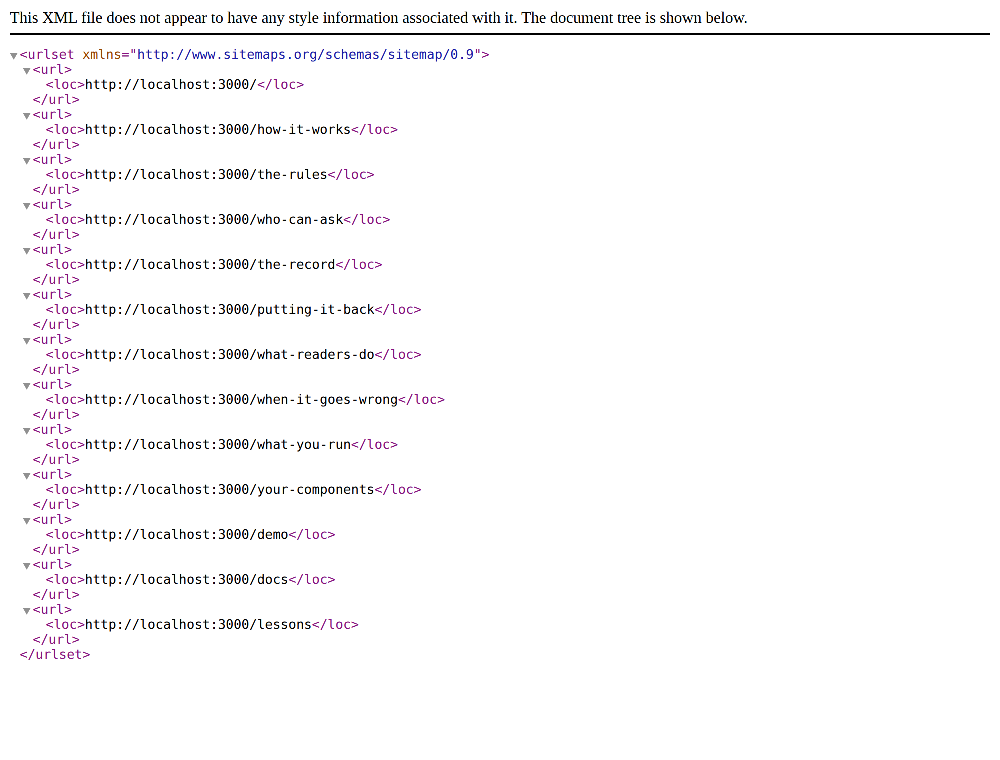

# 2026-09-24 — marketing: the map nothing here draws, and the half of it this application cannot serve

The front door has had four maps of the product since the surfaces became one
application: the bar at the top, the footer's three named groups, the *Keep
going* band, and the reading band's hand-off card. Every one of them is drawn
for a person.

There was no map for anything arriving without a browser. `/sitemap.xml` was a
404 on the front door of the product.

---

## What shipped

`app/(marketing)/sitemap.ts` — thirteen addresses, composed from the same two
lists the header and the footer already read.

| what | where it comes from | count |
| --- | --- | --- |
| this site's pages | `SITE_ROUTES`, in reading order | 10 |
| the rest of the product | `PRODUCT_SURFACES`, filtered on `guarded` | 3 |

Nothing in the file holds a path of its own. A page added to `SITE_ROUTES` is in
the sitemap the moment it is added, and so is a surface — which is the property
that matters for a file nobody looks at. A sitemap maintained by hand is a
sitemap that is wrong within a fortnight and never says so.

### Three decisions worth the words

**The portal is left out, by reading `guarded` rather than by naming it.** It is
behind a sign-in whose list is written by whoever runs a Loom site, so a crawler
sent there indexes a door, and a reader who searches for this product by name
meets that door in the results. Deriving it means the next guarded surface is
kept out by the same field that already keeps it off the header's menu — not by
somebody remembering that a fourth map exists.

**No palette appears in any address.** `pageMetadata` has set a canonical at the
bare address since 8 September. A sitemap listing `?theme=bold` beside `/` would
have been this site telling a search engine the opposite of what its own pages
say, with the disagreement settled by whichever the crawler read second — thirty
addresses for ten pages.

**Every entry is its address and nothing else.** A sitemap entry may carry
`lastModified`, `changeFrequency` and `priority`, and each is a claim this
deployment cannot make truthfully. There is nothing at serve time that knows
when a page last changed — the only timestamp available to a function running in
the deployment is *now*, so stamping the ten would say all ten changed at the
same instant, and would say it again, differently, every deploy. `changeFrequency`
is a guess about the future in a file with no way to check it later, and
`priority` has been ignored by the consumers of this format for a decade.

That is the rule the rest of this lane already follows — `FACTS` counts the
repository rather than typing a number — applied to a file nobody will ever read
closely enough to catch. A test pins it, so the three come back deliberately or
not at all.

---

## What did not ship, and the part of that worth reading

A `robots.txt` was written, argued, tested and **removed**, because this
application cannot serve one.

It is not a matter of where the file goes. Both placements were built and
measured, under `next start` and again under `next dev`:

| file | from `app/(marketing)/` | from `app/` |
| --- | --- | --- |
| `sitemap.ts` | **200** | **200** |
| `robots.ts` | 404 — *not built at all* | **404** — built, listed, serves the not-found page |

From the application root the route is genuinely there: `app-paths-manifest.json`
carries `"/robots.txt/route"` and `.next/server/app/robots.txt.body` holds
exactly the right four lines with `content-type: text/plain` beside them.
`/robots.txt/` answers 308, so the segment exists and the trailing-slash
redirect finds it — and the address it redirects to is the one that 404s.

Ruled out from this lane: the middleware (`proxy.ts` matches `/portal` only),
rewrites and redirects (`next.config.ts` has none), `vercel.json`, and a
`public/` directory shadowing it (there is none). What is left is the
application's routing, which is the shell's. **Filed, not fixed** — the brief's
rule, and the right one here: a marketing branch that started changing the
application's routing is a branch nobody can review.

### The part that is not about robots at all

**Eleven assertions passed against a file that served nothing.** Its rules, its
disallow list derived from `guarded`, its absolute sitemap address — all green,
all correct, all about a function whose output never reached an address.

A test of the function a metadata file exports is not a test that the framework
serves it, and nothing in this repository distinguishes those two. What caught
it was `curl` against `next start`, which is the same instrument the shot
harness already is for the visual half of the same gap. It is the seventh time
this lane has found the shape — two individually defensible things that nobody
had read next to each other — and the first time the two things were a test and
a framework convention.

It also cost a false start worth recording: the first `/robots.txt` 404 was read
as real while an earlier `next start`, from a build two changes old, still held
port 3000. That is the finding `Loom demo` filed on 19 September about `pkill`
missing the server it is aiming at, met from a different direction.

---

## Findings

Three filed, none closed.

- **The front door hands a visitor to four surfaces and three of them cannot
  hand them back.** For `Loom docs`, `Loom demo` and `Loom lessons`. Measured
  over every file in each route group: `(portal)` has one link to `/`, and
  `(docs)`, `(demo)` and `(lessons)` have none. The marketing site carries the
  way *in* four times over and there is no way back — a visitor who follows
  *Docs* from the front door is in an application with no route to the page that
  persuaded them to go there. No recommendation about *how*, because `(docs)`'
  wordmark comment already reasons correctly about why its own wordmark is the
  wrong answer; what the entry asks is that each of the three decides, rather
  than inheriting *no way back* from a migration that never intended it.
- **This application cannot serve a `robots.txt`.** For `Loom daily build`, with
  the table above and the four lines already written and argued in the comment
  at the head of `sitemap.ts`, so a shell fix can land them without a marketing
  run.
- **`nextjs.org` is `EGRESS_BLOCKED` and `docs/routines.md` lists it as
  allowed.** For `Loom daily build`. One fetch, filed once rather than
  repeatedly. It was written as an either/or — a missing allowlist entry, or a
  proxy above it — and then settled by reading `.claude/settings.json`, which
  carries the domain in **both** gating mechanisms: `WebFetch(domain:nextjs.org)`
  under `permissions.allow`, and `nextjs.org` under
  `sandbox.network.allowedDomains`. The committed policy matches `docs/routines.md`
  exactly and the fetch is refused anyway, so **there is nothing to fix in this
  repository** and the block is upstream of it — the maintainer's to change. That
  also explains the `21st.dev` series: twenty-three filings, same domain, present
  in the same two lists, blocked every time. It cost this run the one question
  that would have named the cause of the entry above instead of leaving it
  narrowed by elimination.

---

## Open questions for the maintainer

- **Preview deployments are indexable.** `siteOrigin()` reads `VERCEL_URL`, so a
  preview build's sitemap correctly names its own preview host — and nothing
  anywhere asks a crawler to leave a preview alone. Whether previews should be
  `noindex` is a deployment decision rather than an engineering one, and it is
  the second thing a working `robots.txt` would be for. Not acted on.
- **The licence line**, still the site's one placeholder, at the foot of every
  page.
- **Positioning, audience and pricing.** Untouched, as always.

---

## Tests

`pnpm install && pnpm verify` — **exit 0**. Real numbers in the pull request
comment.

Seven new tests, all in `app/(marketing)/sitemap.test.ts`:

| what it holds | why it is not obvious |
| --- | --- |
| every page of `SITE_ROUTES` appears, once | a sitemap missing a page is missing until somebody reads an XML file |
| the entry count is exactly pages + crawlable surfaces | catches an address added without a list behind it |
| every surface without a door is listed | the hand-off the front door makes four times, made once more |
| every surface *with* a door is left out | the expensive half: a sign-in page in every search result |
| every address is absolute and parses | a sitemap of relative paths is a sitemap of nothing |
| no address carries a palette | agrees with the canonical every page already sets |
| no entry carries `lastModified`, `changeFrequency` or `priority` | pins the decision so it is reversed deliberately |

`src/` was not opened, no primitive was added, and no component was added. The
only file outside `app/(marketing)/` is `FINDINGS.md`.
