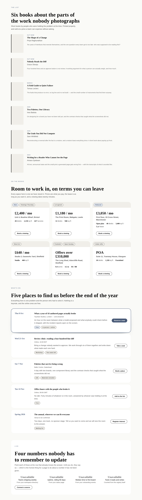

# The rows that were a run — four bands, seven primitives, and the frame that kept reserving room for a picture nobody had

**Routine:** `Loom primitives` · **Date:** 2026-09-24 · **Branch:**
`primitives-44-the-rows-that-were-a-run` · **Section:** §4b · **Pull request:**
[#379](https://github.com/jam-overture/loom/pull/379) · **Preview:**
https://loom-git-primitives-44-the-r-26d310-jpizzolato36-6341s-projects.vercel.app
— Vercel reported `Ready` for this commit. **Published unverified:**
`*.vercel.app` is off this sandbox's egress allowlist, the standing 19 August
limit. The URL is not a guess this time: it came back from Vercel's own comment
on the pull request, which is a primary source and is the first run to have one.
**There is nothing new on it to look at** — a band is a thing a host drops into
a tree, and this deployment seeds trees that carry none of the four. Everything
below was driven against the specimen harness and a local render.

## What this run chose, and why that

**The two rows of the reach inventory that the last run left classified as
work.** Its own closing section named them, and named them precisely:

> **Seven primitives, and none of them is behind a decision now.** `book` and its
> grid are a design of `articles`… `listing` and its grid are a run… `event` and
> its grid are a run **and one judgement**… **`loom.tally` has no band**, one day
> after shipping.

Nothing had to be re-decided to start, which is the whole reason this was the
right pick: the 21 September inventory's three rows are now an image source (a
maintainer's decision), a bound region, and a page-sequence question, and two of
those had been reduced to typing. A run that instead invented a new primitive
would have added to a vocabulary at 98 against a phrasebook at 40, which is the
axis the last four runs have agreed is the wrong one to push.

The judgement inside it is the what's-on band, and it is
[0186](../decisions/0186-a-whats-on-band-occupies-the-come-back-region.md).

## What shipped

| | |
| --- | --- |
| the phrasebook | 40 → **44** bands |
| **primitive types some band can reach** | 81 → **88** of 98 |
| `COMPOSITION_PARTS` | 22 → **22** |
| new tests | **9**, plus two rewritten where the behaviour deliberately changed |
| records | **2 added** — 0186, 0187 |
| findings | **1 closed**, **1 filed** |

### `features-shelf` — a press's list

Six titles in a `loom.book-grid`, each with its author, the year it stands in and
a line about it. The third design of `features` whose body is not software, after
`features-catalogue`'s shop.

### `features-listings` — what is on the books

Six workspaces in a `loom.listing-grid`: the price leading, the address under it,
the state worn on the frame as `loom.badge` nodes, the measurements as
`loom.spec` children, and a viewing request pinned to each card's floor.

### `articles-whats-on` — five dates

A `loom.event-grid` column with the date set first in the accent and a rule
beside it, badges in `meta`, the way in in `action`, and exactly one row
emphasised.

### `metrics-live` — four figures nobody has connected yet

Four `loom.tally` nodes in a `loom.stat-grid`, each naming the answer it will
read and captioned with the source it is waiting on, with **no `loom:data`
anywhere** — `articles-feed`'s rule, unchanged: a binding names a source id, and
a source id is a thing a host registers.

## Which fields became nodes and which stayed props

The content models are Hermes', worked out over a year, and none of the three
pairs was ported this run — all three were written in September. What the call
was spent on here is the **band** level, which is where a primitive's
granularity argument is either paid for or wasted.

| | became nodes | stayed props |
| --- | --- | --- |
| **a listing's measurements** | `loom.spec` children — **two, three and four per card, deliberately**. Hermes held `beds`/`baths`/`sqft` as three fixed fields; the Cross Street floor carries a fourth that no field could have held, and the yard carries two and no blanks | `address`, `price`, `image`, `href` — one of each per record |
| **a listing's state** | `loom.badge` in `flags` — *New*, *Let agreed*, *Reduced*, *Under offer*. Worn on the frame rather than said in the flow | — |
| **an event's qualifiers** | `loom.badge` in `meta` — *Free*, *Workshop*, *Two seats left*. Never exactly one, which is 0052's repeated-content clause | `name`, `date`, `location`, `note`, `emphasis` |
| **every way in** | a `loom.action` in the `action` **region**, on both cards, never in the flow | — |
| **a book's standing** | — | `marker`, and this is the interesting *non*-decomposition: `loom.book` collapses Hermes' `year` and `status` into one free-text field, so the same six nodes with six different markers are a currently-reading list rather than a catalogue |

**The near-miss this run walked straight into is `columns`,** and it is worth
reporting as a failure rather than as a caution. `docs/primitive-granularity.md`
names this prop by name as the case that is easiest to get wrong — *a floor fed
to `auto-fit`, never a count* — and the shelf band was first written as
`columns: "two"` on the reasoning that **two columns of a wide section are about
34rem each**, which is reading it as a count. `two` is a 19rem minimum; 19rem
fits three times across a wide section; the band drew three columns, every card
fell under `loom.book`'s 32rem container query, and the photograph came back with
six blank 2:3 covers 350 pixels tall.

The prop is correct and the run read it wrong, twenty minutes after quoting the
rule into a doc comment. The fix is `columns: "one"`, which is the only value
that can *promise* a width, and that sentence is now in the band.

**The one that is a judgement rather than a rule** is 0186, below.

## The judgement: is a calendar a region?

23 September left this open in as many words, and the difficulty is not the swap
— it is **which part to swap against**, which 0171 leaves to the person running
the test and which decides the answer before any swapping happens.

- **Against `changelog`** the swap fails both ways. A changelog is dated entries
  pointing backwards and this is dated entries pointing forwards; put either
  where the other goes and a page loses something. That reading makes it the
  twenty-third part.
- **Against `articles`** it loses nothing. `articles` is not *the blog* — its
  region is **the come-back band**, and 0183 admitted the episodes shelf into it
  three days ago on exactly this ground.

0186 takes the second, and the reason is one sentence of 0171 that the open
question had not been held against: *"Content is the wrong axis because the tuple
is not a taxonomy of things a page can say. **It is an order**, and an order is a
statement about places."* A shared silhouette — a dated column — is content. The
`changelog` reading is the content test wearing the region test's clothes, and
0171's own worked example is the mirror of it: `proof-faces` and `proof` share
not one node type and are one part.

Two things corroborate it rather than argue it. A what's-on band could
defensibly go before the FAQ, after the changelog, or above the closing ask —
which is 0171's own symptom of a candidate that has not identified a region. And
the price of the other reading is a calendar on every assembled page, for a
region most pages do not have.

**What would reopen it** is in the record: the `changelog` swap fails because it
is run against two different pages, and 0171's test assumes one. A business whose
product is occasions wants a second `PAGE_SEQUENCE`, not a wider tuple.

## What the photographs changed, and it was a primitive rather than a band

**The listings band shipped as six holes and the last run had already predicted
it.** `loom.listing`'s media frame is `aspect-ratio: 4 / 3` unconditionally, so
six cards with no photography gave a quarter of every card to a grey rectangle
with two badges floating in the corner. This is the same fault `articles-episodes`
found in `loom.recording` on 23 September — and that run **named `loom.listing`
as having the same shape and deliberately left it alone**, because there was no
band placing one and *changing a primitive on an argument rather than on a
picture is what produced this defect*. That was right, and this is the band.

So the rule is now a record —
[0187](../decisions/0187-a-frame-with-no-picture-in-it-is-not-the-pictures-shape.md)
— rather than a paragraph inside whichever primitive last hit it:

> **An `aspect-ratio` reserves the shape of a picture. A frame with no picture in
> it does not get one, and takes only the size of whatever it is actually
> carrying.**

The record exists because the *general* rule has now been rediscovered three
times in three weeks, and because the obvious generalisation is wrong. It is
**not** *drop the frame* — that is one primitive's answer, taken by the one whose
frame carries only a mark:

- `loom.recording` carries a **mark**, so its frame is the mark's height.
- `loom.listing` carries a **region** — the flags live on the frame, which is
  precisely why it cannot drop it, or a band would move its badges depending on
  whether a photograph was found. Bare, the ratio goes and the strip is a row of
  badges tall; with neither picture nor flag, no frame.
- `loom.book` carries **the object's own shape**. Its header argues at length
  that a blank panel with a spine reads as *this edition's cover is not to hand*
  and that a shelf should line up whether or not every cover was found. Both stay
  true at 4.5rem of width and neither survives at 350px — so it keeps the ratio
  and loses the width, which is the clause that makes the one-size fix wrong.

The row rendering of a book is untouched, because a flex basis beats a width on a
flex item: a card already drawing a 7rem cover is exactly as it was.

**And the phone shot is what makes this more than cosmetic.** A grid asked for
`columns: "one"` still stacks every card back into the tile rendering at 390px,
so the band cannot fix this by choosing a width. It had to be the primitive.

## What is now checked, and where

Nine new tests. Three are about the *claim* rather than about four subtrees,
because a run that deleted one band would otherwise take a primitive back out of
reach with everything else green.

| | |
| --- | --- |
| **seven primitives named, not counted** | a deleted band fails with the name of the primitive that went dark |
| **`COMPOSITION_PARTS` is still 22** | the 0186 argument has to be made where it can be read, not assumed |
| **a listing carries two, three or four facts** | and at least one carries the fourth, which is the 0052 claim rendered rather than argued |
| **state on the frame, viewing on the floor** | with the flow asserted free of controls on every card |
| **exactly one date emphasised, and it is the first** | plus every date has a qualifier and a way in |
| **four sockets, no bindings** | no `loom:data` anywhere in the band, four distinct binding names, every one captioned |
| **the unreadable figure stays quiet** | asserted under both palettes, from the band — the override lives on `loom.tally` and this is the first thing resting on it four times in a row |
| **both bound primitives declare what they read** | absence and emptiness are different answers (0181), and both said *nobody has said* for two days |
| **a flag on a listing with no photograph** | the case 0187 has to get right rather than merely simplify |

**Two existing assertions were rewritten**, both because the behaviour
deliberately changed and both with the old wording quoted beside the new one in
the test's own comment. One read *three listings, three media panels — the plot
has no photograph and still has a frame*; the plot has no flag either, so it now
draws none. The other counted six book panels and now also counts the two that
are a spine's width. **No test was weakened, none skipped, none deleted.**

## Checks

- `pnpm install && pnpm verify` **green, exit 0**, redirected to a file with the
  exit code read off the run rather than off a pipe (`docs/routines.md`).
- Framework 159 files / **3,012** tests; application 300 files / **5,392** tests;
  **767** findings, 0 malformed; 109 prerendered pages, 957 junctions, 0 run
  together.
- Overflow measured by the harness on all four sheets: 1280 / 1280 wide and
  390 / 390 phone, under both palettes.
- No literal colour anywhere in the diff; the catalogue-wide check that reads
  every band's markup for a hex or an `rgb()` covers all four.
- **One file outside this lane**: `apps/loom/app/(docs)/_lib/api/reference.generated.json`,
  a generated artifact whose only change is `"files": 174 → 178`. Its own test
  names the command, `pnpm --filter @loom/app docs:api`, which is what produced
  it. Nothing was edited by hand.

## What was closed, and what was filed

**Closed:** the 23 September finding from `Loom daily build` — `loom.feed` and
`loom.tally` can now declare what they read. Both declare
`[{ fromProp: "binding", default: … }]`, exactly as the finding wrote it. It was
one line each and it was in the queue ahead of the plan, which is where findings
owned by this lane belong. It also unblocks the framework lane's own next unit:
its entry says the refusal half belongs in the same run as the second or third
declaration, and these are the first two.

**Filed:** three primitives that draw an optional picture were never audited
against 0187 — `loom.article`, `loom.product` and `loom.frame`. **Not fixed in
the run that wrote the record, on purpose.** Every one of these faults is
invisible to every instrument this repository has: they render cleanly, satisfy
every schema, emit no diagnostic and measure no overflow. Auditing the remaining
three by *reading* them is the exact move 0187 rejects and the one that produced
the 23 September defect. `loom.frame` is the one that needs a judgement rather
than the rule, because `shape` is a **prop** there — a tree has asked for the
ratio explicitly, and whether an explicit ask survives an absent picture is a
different question from whether a default does.

## What the library still cannot express

**Ten types, and the shape of the remainder has changed.** For the first time
since the inventory was written, what is left is not a queue of jobs:

- **Six need an asset** — `media`, `embed`, `before-after`, `carousel`,
  `overlay`, `pin`. The catalogue ships no image source at all, by test. This is
  the maintainer's decision and it has been for three weeks; it is the only row
  of the original three still standing, and it is now the *majority* of the gap
  rather than a quarter of it.
- **Three belong to a bound region** — `waiting-state`, `link-pager`,
  `link-trail`. Two of them are states rather than bands, which means they are
  reached by a *page* rather than by a landing page's phrasebook, and the third
  is a breadcrumb — a thing a sub-page has and a landing page does not. That is
  arguably a fourth classification rather than a row to work through, and the
  next run should say so rather than inherit this sentence.
- **One is the root** — `loom.page`, which every band is dropped into.

**`loom.tally` still cannot be photographed answering.** A specimen resolves no
data, so the only half of `metrics-live` a still can carry is the half that
fails. That is the standing finding about a harness that photographs and cannot
assert, in its most literal form yet: the band's entire subject is the number
that arrives, and no instrument in this repository can show one.

**Unchanged and still not mine:** Tier B's one-of-*n* half; `present`/`dismiss`.

**`21st.dev` re-verified blocked** from this lane's session — the proxy refuses
with `EGRESS_BLOCKED`. **Twentieth consecutive check from a routine session and
it has never once been reachable.** The visual standard for this run was
`loom.hero`, `loom.feature-grid` and the four photographs beside this file.
