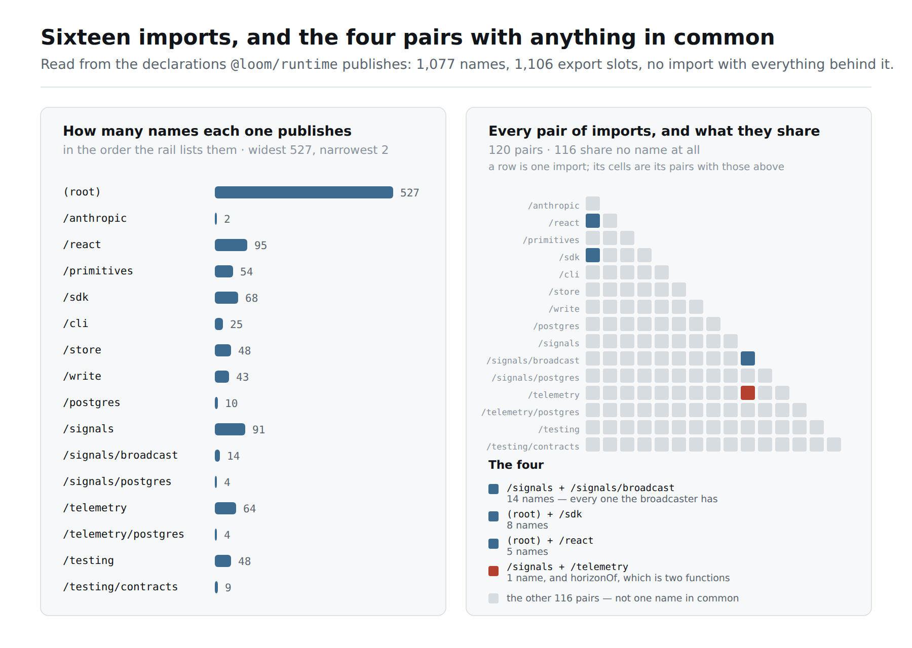
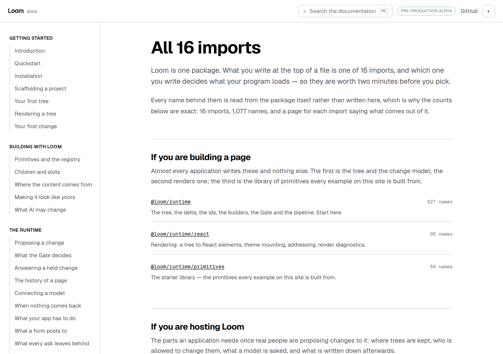
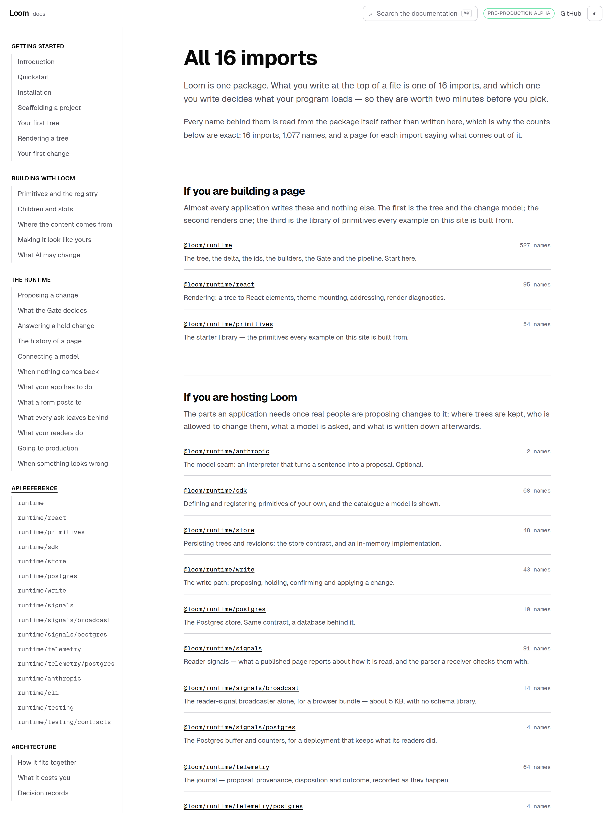
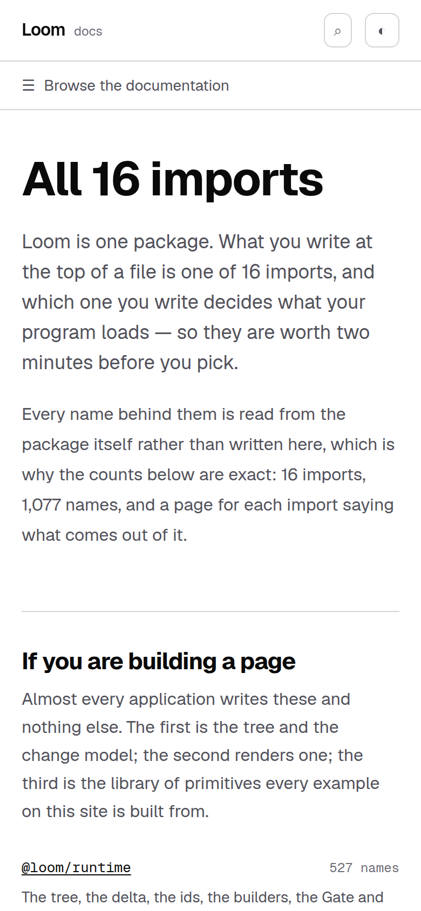

# 25 September 2026 — a front door for the reference, and the one page in it that is not a door

**Routine:** `Loom docs` · **Branch:** `docs-35-a-front-door-for-the-reference` · **Section:** §4c

**Preview:**
<https://loom-git-docs-35-a-front-doo-a65bea-jpizzolato36-6341s-projects.vercel.app>
— Vercel reported **Ready** on the branch. Published unverified, as every
routine run's is: `*.vercel.app` is off
this sandbox's egress allowlist and the proxy answers `403 CONNECT tunnel
failed`. That is the standing 15 September finding and is not re-filed.
Everything measured below is a production build (`pnpm build && next build &&
next start`), fetched over real HTTP and driven in Chromium.



## What this run was

The findings queue: the entry this lane filed against itself yesterday, and the
first item on the last report's *what I would write next*.

`/docs/api-reference` was not a page. The section was sixteen pages, one per
published import, and the rail was the only place the sixteen were ever seen
together. That was fine while each page described one door. It stopped being
fine on Wednesday, when every one of those pages learned to say **most of this
package is behind some other import** — and the only thing it could offer a
reader next was the search box, which answers *where is this name* to somebody
who does not yet have a name.

## The plain version

The reference now has a front door, and it is written for the reader who has
just been told they are looking at a third of what they came for:

> **All 16 imports**
>
> Loom is one package. What you write at the top of a file is one of 16 imports,
> and which one you write decides what your program loads — so they are worth two
> minutes before you pick.

Then the sixteen, in three groups by who writes them — *If you are building a
page*, *If you are hosting Loom*, *From a terminal, and from your tests* — each
one a link to its own page, with the sentence the site already keeps for it and
the number of names behind it.



Then the part only this page can say, because it is a fact about the set rather
than about any one door:

> **No import has everything behind it**
>
> The usual shape of a package like this is a big import with the whole library
> behind it and some smaller ones carved out of it for convenience. Loom is not
> that shape, and the sizes above are where it shows: they add up to more than
> the package publishes, and the biggest one is still less than half of it.
>
> - This package publishes **1,077 names** in all. The widest door,
>   `@loom/runtime`, publishes 527 of them; the narrowest,
>   `@loom/runtime/anthropic`, publishes 2.
> - There are 120 pairs of imports here, and **116 of them share no name at
>   all**. A name you cannot find behind one import is not a name that does not
>   exist — it is almost certainly behind one you have not opened.
> - The 4 pairs that do overlap are these: …
> - **One name here means two different things.** `horizonOf` …
> - `@loom/runtime/signals/broadcast` is the one import here that *is* part of a
>   bigger one …

Every number in it is read from the generated reference. Nothing on the page is
a list of imports typed by hand, so the door that opens in `package.json`
tomorrow is on this page in the same commit it opens in — which is the §4c rule
the sixteen pages under it already follow.

## The two questions the finding said had to be decided first

Both were in the entry, and both are answered here rather than deferred.

### A section can now have a page that *is* the section

`nav.ts` had no notion of one: every section was a list of pages, and the rail,
the pager, the search index and the metadata all read that list. Rather than
teach five things a second shape, **a landing page is a page in the list with no
slug of its own** — `DOCS_LANDING_SLUG`, which is the empty string — and
`docsHref` is the only place that knows what that means:

```ts
export const docsHref = (sectionSlug: string, pageSlug: string): string =>
  pageSlug === DOCS_LANDING_SLUG ? `/docs/${sectionSlug}` : `/docs/${sectionSlug}/${pageSlug}`
```

So the pager reaches it without being changed at all — *When something looks
wrong* → **All 16 imports** → `runtime` — the search index carries it, and
`pageMetadata("api-reference", DOCS_LANDING_SLUG)` throws if it is ever unlisted,
exactly as it does for a written page.

**The rail is the one place the difference shows.** A section with a landing
page makes its own title the link to it and does not list it underneath; a row
repeating the words directly above it is what a rail looks like when it has been
given a shape it does not have. The current page is marked the way every other
current page in that rail is — `aria-current` first, an underline second.



### Installation lists the sixteen too, and that is the right answer for two readers

The finding asked whether two pages listing the same doors is one too many. It
is not, because the two are answering different questions, and the difference is
now stated on both:

- **Installation** answers *I have just installed this — which import do I
  write?* Its table is the specifier, a sentence and who it is for. Sizes would
  mean nothing to somebody who has not met the package.
- **The reference's front door** answers *I am inside the reference — where is
  what I want, and how much of the package am I looking at?* Same doors, with
  their sizes and the shape they make.

So Installation now carries one sentence pointing at the other, saying what it
adds rather than that it exists:

> The table above is the map you need to write your first import. The
> [API reference](/docs/api-reference) lists the same doors with the number of
> names behind each, and says the thing this table cannot: they do not nest, so
> none of them has the whole package behind it.

That link is also what turned up the defect below.

## Found on the way: a check that was right about the rule and looking in one place for it

`cross-references.test.ts` follows every `/docs/…` address written in prose and
fails where one does not resolve. `servableHrefs` builds the set of addresses
the site can serve, and its own paragraph says how a generated page qualifies:

> The generated sections are checked against the filesystem rather than the
> navigation, because their pages have no `page.mdx`: `/docs/api-reference/react`
> is served by one dynamic route from a generated list, so what makes the
> address good is that the route exists and the list contains the entry — which
> is `nav.ts`, and is why both halves are asked here.

**Only one half was asked.** The function scanned the filesystem for `page.mdx`
and returned nothing else, so no address in the API reference was servable as
far as that test was concerned. It cost nothing for as long as it was true that
no written page linked to one — and the first link to `/docs/api-reference`,
added above, failed a check that was correct about the rule. The generated half
is now asked as the paragraph describes: the section's route directory is on
disk, and `nav.ts` lists the page.

That is a fix in this lane rather than a finding, and it is the kind worth a
paragraph: **the comment was right and the code was a subset of it**, which is
the failure mode a repository of well-commented functions has instead of the
one it avoided.

## Decisions taken that were not specified

**No decision record.** Nothing here constrains anything outside this route
group, no Accepted record is touched, and a section landing page is the §4c rule
applied to navigation rather than a new rule. Same call as the six runs before
it.

**The heading counts the doors rather than spelling the number.** `All ${entryPoints.length} imports`,
not *All sixteen imports*: the second is a true heading today and a false one the
morning a seventeenth door opens, and nothing would go red, because that door
would have a page and the rail would be complete. It is the one place on the
page where a number sits in the navigation rather than in the render, so it is
the one place the drift could have hidden.

**Grouped by who writes them, not by size.** Sixteen rows ordered by how many
names each publishes is a ranking; a reader arriving at a reference wants the
two or three imports their own program will write. `entry-points.ts` already
records the audience, and the three groups are its three values. Within a group
the order is the rail's, so the rail and the page never disagree about which
comes first.

**A pair is one row, not two.** Every overlap and every collision is already
carried by both of its doors, from each side. Printing them as the doors report
them would have listed `horizonOf` twice and told a reader there were two of
them; the wider door is taken as the left-hand side, and where two doors are the
same size, the order the rail lists them decides.

**The band that unteaches is a section, not a box.** On a reference page the
same fact is a bordered band under the install band, because the page around it
is a list of signatures. Here it is the argument the page was written for, so it
is prose with a heading, and it comes *after* the sixteen rather than before —
the concrete thing first, the rule that explains it second, which is the brief's
order.

## Tests

`pnpm install && pnpm verify` at the repository root: **green, exit 0**, read
from a log file rather than through a pipe.

| | `main` at `5899324` | this branch |
| --- | --- | --- |
| `@loom/runtime` | 159 files / 3,029 tests | **159 / 3,029** — `src/` was not opened |
| `@loom/app` | 305 / 5,529 | **307 / 5,560** |
| findings ledger | 786 entries, 0 malformed | 787, 0 malformed |
| prerender | 109 pages, 1,206 junctions | **110**, 1,285, 0 run together |

**+31 tests, two new files**, none weakened, nothing skipped. The `main` column
for `@loom/app` is this branch's figures **minus what this branch adds** — 23
tests in two new files, 8 in three existing ones — rather than a second full
gate run on a worktree; every other row was measured. The 79 new text junctions
are this page's own sentences: `prerender:check` reads every place a JSX
expression sits beside a word and fails where they run together, so every
clause of every count on this page is guarded by it.

Green is not evidence, so **nine mutations were introduced one at a time**:

| what was broken | what went red |
| --- | --- |
| the package total is the doors added up | 1 |
| a pair sharing nothing is counted from each side | 2 |
| an overlapping pair is listed from both ends | 2 |
| a door is inside another whenever they share anything | 1 |
| a collision is named at both of its doors | 1 |
| the band prints its overlap list on a package with none | 1 |
| every door is described as inside another | 1 |
| a landing page is addressed like any other page | 3 |
| the rail lists a section's own page under its name too | 2 |

Nothing survived. Files were restored from byte-for-byte copies rather than with
`git checkout`, which is the 16 September finding, and `diff` against the copies
is empty on all three.

The measurement's own tests are over **invented packages**, for the reason
`standing.test.ts` gives: what this page tells a reader is a claim about the
*shape* of a package, and a test that only ever saw Loom's would pass on a rule
that happens to hold today. So the shapes are stated — a door wholly inside
another, a name meaning two things at two doors, two doors tying for widest, and
a package with one door and nothing to compare it to.

Beyond the unit tests, the page was fetched from a running production build and
its HTML read: 1,077, 527, 120, 116, the four pairs, `horizonOf` and the
broadcaster all present, with no two words run together.

## Scope

`apps/loom/app/(docs)/` only, plus `FINDINGS.md` and this report. Ten files
under `(docs)`: three new — `docs/api-reference/page.tsx`, `_lib/api/doors.ts`,
`_components/api-doors.tsx` — two new test files, and five touched
(`_lib/nav.ts`, `_components/sidebar.tsx`, `_lib/cross-references.ts`, the
Installation page, and one export made public in `_components/api-reference.tsx`
so that the two pages format a four-digit number the same way).

**No file in another lane was opened.** `git diff origin/main -- src/` is empty, and the
generated reference is untouched — this run measured nothing new, it arranged
what the last one had already measured.

## At 390 pixels

`scrollWidth 390 / innerWidth 390`. The door rows stack rather than sitting in
columns, which is why: the specifier is the longest unbroken string on the page,
and a three-column table of sixteen of them either scrolls sideways or squeezes
the sentence into a column two words across.



## Findings

**Closed — one.** The 24 September entry this branch was written from.

**Filed — one.** *The site cannot search a sentence that a component renders.*
The prose index is read from the MDX files, so a generated page contributes its
title and its one-line summary and nothing else. Until this week that cost
almost nothing. It now hides five bands on every reference page and the whole of
the page above — a reader searching *do the imports nest* finds the summary of
this page if they are lucky and none of the paragraph that answers them.

**Not re-filed:** the preview URL cannot be verified from this sandbox (15
September); the screenshot harness photographs an address while the theme lives
in `localStorage`, so the page pictures are light (14–16 September); the phone
heading break on an entry-point page (23 September); and the `next build` that
serves the previous build's HTML (24 September) — `rm -rf .next` was run before
each of this run's three builds because of it.

## What I would write next

- **A way back to the front door.** `(docs)` links to `/` zero times, which the
  marketing lane measured and filed on 24 September against three surfaces
  including this one. It is this surface's call how — the wordmark is a poor
  answer for a reference site and its own comment says so — and it is now the
  oldest open thing this lane owns.
- The `<wbr/>` at each slash in the entry-point heading, so the four longest
  doors stop breaking mid-word on a phone. Small, filed, and the oldest cosmetic
  thing here.
- The arrival route on *Introduction* describes six steps beginning at
  *Installation* and does not acknowledge a reader who arrives having already
  run the quickstart. One paragraph in `_lib/arrival/route.ts`. Unchanged from
  the last six reports.
