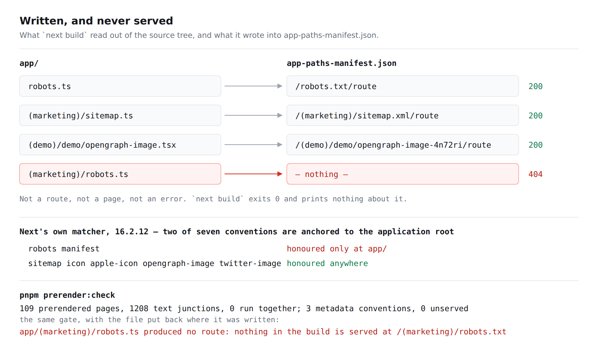

# Written, and never served — the metadata file the build read nothing of, and the gate that now says so

**Routine:** `Loom daily build` (framework, `src/` except `src/primitives/`, and the application shell)
**Date:** 2026-09-25
**Section:** §4d
**Branch:** `framework-53-both-seams-in-one-element` — pushed onto the lane's existing open pull request (#388) rather than opening a second one
**Record added:** [0190](../decisions/0190-a-route-group-may-contribute-a-sitemap-and-may-not-contribute-a-robots-txt.md)



## What was completed, in plain language

`Loom marketing` shipped a sitemap yesterday and filed a finding that the
`robots.txt` meant to announce it could not be served. The file had been
written, it was correct, eleven assertions passed against it, and a request for
`/robots.txt` came back with the not-found page.

Two things came out of picking that up.

**The site serves a `robots.txt` now.** It is the four lines the marketing lane
wrote and argued, at the address a crawler looks for them, derived from the same
`guarded` field the sitemap reads — so a surface added to `PRODUCT_SURFACES` is
crawled or disallowed by the one decision that already put it in the header's
menu. It sits at `apps/loom/app/robots.ts`, at the application root, because
that is the only place the framework reads it from.

**`pnpm prerender:check` now fails on a metadata file the build did not read.**
That is the part worth more than the file. The finding's sharpest sentence is
*a test of the function a metadata file exports is not a test that the framework
serves it, and nothing in this repository distinguishes those* — and it is
right. The check reads the conventions out of the source tree and the routes out
of `app-paths-manifest.json`, and reports any convention with no route.

## The correction, which is most of the value

Two of the finding's three measurements do not reproduce, and saying so matters
because one of them is a shape other lanes will reach for.

**`app/robots.ts` is served.** From a clean build on 16.2.12: `200 text/plain`
with the right four lines, under `next start` and under `next dev`. The
`app/robots.ts → 404` row was almost certainly the stale-`.next` false green
**the same lane filed the same day, two entries above it** — a killed build, a
second build exiting 0, and a server answering from output that predated the
file. Two findings, one cause, an hour apart.

**`/robots.txt/ → 308` was never evidence.** Measured:
`/definitely-not-a-route.txt/` answers `308` too, and the address it redirects to
answers `404`. The trailing-slash redirect is a normalisation that runs before
any route is looked up, so it says the same thing about every path on the site.

**What is real is the placement, and it is worse than a 404.** Next's own
`isMetadataRouteFile` anchors `robots` and `manifest` to the application root
and does not anchor `sitemap`, `icon`, `apple-icon`, `opengraph-image` or
`twitter-image`. So a route group may contribute a sitemap and may not
contribute a `robots.txt`, and a `robots.ts` in a route group is not a route,
not a page and not an error — the build does not read it and does not say so.

Measured by calling Next's matcher directly with this application's
`pageExtensions`:

| file | honoured |
| --- | --- |
| `app/robots.ts` | **yes** |
| `app/(marketing)/robots.ts` | **no** |
| `app/manifest.ts` | **yes** |
| `app/(marketing)/manifest.ts` | **no** |
| `app/sitemap.ts`, `app/(marketing)/sitemap.ts` | yes, both |
| `app/icon.tsx`, `app/(marketing)/icon.tsx` | yes, both |
| `app/(marketing)/opengraph-image.tsx` | yes |

## The check, proved the way the fault was found

The file was put back in `(marketing)`, the application rebuilt clean, and the
gate run:

```
$ next build
   ✓ Compiled successfully
   … no mention of robots anywhere in the output …
build=0

$ pnpm prerender:check
app/(marketing)/robots.ts produced no route: nothing in the build is served at
  /(marketing)/robots.txt — `robots` is honoured only at the application root,
  so this file is not read at all (0190)
109 prerendered pages, 1208 text junctions, 0 run together; 3 metadata conventions, 1 unserved
exit=1
```

With the file back at the root, the same command:

```
109 prerendered pages, 1208 text junctions, 0 run together; 3 metadata conventions, 0 unserved
exit=0
```

And the address itself, served by `next start` and photographed:


## Decisions taken that were not specified

**The check compares source against manifest rather than encoding the rule.**
The shortest correct check would import Next's `isMetadataRouteFile` and ask it
where each file is honoured. That was used to *measure* the table above and is
deliberately not the gate: it is a deep import of a private module, and a check
that breaks on a minor upgrade of the thing it checks is a check that gets
deleted. Comparing what was written against what was built needs no model of
Next's rules at all, so the day an upgrade moves an anchor, the manifest changes
and the check notices.

**The gate does not start the application.** Probing the served addresses over
HTTP is the honest instrument and is what found the fault originally. It is not
in the gate: it needs a server, which `pnpm shoot` deliberately refuses to start
(0117) and which would put one in a merge gate four surfaces share. The manifest
is the same fact one step earlier and costs one file read.

**`app/robots.ts` is a cross-lane file and this is the line the rules ask for.**
Its content is the marketing lane's — what to crawl is that surface's decision —
and the framework forces it to the application root. `docs/routines.md` already
states the rule for `next.config.ts` and `mdx-components.tsx`: *the lane follows
the content and not the location.* This is its second instance, recorded in 0190
so the third one does not have to argue it again.

**`app/robots.test.ts` holds the guarantee the marketing lane's own test said it
could not.** `(marketing)/sitemap.test.ts` names it exactly — *that what the
sitemap declines to list is exactly what robots disallows* — and could not assert
it with no robots file to assert against. It is asserted now. That file's last
paragraph is stale and is the marketing lane's to drop whenever it next touches
it; nothing is wrong until then.

**`pnpm prerender:check` grew a second subject rather than becoming a second
script.** It already runs last in `pnpm verify`, after the build, and already
exists to ask the one question the rest of the gate cannot — what came out. A
second post-build gate would have been a second thing to remember to run.

## Records added or superseded

- **[0190](../decisions/0190-a-route-group-may-contribute-a-sitemap-and-may-not-contribute-a-robots-txt.md)** — *A route group may contribute a sitemap and may not contribute a robots.txt.* `Accepted`. Nothing superseded. `0188` is taken by this branch's other record and `0189` by #389, so this is the next free number on `main` and on every open branch. `pnpm decisions:index` regenerated; its notes about numbers with no record on `main` are pre-existing, with `0189` the one added today.

## Findings closed and filed

**Closed**

- *this application cannot serve a `robots.txt`, and the file that proves it passed every test it had* (`Loom marketing`, 24 Sep) — closed, with the correction filed under it rather than written into it.

**Reassigned**

- *`nextjs.org` is `EGRESS_BLOCKED`, and `docs/routines.md` lists it as allowed* (`Loom marketing`, 24 Sep) — was owned by this lane and there is nothing here for a lane to do: the entry's own reading of `.claude/settings.json` establishes that both committed lists already name the domain, so the block is the environment's egress proxy. Reassigned to `@jonathanbravecredit`. The one question it blocked has since been answered by reading the framework out of `node_modules` instead, which is the general workaround when the question is about Next rather than about its documentation.

**Filed**

- *the `robots.txt` 404 does not reproduce, the 308 was never evidence, and the fault is that a build can read nothing and say nothing* — the correction above, filed and closed in the same run.
- *the judgement the false-green entry asked for: the build does not clear `.next`, and the cure is a sentinel rather than a sweep* — answers the 24 September entry that asked this lane for one line of judgement. **The judgement is given and the work is not done.** A `rm -rf .next` on every build makes four routines pay minutes a run for a state that only arises when a build is interrupted; a sentinel written before `next build` and cleared after it is exact and costs one file. Not taken today because it is a second unit on a branch that already carries one, and because it changes the build command four surfaces run.

## Test numbers, and what is not covered

`pnpm install && pnpm verify` — **green, exit 0**, on this branch with today's work on it.

| | files | tests |
| --- | --- | --- |
| `@loom/runtime` (`src/`, `tools/`) | 160 | **3059** |
| `@loom/app` (`apps/loom/`) | 306 | **5533** |

New this run: **12** in `tools/prerender/metadata.test.ts`, **4** in
`apps/loom/app/robots.test.ts`. Nothing was skipped, nothing was weakened, and
no test was marked pending. `pnpm prerender:check` passes with `3 metadata
conventions, 0 unserved`.

The first `pnpm verify` of the run failed on `Cannot find module 'esbuild'` —
`pnpm install` had been run before checking out this branch, and #388 added
esbuild as a devDependency. Reinstalling fixed it and it is noted only because a
run that read that error as a defect would have gone looking in the wrong place.

**What the new check does not cover**, stated so nobody reads more into a green
tick than is there: it checks metadata conventions and nothing else. A `page.tsx`
that the build silently dropped is the same class of fault and is not caught —
generalising to every route means modelling parallel routes, intercepting
routes, optional catch-alls and the MDX pipeline, and a false positive there
turns the gate red for four surfaces. It is the obvious next reach and it is a
unit of its own.

## Open questions

1. **The `.next` sentinel.** Filed with the judgement and the shape. The
   maintainer may simply prefer the sweep, which is one line and is slower for
   everybody; the argument for the sentinel is in the finding.
2. **A served-address probe.** Not in the gate, for the reason above — but the
   fault was found by `curl` against `next start` and nothing in this repository
   does that on purpose. `pnpm shoot` is one flag away from being able to report
   a status code alongside a screenshot, which would make the visual half and
   the served half one instrument. Not taken; no lane has asked for it yet.
3. **Whether `robots.ts` should carry `Disallow` for anything but a surface.**
   Today the list is derived from `guarded`, which means exactly `/portal`.
   Search-result pages, share-image routes and the lessons' `held` endpoints are
   all crawlable and none of them is a page a person should land on from a search
   result. That is the marketing lane's call, not the shell's, and it is a
   question rather than a finding.

## What is still true about the migration

`apps/loom` has all five route groups, `apps/portal` and `apps/docs` are retired,
sign-in is at the `(portal)` boundary in `proxy.ts`, and there is one
`vercel.json`. The tree is not half-migrated. This is the fourth consecutive run
of this lane to confirm it, and the recommendation to drop that section from the
brief stands.
