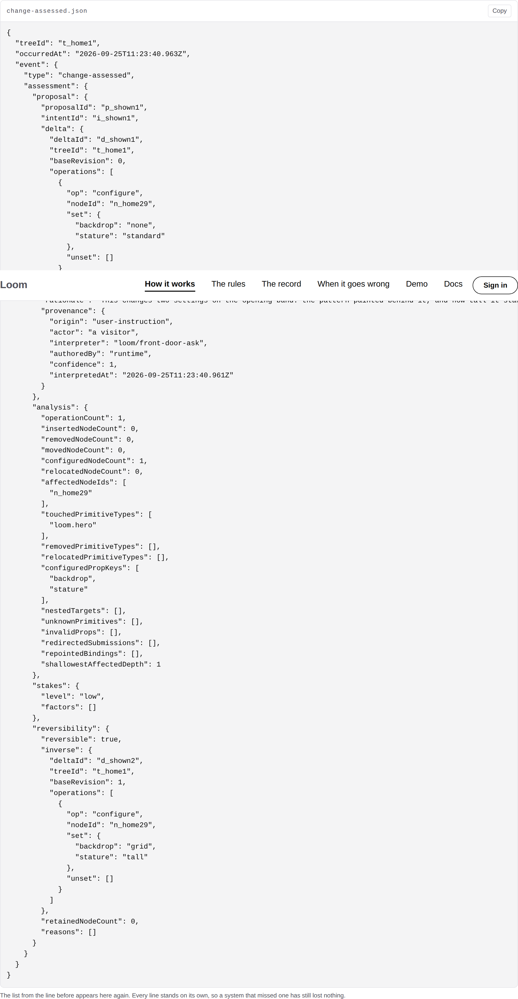
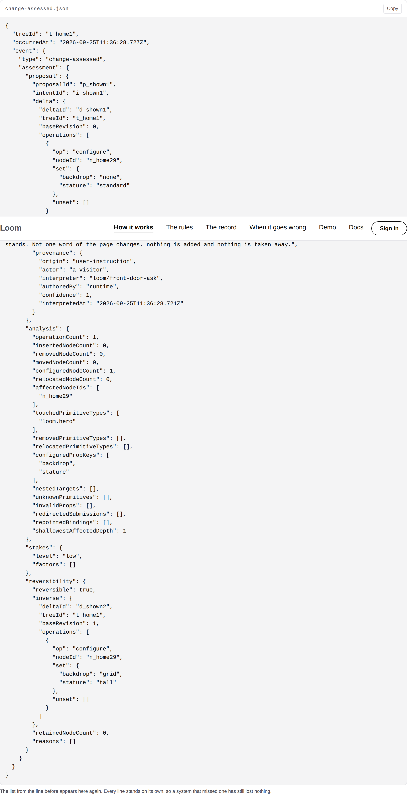
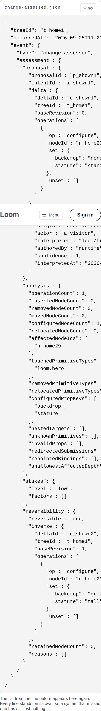
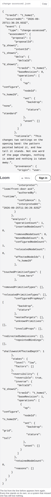
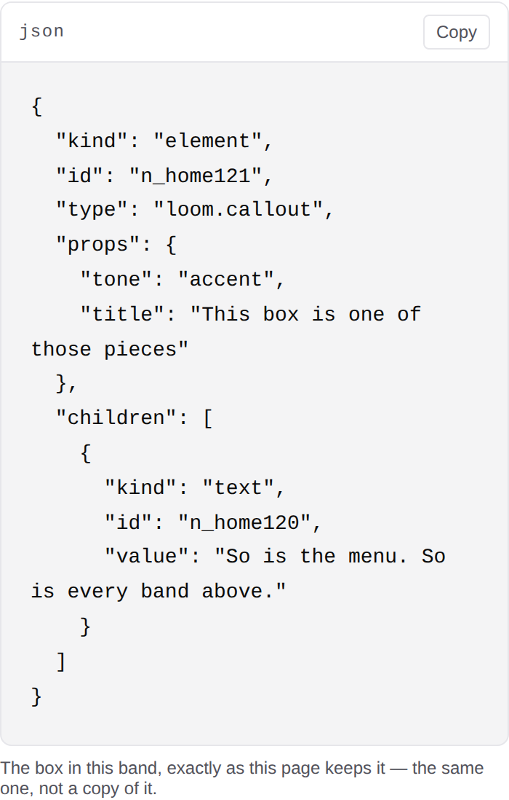

# 2026-09-25 — marketing: the three lines written in English, and the prop that was built for them three weeks ago

`/how-it-works` prints the whole of a real run of the runtime — seven panels,
341 lines, gathered from a listener attached to a live request against this
site's own front door. It is the band everything else on the site points at.

Three of those 341 lines are longer than 110 characters. They are the model's
`rationale`, twice — its own sentence saying *why* it asked for the change — and
the refusal's `detail`, its reason for saying no. **They are the only three
lines in the record written in English rather than in keys, ids and counts, and
they were the only three a reader could not finish.**

| before — `main` | after — this branch |
| --- | --- |
|  |  |
|  |  |

The line reads `"rationale": "This changes two settings on the opening band: the
pattern painted behind it, and how tall it sta` and then the panel ends. Three
inches below it, the band's own caption says *every line stands on its own*.

---

## What shipped

`wrap: true` on all eight `loom.code` panels this site serves, through one
constructor in `_lib/nodes.ts`, plus a sweep that holds it.

| file | what changed |
| --- | --- |
| `_lib/nodes.ts` | `code()`, beside `heading`, `prose` and the table three — `wrap` written first so a panel may still say `wrap: false` |
| `_lib/pages/how-it-works.ts` | `stage()` and `refusal()` — seven panels |
| `_lib/pages/as-data.ts` | the front door's panel, and the doc comment beside it |
| `_lib/pages/pages.test.ts` | four assertions, swept over every route |

No primitive was added, nothing under `src/` was opened, and no component was
added. Outside `app/(marketing)/`: `FINDINGS.md` and this report.

### The measurement, which is the argument

Taken on the built application under `next start`, before anything changed:

| | |
| --- | --- |
| panels on `/how-it-works` | 7 (plus one on `/`) |
| lines printed | 341 |
| lines over 110 characters | 3 — `"rationale"` ×2 at 201 and 203, `"detail"` at 142 |
| characters a 1280 panel shows | ~125, so all three cut mid-word **on a laptop** |
| characters a 390 panel shows | ~39, so roughly a third of every panel goes with them |
| `pnpm shoot`'s overflow reading | `scrollWidth 390 / innerWidth 390` — clean, at every viewport |

That last row is why this survived. The `pre` scrolls **inside** the panel, so
the page does not overflow, no diagnostic is emitted, the schema is satisfied,
and 310 assertions about these pages passed the whole time. The instrument that
found it was a photograph of one clipped element.

### The three weeks

- **3 September** — this lane files that `loom.code` sets `white-space: pre` and
  scrolls, and that a pretty-printed JSON string value is one line however long
  the string is. It works around it by shortening the copy in the box.
- **12 September** — `Loom primitives` ships `wrap`, citing that finding by name
  in the prop's own doc comment, down to the measurement, and noting that this
  lane *"worked around it by choosing a shorter specimen, which is a cost it
  should not have had to pay."*
- **19 September** — `Loom primitives` photographs the same failure in its own
  catalogue: *"unwrapped, every line ends behind a gesture."*
- **25 September** — not one panel on this site sets it, and the comment in
  `as-data.ts` still states the constraint as a fact about the library.

Both sides were complete and correct the whole time. A finding is closed when
the lane owning the mechanism ships it, and nothing anywhere closes the half
where the lane that asked wires it up. Filed as an entry of its own, because the
two lanes were different and neither entry reached the other.

### What it cost, stated rather than glossed

| | before | after |
| --- | --- | --- |
| `/how-it-works`, whole page at 1280 | 14,087px | **14,150px** (+0.4%) |
| the widest panel at 1280 | 1,959px | **1,980px** (+21px) |
| the same panel at 390 | 1,987px | **2,764px** (+39%) |

On a laptop it is free. On a phone that panel is 39% taller, and short keys now
break across two rows — `"proposalId":` above `"p_shown1",` — because
`overflow-wrap: anywhere` is the half of the prop that makes it work on a narrow
screen at all. That is the right trade when the alternative is a third of the
content being unreachable, and it is also the strongest argument for the second
finding below: what this band actually wants is a ceiling, not a longer page.

The front door's panel is the one where the gain is plainest, because it is the
one a visitor is meant to read at a glance:

`"title": "This box is one of those pieces"` and `"value": "So is the menu. So
is every band above."` both used to end at 39 characters.

### The comment that was describing a constraint that had gone

`as-data.ts` explained that its box's words are short **because** a JSON string
does not wrap. That stopped being true on 12 September. The box stays short
anyway — the argument belongs in the prose below, where nothing constrains its
length, and the box's job is being small enough to read whole, twice — so the
copy is unchanged and the comment now says it is an editorial choice rather than
a limit. A constraint nobody re-reads is how a stylesheet goes on making a
decision somebody should be making.

---

## The rule, and where it is written

`wrap` is optional on the primitive and absent means `false`, which is right for
a library that does not know what it is holding. This site does know: it has
never printed a command, and all eight panels are JSON. So the default lives in
`code()` and the sweep holds three things —

| what it holds | why it is not obvious |
| --- | --- |
| there are exactly eight panels, across every route | a panel on a page the sweep forgot to walk reads as the same green as one that wraps |
| each declares `wrap`, true or false | absent is the one answer no panel here may give; a command panel is welcome and says so out loud |
| none is a terminal, and every one wraps | the premise, asserted rather than assumed — the day one of these is a command, this test is where the change gets argued |
| the record's long lines are the sentences | pins *why*: it fails when the record stops carrying a `rationale`, not when a laptop gets wider |

It sweeps `pageTreeFor` rather than `treeFor`, because the panels this is about
arrive from a request made outside the builder — a sweep over the synchronous
trees finds one panel and reports eight-eighths green.

**Both rule assertions were checked red**: reverting the default in `nodes.ts`
fails two of the four and passes the other two, which is the correct split.

---

## Findings

**Two filed, one of them closed by this branch.**

- **A prop built to answer one lane's finding sat unwired for three weeks**, and
  the only instrument that could see it was a camera. This lane's own, closed
  here, recorded for the shape: nothing closes the half of a finding where the
  surface that asked for the mechanism wires it up.
- **`loom.code` cannot be collapsed, so a complete record is either a wall or
  absent.** For `Loom primitives`, open, not blocking. 73% of the visible text
  of `/how-it-works` is raw JSON — 12,415 characters of 17,059 — on the first
  page of the reading order, the first item in the menu, and the destination of
  the front door's primary button. One panel is 135 lines on its own. The band's
  argument for printing all of it is an argument for the record being
  **complete**, not for all of it being **open**, and the library offers no third
  option: `loom.faq` takes its answer as a string of at most 1,000 characters,
  and `loom.code` declares `copy` and no other behaviour. Two shapes offered; a
  height ceiling with the full panel one press away is the one this lane
  prefers, because these panels are long rather than wide.

Nothing was closed that this lane did not own.

---

## Open questions for the maintainer

Unchanged from the last three runs, and none of them is blocking:

- **The licence line**, still this site's one placeholder, at the foot of every
  page.
- **Positioning, audience and pricing.** Untouched, as always.
- **Whether preview deployments should be `noindex`**, which is the second thing
  a working `robots.txt` would be for. Still filed against the shell.

---

## Tests

`pnpm install && pnpm verify` — **exit 0**, read off the run rather than a pipe,
on a `.next` and a `dist` deleted first.

| | |
| --- | --- |
| `pnpm verify` | **green, exit 0** |
| runtime | **3,029 passed** in 159 files |
| application | **5,533 passed** in 305 files — four added |
| `pages.test.ts` | **314**, up from 310 |
| `pnpm shoot` | 4 shots, exit 0, no overflow at 1280 or 390 |
| findings | **788**, 0 malformed |
| build | 109 prerendered pages, 1,208 text junctions, 0 run together |

Nothing was skipped, nothing was weakened, nothing failed, and no existing
assertion was rewritten. No decision record: nothing here touches the tree
schema, the delta model or an `Accepted` record — `wrap` is a prop the runtime
already offers, being set.

**One thing worth recording about the run itself.** The first *after* measurement
came back saying nothing had changed, because an earlier `next start` from the
pre-change build still held port 3000 and the new one had failed to bind with
`EADDRINUSE` into a log nobody was reading. That is the finding `Loom demo` filed
on 19 September about `pkill` missing the server it is aiming at, met a third
way. The fix is to read the server's own log before believing a measurement
taken through it.
