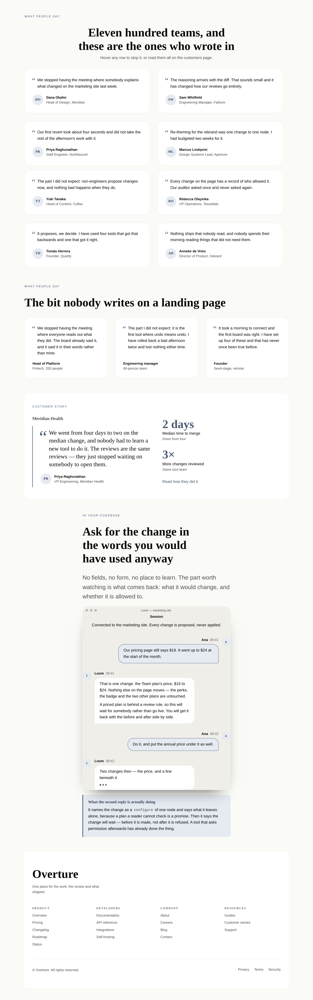
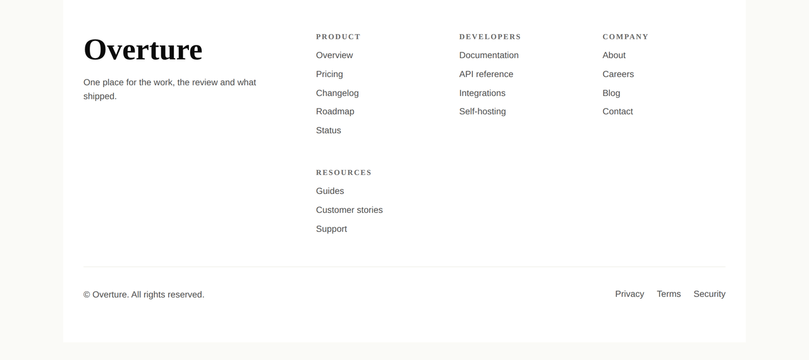
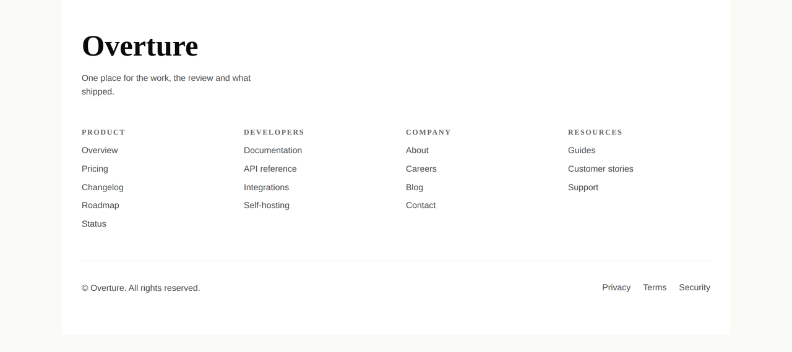

# The face the band promised — the phrasebook photographed as a page for the first time, and the three things only that could find

**Routine:** `Loom primitives` · **Date:** 2026-09-25 · **Branch:**
`primitives-45-the-face-promised` — deliberately short, because a blob URL
carries it and the 24 September finding measures the ceiling at 158 characters ·
**Section:** §4b · **Pull request:**
[#389](https://github.com/jam-overture/loom/pull/389) · **Preview:**
https://loom-git-primitives-45-the-f-ceef18-jpizzolato36-6341s-projects.vercel.app
— **published unverified**: `*.vercel.app` is off this sandbox's egress
allowlist, the standing 19 August limit, so the URL is Vercel's own comment on
the pull request rather than something this run opened. Vercel reported
*verified and building* on the head commit, which is the 24 September finding's
rule holding: nothing about the commit's author was overridden. **There is
nothing new on it to look at** — a primitive is a thing a tree uses, and this
deployment seeds trees that carry none of these bands. Everything below was
driven against the specimen harness and a local render



## What this run chose, and why that

**Not a band, and not a primitive. An instrument — and then whatever it found.**

The library is at 98 primitives and 44 bands, and the last four runs have agreed
that pushing the vocabulary is the wrong axis. The remaining reach inventory is
ten types, six of which need an image source that is the maintainer's decision
and has been for three weeks. So the honest question this morning was not *what
is missing* but **is what we have any good**, and the brief answers how to find
out: *this is the surface that has to pop; it has to be looked at.*

So the run began by looking. `PAGE_SEQUENCE` — the canonical design of each of
the twenty-two parts, which is exactly what a surface offering to *start a page*
hands somebody — assembled into one `loom.page` and photographed under both
starter palettes. About 12,000 CSS pixels.

**Forty-four bands had shipped and this had never been done.** Every specimen in
this directory frames a band, or the handful of bands one run built. That is the
right subject for *does this band render* and it is structurally incapable of
answering *does this read as a product*.

It found three things in the first frame. Two are fixed here; the rest are
filed.

## The one that was written down as fact and was not true

`testimonials-band.ts` has said this in its own doc comment since 19 September,
when the band was written:

> `loom.quote` draws a monogram from the author when there is no avatar, so the
> band is complete without one rather than visibly missing something.

**It did not.** `loom.quote` drew a photograph or nothing, and **this catalogue
ships no photographs** — that is a standing decision, asserted by test, because
a starting composition cannot supply an asset and will not link to somebody
else's. So the sentence was describing a fallback that did not exist, in a
library where the fallback is the *only* path.

`loom.message` was the same. `loom.avatar` and `loom.person` were not: both fall
back to the initials and have since they shipped.

| | with a photograph | without one |
| --- | --- | --- |
| `loom.person` | the photograph | the initials |
| `loom.avatar` | the photograph | the initials |
| `loom.quote` | the photograph | **nothing** |
| `loom.message` | the photograph | **nothing** |

Every one of the four renders cleanly, satisfies its schema, emits no diagnostic
and measures no overflow. **The only instrument that can tell the columns apart
is a picture**, and a picture of the testimonials band alone does not do it
either — what says it is a wall of faceless quotes standing four bands above a
team band full of faces. That is
[0187](../decisions/0187-a-frame-with-no-picture-in-it-is-not-the-pictures-shape.md)'s
lesson arriving a second time in two days, one level up: the band was right, the
page was the subject.

The rule is now [0189](../decisions/0189-a-portrait-with-no-photograph-is-the-persons-initials-and-a-portrait-with-nobody-named-is-nothing.md):

> **A primitive that draws a person falls back to that person's initials, and
> draws nothing at all when nobody is named.**

And it is enforced structurally rather than remembered. `src/primitives/portrait.ts`
is the one function all four call, beside `monogram.ts` and for that file's own
stated reason — *"a second copy is how two faces on one page end up disagreeing
about what a three-word name reduces to."* `monogramOf` took the two letters out
in August and left the circle behind, and **the circle is exactly what
diverged.** A primitive can no longer reach the photograph without going through
the fallback.

## The half that is not a fallback, and the prop it needed

The photograph of the fix was worse than the photograph of the defect, in one
band, and that is the interesting part of the run.

The canonical `testimonials` band attributes its quotes to **roles** — *Head of
Platform*, *Engineering manager*, *Founder* — deliberately, on the standing rule
that a starting composition may not ship a fabricated endorsement from a person
who does not exist. Given a fallback, those rendered as `HO`, `EM` and a circle
with a single `F` in it. **The initials of a job title are not a face**; they
read as a person whose name got lost.

Nothing can infer the difference: `monogramOf("Head of Platform")` is `"HO"` and
`monogramOf("Hanna Ochoa")` is `"HO"`, and that is an assertion in the suite
rather than a remark here. So the tree says it, and `loom.quote` takes
`anonymous: boolean` meaning **this attribution names nobody** — which is
[0160](../decisions/0160-a-prop-that-unblocks-a-rendering-names-the-content-and-never-the-layout.md)
applied unchanged, down to all three of that record's conditions. It names the
content (*nobody is named here*, which stays true) and never the layout (*draw
no avatar*, which would pin every tree that said it to September).

`loom.message` needed no such prop and the asymmetry is the argument's test: its
`name` is already optional, so a turn with nobody to name says the same fact by
saying nothing. A second spelling would be two ways to say one thing with a
silent wrong answer waiting in whichever a future run forgot.

So the pair, photographed in one frame the way `debts.specimen.ts` puts a defect
beside its absence: **eight named voices with eight faces, and three unnamed
ones with none.**

## Which fields became nodes and which stayed props

| | became nodes | stayed props |
| --- | --- | --- |
| **a quote's portrait** | — | `avatar`, and this is the *non*-decomposition the run argued hardest. See below |
| **whether an attribution names anybody** | — | `anonymous`, a 0160 prop: it changes no node, it is genuinely unobservable, and getting it wrong degrades rather than breaks |
| **a turn's speaker** | — | unchanged. `system` now means one thing more than *which side*: the room speaking rather than somebody, so it never draws a face however it is named |

**The decomposition this run did not take, and it is stronger on 0052 than what
shipped.** Make the portrait a **slot**, put a `loom.avatar` in it, and let one
primitive draw every face in the library. A quote with a face and a quote
without are different sets of nodes, so *add a face to this testimonial* becomes
an `insert` rather than a `configure` on a URL nobody can supply; and a slot is
precisely what answers `loom.quote`'s own objection to making it a child, since
[0051](../decisions/0051-a-slot-is-a-region-the-primitive-places.md) says a slot
is a region the primitive places and cannot be reordered against the words.

It was not taken, and the reason is evidential rather than architectural: this
run's evidence is **a photograph of a missing face**, which argues for the
fallback and says nothing about the seam. Removing a prop from two settled
schemas on evidence that does not bear on it is the move 0187's own Alternatives
section rejects. It is filed, with the three things whoever takes it will need.

## The footer column that fell off the row

The second find, and the one that could only be seen in a page.

`loom.footer` lays its link groups out with `auto-fit` over a floor, and
`GROUP_MINIMUMS` exists — with a paragraph explaining itself — so that
*"`columns: "four"` renders two — the names stop meaning what they say"* could
not happen. **It happened one step smaller.** Four link groups, the number an
ordinary product footer has, rendered **three columns and an orphan on a second
row**, under both palettes.

Nothing was wrong with the floor. `auto-fit` divides what is *left over*, and
what was left over was decided by the brand column: 1120px of page, less the
surface tone's own 64px inset, less 20rem of wordmark-and-blurb and a gap,
leaves 640px — and four 9rem columns with a `space(5)` between them want 672.
**Six and a half rem of blurb was deciding how many link groups a footer has.**

It needs the band at a page's width *and* the tone the canonical band uses, which
is why no shot of the footer band alone has ever shown it.

The fix is that `columns` stops competing with the brand for room:

```
min-width: min(100%, calc(4 * 9rem + 3 * var(--loom-spacing-5)))
```

The groups reserve the width their promise needs; the brand yields, or the row
wraps and gives the groups a line of their own; and `min(100%, …)` caps the
reservation at the band's own width so a phone falls to one column instead of
demanding four and pushing the page sideways. `columns: "auto"` reserves
nothing, because it is the one value that means *as many as fit*.

| before — `main` | after |
| --- | --- |
|  |  |

Both crops are the same band in the same assembled page at 1280, cut from the
whole-page photograph at 1:1. The *before* was taken with `loom.footer.ts`
unmodified; that file and the footer band are byte-identical across the two
commits the two shots were taken on, checked with `git diff` rather than
assumed.

It is still not a count — nothing truncates or pads the list, and five groups
under `columns: "four"` wrap the fifth exactly as before. What changed is that
the floor is now **kept** rather than merely declared.

## What the photographs changed that no argument would have

Two things, both the same shape as the run itself.

**`.loom-message` aligned its row to `flex-end`.** That is the messenger
convention — a portrait at the foot of a speaker's last bubble — and it was
correct when it was written and never once rendered, because no band in this
library had ever drawn a portrait there at all. The convention assumes a
transcript with *no name lines in it*. This one prints the speaker's name and
the time above the bubble, so the first picture of it showed four faces pinned
three lines below the names they belong to. It is `flex-start` now, and the
stylesheet says why.

**A system turn is not somebody speaking.** It came out of the same frame: given
a name, `Session` drew an `S` and read as a fifth participant. `speaker` now
means one thing more than which side of the exchange a turn is on.

Neither was in the plan. Both were twenty seconds of looking.

## What is now checked, and where

Fourteen new tests across two files — eleven in `library.test.ts`, three in
`compositions.test.ts`.

| | |
| --- | --- |
| **four primitives named, not counted** | a run that drops the fallback from one fails with the name of the primitive that went blank |
| **all four painted from the palette, under both themes** | asserted past the root's opening tag, which is the only place in a Loom page a literal lives |
| **`role="img"` on one, `aria-hidden` on three** | the one argument in `portrait.ts` that is not about paint, held where getting it backwards is a name read twice |
| **a turn with no name draws nothing** | probed on `user-select:none`, which only a monogram declares — a person's own bubble is painted `accent-subtle` too, so the tint alone cannot tell a drawn face from an undrawn one |
| **a system turn draws nothing, however it is named** | |
| **`HO` from a role and `HO` from a name** | 0160's first condition demonstrated rather than claimed |
| **a photograph still wins, even when anonymised** | a silhouette is not a name |
| **every role-attributed quote declares it, every named one does not** | asserted as a *pair*: a run that changed one band's copy without the other's declaration would otherwise leave every test green |
| **the wall's authors have names in them** | the property the declaration above rests on |
| **a footer reserves what its name promises** | for `four`, for `two`, for the default, and **not** for `auto` |
| **the reservation is capped at the band's width** | the clause that stops a promise becoming an overflow |

**No test was weakened, none skipped, none deleted. One existing assertion was
rewritten** — `.loom-message`'s `align-items`, which is the stylesheet change
above and is a test doing its job. The old line is quoted in a comment beside
the new one with the reason, which is this lane's convention when behaviour
deliberately changes.

## Checks

- `pnpm install && pnpm verify` **green, exit 0**, on the run that opened this
  pull request.
- Framework **159 files / 3,043 tests**; application **305 files / 5,529 tests**;
  **789** findings, 0 malformed; 109 prerendered pages, 1,208 text junctions,
  0 run together. All read off that run.
- **It was red twice first, and the first reading of each said green.** Three
  failures across two runs — a decision record whose section was
  `## Alternatives` where the tool requires `## Alternatives considered`;
  the generated API reference, whose file count moved because `portrait.ts` is
  the 179th; and `library.test.ts` asserting the exact
  `.loom-message` block this run deliberately changed. All three are tests doing
  their job and all three are dealt with above. What is worth writing down is *how nearly
  they were missed*: the gate was run as
  `(pnpm verify > log 2>&1; echo "EXIT=$?" | tee exit)`, and the session's own
  task report came back **exit code 0** — because the last command in that line
  is `tee`. `docs/routines.md` names this act in its `| tail -35` spelling; this
  is the same act in another one, and it is filed.
- Overflow measured by the harness on all four sheets of the run specimen:
  1280 / 1280 wide and 390 / 390 phone, under both palettes; and on all four of
  `the-whole-page`, which is the 12,000px document.
- No literal colour anywhere in the diff.
- **`pnpm decisions:index` regenerated.** It exits non-zero with *0154 and 0188
  have no record here* — both are numbers claimed on branches that have not
  merged, which is the note [0097](../decisions/0097-a-hole-in-the-numbering-is-reported-and-a-clash-is-fatal.md)
  says to expect. Nothing in `pnpm verify` fails on it.
- **One file outside this lane**: `apps/loom/app/(docs)/_lib/api/reference.generated.json`,
  a generated artifact whose only change is `"files": 178 → 179` — `portrait.ts`
  is the 179th. Its own test names the command, `pnpm --filter @loom/app docs:api`,
  which is what produced it. Nothing was edited by hand. This is the same
  crossing the 24 September run made and for the same reason.
- **Nothing else outside `src/primitives/`** except `FINDINGS.md`, `decisions/`
  and this report. `apps/` was not otherwise opened.
- **The commit's author was not set**, by any means — the 24 September finding's
  restated rule, checked with `git log -1 --format="%an <%ae>"` before pushing
  rather than remembered.

## What was filed

**Three, and one of them is not this lane's:**

- **The other two things the page photograph found**, which are thin rather than
  broken and are a band's work: the `bento` band leads with a full-width
  `loom.feature` that is a card which happens to be long, where every reference
  bento earns its wide cell by putting something *in* it; and the integrations
  orbit is eight wordmarks on a large empty ring, which may be a `loom.avatar`
  with `shape: "soft"` rather than a `loom.logo` — the same answer 0189 just took
  for faces. The specimen is committed, so re-finding them costs a command.
- **The slot reading of a portrait**, with the three things whoever takes it
  needs: a migration story for two props, `auditRegistry`'s view of a slot
  nothing places (0180), and 0189's own Alternatives considered.
- **The merge gate's exit code, read off `tee`** — owned by `Loom daily build`,
  because `docs/routines.md` is its file. The rule against this exists and was
  followed; its failure mode had moved one pipe to the right, and the restated
  form that covers the act rather than the spelling is in the entry, drop-in.

**Not closed:** the 24 September 0187 audit of `loom.article`, `loom.product`
and `loom.frame`. It is this lane's and it is still the queue. What this run can
add to it, from the whole-page photograph, is that **`loom.article` is
clean** — it returns no cover element at all without an image, which is the rule
rather than a violation of it — and that `loom.frame` does not take a `shape`
prop and has no `aspect-ratio` anywhere in it, so the finding's description of it
is wrong. That leaves `loom.product` as the only one of the three still
unexamined, and the entry should be corrected by whoever takes it rather than by
this report.

## What the library still cannot express

**Unchanged from 24 September, and deliberately so** — this run spent its budget
on the quality half of the mandate rather than the breadth half, and nothing in
the reach inventory moved. Ten types: six need an asset the catalogue does not
ship and will not link to, three belong to a bound region or to a *page* rather
than to a landing page's phrasebook, and one is the root.

What *has* changed is the instrument. `the-whole-page.specimen.ts` is committed
and derived from `PAGE_SEQUENCE`, so it cannot drift from the catalogue, and a
part left undrawn shows up in it as a hole rather than as a passing test. **The
next run should take a photograph before it takes a plan.**

**`21st.dev` re-verified blocked** from this lane's session — the proxy refuses
the CONNECT tunnel with a 403. **Twenty-first consecutive check from a routine
session and it has never once been reachable.** Re-verified rather than re-filed.
The visual standard for this run was `loom.hero`, `loom.feature-grid`, and the
twelve-thousand-pixel photograph beside this file.
