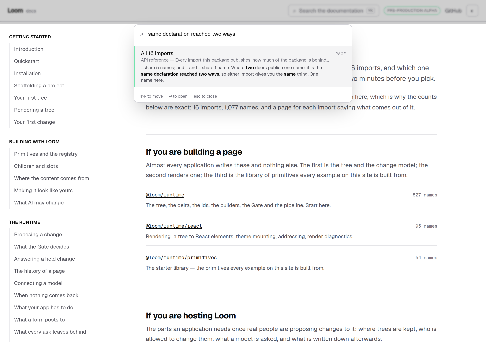
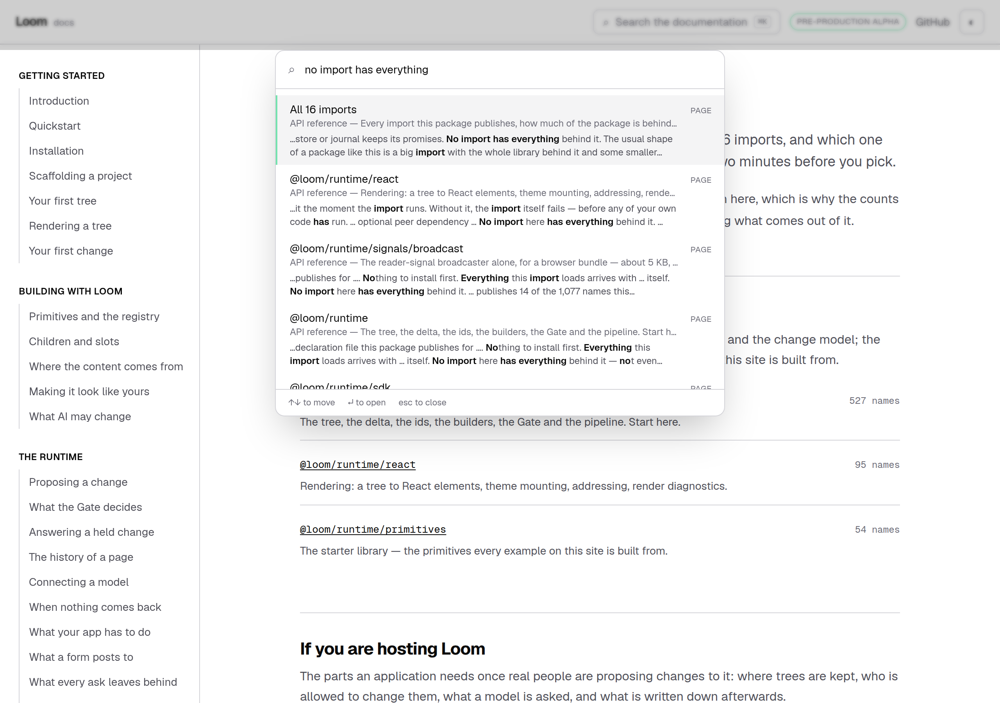
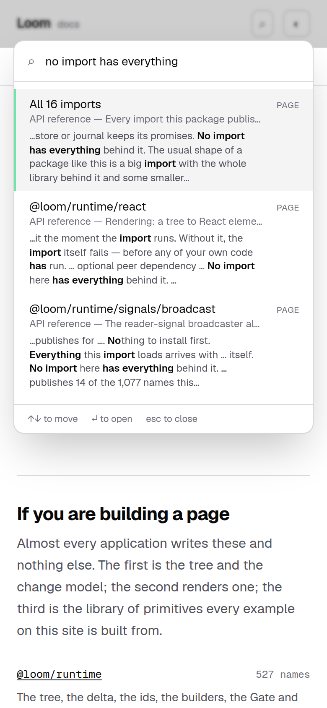

# 26 September 2026 — the words a component renders, and the seventeen pages the search box could not read

**Routine:** `Loom docs` · **Branch:** `docs-36-the-words-a-component-renders` · **Section:** §4c

**Preview:**
<https://loom-git-docs-36-the-words-a-c-PENDING-jpizzolato36-6341s-projects.vercel.app>


*On `main`: **"Nothing on the site says 'same declaration reached two ways'"** —
with the sentence three inches below the dialog, on the page behind it.*



*On this branch: one result, the page the sentence is on, cut at the sentence.*

## What this run was

The findings queue: the entry this lane filed against itself yesterday, which was
the one thing it had left open. It said the choice between three ways out **was
the whole of the ask**, so this report is mostly that choice and what it cost.

## The plain version

Most pages on this site are files. Somebody wrote the sentences, the index reads
the file, and the search box finds them. **The seventeen reference pages are not
files** — they are components over data generated from the package — so there
was nothing to read, and what the index held for one of them was its title and
its one-line summary.

That was close to free while such a page was a list of names: what a reader
wants to find on a list of names is a name, and the names have an index of their
own. It stopped being free on Wednesday, when those pages grew five bands of
argued prose, and again on Thursday, when `/docs/api-reference` became a whole
page of it. A reader searching *no import has everything* or *same declaration
reached two ways* was searching for a sentence this site contains and its index
did not.

**The reference's sentences are now in the search box**, read off the thing that
renders them. Nothing is written down twice: the band says the sentence, and the
index reads the band.

## The choice the finding asked for

The finding offered three, and the answer took the first **arrived at the way the
second describes**:

| | what it is | why not |
| --- | --- | --- |
| render it and read the text back | truthful by construction | a server renderer cannot render `next/link` inside the server build — see below |
| let a page **declare** its prose beside the data | cheap | a second copy of every sentence, unless the component reads it too |
| say nothing | defensible | less defensible with every band |

What shipped is the first without a renderer: **the element tree is walked**, and
the text a reader would see is collected from it. Rendering was tried and is not
available here — the bands import `next/link`, which is a *client* component, and
inside the server build `Link` is a proxy standing in for a module that is not
there. Both rendering it and calling it throw:

```
Error: Attempted to call the default export of …/next/dist/client/app-dir/link.js
from the server but it's on the client.
```

That error is the reason `rendered.ts` checks for `$$typeof === Symbol.for("react.client.reference")`
rather than for `typeof type === "function"`. **It was caught by `next build` and
by nothing else** — in a test, `next/link` is the real component and the walker
calls it happily. Written down in the module, because the next lane to walk an
element tree will meet it.

## What it is made of

| file | what it is |
| --- | --- |
| `_lib/search/words.ts` | the last thing that happens to every body, wherever it came from — spacing, one ellipsis for a run of missing names, no space before the punctuation one left behind. `prose.ts` now ends here too, and its behaviour is unchanged |
| `_lib/search/rendered.ts` | the walker: a plain function component is called, a client reference is read through to its children, `<code>` and `<pre>` are an ellipsis, and a region marked `data-search="off"` is nothing |
| `_lib/search/generated.ts` | the words of every page in a generated section, keyed by address |
| `_lib/api/body.tsx` | **what a reference page is below its title, said once** — the route renders it and the index reads it, so the page a reader is looking at and the page the search box describes cannot drift apart |

Two regions say they are not prose, and both say why where they are set: the
**signature list** (a thousand names and their doc comments would outrank the
export a reader typed letter-for-letter — the same argument `prose.ts` already
makes for a name between backticks) and a page's **table of contents** (a list
of links is navigation; every target is in the index under its own title).

The lead paragraphs of both routes moved into the components they sit above.
Same paragraph, same place on the page, same classes — but a paragraph written
in the route is a sentence the index cannot reach, which is the defect in
miniature.

## The truth of it is tested against a browser

The strong claim here is that **the words collected are the words a reader
sees**, and a test comparing the walker to a second implementation of itself
would go on passing on the day both stopped reading a band. So the comparison is
against a rendered document: Testing Library puts the real components in a real
DOM, the code and the marked regions are removed from it, and the text runs are
read back out in order and compared word for word with what the walker collected
— for an invented tree, for the reference's front door, and for a reference page
with its bands, its names and all.

## Found on the way: an excerpt that answered with the wrong sentence

`match.ts` built a result's excerpt from **the first place any of the reader's
words appeared**. On a written page that is right by construction: a body is the
prose under one heading, so the first `two` in it is in the sentence about `two`.

A generated page's body is the whole page — 4,548 characters on the front door,
because its bands have no anchors to cut it at. Photographed on the production
build, searching *same declaration reached two ways* returned the right page and
showed the reader:

> *"…what your program loads — so they are worth **two** minutes before you pick.
> Every name behind them is read from the package…"*

Every word they typed was on that page. Not one was in the line they were shown.

The excerpt is now cut **where the most of the reader's words are together**,
ties to the earliest place — which is the old behaviour wherever the words are as
together at the top as anywhere else, and keeps a query answering with the same
line every time. It is a better excerpt on the written pages too; the long body
only made it visible.

A heading also now ends in a full stop inside a body where it does not already
end in something. On a written page a heading opens a section and is never
inside a body; on a one-body page it ran into the sentence under it — *"…keeps
its promises. No import has everything behind it The usual shape of a package…"*



*`no import has everything`: the front door first, with the band that answers as
its excerpt — and, under it, the crowding this run also measured and filed.*

## What it bought, and what it cost

Measured on the real index with the ranking a browser runs, before and after.

**Bought:**

| query | before | after |
| --- | --- | --- |
| *no import has everything* | three unrelated headings | **All 16 imports**, first |
| *does the biggest import have everything* | nothing | **All 16 imports** |
| *same declaration reached two ways* | nothing | **All 16 imports**, alone |
| *what do I install first* | nothing | ten reference pages |

**Cost, and it is filed rather than hidden:** the four bands on a reference page
are one band rendered sixteen times with different numbers in it, so a query
whose words are in a band matches sixteen near-identical pages.

| query | before | after |
| --- | --- | --- |
| *peer dependency* | **Installation → What you actually need**, first | nine reference pages, and that heading **tenth** |
| *no import has everything* | — | ten results, ten of them reference pages |

The first row is a regression for the reader this site is written for. It is in
`FINDINGS.md` with the three remedies and a recommendation — **fold siblings in
the result list**, one row with *and 9 more imports*, which is the only one of
the three that keeps every sentence findable. Not taken here because it is a
ranking-and-presentation change with its own tests, and this pull request is the
index.

## What it costs to send

Nothing a reader waits for moved.

| | before | after |
| --- | --- | --- |
| Contents — the only file a reader waits for | 38.1 KB raw / **7.5 KB gzip**, 207 rows | **unchanged, to the byte and the row** |
| Prose — *API reference* | 13 bytes | **24.4 KB raw / 3.3 KB gzip** |
| Prose — all five sections | 171 KB / 58.3 KB | 190.9 KB / **60.2 KB** (caps: 260 KB / 80 KB) |

A generated page's words sit under the page entry that was already in the
contents file, rather than under 85 new heading entries — 85 rows in the file a
reader sits in front of, for bands that have no `id` to land on. The reference
shard is the cheapest large file in the index: it compresses seven and a half
times, because sixteen pages built from one set of bands say many of the same
sentences with different numbers in them. That is the same fact the cost above
is about, seen from the other side.

## Decisions taken that were not specified

**No decision record.** Nothing here constrains anything outside this route
group, and no Accepted record is touched. Reading a generated page's words off
what it renders is §4c's own rule — *the reference is generated, not written* —
applied to the index rather than to the page.

**Default on, with an opt-out.** A band added to a reference page next month is
searchable the day it ships without anybody remembering anything; a region that
is not prose says so, in the file, next to the reason. The failure this run was
fixing was a sentence that was missing, so the default is that a sentence is
read.

**A name is left out of a generated body**, exactly as it is left out of a
written one: `<code>` becomes an ellipsis, as backticks already do. So
`horizonOf is two functions` still finds the *name* in the names band rather
than the sentence about it. Same rule, same reason, whichever half of the site
the sentence is on — and it is what stops a reference page outranking the export
a reader typed.

**A `<pre>` is not prose either.** The install command and the signatures are
things to copy, which is the rule the code band already applies to a fence.

## Tests

`pnpm install && pnpm verify` at the repository root: **green, exit 0**, read out
of a log file rather than through a pipe.

| | `main` at `d82dcac` | this branch |
| --- | --- | --- |
| `@loom/runtime` | 160 files / 3,073 tests | **160 / 3,073** — `src/` was not opened |
| `@loom/app` | 309 / 5,904 | **311 / 5,934** |
| findings ledger | 802 entries, 0 malformed | **803**, 0 malformed |
| prerender | 112 pages, 1,285 junctions | **112**, 1,300, 0 run together, 0 unserved |

**+30 tests in two new files and two existing ones**, none weakened, none
skipped. One existing test was rewritten and it is the one to look at: *"hands
back an empty file for a section with nothing written in it"* asserted that the
API reference's words file is empty, which is exactly what this branch makes
false. It now asserts what that address serves — a body over 400 characters for
every page in the section, and the front door's argument in it — and the
adjacent tests still hold the *rather than a 404* half it was also protecting.

Green is not evidence, so **seven mutations were introduced one at a time**,
against a baseline of 190 passing across the search, the two components and the
index routes:

| what was broken | what went red |
| --- | --- |
| the excerpt cuts at the first matching word again | 1 |
| two equally good places tie to the later one | 2 |
| the walker ignores `data-search="off"` | 9 |
| code is prose again | 8 |
| a heading no longer stops | 2 |
| the index stops reading the generated pages | 2 |
| the signature list stops saying it is not prose | 5 |

Nothing survived. Files were restored from byte-for-byte copies rather than with
`git checkout`, and `diff` against the copies is empty on all four.

**One mutation is deliberately not in that table**, because no test in this
repository catches it: treating a client reference as a callable component. It
is caught by `next build` and only by `next build` — in vitest `next/link` is the
real component — which is how it was found in the first place and why it is in
the module's own comment.

## At 390 pixels

`scrollWidth 390 / innerWidth 390`, on both. The dialog is the chrome's and this
run did not touch it.



## Scope

`apps/loom/app/(docs)/` only, plus `FINDINGS.md` and this report. Thirteen files
under `(docs)`: five new — `_lib/search/words.ts`, `rendered.ts`, `generated.ts`,
`_lib/api/body.tsx`, and two test files — and eight touched.

**No file in another lane was opened.** `git diff origin/main -- src/` is empty,
and the generated reference is untouched: this run measured nothing new about the
package, it read what the pages already say about it.

## Findings

**Closed — two.** Yesterday's *the site cannot search a sentence a component
renders*. And the excerpt defect this run found and fixed, recorded because the
class is general: a rule that is correct because of a property somebody else's
code happens to have — *a body is one paragraph* — is a rule with an undeclared
premise.

**Filed — one.** The crowding measured above, with its three remedies and a
recommendation.

**Not re-filed:** the preview URL cannot be verified from this sandbox (15
September); the screenshot harness photographs an address while the theme lives
in `localStorage`, so the page pictures are light (14–16 September); the phone
heading break on an entry-point page (23 September); and `(docs)` still links to
`/` zero times (24 September, `Loom marketing`), which remains the oldest open
thing this lane owns.

## What I would write next

- **Fold the siblings**, per the finding above. It is now this lane's newest
  regression and the fix is a result list rather than an index.
- **A way back to the front door.** Unchanged from the last report and now the
  oldest open thing here.
- The `<wbr/>` at each slash in the entry-point heading, so the four longest
  doors stop breaking mid-word on a phone.
