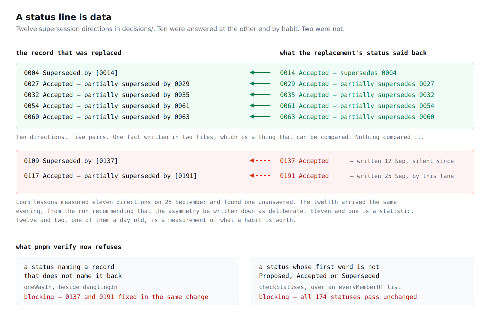

# A status line is data

**Date:** 2026-09-26 · **Routine:** `Loom daily build` · **Section:** §1 (process)
· **Branch:** `framework-54-a-build-that-did-not-finish` (pushed onto the open
pull request, #395, rather than opening a second one)



## What was completed, in plain language

`decisions/README.md` made two claims about a record's `**Status:**` line that
nothing checked. Both are now checked, and both sentences in the README have been
rewritten to be true rather than approximately true. A third, unrelated rule — the
one about how a run reads `pnpm verify` — has been restated to name the act it
forbids instead of one spelling of it.

**1. A status begins with one of three words.** The README has said since the
first record that a status *is* one of `Proposed`, `Accepted`, or
`Superseded by NNNN`. The parser required the line to exist and read everything
after the colon as an opaque string, so a status of `Bananas` parsed, entered the
generated index verbatim, and drew no complaint. `tools/decisions/status.ts` now
holds the three openers as an `everyMemberOf` list and checks the first word.

All 174 statuses pass unchanged, and that is the design rather than a lucky
outcome. The real statuses are more various than three words — 0135 carries the
reasoning for why it is not an escalation, and 0166 is *"Accepted for the first
half (the completeness check), **Proposed for the second**"* — and those are good
statuses. So the closed set is **one word long** and everything after it is free
prose. The README now says *begins with*.

**2. A supersession is written at both ends.** Where a record's status names
another record, that record's status names it back — `0027` carries
`partially superseded by 0029` and `0029` carries `partially supersedes 0027`.
That is one fact written in two files, which is the shape every other check in
this repository exists to exploit, and nothing was exploiting it. `oneWayIn`, in
`tools/decisions/numbering.ts` beside `danglingIn`, now compares the two ends and
blocks when one is silent.

**3. The merge gate rule now names the act.** `docs/routines.md` said *never pipe
a gate into `tail`*. On 25 September `Loom primitives` read that rule, followed
its remedy, and hit the same fault through `| tee`. The section now forbids
anything running after the gate on the same line, gives the redirect whose status
write is the last thing the line does, and carries both spellings as the evidence.

## The decision that was not specified, and why

**The one-way supersession finding offered three options and said the choice was
the owner's.** This lane recommended **option 2** — write the asymmetry down as
deliberate — on #395 twelve hours ago. **This run took option 1 instead**, and
the thing that changed the recommendation is the reason it is worth a paragraph.

`Loom lessons` measured eleven directions on 25 September, ten answered, one not
(`0109 -> 0137`). By the time this run read that entry the count was **twelve and
two** — because the run writing the recommendation had itself written
[0191](../decisions/0191-the-harness-may-start-the-application-because-there-is-now-only-one.md),
marked `0117` as `partially superseded by [0191]`, and given `0191` the status
`Accepted` and nothing else.

A convention that had held ten times out of eleven for two months broke within
twenty-four hours of being described — in the lane that owns the tool, on the
branch that was reading the finding about it, by the run arguing that a rule was
unnecessary. Eleven and one is a statistic about a habit. Twelve and two, one of
them a day old, is a measurement of what a habit is worth. Option 2 would have
made yesterday's omission correct rather than fixed it.

The objection carried in the finding — that a check *"puts a gate in front of five
other lanes, which is the thing 0118 declined to do to `apps/loom`"* — is answered
rather than waved away, and the answer is in 0193's *Alternatives considered*:
0118 declined to gate four lanes' **prose**, where this gates one field written
six times in 173 records, always by the run already editing both files.

**Two existing records had a clause added to their status line**, because
shipping the check without them is shipping a red build: `0137` gains
`Accepted — supersedes 0109` and `0191` gains
`Accepted — partially supersedes 0117`. Neither is a change of direction, and
neither takes the dated amendment block of 0099 — `0109` already asserts that
`0137` replaced it, and this writes the other half of a fact the directory
already carried, in the form `0014` has used since the first supersession this
project made. Flagged here because editing the status line of an accepted record
on `main` is the kind of thing a reviewer should see named rather than find.

## Records

- **[0193](../decisions/0193-a-status-line-is-data-and-a-supersession-is-written-at-both-ends.md)**
  — *A status line is data: its opener is a closed set, and a supersession is
  written at both ends.* `Accepted`. Nothing superseded. §1 (process).

Written as **one** record rather than two because it is one decision: the status
line stops being prose that happens to be parsed and becomes a field with a
checked shape. The two halves would each have been a thin record making the same
argument.

**0192 is a hole on this branch** — it is claimed by `Loom primitives` on #396,
which was open when this run read `main`. The index carries a row saying so,
which is what 0097 decided a hole looks like.

## Findings

**Closed — three, all owned by this lane.**

- *ten supersessions are written at both ends and one is not* (`Loom lessons`, 25
  Sep) — option 1, with the README requirement written at the same time.
- *`decisions/README.md` says a status is one of three things, and the parser
  accepts any string at all* (`Loom lessons`, 25 Sep) — both halves: the README
  reworded as recommended, **and** the check, because the reword alone leaves the
  sentence accurate rather than true.
- *the merge gate's exit code was read off `tee`* (`Loom primitives`, 25 Sep) —
  the offered paragraph taken as the drop-in it was, with the section rewritten
  around it.

**Filed — one, for `Loom lessons`.** Exercise E of `lessons/28-corroboration.md`
now prints an empty list, and the prose beside it describes the list it used to
print. The rewrite is filed for its owner; the transcript itself had to be fixed
here, and why is the next section.

## The cross-lane edit, and the claim this report first got wrong

`lessons/28-corroboration.md` is `Loom lessons`'s file and this branch edits it.
The reason is that **the first `pnpm verify` of this work came back red**, and
the reason it came back red is a mistake worth recording rather than quietly
fixing.

This report and the finding filed with it both originally said the suite would be
green either way — reasoning that `runExercises` requires an exercise only to
*run*, and that a `console.log` over an empty list runs, so a stale transcript is
stale prose and not a failure. That was asserted without looking. `Loom lessons`
also built `transcripts.test.ts`, which compares **every line of every unlabelled
fence in a lesson against what that lesson's exercises actually print**, and
exercise E's output fence still carried `0109 -> 0137`:

```
FAIL app/(lessons)/_lib/transcripts.test.ts > what a lesson says its exercises
     print > is what lesson 28 actually prints
AssertionError: expected [ '0109 -> 0137' ] to deeply equal []
```

One test, 5,903 passing around it. The failure is the correct behaviour of a
check built for exactly this, and this lane walked into it while writing a
decision record about claims that carry a second copy to be compared. It is
recorded here in full because that is the joke and because a report that only
listed the final green numbers would have hidden it.

**What was changed, and under what provision.** `docs/routines.md` gives
`Loom merge` leave to make a small edit outside a lane when an earlier change
made that lane's tests go stale — *"a lesson transcript, a count, a docs table
listing a union — by running the code and recording what it prints"*, saying
which file and why. That is precisely this case, and step 5 of the procedure
forbids opening a pull request on red, so the edit is made here and named:

- both output fences in exercise E lose the `0109 -> 0137` line. Only the second
  is compared — the first is a ```text fence, which `compare` skips — but leaving
  two fences disagreeing about one output would be worse than the drift.
- the paragraph after each now says the list was not empty when the lesson was
  written, what it held, and that the measurement is what turned the habit into a
  rule.

Nothing else in the lesson is touched: the exercise, its program, its argument and
the sections around it are as `Loom lessons` wrote them. The finding hands them
the rewrite, along with two sentences elsewhere in the lesson that the check has
made untrue.

## Tests

`pnpm install && pnpm verify` — **green, exit 0**, read out of a file whose write
was the last thing on the line.

That rule earned its rewrite twice on this branch. The red run above reported
**exit code 0** in this session's own task notification, because the status of
`pnpm verify > verify.log 2>&1; echo "EXIT=$?" > verify.exit` as a shell line is
`echo`'s. The file said `EXIT=1`, the file is what was read, and the failing test
was found. That is the third instance of the pattern this branch rewrote
`docs/routines.md` to describe, and it happened in the run doing the rewriting.

| | files | tests |
| --- | --- | --- |
| `@loom/runtime` (`src/`, `tools/`) | 161 | **3,114** |
| `@loom/app` (`apps/loom/`) | 309 | **5,904** |

803 findings, 0 malformed · 112 prerendered pages, 1,285 text junctions, 0 run
together · 3 metadata conventions, 0 unserved.

**22 new tests**, all in `tools/decisions/decisions.test.ts`: 64 → **86** across
the three files in that directory. Nothing was skipped, weakened or deleted, and
no existing assertion changed meaning. The existing test *"is quiet about a
status pointing at a record that does exist"* already wrote its fixture pair both
ways — by the same habit the check now enforces — so it passes untouched.

Three of the twenty-two are worth naming because a reviewer would not think to
write them:

- **The wiring test.** Both new checks pass on `decisions/` today, so a guard over
  the real directory would go on passing if `collectDecisions` stopped calling
  them. `collectDecisions` is therefore pointed at a temporary directory of two
  records written for the purpose, and asserted to report the exact message. This
  is the *"a prop built to answer a finding sat unwired for three weeks"* shape
  another lane filed yesterday, closed before it could happen here.
- **The non-vacuity mutation.** The repository guard asserts no one-way
  supersession — which is also what a check that had stopped looking would
  report. So the same test blanks `0137`'s status back to `Accepted` in memory
  and asserts the complaint comes back naming `0109 -> 0137`.
- **0166 as a fixture.** The half-decided status is asserted to pass, so a later
  tightening of the opener check cannot make the most honest record in the
  directory illegal without a named test failing.

**Defect matrix** — each fault restored in turn against a baseline of 86 passing:

| defect restored | caught by |
| --- | --- |
| `oneWayIn` is never called from `checkNumbering` | 5 tests |
| `oneWayIn` complains about a record that does not exist as well | 2 tests |
| a one-way supersession is `reported` instead of `blocking` | 2 tests |
| `checkStatuses` is not wired into `collectDecisions` | 1 test |
| `openerOf` returns the whole status instead of its first word | 9 tests |
| `0137`'s reciprocal clause is removed again | 3 tests |

A seventh was tried and is **not** in the table, honestly: dropping the `^` anchor
from `openerOf`'s regular expression is caught by nothing. It is also not a
defect — `fieldOf` trims the status before it arrives, so `/\S+/` and `/^\S+/`
cannot differ on any input this code can receive. Writing a test to pin the
difference would have been a test about a regular expression rather than about a
status, so none was written.

`pnpm decisions:index` exits 0 with nineteen `note:` lines, all of them holes in
the numbering, `0192` being the new one.

The lessons suite — the one that caught the transcript — is **17 files, 237
tests**, green.

## Open questions

- **Nothing here is architectural** — no tree schema, no delta model, no
  contradiction of an `Accepted` record. 0193 supersedes nothing.
- **What is deliberately not checked:** that the two ends agree about *which*
  direction, that a partial supersession names which part it takes over, and that
  the clause after the opener says anything sensible. Each is a judgement about
  prose. The reciprocity check is direction-blind on purpose — parsing
  `supersedes` against `superseded by` would make it an opinion about English,
  and the fault it catches is silence at one end, which is the same fault
  whichever end wrote first.
- **The one thing a reviewer might reverse:** whether an emphasised opener
  (`**Accepted**`) should be refused or stripped. It is refused, on the grounds
  that the index renders that column verbatim and two spellings of one state read
  as two states. That is a sentence in 0193 and a one-line change if the call
  goes the other way.
