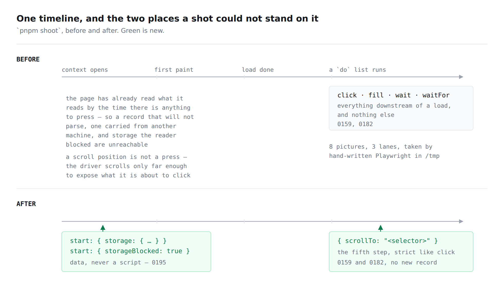

# The states a shot could not reach

**Date:** 2026-09-26 · **Routine:** `Loom daily build` · **Section:** §1 (process)
· **Branch:** `framework-56-the-states-a-shot-could-not-reach`



## The migration

**Already done, and not by this run.** [0067](../decisions/0067-the-four-surfaces-are-one-application.md)'s
one-application shape is on `main`: `apps/` holds `apps/loom` and nothing else,
with `(marketing)`, `(docs)`, `(lessons)`, `(portal)` and `(demo)` as route
groups, sign-in at the `(portal)` boundary in middleware, and one Vercel
deployment. `apps/portal` and `apps/docs` do not exist. The tree is not
half-migrated and nothing is owed to the three routines that were waiting on
its shape.

So this run took the next thing in the order: **open findings owned by this
lane.**

## What was completed, in plain language

Two findings, filed eight days apart by two lanes, asked for the same thing
from opposite ends of one timeline: **a shot could not stand anywhere except
downstream of a load.** `pnpm shoot` can now stand in both places.

**1. `{ "scrollTo": "<selector>" }` — the fifth `do` step.** `Loom demo` pinned
a caution to a rail's scroller and needed the frame a visitor reaches by
scrolling *back* to the controls. No press lands there: Playwright scrolls an
element into view before clicking it, but only to the minimum position that
exposes that element, which is a position chosen by the driver rather than by
the lane. `scrollTo` is strict like `click` and unlike `waitFor` — which of two
matches is brought into view decides what the picture is of, exactly as which
of two buttons is pressed does.

**2. `start` — what the browser already holds when the first document loads.**
`Loom lessons` shipped three screens whose whole subject is the state the
browser arrived with, and none of them is reachable by any step, because by the
time there is something to press the page has read the record and decided what
to say. Two members, and no third:

```json
{ "path": "/lessons/record", "out": "…", "start": { "storage": { "loom.lessons.progress.v1": "{{{" } } }
{ "path": "/lessons/record", "out": "…", "start": { "storageBlocked": true } }
```

Between them: 8 pictures, across 3 lanes, taken by hand-written Playwright in a
scratch directory — the arrangement [0116](../decisions/0116-a-screenshot-is-taken-by-the-repository-and-playwright-is-never-a-dependency.md)
exists to keep from becoming normal, and the one property such a picture loses
is the only one the harness is for: it cannot be retaken from anything in the
repository.

## The decision that was not specified, and why

**The 17 September finding declined to guess and said so**, which is the reason
it was filed rather than attempted. The obvious field is an `initScript`
string: one field, covers every case including the ones nobody has thought of.
It is refused, permanently, in [0195](../decisions/0195-a-shot-may-say-what-the-browser-started-with-and-it-says-it-as-data.md).

A shot list is *input*. Everything in `plan.ts` is Zod and `strict` so that a
misspelled `clik` is loud rather than an empty step that photographs the
ordinary page. A string of JavaScript has no misspellings — only different
programs — and the failure it produces is precisely the one the schema exists
to prevent: an error thrown inside a page nothing is watching, surfacing as a
correct-looking photograph of the wrong state. It is also a standing invitation
to put the assertion [0159](../decisions/0159-an-instrument-may-reach-a-state-and-may-never-assert-one.md)
forbids into a shot list, one `if` at a time.

So `start` is a **closed set of named states**, and both halves shipped rather
than the safe one. The finding was right that a map of keys cannot reach
blocked storage — there is no value of any key that means *this throws* — and
that the blocked case is the one most worth a picture, because it is the one a
reader cannot see is happening. `storageBlocked` replaces the `localStorage`
**getter**, not `getItem`, because that is where a browser throws and a page
that guards the call and not the access is exactly the page worth photographing.

`scrollBy: <pixels>`, offered beside `scrollTo` in the 25 September finding,
was **declined**: a distance is a position chosen against a scroller the list
does not name, it means a different thing at `phone` and at `wide`, and both
lanes that asked meant *the controls* rather than *four hundred pixels*.

## The defect this run shipped, found by taking the picture

The first version of the start state handed `addInitScript` a TypeScript
function and let Playwright serialise it. Every test passed — including one
written for exactly this hazard, which took the function to source, evaluated
it in a fresh scope and ran it. Then `pnpm shoot` produced a `storageBlocked`
picture that was **byte-identical** to the ordinary one.

`tsx` compiles with esbuild's `keepNames`, so a function containing a nested
function arrives in the page as

```
()=>{Object.defineProperty(window,"localStorage",{…,get:__name(()=>{…},"get")})}
```

and `__name` does not exist there. The init script threw a `ReferenceError`
nobody was watching, the property was never defined, and what came back was a
correct photograph of the wrong state — the single failure mode this harness
exists to prevent, arriving through the field added to prevent it. `seedStorage`
had no nested function, so it worked, which is why the docs theme and the
unreadable record were right and only the block was wrong.

**The round-trip test did not catch it because Vitest's transform is not
`tsx`'s.** It was evaluating a different string from the one that ships. That is
the part worth carrying away: a test of the code is not a test of the artefact,
and a harness whose subject is *what a browser actually did* is exactly where
the difference bites.

**The fix takes the transform out of the path.** `tools/specimen/start-state.ts`
holds the injected scripts as string literals — what is written is what the
browser runs, character for character — and the data goes in through
`JSON.stringify`, which is also what keeps a record containing a quote from
becoming program. The test that would have caught it now exists: it compiles
the module with esbuild and `keepNames` on, the way the harness compiles it,
and asserts the shipped string is unchanged. Restoring the serialised-function
version fails that test and nothing else.

**This was found by looking at the picture**, after `md5sum` said two files that
should differ did not. Nothing else in the run would have said so.

## Records

- **[0195](../decisions/0195-a-shot-may-say-what-the-browser-started-with-and-it-says-it-as-data.md)**
  — *A shot may say what the browser started with, and it says it as data.*
  `Accepted`. Nothing superseded. §1 (process).

**`scrollTo` gets no record**, deliberately. It is a fifth member of a set 0159
and 0182 already decided the shape of, and 0159 named *scrolling to a position*
as a reach it had not been asked for yet. A record saying "the thing 0159 said
would be fine is fine" is a record that makes the directory longer and not
better. What it *did* need — why `scrollBy` was declined — is a paragraph in
0195, beside the rest of the reasoning about what a shot may name.

**0194 is a hole on this branch.** It is claimed by this lane's own open
pull request #402, which was open when this run read `main`. The index carries
a row saying so, which is what 0097 decided a hole looks like.

## Findings

**Closed — two, both owned by this lane.**

- *a shot list can press and wait and cannot scroll* (`Loom demo`, 25 Sep) —
  `scrollTo` shipped; `scrollBy` declined with the reason recorded.
- *a shot list can click and wait, and cannot photograph a state that lives in
  the browser before the page loads* (`Loom lessons`, 17 Sep) — `start`
  shipped, **both** members, with the `initScript` question decided against.

**Filed — none.** Nothing outside this lane was touched and nothing outside it
was found wanting.

## Tests

`pnpm install && pnpm verify` — **green, exit 0**, read out of a file whose
write was the last thing on the line.

| | files | tests |
| --- | --- | --- |
| `@loom/runtime` (`src/`, `tools/`) on `main` | 161 | 3,130 |
| `@loom/runtime` on this branch | **163** | **3,163** |
| `@loom/app` (`apps/loom/`) — untouched | 315 | 6,103 |

**33 new tests, 2 new files.** The `main` row is measured, not remembered: the
branch was stashed, the suite run, and the stash popped. 814 findings, 0
malformed · 112 prerendered pages, 1,300 text junctions, 0 run together · 3
metadata conventions, 0 unserved. Nothing was skipped, weakened or deleted, and
no existing assertion changed meaning.

Three are worth naming because a reviewer would not think to write them:

- **The artefact test.** `start-state-source.test.ts` compiles its subject with
  esbuild and `keepNames` on — the setting `tsx` uses — and asserts the shipped
  string is identical to the one Vitest sees. It is the only assertion in the
  suite that could have caught the defect above, and it is in a file of its own
  because esbuild cannot run under jsdom: its `TextEncoder` is not Node's and
  the library refuses to start.
- **The escaping tests.** A record is a lane's arbitrary text arriving through
  JSON, so a value containing `"`, `\` and a newline goes in and comes back
  identical, and so does a *key* that would end the literal. The failure being
  prevented is not a wrong picture; it is data becoming program.
- **The two characters JSON is allowed to leave raw.** U+2028 and U+2029 are
  legal in a JSON string and were line terminators in a JavaScript one until
  ES2019. They are escaped anyway, and the test pins it.

**Defect matrix** — each fault restored in turn against a baseline of 175
passing across `tools/specimen` and `tools/screenshot`:

| defect restored | caught by |
| --- | --- |
| the block ships as a serialised function rather than a literal | 1 test |
| `start` is applied after the `before` instead of before it | 1 test |
| `start` is never applied at all | 3 tests |
| U+2028 and U+2029 are left raw in a seeded value | 1 test |
| a scroll takes the first of several matches | 3 tests |
| the `scrollTo` branch is dropped and a scroll falls through to `wait` | 3 tests |
| `storageBlocked` is a `boolean` rather than the literal `true` | 1 test |
| an empty `storage` map is accepted | 1 test |
| the seeding member is not `strict` | 2 tests |
| the block is defined non-`configurable` | 3 tests |
| `start` is moved onto the approach shape, so a `before` may carry one | 1 test |
| the two members of `scriptFor` are swapped | 3 tests |

`pnpm decisions:index` exits 0 with nineteen `note:` lines, all of them holes
in the numbering, `0194` being this lane's own.

## The pictures, which are the point

Every one of these was taken by `pnpm shoot` against the built application, and
before this branch not one of them could have been.

**`storageBlocked`** — the state a reader cannot see is happening. Before the
fix above, the second of these was byte-identical to the first.

- `2026-09-26-framework-start-record-ordinary-wide.png`
- `2026-09-26-framework-start-record-blocked-wide.png`

**`storage`** — a record that will not parse, seeded before the first paint.

- `2026-09-26-framework-start-record-unreadable-wide.png`

**`scrollTo`** — the same page, before and after one step, no press anywhere.

- `2026-09-26-framework-scroll-before-wide.png`
- `2026-09-26-framework-scroll-after-wide.png`

One thing a lane should know: a `scrollTo` whose selector matches nothing fails
the shot loudly, with a `TimeoutError` naming the selector, rather than
photographing where the page happened to be. That was hit during this run, from
a wrong href, and it is the correct behaviour.

## Open questions

- **Nothing here is architectural** — no tree schema, no delta model, no
  contradiction of an `Accepted` record. 0195 supersedes nothing.
- **`start` will be asked to grow**, and the answer each time is another named
  member: a cookie, a media preference, a clock. Each is a small decision about
  what is data. The answer ruled out is the one that makes all of them
  unnecessary at once.
- **An init script runs on every document in the context**, so a shot whose
  `before` writes to a key that `start` seeds will have the seed reapplied on
  the next navigation. Stated in the docblock rather than worked around: a shot
  that needs the two to interact is asking for a sequence, and `do` is what a
  sequence is.
- **The one thing a reviewer might reverse:** whether `scrollTo` should be
  strict. It is, on the grounds that which of two matches is brought into view
  decides the picture — the same argument `click` makes. `waitFor` takes the
  first, and the asymmetry is deliberate. It is one `.first()` if the call goes
  the other way.
