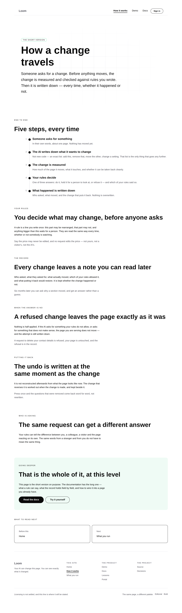
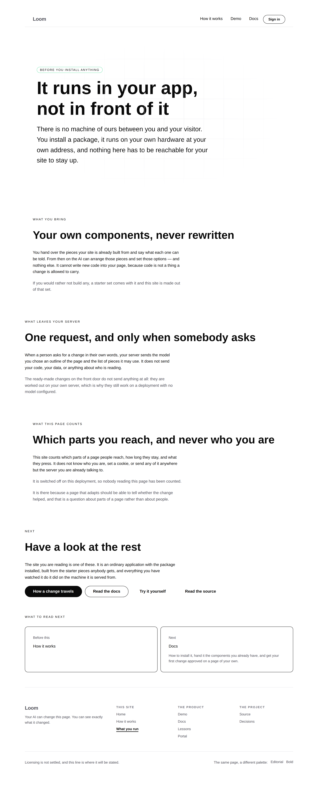

# 2026-09-26 — marketing: the cliff notes, at the maintainer's direction

The maintainer read this site this evening and gave four instructions. They
outrank the plan, and this branch is them.

> *It is too detailed and too complex. It should be simple enough that a high
> schooler can understand it… We can probably get rid of about 60%-75% of the
> content. No need for tabs to explain The rules, The record, When it goes
> wrong. Combine these into the cliff notes versions and you can probably
> combine it all under the How it works page… No UK/English in the marketing
> page.*

He was right on every count and none of it was visible from inside. The site had
grown to **ten pages and 13,208 words** — a documentation site with a marketing
site's address.

| | before | after |
| --- | --- | --- |
| pages | 10 | **3** |
| words a visitor reads | 13,208 | **2,413** |
| | | **an 82% cut** |
| items in the top bar | 7 | **4** |
| printed JSON on `/how-it-works` | 12,415 chars (73% of the page) | **none** |
| our own words taught to a stranger | 5, with a glossary | **none** |
| UK spellings in rendered copy | 0 measured, 0 enforced | **0, enforced** |

The 82% is past the range he named. It is the consequence of the instruction he
gave rather than of a target I set: he asked for three pages to be folded into
one, and once the mechanism was in one place the four remaining pages about it
had nothing left to say. Every band is one line from coming back.

---

## What the site is now

**`/` — the front door.** Unchanged in shape, trimmed: the *how this page is
put together* band is gone, the four problem cards are shorter, the FAQ answers
are shorter. 1,643 → 1,318 words. It is still 55% of the site, which is the
right shape for a marketing site.

**`/how-it-works` — the whole mechanism, at one altitude.** Five steps, then one
short band each for the four questions the retired pages answered at length, then
*who is asking*, then the handover to the docs. 609 words.

**`/what-you-run` — the one buying question.** It runs in your app, you bring
your own components, one request leaves when somebody asks. 486 words.

### What was deleted

| page | words | where it went |
| --- | --- | --- |
| `/the-rules` | 1,382 | *Your rules* — one band |
| `/the-record` | 951 | *The record* — one band |
| `/when-it-goes-wrong` | 1,116 | *When the answer is no* — one band |
| `/putting-it-back` | 984 | *Putting it back* — one band |
| `/who-can-ask` | 901 | *Who is asking* — one band |
| `/your-components` | 1,405 | *What you bring*, on `/what-you-run` |
| `/what-readers-do` | 1,591 | *What this page counts*, on `/what-you-run` |

Two of those are not optional and are worth naming:

- **The reader-signal disclosure.** This deployment counts which parts of a page
  people reach, and the footer of every page linked to the page that said so.
  Deleting the page while keeping the collection would be this site quietly
  dropping the one thing it sells. It is a band on `/what-you-run` now, at
  `#what-we-count`, and the footer points there — **including the sentence that
  says whether counting is on for the deployment you are reading**, which is
  read off the same switch that decides whether the broadcaster is mounted.
- **The record link.** The front door's notice offered *See the whole record*,
  pointing at `/the-record` with a replayable sequence in the address. It now
  points at `/how-it-works?ask=…`, which already printed the record of a real
  run and already took an `ask`. What is lost is the multi-change sequence;
  nothing linked to one but that page.

### What went with the length, deliberately

**The glossary.** `/how-it-works` introduced five of our words — `provenance`,
`runtime`, `inverse`, `disposition`, `node` — plainly first, then by name. It
existed because the page printed 341 lines of the runtime's own JSON, in which
our vocabulary arrives whether anybody chose it or not. Both are gone. The
vocabulary is the documentation's to teach.

**The raw record panel.** 12,415 of the 17,059 visible characters of that page.
The front door already shows a real record in plain sentences, which is the
version a stranger can read.

---

## The test that was enforcing the wrong rule

`voice.test.ts` has held the register since 20 August, and its rule was about
*place*: the front door may not use a reserved word, a mechanism page may once
it has said the plain thing first. That second clause was written to keep the
rule from being censorship. It is also what let the jargon in — it made a
glossary the **compliant** answer. Print five of our words, introduce each one
plainly, and the suite goes green on a page that has just taught a stranger
`disposition`. Both directions were asserted. Nothing was ever red.

The rule is now flat: **no page of this site uses one of these words, anywhere**,
swept over every route. Shorter, stricter, and what the 20 August instruction
meant.

### And two new rules, because instructions decay

- **US spelling, on every route, read off the words a page renders** rather than
  grepped from source — most of the copy here is props rather than text nodes,
  and a source grep would have reported a clean site while every feature title
  went unread. Checked red by putting `behaviours` in a step body.
- **A band on the mechanism page is one answer and one example** — body at most
  60 words, example at most 30. The thing that would undo today is not a band
  disappearing; it is a band growing a third paragraph, then a fourth, until the
  page is the four pages again with different headings.

---

## Spelling

Zero UK spellings in rendered copy, before and after — the scan found them all
in identifiers and comments, not in what a visitor reads. Converted anyway
inside this lane: `unhonoured` → `unhonored`, `readingNeighbours` →
`readingNeighbors`, `colour` → `color`, and ten more across 29 files.
`catalogue` was left where it names the runtime's own module, which is another
lane's export and not this lane's to rename.

---

## What this cost, stated rather than glossed

**Real work by this lane was deleted** — seven page builders, their tests, and
four modules in `_lib/adapt/` that only they used (`askers`, `round-trip`,
`floors`, `history`). Some of it was good: `/who-can-ask` put sixteen real runs
side by side to show one request answered four ways, and `/what-you-run` printed
the exact size of the prompt that leaves your server, measured at build time.
Both were honest and neither belongs on a marketing site.

The application suite went from 6,010 tests to 5,094 — **916 fewer**. Not one
was weakened or skipped: every one of them asserted something about a page that
no longer exists. Where a deleted test was protecting something that outlived
its page, the assertion was moved rather than dropped — the mechanism page's
bands, the `loom.code` sweep, the register.

---

## Findings

**Two filed, both closed here, both recorded for the shape.**

- **The site was four surfaces' worth of documentation, and nothing could see
  it.** Every page was added by a run that had just found a real gap; each was
  defensible alone; no run ever saw the ten together. A lane that adds one good
  page a day builds a documentation site in a fortnight. Three things would have
  caught it — a word budget, an altitude rule in `docs/routines.md`, and
  somebody reading it cold — and none existed. Offered to the other four surface
  lanes, which are built the same way by the same kind of run.
- **The register test was enforcing the rule that let the jargon in.** An
  exemption written into a test to keep it honest is an exemption a later run
  will build inside.

---

## Open questions for the maintainer

- **Is three pages right, or is the 82% too far?** Every deleted band is in git
  and every one is a line to restore. My reading: `/` and `/how-it-works` are
  the site, and `/what-you-run` earns its place by answering *is this a service
  I am locked into* — the one question a stranger asks that is not about the
  mechanism. If you want a fourth, `/your-components` is the strongest
  candidate.
- **The licence line**, still this site's one placeholder, at the foot of every
  page.
- **Positioning, audience and pricing.** Untouched, as always.

---

## Tests

`pnpm install && pnpm verify` — **exit 0**, read off the run rather than a pipe,
on a `.next` and a `dist` deleted first.

| | |
| --- | --- |
| `pnpm verify` | **green, exit 0** |
| runtime | **3,073 passed** in 160 files — untouched |
| application | **5,094 passed** in 296 files, down 916 with the pages they tested |
| marketing suite | **871 passed** in 27 files |
| findings | **806**, 0 malformed |
| prerender | 112 pages, 1,285 text junctions, 0 run together, 0 unserved |
| `pnpm shoot` | 4 shots, no overflow at 1280 or 390 |

Nothing was skipped and nothing was weakened. No decision record: this is the
maintainer's direction on content, and it touches no tree schema, no delta
model and no `Accepted` record.

**Two things about the run itself.** The first attempt at the after-photographs
was taken through a server holding the *previous* build on port 3000 —
`EADDRINUSE` into a log nobody read, and `ss -ltnp` showing the port free while
`next start` insisted it was not. The fix was to serve on another port and prove
it with `curl` before photographing: the seven retired routes answer 404 and the
three live ones answer 200, checked before the shutter. That is the discipline
yesterday's report wrote down, met a fifth way.

And the first pass at the two rewritten pages used `width: "readable"` for the
prose bands while their neighbours were `wide`, which gave the page **two
different left edges**. Every test passed. The instrument that found it was a
full-page photograph, again.
