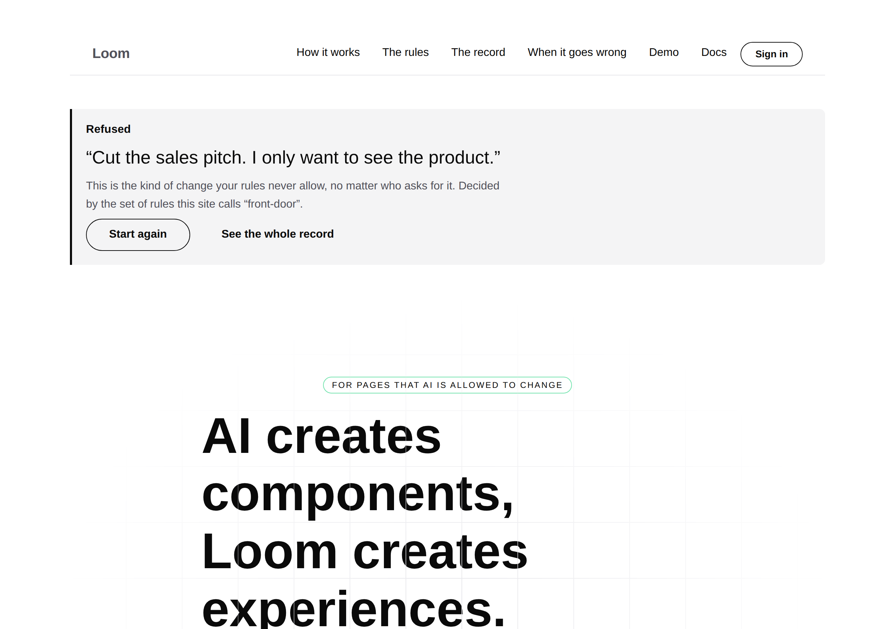
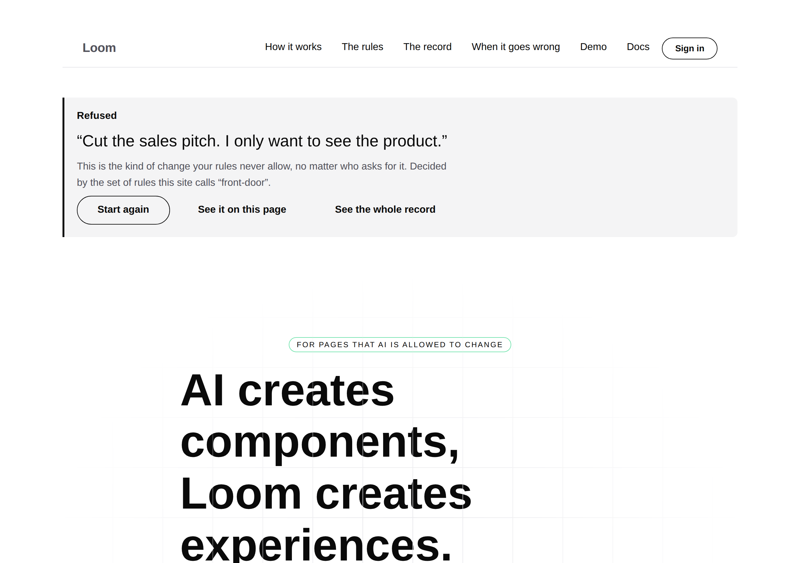
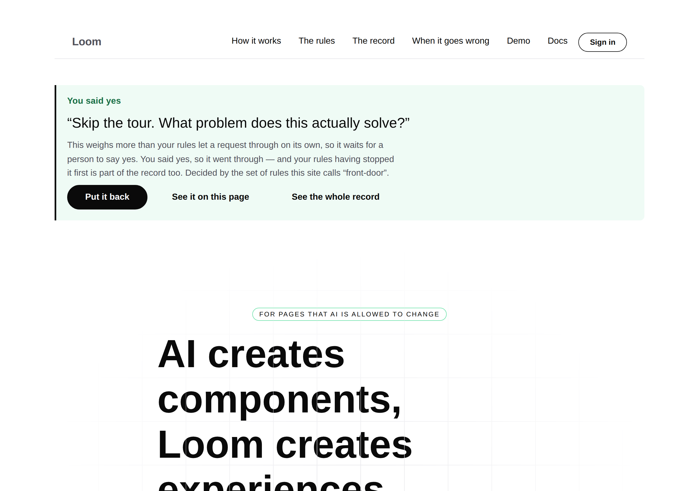
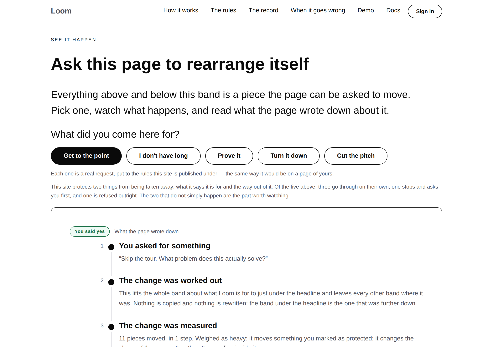
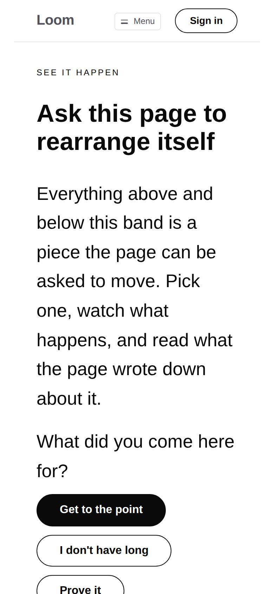

# 2026-09-26 — marketing: the way back to what happened, and the comment that said it could not be built

The front door lets a visitor ask it for a change. Pressing one of the five
choices is an ordinary link, so the browser navigates and leaves the reader at
the **top of the document** — three screens above the band they were reading. A
notice was added there on the 22nd to meet them, and it works: it says what the
rules decided and offers the decision that follows.

It could not show anybody **where**. The one change on this site that a
competitor cannot copy happened below the fold, the notice above the fold
reported it, and nothing connected the two.

| the same address, `/?ask=drop-pitch` | |
| --- | --- |
| before — `main` |  |
| after — this branch |  |

---

## What shipped

**One control**, and the two things it needed to exist.

| file | what changed |
| --- | --- |
| `_lib/bands.ts` | `ANCHOR` — where a link lands, beside `BAND`, which is what a band is called |
| `_lib/pages/see-it-happen.ts` | the band declares `anchor: ANCHOR.seeItHappen` |
| `_lib/pages/answer.ts` | the notice offers **See it on this page**, carrying the whole of the visitor's address; `where()`; the stale comment replaced |
| `_lib/pages/in-your-own-words.ts` | `YOUR_TURN_ANCHOR` reads off `ANCHOR` rather than spelling a second literal |
| `_lib/anchors.test.ts` | new — 106 cases over 21 states of the front door |

No primitive was added, nothing under `src/` was opened, and no component was
added. Outside `app/(marketing)/`: `FINDINGS.md` and this report.

### The notice, and where it now goes

Three controls where there were two: the decision, then the look that does not
leave, then the record page. The new one is `quiet` and sits in the middle
because it is the cheapest of the three — a reader deciding whether to spend
another click should meet *stay here* before *go elsewhere*.

Pressing it lands on the band that ran the change, with the panel of five lines
already filled in:

The clearance under the sticky header is not this composition's doing: an
`anchor` brings `scrollMarginBlockStart` with it in the library, which is the
kind of thing worth saying out loud, because the alternative reading is that
this page got lucky.

---

## The comment that said it was impossible

The control is four lines. It did not exist because of this, which sat in
`answer.ts` exactly where the control belongs:

> *The panel below carries the same five steps, and a link to it is the one
> thing this band cannot offer: a tree can hold a fragment — the scheme
> allowlist would pass `#…` without complaint — and **no primitive in the
> library renders an `id` for it to point at**. Filed rather than worked around,
> because the workaround would be a local component and this lane does not get
> one.*

The first half is true. The second half is false, and the disproof is one import
away in the same file's own neighbourhood: `loom.section`, `loom.hero` and
`loom.callout` all declare `anchor`, `anchorAttributes` renders it as an `id`,
and **the band directly below this one is already using it** —
`in-your-own-words.ts` declares `anchor: "your-turn"` and `see-it-happen.ts`
links to it.

How long it had been wrong is not recoverable from this checkout, whose history
begins on 19 September with both files already written. What can be said is that
it was wrong this morning, and that a run reading that file to decide what the
band could offer — which is what a run does — would have been told the wrong
thing and moved on.

**This is the second consecutive run by this lane to find that shape.**
Yesterday it was `wrap` on `loom.code`: built for this lane's own finding on
12 September, cited in the prop's doc comment, and unset on all eight panels on
the 25th. Both times the mechanism existed, the comment beside the workaround
still stated the constraint as a fact about the library, and nothing anywhere
was red. Filed as a finding of its own, because twice is a pattern and the
generalisation is not this lane's alone: **a comment stating a limit is a claim
about somebody else's code, and this repository holds no claim of that kind to
anything.**

---

## The test, and the class of bug it exists for

Every other control on this site is a path, and a path that has gone wrong
announces itself — the route is missing, the build says so, `pnpm verify` goes
red. **A fragment fails silently.** A link to a band that has stopped declaring
its anchor is a button a visitor presses and nothing happens: no error, no
console line, no failing test, a page that still renders perfectly. The site had
two links of this kind and nothing holding either end to the other. The band's
own comment said so and was the whole of the protection:

> *A link pointing at a band that has since been renamed is a control that
> silently does nothing, and nothing else on the page would say so.*

`anchors.test.ts` is that sentence, asserted. It holds four things over **21
states** — the page as a stranger arrives at it, and each of the five choices in
each of its four states afterwards (asked, allowed, put back, put back and
allowed):

| what it holds | why it is not obvious |
| --- | --- |
| every declared anchor is an `id` **in the rendered markup** | the prop being set is not the claim; what a press depends on is the attribute in the document, so it renders rather than reads the tree |
| every same-page fragment a control points at is declared on that page | stated in the direction that fails — a link and an anchor drifting apart breaks the *link* |
| no two elements answer to one anchor | otherwise a link lands on whichever the browser met first, which is a page-order dependency nobody wrote down |
| each name in `ANCHOR` is on the front door in every state | the same check one layer earlier, and the one that says *which* band went |

Only same-page fragments are collected, deliberately: a fragment on another
surface's address is that surface's promise to keep, and a test here that
checked it would be this lane asserting over another lane's chrome — the same
rule that put *the way back from the other three surfaces* into a finding rather
than a commit.

**Both halves were checked red.** Removing `anchor` from the band fails **21**
of the 106; dropping `back` from the address the link carries fails **10**. The
second is the one worth having: a control that quietly lost `back=1` would put a
change the visitor had just reversed back onto the page while claiming to do
nothing but scroll — the site undoing an undo, on the one band whose entire
subject is that nothing gets dropped.

### Why the anchors are declared and not derived

`BAND` already holds every band's eyebrow, and `"See it happen"` slugs to
`see-it-happen` without any help. Deriving would make the link and the anchor
agree by construction, which is this repository's usual instinct — `FACTS`
counts the repository rather than typing a number, the sitemap holds no path of
its own.

It is the wrong instinct here, because **a fragment is an address**. Somebody may
be holding `/?ask=shorter#see-it-happen`. Deriving the slug from visible copy
makes every wording change a silent redirect to nowhere for anyone who saved
one, and a silent redirect is strictly worse than the failure deriving prevents
— which the test catches anyway, in the direction that matters.

---

## Findings

**Three filed, one of them closed by this branch.**

- **A fragment is the one broken link this repository cannot report.** For
  `Loom docs`, `Loom lessons`, `Loom demo` and `Loom portal`; open for the four,
  the marketing half closed here. The sweep is twenty lines and transfers
  directly; the list of anchors is the part that has to be theirs. Same shape as
  the plain-language sweep `Loom portal` filed on 24 September, and offered the
  same way.
- **A comment stating a library limit outlived the limit.** This lane's own,
  closed here, recorded because it is the second consecutive run to find it.
- **The two `loom.hero` findings of 20 September are six days open**, for
  `Loom primitives`, **re-filed by reference with nothing added**. Both were
  photographed again this morning on `main`: the `grid` backdrop still paints
  over the 72px headline and reads as a strikethrough through *components,* and
  *experiences.*, and `TEXT_MEASURE = "44rem"` still gives the front door a
  three-line headline at 1280 and puts both of its actions below the fold at
  900. The age is the only new fact, and it is the most expensive thing on this
  surface that the composition cannot reach — `stature` and `align` are its
  levers and neither moves a measure that lives inside the primitive.

Nothing was closed that this lane did not own.

---

## Open questions for the maintainer

Unchanged from the last four runs, and none of them is blocking:

- **The licence line**, still this site's one placeholder, at the foot of every
  page.
- **Positioning, audience and pricing.** Untouched, as always.
- **Whether preview deployments should be `noindex`.** Still filed against the
  shell; `/robots.txt` is served on `main` as of #388, so the question is now
  answerable rather than theoretical.

---

## Tests

`pnpm install && pnpm verify` — **exit 0**, read off the run rather than a pipe,
on a `.next` and a `dist` deleted first.

| | |
| --- | --- |
| `pnpm verify` | **green, exit 0** |
| runtime | **3,073 passed** in 160 files |
| application | **6,010 passed** in 310 files — 106 added, in one new file |
| `anchors.test.ts` | **106**, over 21 states of the front door |
| `pnpm shoot` | 13 shots across two runs, exit 0, no overflow at 1280 or 390 |
| findings | **804**, 0 malformed |
| prerender | 112 pages, 1,285 text junctions, 0 run together, 0 unserved |

Nothing was skipped, nothing was weakened, nothing failed, and no existing
assertion was rewritten. No decision record: an `anchor` is a prop the library
already offers, being set, and nothing here touches the tree schema, the delta
model or an `Accepted` record.

**One thing about the run itself**, because it is the same trap two days
running. The first attempt to photograph the built change came back with no
`id` in the HTML at all. The cause was not the change: `pkill -f "next start"`
returned success and did not kill the server — the process holding port 3000 had
survived it — so the new build was refused the port with `EADDRINUSE` into a log
nobody had read, and `curl` was talking to the *old* binary the whole time.
`ss -ltnp` named the pid in one line. That is `Loom demo`'s 19 September finding
about `pkill` missing the server it is aiming at, met a fourth way, and the
discipline that catches it is the one yesterday's report already wrote down:
**read the server's own log before believing anything measured through it.**
