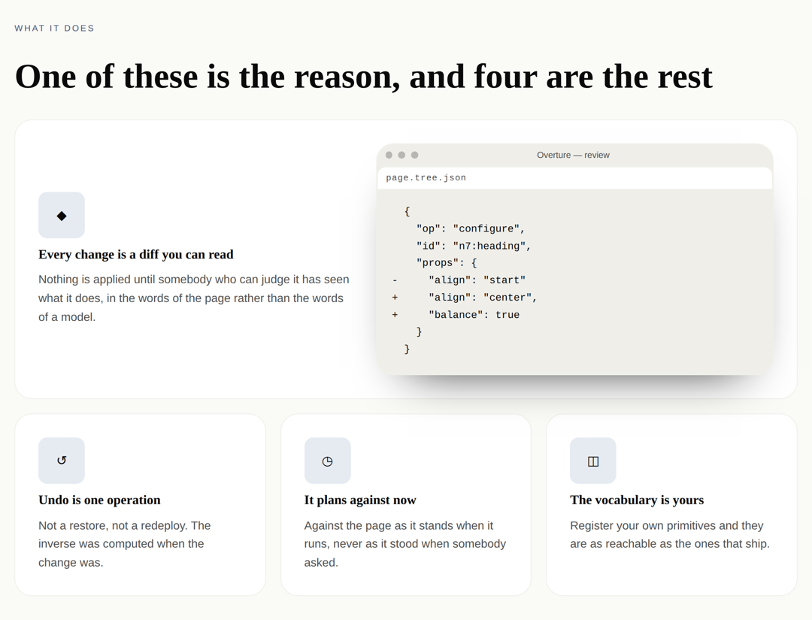
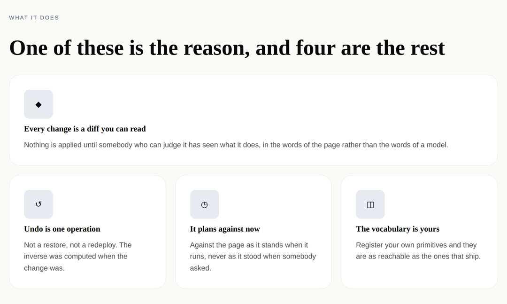
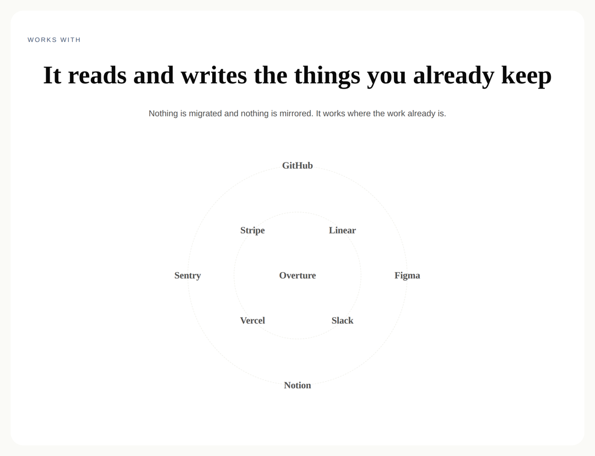
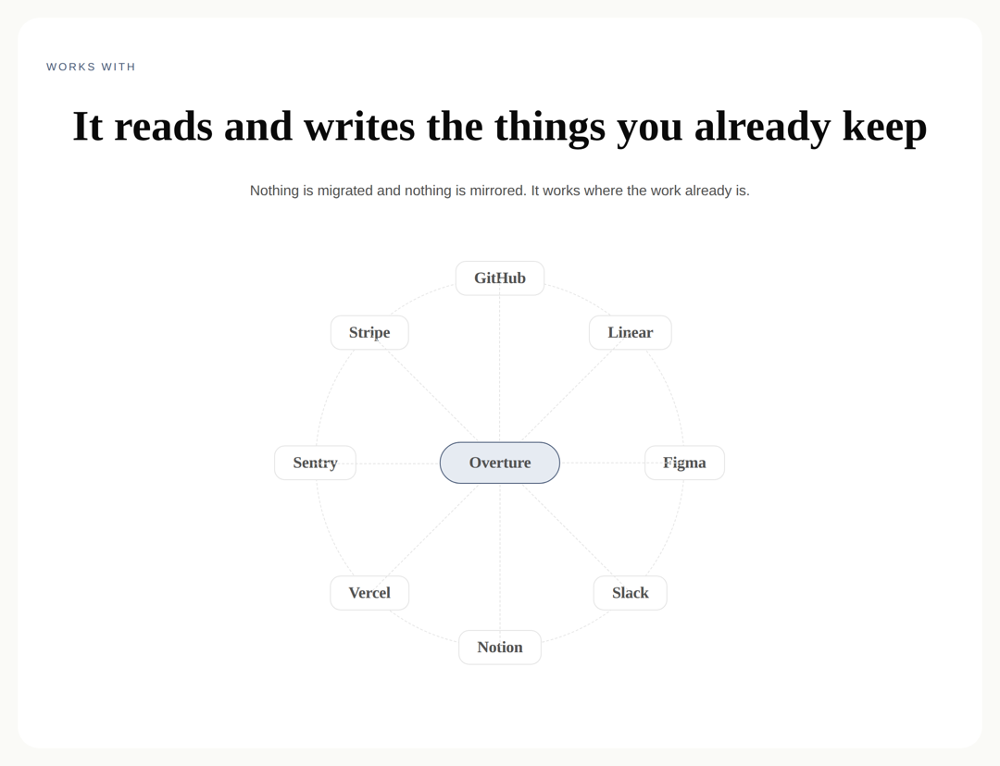
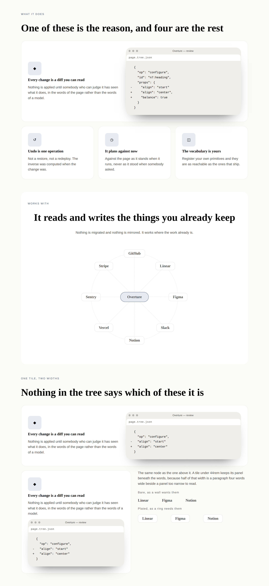
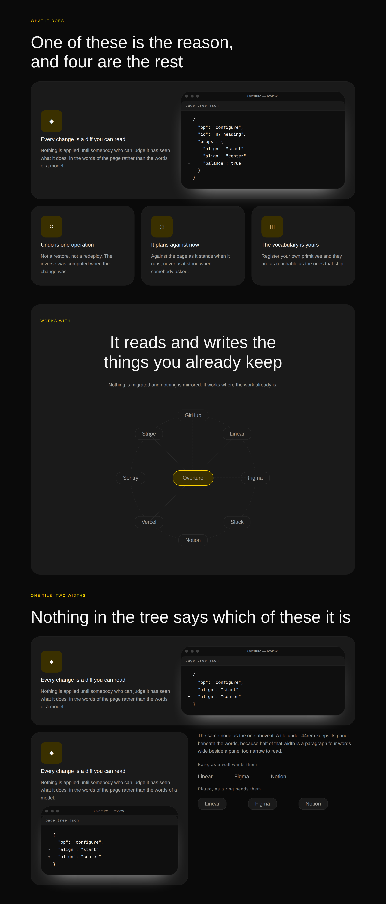
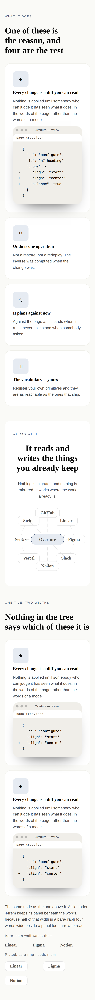
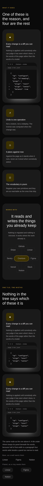

# Earning the wide cell — the two bands a page photograph found thin, and the two regions neither primitive had

**Routine:** `Loom primitives` · **Date:** 2026-09-26 · **Branch:**
`primitives-46-earning-the-wide-cell` · **Section:** §4b

## What this run chose, and why that

**The queue the last run left, and nothing else.**

The 25 September run built `the-whole-page.specimen.ts`, photographed this
catalogue as a document for the first time in forty-four bands, and ended its
report with one instruction: *the next run should take a photograph before it
takes a plan.* So this one did — 12,347 CSS pixels under both starter palettes,
before a line was written — and then worked the two items that photograph had
left open:

- **the bento's wide cell**, which was *"a card that happened to be long"*;
- **the works-with orbit**, which was *"a ring of words"*.

Both were filed as **thin rather than broken**, and both turned out to need a
**rendering the library did not have** rather than better copy. That is the
finding under the finding, and it is why this is primitive work and not band
work: a band cannot fix a band that has nothing to say the missing thing with.

Two things were deliberately *not* chosen. The reach inventory did not move —
ten registered types remain unreachable, six of them waiting on an image source
that is the maintainer's decision — and the portrait-as-a-slot alternative
stays filed, on last run's own recommendation. A run that opened a third front
would have photographed neither of these properly.

## The wide cell

`loom.mosaic`'s `lead` rhythm runs its first cell across the full width. The
band gave that cell a `loom.feature`, and a `loom.feature` was a glyph, a title
and a sentence — so the first thing a reader met after the features grid was
1120px of card with about 40px of air under it.

| before — `main` | after |
| --- | --- |
|  |  |

**`loom.feature` grows a `media` region.** It is a slot rather than a child
because the tile *places* it — after the words, and turned beside them when the
tile is wide enough — so *the last child is the picture* would be a rule no
schema states and every `move` breaks ([0051](../decisions/0051-a-slot-is-a-region-the-primitive-places.md)).
It is a region rather than a prop because a tile with something in it and a tile
without are **different sets of nodes**: *show the diff here* is an `insert`
carrying whatever the page already knows how to draw, and never a `mediaUrl`
prop nobody can supply ([0052](../decisions/0052-a-repeated-item-is-a-node-and-a-fixed-field-is-a-prop.md)).

**The turn is a `@container` query over the tile's own width**, at 44rem. A
340px cell of a `loom.feature-grid` and the same node running the full width of
a mosaic's lead cell are on the same laptop, so the window cannot tell them
apart — which is [0079](../decisions/0079-a-layout-css-alone-can-express-belongs-in-the-stylesheet.md)'s
bargain and the pattern `loom.mosaic` and `loom.event` already use. The
specimen photographs the pair: one tile design, drawn at the full measure and
again in half of a `loom.split`, with nothing in either tree saying which.

**What is in it is nodes.** `loom.frame`'s window chrome over a `loom.code`
panel holding a real `configure` against the tree the band is in — the rule
`hero-split-band` set in August (*a product surface built out of the library is
worth more than a screenshot*) arriving one level down. It needs no asset, and
it is the one thing this whole page asserts and never showed: the code band
shows what a developer writes, the conversation band shows what somebody asks,
and nothing showed **what comes back**.

The diff is set one property per line, and that is a measurement rather than a
preference. `loom.code` puts an over-long line behind a horizontal scroll,
deliberately — *a command broken across two rows reads as two commands* — and on
a 390px phone that panel is about thirty characters wide. Written with each
`props` object on one line, the end of both changed lines went off the right
edge, which is the one thing a diff must not do.

## The ring of words

The orbit was worse in a page than in any photograph of it alone: eight small
grey wordmarks on two faint circles, the guide drawn straight through several
of them, and the product's own name the same size and colour in the middle.

| before — `main` | after |
| --- | --- |
|  |  |

Three changes, and the content is untouched.

**`loom.logo` grows `surface: "card"`.** A mark on a wall is a word on the page
and wants nothing under it; a mark on a **ring** is the same content model drawn
the other way — a tile the guide passes behind rather than through. Two
renderings from a closed set the schema names, changing no node: 0052's
display-mode clause, read exactly as `loom.feature`'s own `surface` reads it.

**`loom.orbit` grows `guides: "spokes"`.** The primitive's whole claim over a
`loom.logo-cloud` is in its own doc comment — *these things move around that
thing* — and nothing in the picture had ever drawn the relationship. A connector
is drawn from each seat back to the middle, which needed the seat to carry its
bearing in degrees as well as the two multipliers it already had: `atan2` is not
a thing a stylesheet has, and a percentage on a seat's own connector resolves
against the seat rather than the stage, so the radius is emitted a second time
in `cqi`.

**`loom.orbit` grounds its `mark` region**, which is the one thing here that
needed a record. [0192](../decisions/0192-a-region-a-primitive-places-is-a-region-it-may-ground.md):
**a region a primitive places is a region it may ground.** `loom.card` has been
laying its media outside the padding, `loom.frame` has been giving its screen
the surface ground, and `loom.hero` has been insetting its media against the
text column — three primitives doing the same thing, none of them saying so,
and a fourth that read 0051, found no permission, and left its region bare for
five weeks. The bound is in the record: the primitive owns the region and never
the content, so a ground is not a placeholder and an empty region still draws
nothing at all (0187).

The band then asks for **one ring rather than two**, which it could not have
done before: eight *plates* alternating between two radii crowd the hub they are
circling, where eight bare words did not.

## The third fault, which was in neither plan

**The guides were drawn in `border-subtle`, and on the bold palette that is a
line nobody has ever seen.** Five points of luminance, on a section whose own
ground is the same value. The primitive's doc comment says the dashed circles
are *"the thing that makes the arrangement read as an orbit rather than as
scattered logos when it is standing still, which is every screenshot"* — and
under one of the two starter palettes it had been drawing nothing since it
shipped.

It caught the new plate on the way past: a tile the size of a word is mostly
edge where a card is mostly fill, so at `border-subtle` the whole plate vanished
on the bold palette, on exactly the band it had been added for. Both take
`border-default` now. The general shape is filed as an audit, with the rule it
suggests: **a border beside a fill may be subtle; a border that is the whole
mark takes `border-default`.** It needs a sheet per primitive rather than a
grep, because the difference is not in the source.

## Which fields became nodes and which stayed props

| | became a region | stayed a prop |
| --- | --- | --- |
| **a feature's picture** | `media`, a slot — an `insert` carrying a subtree, not a URL nobody can supply | — |
| **where that picture sits** | — | nothing: the tile decides, from its own width, in the stylesheet |
| **a mark's tile** | — | `surface`, two renderings of one content model, changing no node |
| **the connectors** | — | `guides`, a third member of a closed set that already had two |
| **the hub** | — | neither: the primitive draws it, which is 0192 |

Nothing here is a count, and nothing here decides how many children exist —
which is the granularity doc's sharper question, asked of all four.

## The whole sheet, under both palettes

| | |
| --- | --- |
|  |  |
|  |  |

`earning-the-wide-cell.specimen.ts` is committed. Overflow measured by the
harness on all four sheets: 1280 vs 1280 wide, 390 vs 390 phone, under both
palettes, with no diagnostics.

## What is now checked, and where

**Sixteen new tests** — eleven in `library.test.ts`, five in
`compositions.test.ts` — and a **thirteen-row defect matrix**, each defect
restored in turn against a baseline of 448 passing:

| defect restored | caught |
| --- | --- |
| the `figured` modifier dropped from a tile that was handed something | 1 |
| the picture placed before the words | 1 |
| every mark plated, always | 1 |
| the plate's edge back to `border-subtle` | 1 |
| the ring's guide back to `border-subtle` | 1 |
| the connector back to `border-subtle` | 1 |
| the hub ground removed | 1 |
| the bearing written as the index rather than the angle | 2 |
| the spoked class never applied | 1 |
| a panel in every cell rather than the lead one | 1 |
| the removed line tidied out of the diff | 1 |
| the ring's marks unplated | 1 |
| the band stops asking for connectors | 1 |

The two worth naming are the ones a reviewer would not think to write. **The
`figured` modifier** is the only thing standing between the wide cell and the
squat box it was — a run that placed the region and forgot the class leaves
every other assertion green and the tile a column forever. **The bearing** is
asserted as *the same angle the multipliers already encode*, by taking its
cosine and sine, so the third property cannot drift from the first two.

**One existing assertion was rewritten** and the old line is quoted in a comment
beside the new one with the reason, which is this lane's convention when
behaviour deliberately changes: the orbit seat pattern was anchored on the
closing quote of the `style` attribute, so it asserted *these two custom
properties and nothing else*. A seat now carries three. The property the test
was really protecting — no radius on the element — is unchanged and asserted
directly, twice.

**No test was weakened, none skipped, none deleted.**

## Checks

- `pnpm install && pnpm verify` **green, exit 0**, read off the run rather than
  off a pipe. The 25 September `tee` finding was the reason to be careful here;
  the gate was redirected to a file and `$?` taken from the gate itself.
- Framework **160 files / 3,089 tests**; application **309 files / 5,904 tests**;
  **802** findings, 0 malformed; 112 prerendered pages, 1,285 text junctions,
  0 run together.
- **No literal colour anywhere in the diff.** One is worth calling out: the
  explanation of *why* `border-subtle` fails on the bold palette had to be
  written without its hex values, because a hex literal inside the library
  stylesheet is indistinguishable from a hardcoded colour to the test that
  forbids one. The numbers are in the finding instead, and the comment says so.
- **`pnpm decisions:index` regenerated.** It exits 0 with notes for numbers
  claimed on unmerged branches, 0191 among them, which is [0097](../decisions/0097-a-hole-in-the-numbering-is-reported-and-a-clash-is-fatal.md)'s
  expected behaviour. 0192 is this branch's and does not clash.
- **Nothing outside `src/primitives/`** except `decisions/`, `FINDINGS.md` and
  this report. `apps/` was not opened.
- **The commit's author was not set**, by any means — checked with
  `git log -1 --format="%an <%ae>"` before pushing rather than remembered.

### One thing this run cost itself, written down so the next one does not

A defect matrix was run with `git checkout -- src/primitives` as its restore
step, against **uncommitted** work. It restored the branch to `main` and
deleted every change and both test blocks in one command. Everything was
recoverable — the edits were in the session and `dist/` still held the compiled
output with comments — and it cost about twenty minutes.

**The rule: commit before running a defect matrix.** A matrix restores with
`git checkout`, which is a restore *to the last commit*, and work that is not
committed is not in it. Filed nowhere, because it is not a fault in the
repository; it is here because it is exactly the kind of thing a fresh session
with no memory of this one would do again.

## What was filed

- **`border-subtle` as a hairline is invisible on the bold palette** — filed as
  an audit for this lane, with the two instances found here, the rule they
  suggest, and the candidates worth looking at first (`loom.divider`, the
  milestone rail, table row lines, anything dashed).

## What was closed

- **The 25 September phrasebook-page finding.** Both remaining bands are fixed
  and photographed in the assembled page, which is what the entry said would
  close it. The instrument stays: it found five faults in two sittings and not
  one of them was visible to any assertion in this repository.
- **The 24 September 0187 audit** of the three primitives that draw an optional
  picture. `loom.article` was cleared on 25 September; `loom.frame` turned out to
  have no `shape` prop and no `aspect-ratio` at all, so the entry's description
  of it was wrong; and **`loom.product` was photographed today** — six cards in
  the `catalogue` band, no art on any, nothing reserved. It was taken the way
  the entry asked for rather than by reading the branch, because the entry is
  right that reading is what produced the defect it was written about. 0187's
  rule now holds across all six.

## What the library still cannot express

**Unchanged, and the list is stable enough now to be worth stating as a
decision the maintainer owns rather than as a gap.** Ten registered types are
unreachable from the phrasebook: `loom.before-after`, `loom.carousel`,
`loom.embed`, `loom.media`, `loom.overlay` and `loom.pin` need an **image
source** this catalogue will not invent; `loom.link-pager` and `loom.link-trail`
belong to a *site* rather than to a landing page; `loom.waiting-state` belongs
to a bound region; and `loom.page` is the root.

Six of ten is one decision, not six. Everything else in the library is reachable
by dropping in a band.

**What this run adds to that picture** is that the remaining growth is not
vocabulary. The library is 98 primitives and 44 bands, and the two bands that
failed a page photograph failed for want of a **rendering**, not a type. The
next axis is the one the phrasebook's own doc comment names — more designs per
part, each differing in the set of nodes it builds — and the instrument for
deciding which ones are worth having is the whole-page photograph, which is
committed and costs one command.

**`21st.dev` re-verified blocked** from this lane's session: the proxy refuses
the CONNECT tunnel. Twenty-second consecutive check, never once reachable.
Re-verified rather than re-filed. The visual standard for this run was
`loom.hero`, `loom.feature-grid`, and the assembled page beside this file.
