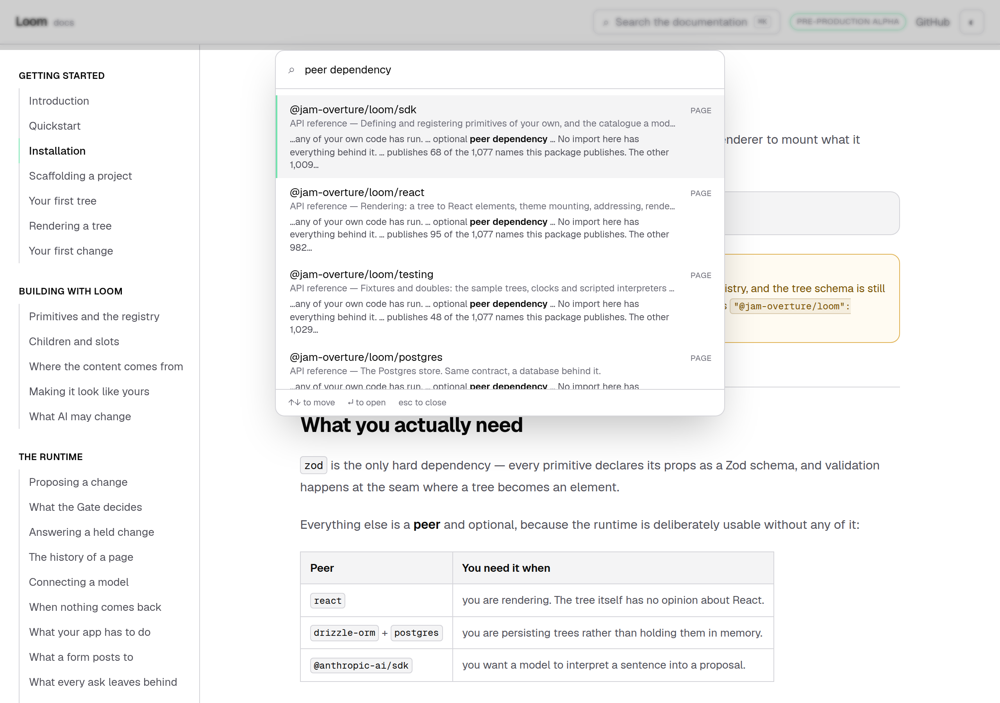
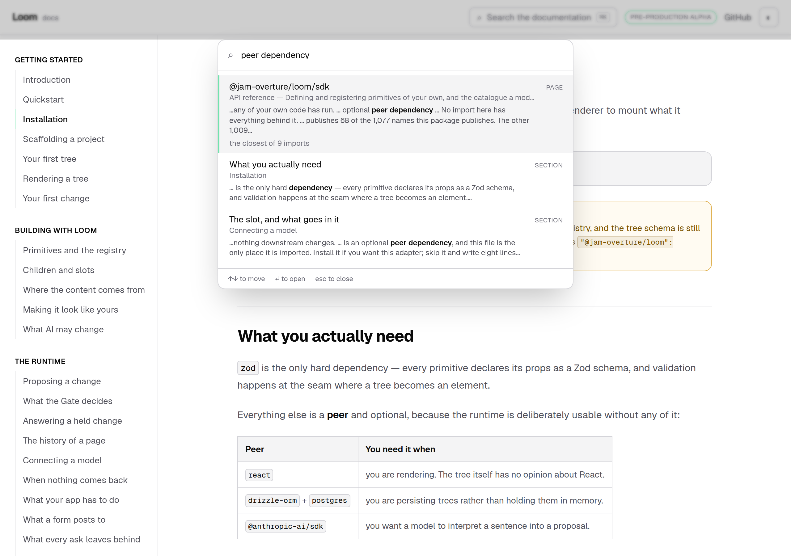
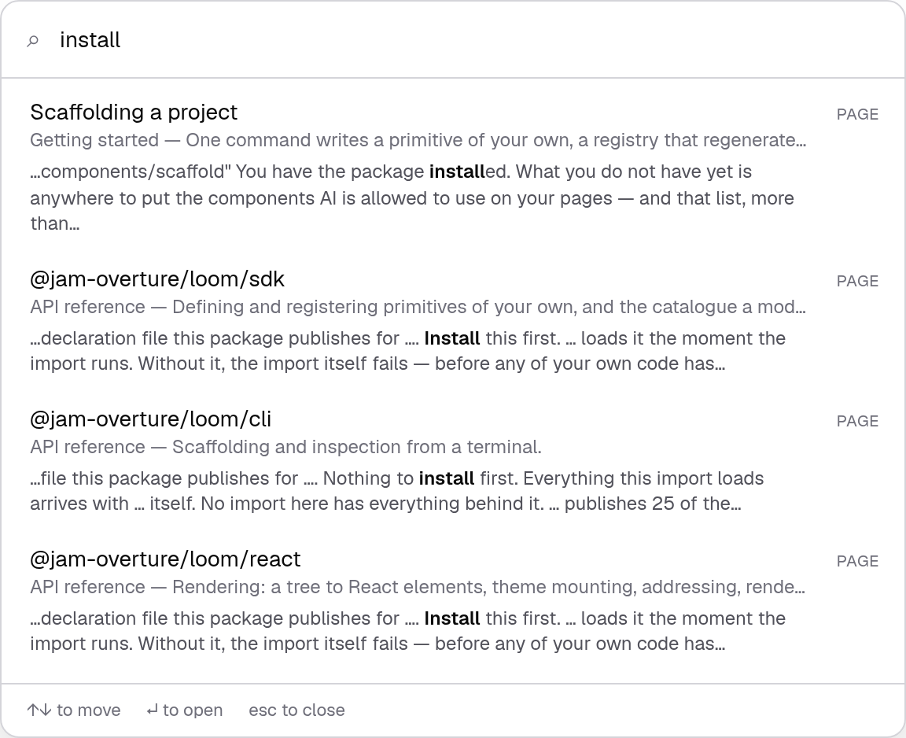
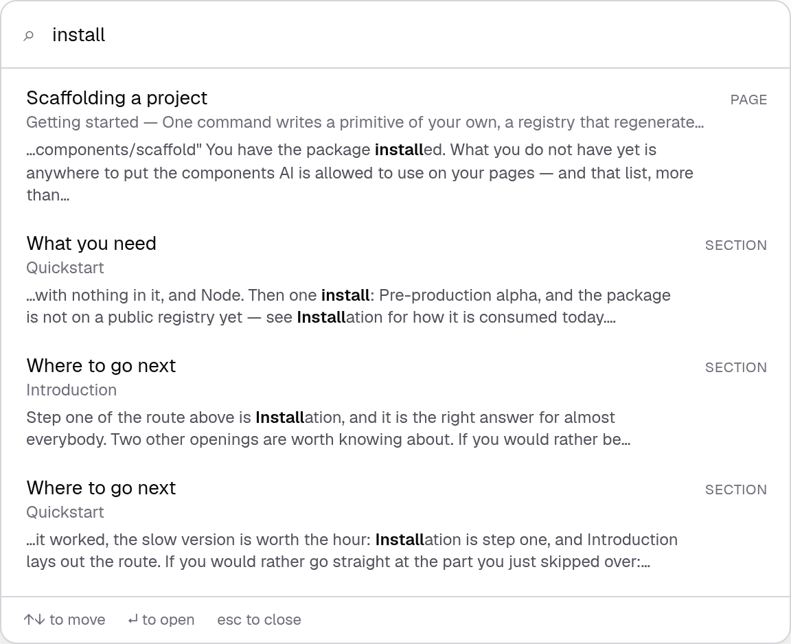
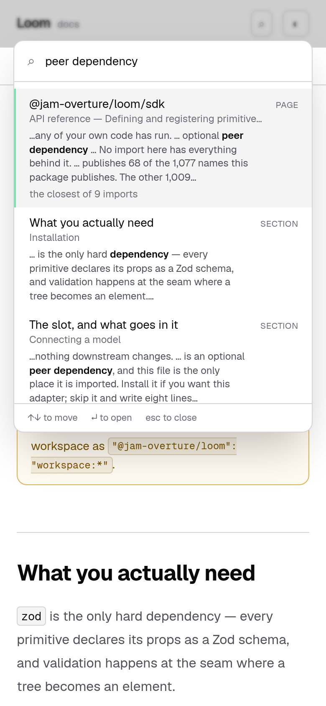

# 27 September 2026 — a row that stands for sixteen

**Routine:** `Loom docs` · **Branch:** `docs-37-a-row-that-stands-for-sixteen` · **Section:** §4c

## The plain version

Somebody installs Loom, hits a snag, and types **peer dependency** into the
search box three minutes later.

Until today the site handed them **nine pages of the API reference** and put the
paragraph that answers them — *Installation → What you actually need* — tenth.
Not because the reference is a bad answer, but because the reference's sixteen
pages are **one page rendered sixteen times with a different import's numbers in
it**. A sentence in a band they share is a sentence on all sixteen, so a query
whose words are in a band matches sixteen near-identical pages, and sixteen
copies of one sentence can fill a list that is ten rows long.

Those sixteen now arrive as **one row**, the closest, saying *the closest of 9
imports*. The nine slots it gives back go to the rest of the site.



*On `main`: nine import pages, and the heading that answers below the fold.*



*On this branch: one row for the imports, and* What you actually need *second —
with the sentence it found visible on the page behind the dialog.*

## What this run was

The findings queue. This lane filed the crowding against itself yesterday,
measured, with three remedies and a recommendation, and it was the only open
thing it owned. **The recommended remedy is the one taken**, unchanged: fold the
siblings in the result list. The other two were reconsidered before building and
are still worse, for the reasons the entry gives.

No maintainer comment was outstanding — #398 carries the Vercel bot and this
lane's own comment and nothing else.

## What a family is, and where the site says so

The fold needs to know that two pages are copies of each other. Deriving it
would be guesswork, so **the site states it**, in the one file that is already
the statement of what the site contains:

```ts
const apiReferenceSection: DocsSection = {
  slug: "api-reference",
  title: "API reference",
  source: "generated",
  family: "imports",
  …
```

Four things about that line are decisions, and each is in the code beside it:

- **Declared rather than inferred from `source`.** Being generated is not the
  property that licenses folding. A generated section could perfectly well hold
  pages that answer different questions; what licenses it is that these answer
  the same one about a different door.
- **A plural noun**, because the row has to say what it stands for. *imports*.
- **The landing page is never a member.** `/docs/api-reference` is the section —
  it says things none of the sixteen says, and it is usually the best answer to
  the query that reached the whole family. A fold that swallowed it would hide
  the page most likely to be right. Held by a test that walks every page of
  every section in `nav.ts`.
- **A written page is never a member**, because no written section declares a
  family and the site is not about to grow one by accident.

## Two things that are load-bearing and easy to get wrong

**The fold happens before the list is cut to ten.** Folding after the cut turns
ten results into a list of one; folding first is what gives nine slots back. It
also makes the count true about the site rather than about the top ten — a
reader told *the closest of 9 imports* was told how many there are, not how many
happened to fit.

**The line is worded over the total rather than the remainder.** *The closest of
9 imports*, not *and 8 more imports*. A folded row always stands for at least
two, so the noun is always plural and the site never has to hold both *import*
and *imports* to write one line. *And 1 more imports* is the sentence that
choice exists to prevent.

## What it bought and what it cost, on the real index

Measured by running the code, `main`'s behaviour reproduced by clearing every
`family` — which is exactly what `main` serves, since the fold is a no-op when
no entry is one of anything.

| query | before | after |
| --- | --- | --- |
| *peer dependency* | 9 import pages, then **What you actually need** tenth | **the imports, once** · **What you actually need** · *The slot, and what goes in it* |
| *install* | rows 8–10 were three more import pages | rows 8–10 are **What you need**, **Where to go next**, **Where to go next** |
| *no import has everything* | 1 written page, 9 import pages | 2 pages, **5 written sections** |
| *postgres* | three postgres doors, then the prose | **one door**, *closest of 3*, and two published names now reach the list |
| *theme*, *typescript* | — | **unchanged**, because one door matched and one door is not a family |

The second row is the one there is a picture of:





**The cost, stated rather than buried: some lists get shorter.** *peer
dependency* returns three rows where it returned ten, and *the import itself
fails* — a sentence only the doors say — returns one. That is the honest number
of distinct answers the site has, and it was ten only because one page was being
shown nine times. The fold line is what stops it reading as *the site barely
covers this*: the reader is told nine imports matched. It is a judgement call and
it is the one place I would want a second opinion.

**The sentence stays findable**, which is the property the other two remedies
would have given up. Indexing a repeated band once would make *the import itself
fails* findable on one door and nowhere else; ranking a generated body below a
written one breaks the reference's own front door, which **is** a generated page.

## What it costs to send

`family` travels in the file a reader **waits for** — it has to, because the fold
happens before the list is cut. Sixteen of 207 entries carry it, and it is one
string written sixteen times:

| | raw | gzip |
| --- | --- | --- |
| contents, with `family` | 39,441 | **7,723** |
| contents, without it | 39,137 | 7,706 |
| **what it costs** | **304 bytes** | **17 bytes** |

Against caps of 60,000 raw and 12,000 gzip. Asserted in `build.test.ts` rather
than argued, at 600 and 200, because a field on the payload a reader sits in
front of is exactly the kind of thing that is free once and is not at the fifth
one. Nothing else moved: the words, the code and the names files are untouched.

## Decisions taken that were not specified

**No decision record.** Nothing here constrains anything outside this route
group, no Accepted record is touched, and the tree schema and the delta model are
not in the diff.

**One row per family and no way to open the rest.** The row goes to the closest
door; a reader who wants another types its name, and the section's own front door
is in the list saying *All 16 imports*. An expandable row was considered and not
built: it is keyboard-navigable chrome with its own state, its own `aria`, and its
own tests, for a disclosure the count already makes.

**No threshold.** Two is enough to fold. A rule that folded only at four would be
a number to defend, and a list showing one page twice is the same defect smaller.

## Tests

`pnpm install && pnpm verify` at the repository root: **green, exit 0**, read out
of a file written as the last thing on its own line.

| | `main` | this branch |
| --- | --- | --- |
| `@jam-overture/loom` | 165 files / 3,200 tests | **165 / 3,200** — `src/` was not opened |
| `@loom/app` | 310 / **5,381** | 310 / **5,396** |
| findings ledger | 832 entries, 0 malformed | **834**, 0 malformed |
| prerender | 112 pages, 1,300 junctions | **112 / 1,300**, 0 run together, 0 unserved |

**+15 tests in four existing files**, none weakened, none skipped, no new file.
`main`'s number was measured on a stashed tree rather than quoted from a report.

Green is not evidence, so **eleven mutations were introduced one at a time**,
files restored from byte-for-byte copies rather than with `git checkout`, and
`diff` against the copies empty on all five afterwards:

| what was broken | what went red |
| --- | --- |
| the fold happens after the list is cut | 2 |
| the count is of the top ten rather than the family | 2 |
| a family keeps whichever member the index lists first | 12 |
| a family of one says it is one of a family | 1 |
| the section's own front door is folded away with its doors | 1 |
| the family is written down even where there is none | 2 |
| a published name is one of the imports too | 2 |
| the browser drops the family on the way in | 4 |
| the row stops saying what it stands for | 1 |
| a family keeps its last member rather than its closest | 15 |
| a heading is one of a family too | **0 — see below** |

**One survived, and it is not a gap.** Making a heading carry its section's
family changes nothing, because headings are read only from *written* sections
and no written section declares one. There is no defect there to test for; the
assertion that a heading never carries a family is a guard for the day somebody
declares a family on a written section, and it is red under the mutation that
would really cause it — *a published name is one of the imports too*.

**One mutation caught a test rather than the code**, and it is filed. The third
row began at **zero**: *a family keeps whichever member the index lists first*
turned eleven ranking tests red and left the one test written about the fold's
choice green, because that test compared the folded search against the unfolded
search and the mutation moved both. Rewritten to name the answer; the row above
is the re-run.

## At 390 pixels

`scrollWidth 390 / innerWidth 390`, before and after. The fold line wraps within
the row.



## Scope

`apps/loom/app/(docs)/` only, plus `FINDINGS.md` and this report. Ten files under
`(docs)`, all of them existing: five source and five test. **No file in another
lane was opened** — `git diff origin/main -- src/` is empty, and the generated
reference is untouched.

## Findings

**Closed — one.** Yesterday's crowding entry, by the remedy it recommended.

**Filed — two**, both found while building:

- **A result list that scrolls inside a fixed height is photographed from the
  top.** The before and after of *install* came back with the **same `md5`** —
  two production builds, two trees, one picture — because the rows that changed
  were below the dialog's own scroll. Every signal was correct and silent. It is
  the third case of `Loom marketing`'s 27 September question about the overflow
  measurement's blind spot, and the nastier one: a half-empty band is at least in
  the picture. The remedy is three lines of a shot list and it is written down,
  including why `:last-child` throws *Element is not attached to the DOM* on a
  list that re-renders as four index files land.
- **A test whose expected value comes from the code under test cannot see a
  defect that moves both sides of it.** Above.

**Not re-filed:** the preview URL cannot be verified from this sandbox (15
September); the screenshot harness photographs an address while the theme lives
in `localStorage`, so the pictures are light (14–16 September); the phone heading
break on an entry-point page (23 September); the documentation naming an import
subpath the published package does not have (26 September); and **`(docs)` still
links to `/` zero times** (24 September, `Loom marketing`), which remains the
oldest open thing this lane owns.

## What I would write next

- **A way back to the front door.** Unchanged for four reports and now, with the
  crowding closed, the oldest open thing here by a distance.
- **The `<wbr/>` at each slash in the entry-point heading**, so the four longest
  doors stop breaking mid-word on a phone.
- **The subpath the package does not publish.** The 26 September entry says the
  documentation teaches an import that will not resolve from the first publish.
  That is a page saying something untrue, which outranks anything about a search
  box.
