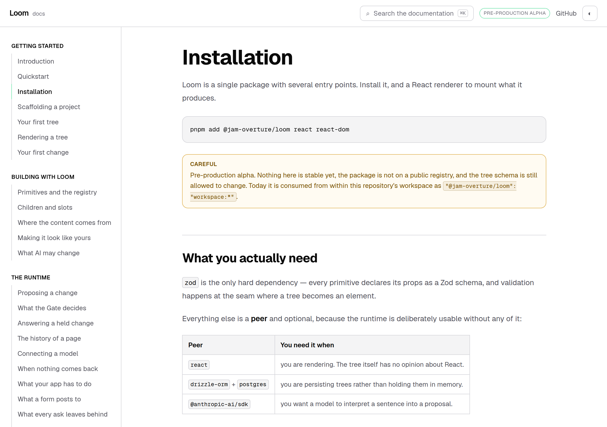
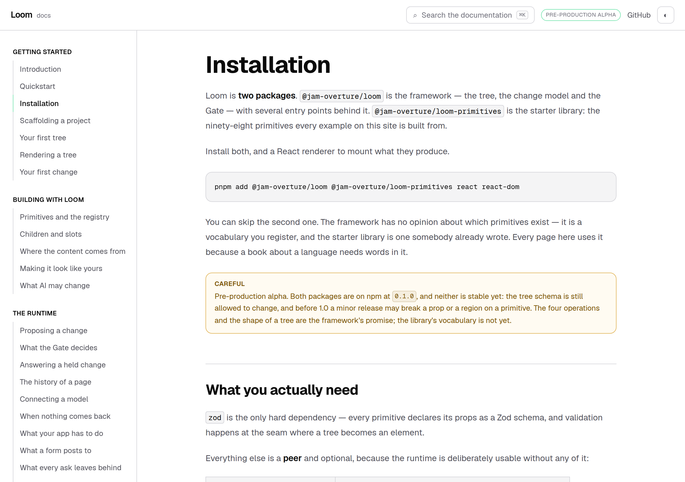
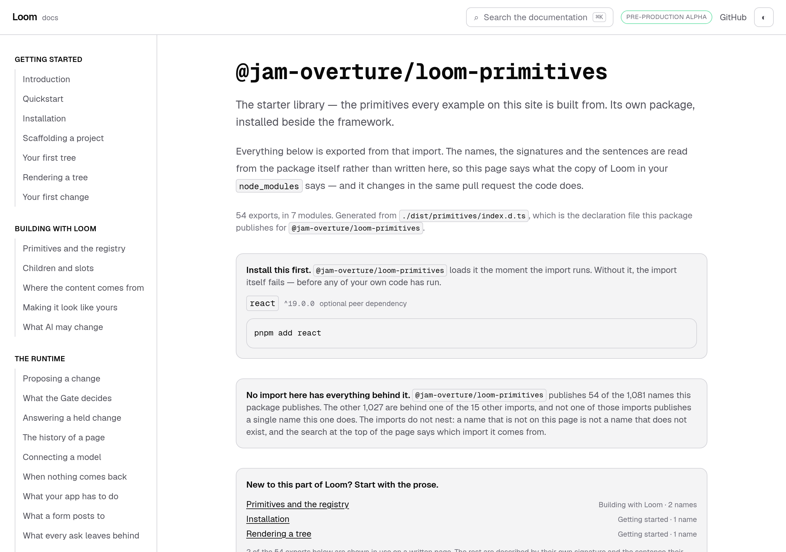
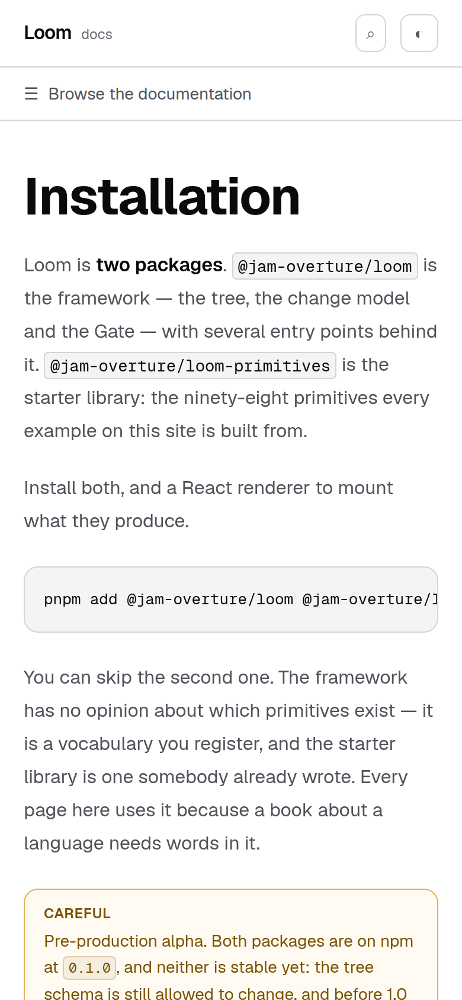

# 27 September 2026 — the name the library ships under

**Routine:** `Loom docs` · **Branch:** `docs-38-the-name-the-library-ships-under` · **Section:** §4c

## What this run was

**The maintainer, live:** *"We recently published the primitives library under
`@jam-overture/loom-primitives`. We need to make sure our documentation is
referencing that."*

That is the open finding this lane has owned since 26 September — filed by
`Loom daily build` the night before the framework was published, and its sharpest
sentence was the warning that this would happen:

> *"There will be a window where the site documents a subpath the registry does
> not have."*

The window was open for a day. This closes it.

## The plain version

Loom used to be one package. Since
[0194](../decisions/0194-the-framework-is-the-package-and-everything-that-uses-it-ships-separately.md)
it is **two**: `@jam-overture/loom` is the framework, and the starter library is
its own package, because the framework does not depend on the library and so
cannot ship it.

The site had not noticed. The first example on *Installation*, the file
*Quickstart* tells you to save and run, and one of the doors in the API reference
all said:

```ts
import { createStarterPrimitiveRegistry } from "@jam-overture/loom/primitives"
```

On a reader's machine that is `ERR_PACKAGE_PATH_NOT_EXPORTED`. The subpath is
withheld from the published `exports` map; it resolves inside this workspace and
nowhere else.



*On `main`: "Loom is a single package", one package on the install line, and a
warning saying it is not on a public registry.*



*On this branch: two packages, both on the install line, and what each is for.*

## Verified against the registry rather than the repository

Everything below rests on what is actually published, read from npm rather than
from this repository's own prose:

| | version | exports |
| --- | --- | --- |
| `@jam-overture/loom` | **0.1.0** | 15 subpaths — **no `./primitives`** |
| `@jam-overture/loom-primitives` | **0.1.0** | `.` and `./compositions`; peers `@jam-overture/loom@~0.1.0`, `react@^19` |

That also settled a second thing: the warning callouts on *Installation* and
*Quickstart* both said the package **is not on a public registry**. It is. Both
now say what is really true — on npm at `0.1.0`, and not stable.

## The problem this had to solve

A documentation site made of executed examples cannot simply be find-and-replaced,
because the two names are both true and which one is true depends on where you
are standing:

| | reaches the library by |
| --- | --- |
| a reader, with an `npm install` behind them | `@jam-overture/loom-primitives` |
| this repository, before anything is published | `@jam-overture/loom/primitives` |

Teaching the published name and stopping there would break the build. Teaching
the name that compiles is what was already wrong. §4c's rule — *an example that
cannot render is a failing test rather than a stale snippet* — rules out the
third option of dropping the blocks from the checked set.

**So the site teaches the first and compiles the second**, and `_lib/packages.ts`
is the one statement of that. It is not a workaround: `tools/package/` performs
the mirror image at package time, rewriting the library's relative imports into
`@jam-overture/loom/sdk`. A repository that assembles a package from a workspace
owes one of these in each direction.

### Three seams, and that is all of them

| seam | what happens |
| --- | --- |
| **a page's code block** (`fences/program.ts`) | the page says the published name; the compiled program imports the workspace's, so the block is still executed |
| **the quickstart file** (`quickstart/program.ts`) | read off disk and shown with the published name; run as the module this repository compiles |
| **the reference and the table** (`api/extract.ts`, `entry-points.ts`) | every specifier printed is the one a reader could install |

The rename map is **derived, not maintained**: `packages.test.ts` reads the
framework's own manifest and asserts the map's keys are exactly the subpaths
`exports` has and `publishConfig.exports` does not. A seventeenth door published
tomorrow needs no edit here; a second one withheld cannot be forgotten. The one
fact no manifest in this repository can check — the published *name* — is read
out of `tools/package/manifest.ts`, which is the file that decides it.

## The two tests that were checking the wrong thing

The finding named one and this run found the other. Both were green the whole
time they were wrong, which is the only reason either is interesting.

**`entry-points.test.ts` and `extract.test.ts` read `exports`.** That is the map
this *workspace* resolves against. `publishConfig.exports` is the one that goes
to the registry. So a test called *names exactly what the runtime publishes* was
checking the sixteen doors this repository can open rather than the fifteen a
reader can — and the sixteenth was a page telling a stranger to import something
that throws. Both read the published map now, and `entry-points.test.ts` gained
the sharper assertion it could not previously make: **no door on this table is a
subpath the registry refuses.**

**`quickstart.test.ts`'s *imports only what the install line installs*.** It
collapses a specifier to its package — `@jam-overture/loom/primitives` becomes
`@jam-overture/loom` — and asks whether that package is installed. It was. The
check cannot see a subpath the package does not export, which is exactly the
defect. Filed rather than patched: it is right about what it checks, and the
claim it cannot make needs the published manifest, which is what the new sweep
reads.

## The test that did not exist

`_lib/teaches.test.ts`. **Nothing this site tells a stranger to type may be a
door the registry refuses** — swept over every `page.mdx`, the quickstart block,
the entry-point table and the generated reference.

It reads *what the page says* rather than what it means, and that is the whole
point: a test that resolves imports cannot see this fault, because the fault is
that they resolve. The forbidden set is derived from the manifest, so it covers
the next withheld door without an edit. It also asserts the other direction —
that the site really does teach the packages, and that the install command on the
page a stranger starts from names every one of them — so it cannot be satisfied
by a site that says nothing.

## Found while building: one command, written down three times

*Quickstart*'s install line was stated in `QUICKSTART_COMMANDS`, again in the
quickstart file's own header comment, and a **third** time as a hand-typed
` ```bash ` fence in the page. This run updated two of them. The third was the one
a reader reads.

Nothing failed. `quickstart.test.ts` has a test called *tells the reader to
install every one of them*, and it reads the copy in the module rather than the
fence on the page.

**It was caught by a photograph** — the before and after of the page came back
with the same `md5`. That is the second time in one day this lane has found
something that way; the first is this morning's entry on a list that scrolls
inside a fixed height.

The block is rendered from the list now, by a component beside the two that
already render the file and its output, and the guard is a test asserting the
page has **no fenced install command at all** — a claim about absence, which is
the only kind a third copy cannot satisfy by agreeing with the second.



*The API reference door, under the name it ships as. The URL is unchanged —
`apiSlugFor` resolves a published name back through the workspace's door, so
`/docs/api-reference/primitives` is still the address it has always been.*

## Decisions taken that were not specified

**No decision record.** 0194 already decided the packaging; this is §4c applying
it to the site. Nothing here constrains another route group and no Accepted
record is touched.

**The reference keeps sixteen pages, not fifteen.** Dropping the library's page
was the obvious reading of *"fifteen doors publish"*. It is the wrong one: the
library is published, it has declarations, and a reader looking for
`createStarterPrimitiveRegistry` should find it. What was wrong was the **name on
the page**, not the page.

**The URL did not move.** A reader who bookmarked `/docs/api-reference/primitives`,
and the four surfaces that link into the reference, should not pay for a change in
how something is packaged.

**The site's own code still imports the workspace's door**, and says so where it
does. `(docs)/_lib/loom/registry.ts` is the site's code rather than something a
reader copies, so it uses what resolves — with a comment naming the two seams
where a reader's name is turned into this one, so the next run does not "fix" it
into a broken build.

**`@jam-overture/loom-primitives` was not added as a dependency of `@loom/app`.**
It would have let the quickstart's scratch-directory runs execute the reader's
exact text, which is tempting. It would also put a second copy of the runtime's
peer in the tree — the precise thing the package's own README warns about — and
it belongs to whoever owns the workspace manifest, not here.

## Tests

`pnpm install && pnpm verify` at the repository root: **green, exit 0**, read out
of a file written as the last thing on its own line.

| | `main` at `9bfe90f` | this branch |
| --- | --- | --- |
| `@jam-overture/loom` | 165 files / 3,216 tests | **165 / 3,216** — `src/` was not opened |
| `@loom/app` | 311 / **5,407** | **313 / 5,430** |
| findings ledger | 842 entries, 0 malformed | **844**, 0 malformed |
| prerender | 114 pages, 1,302 junctions | **114 / 1,302**, 0 run together, 0 unserved |

**+23 tests in two new files and three existing ones**, none weakened, none
skipped. `main`'s number was measured on a stashed tree rather than quoted.

Green is not evidence, so **six mutations** were introduced one at a time, files
restored from byte-for-byte copies and `diff` empty on all six afterwards:

| what was broken | what went red |
| --- | --- |
| a page teaches the door the registry refuses | 5 |
| the install command loses the second package | 5 |
| the quickstart is shown exactly as this repository compiles it | 1 |
| the reference titles a door by the subpath it is read through | 7 |
| the entry-point table lists the withheld door again | 9 |
| the rename map is emptied | 13 |

Nothing survived. **One mutation is not in that table** and is worth naming:
removing the rewrite from the fence pipeline is caught by `tsc`, not by vitest —
the compiled program stops resolving. That is the correct place for it to fail
and it is why the rewrite lives in the pipeline rather than in a page.

**One real break was found by this process rather than by reading.** Wiring the
quickstart's display through the rename left `QUICKSTART_DEPENDENCIES` without the
new package, so the file's own *imports only what the install line installs*
check went red — correctly. It surfaced in a mutation run rather than in the suite
I had run a moment earlier, because that suite predated the wiring. Both the
dependency list and the command are fixed; the numbers above are the run after.

## At 390 pixels

`scrollWidth 390 / innerWidth 390`, before and after. The longer install command
wraps inside its block rather than widening the page.



## Scope, and one deviation stated plainly

`apps/loom/app/(docs)/` only, plus `FINDINGS.md` and this report. Thirteen files
under `(docs)`: two new (`_lib/packages.ts`, `_lib/teaches.test.ts`) and eleven
touched, one of which is the regenerated `reference.generated.json` — a one-line
diff, because only a specifier changed.

**No file in another lane was opened.** `git diff origin/main -- src/` is empty.

**The deviation:** `docs/routines.md` says a lane with an open pull request should
push onto that branch rather than open a second. #412 was open, green and
untouched by any of this — its files are `_lib/search/`, `nav.ts` and the search
dialog, and none of them is in this diff. The rule's stated reason is a conflict
the lane created for itself at merge time, and with disjoint file sets there is
none; putting this on #412 would instead have meant reopening a finished pull
request for an unrelated argument and racing the 15:00 merge window with a change
the maintainer asked for directly. Said here rather than left to be noticed.

## Findings

**Closed — one.** The 26 September entry this run exists for, at the maintainer's
instruction.

**Filed — two**, both found while building:

- **One install command written down three times**, with the test guarding the
  copy a reader never sees. Closed in the same run.
- **A check named *imports only what the install line installs* cannot see a
  subpath the package does not export**, because it normalises a specifier to its
  package before comparing. Left as it is — it is right about what it checks —
  and filed for the class, which is the third instance today: *a check that
  normalises its input has thrown away the distinction it is being asked about.*

**Not re-filed:** the preview URL cannot be verified from this sandbox (15
September); the screenshot harness photographs an address while the theme lives in
`localStorage`, so the pictures are light (14–16 September); the phone heading
break on an entry-point page (23 September); and **`(docs)` links to `/` zero
times** (24 September, `Loom marketing`), still the oldest open thing this lane
owns.

## What I would write next

- **A way back to the front door.** Unchanged for five reports and now, with both
  of this week's findings closed, the oldest open thing here by a distance.
- **`@jam-overture/loom-primitives/compositions`.** The published package has a
  second subpath — 44 starting compositions, `PAGE_SEQUENCE`, `compositionsForPart`
  — and this site does not mention it anywhere. A reader learning the vocabulary
  from these pages does not learn that whole bands exist.
- **The `<wbr/>` at each slash in the entry-point heading**, so the four longest
  doors stop breaking mid-word on a phone.
