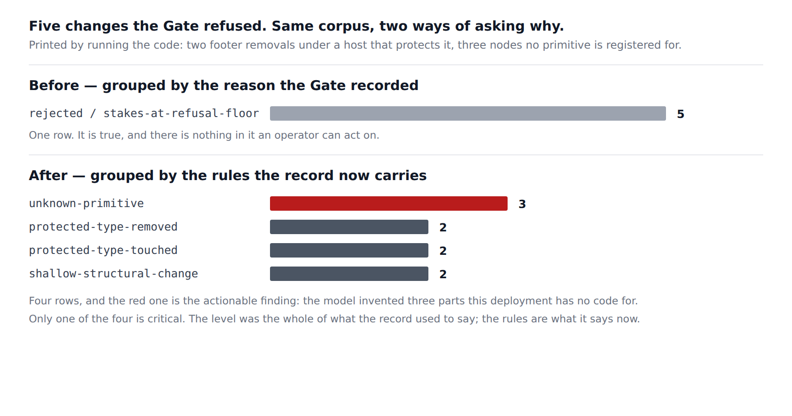

# The thirteen rules in the record — a refusal that says which rule it broke

**Routine:** `Loom daily build` (framework, `src/` except `src/primitives/`, and the application shell)
**Date:** 2026-09-27
**Section:** §6 (telemetry), binding on §2
**Branch:** `framework-58-the-thirteen-rules-in-the-record` — branched off `origin/main` at `c265328`; this lane had no open pull request of its own
**Record added:** [0198](../decisions/0198-a-refusal-records-which-rules-it-broke-and-the-rules-names-are-a-closed-vocabulary.md)
**Finding closed:** *the two `critical` factors the floors raise are dropped by the telemetry summary* — `Loom portal`, 23 September

## The migration is done, and this run did not touch it

Checked first, because three routines are waiting on the answer and a fresh
session has no memory of it. **`apps/loom` exists with all five route groups, and
`apps/portal` and `apps/docs` are gone.** `pnpm-workspace.yaml` names `apps/*`
and `apps/` holds exactly one package; `vercel.json` is `apps/loom/vercel.json`
and there is no other. Nothing is half-migrated, this run added nothing to it,
and the tree crosses this run boundary in one piece.

## What was completed

`Loom portal` filed on 23 September that **a stored refusal cannot say what it
was refused for.** `summariseAssessment` narrows a `ChangeAssessment` for the
journal — correctly, under 0023 — and of the stakes it kept `stakes`, the single
highest level anything reached. The factors did not cross.

That was survivable when `protected-type-removed` was the only `critical` factor.
It is not now: 0173 added `unknown-primitive` and 0179 added `invalid-props`,
both `critical`, and `nested-target` was already there. Four rules, one word in
the record, and the Gate records the same disposition reason —
`stakes-at-refusal-floor` — for all of them. In the portal's words:

> *This project turned down four changes as too risky* and *this project turned
> down four changes because the AI invented parts that do not exist here* are the
> same row, and only the second is a thing an operator can act on.

**`stakeFactorCodes` now joins `AssessmentSummary`**, optional and never
defaulted (0045), carrying every factor the Gate raised in the order it raised
them. It is the recommendation as filed, unmodified.

| | crosses | why |
| --- | --- | --- |
| `code` | **yes** | one of thirteen fixed strings, naming a rule and nothing about the change |
| `detail` | no | a sentence naming nodes, types and endpoints — content, which 0023 keeps out |
| `level` | no | recoverable, and a second copy of a fact is how two readings start disagreeing |

The `level` argument is the one place I went past the finding, and it is worth
stating because it is load-bearing: **twelve of the thirteen factors are fixed at
their code.** Only `large-removal` varies, between `medium` and `high`, and it is
decided by `removedNodeCount` — already on the summary — against the
`removalThresholds` of the policy that `policyFingerprint` already names. So a
reader can recover every level from what the record already holds, and storing it
would be duplication rather than information. Checked by
`src/runtime/stakes.test.ts`, which now raises all thirteen at once.

**`StakeFactorCode` became a schema on the way**, because the codes now leave the
process and anything crossing that boundary is parsed coming back in.
`stakeFactorCodeSchema` is the declaration, the type is inferred from it, and
`STAKE_FACTOR_CODES` is its `options` rather than a second hand-written list —
which is precisely the case `src/closed-set.ts` says needs no `everyMemberOf`.

## The measurement, which is this report's visual

Five changes, put through the real assessment, the real Gate and the real
telemetry narrowing under one host policy. Printed by running the code.

| the change | disposition | reason recorded | stakes | rules the record now carries |
| --- | --- | --- | --- | --- |
| tears out the footer | `rejected` | `stakes-at-refusal-floor` | `critical` | `protected-type-removed`, `protected-type-touched`, `shallow-structural-change` |
| tears out the footer again | `rejected` | `stakes-at-refusal-floor` | `critical` | `protected-type-removed`, `protected-type-touched`, `shallow-structural-change` |
| invents `loom.testimonial` | `rejected` | `stakes-at-refusal-floor` | `critical` | `unknown-primitive` |
| invents `app.pricing-grid` | `rejected` | `stakes-at-refusal-floor` | `critical` | `unknown-primitive` |
| invents `loom.hero`, with copy inside it | `rejected` | `stakes-at-refusal-floor` | `critical` | `unknown-primitive` |

Grouped as the journal could group them, **before**: one row, `rejected /
stakes-at-refusal-floor`, 5. Grouped as it can group them **now**:
`unknown-primitive` 3, `protected-type-removed` 2, `protected-type-touched` 2,
`shallow-structural-change` 2.

Three of those five refusals are a model confidently inventing parts this
deployment has no code for — the single most legible failure a catalogue has, and
the one an operator can act on by publishing the primitive or fixing the
catalogue the model was handed. It was indistinguishable from the other two.

Note also what the rows show about `stakes`: a refusal raises **three** rules of
which one is critical. The level was the whole of what the record said.

## Decisions I made that nothing specified

- **Codes, not `{ code, level }`.** Argued above and in 0198's alternatives. The
  finding recommended codes; the recoverability of `level` is the reason that
  recommendation is right rather than merely narrow.
- **A closed enum rather than an open string.** `telemetryFailureSchema.code` is
  deliberately open so that adding an error code elsewhere cannot invalidate
  yesterday's records. A stake factor is not an error — it is the Gate's own
  vocabulary, in the same position as `stakeLevelSchema` and
  `dispositionReasonSchema`, which already cross as closed enums. The cost is
  real and stated in 0198: a record written by a newer deployment does not parse
  on an older one, loudly.
- **`removedPrimitiveTypes` stays.** Its comment claimed it was the input to the
  only critical factor, which stopped being true a fortnight ago. It earns its
  place on different grounds — `protected-type-removed` says a rule fired, this
  says what it fired about — and the comment now says that instead.
- **A counted sentence, registered.** 0198 says *thirteen* and
  `src/record-claims.test.ts` now holds that word against
  `STAKE_FACTOR_CODES.length`, so a fourteenth rule fails `pnpm verify` rather
  than a reader. `NUMBER_WORDS` gained `thirteen` for it.
- **The docs reference was regenerated, not written.** Two new public exports
  tripped `(docs)`' check that nothing is published without a page. I ran
  `pnpm --filter @loom/app docs:api`, which is the remedy that check names, and
  committed its output. No prose on that surface was touched.

## Test numbers

All real, from `pnpm verify` on the branch head.

| | |
| --- | --- |
| framework suite (`pnpm test`) | **3223 passed**, 165 files, 0 failed |
| application suite (`pnpm --filter @loom/app test`) | **5490 passed**, 315 files, 0 failed |
| `pnpm findings:check` | 854 findings, 0 malformed |
| `pnpm prerender:check` | 114 pages, 1302 junctions, 0 run together; 3 conventions, 0 unserved |
| `pnpm build`, `pnpm typecheck` | clean |

Nothing was skipped and nothing is failing. Two things failed on the way and both
are worth naming, because both were the repository catching me rather than a
flake:

1. **`src/documentation.test.ts`** refused my first comment on
   `removedPrimitiveTypes`, which made *"0173 and 0179 added two more"* part of a
   published sentence. The maintainer's rule is that the API reference never
   makes a reader follow a record number; the sanctioned shape is a liftable
   parenthetical. Rewritten to `(0173, 0179)`.
2. **`(docs)`' two API checks** failed because two exports had no page. Fixed by
   running the generator, as above.

## Findings

**Closed:** *the two `critical` factors the floors raise are dropped by the
telemetry summary* (`Loom portal`, 23 September) — by this branch, with 0198.

**Filed:** one — *the commit-identity trap, eighth occurrence, and this one had
read the ledger but not the file the rule is in.* I authored this branch's first
commit as `jonathanbravecredit <jpizzolato36@gmail.com>`, Vercel refused it, and
#423 went up with no preview. Repaired with `--amend --reset-author` and
force-pushed before any review existed, which is the fourth time that exact
repair appears in the ledger.

The entry is not an apology and it is not another paragraph of documentation.
The rule is already written correctly in `docs/routines.md`, **twice**, with the
exact error text I got. It did not stop me because I did not open that file — my
own procedural failure, and precisely the failure mode no ninth paragraph
addresses. What the entry proposes instead is one line in `package.json`'s
`prepare`, beside the `merge.ours.driver` line already there, setting the address
every commit on `main` carries before any routine commits anything. I did not
make that change: it rewrites the authorship of every commit from all eight
routines, which is a fact about this repository's history rather than a build
detail. It is the first question below.

Two further things worth saying to other lanes went into the closing note on the
closed entry rather than into new entries, because neither is a defect:

- `Loom portal` and `Loom marketing` both walk their plain-language
  `Record<StakeFactorCode, string>` with `Object.keys(...) as StakeFactorCode[]`.
  That cast was standing in for a list that did not exist and now does. Nothing
  is broken — both tables are total over the union — so it is a convenience for
  whoever is next in those files, not a request.
- The portal's in-request workaround (teeing `change-assessed` in
  `_lib/write.ts`) is no longer the only way to see the factors. Whether to
  simplify it is that lane's call.

## Open questions

**The other half of the portal's 23 September pair is still open, and I did not
take it.** The sibling finding is that `CompositionRuntime.propsVocabulary` is
not in the policy fingerprint, so two deployments with matching fingerprints can
disagree about whether a part's own settings are checked before a change is
written. The portal proposed a declared name on `GatePolicy`, the way `policyId`
works.

I left it because the proposed shape has a hole I could not close without
guessing, and guessing here writes an unverifiable claim into every stored
record. `policyFingerprintOf` digests `GatePolicy`, and `registeredPrimitiveTypes`
is *in* the policy, so the fingerprint covers something the Gate actually
consults. A `propsVocabularyId` field would not be: the vocabulary is wired on
`CompositionRuntime`, so a host could name one and wire another, or name one and
wire none, and nothing could tell. That is a fingerprint entry that can be wrong,
which is worse than one that is missing — 0048's own argument, that a digest
exists to catch a knob nudged and forgotten, cuts against a knob that is merely
asserted.

The honest alternative is to fingerprint what actually judged: have the
`policy-resolved` runtime event carry the runtime's vocabulary identity alongside
the policy, so the digest covers both halves of what the Gate consulted. That is
a change to an event shape and to what every host passes, so it is a decision
rather than an implementation, and it is the question below.

