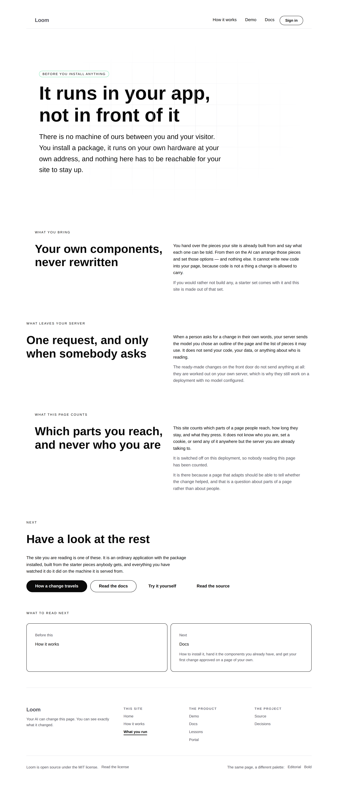
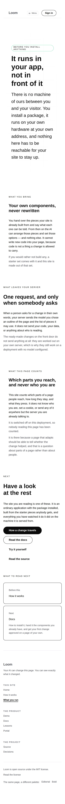
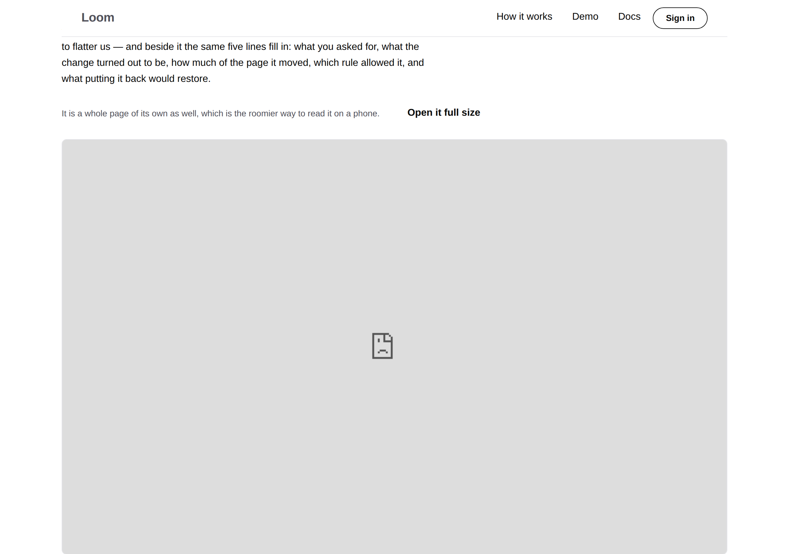

# 2026-09-27 — marketing: a band that faces its answer

The 26 September cut took this site from 13,208 words to a third of that, and it
was the right cut. What it left behind on the two interior pages was **nine
bands in a row, each a full-width heading above a reading column, with roughly
half of every band empty.**

| `/how-it-works` at 1280 | |
| --- | --- |
| before — `main` |  |
| after — this branch |  |

Nothing was broken. Every band rendered correctly, emitted no diagnostic and
passed every test this surface has. The page just looked like it had not
finished loading.

---

## The measurement, before anything moved

`loom.section` lays its regions out in a column — eyebrow, heading, content —
and `loom.prose` with `measured` is capped at `READABLE_MEASURE`, 68ch. Put
those two together in a `width: "wide"` band and the arithmetic is fixed:

| | |
| --- | --- |
| the band | 1120px, less the page's own padding |
| the paragraph in it | 68ch |
| what is left | **roughly half of it, on every prose-only band** |

Nine of them: four short answers and *Who is asking* on `/how-it-works`, three
on `/what-you-run`. The heading went into the space the paragraph was not using.

## What shipped

**One constructor**, and the nine bands that use it. No primitive was added,
nothing under `src/` was opened, and no component was added — `loom.split` has
existed since the port and this lane had never composed one.

| file | what changed |
| --- | --- |
| `_lib/nodes.ts` | `splitSection` — `section`'s sibling, heading beside the content instead of above it |
| `_lib/pages/how-it-works.ts` | the four short answers and *Who is asking* |
| `_lib/pages/what-you-run.ts` | *What you bring*, *What leaves your server*, *What this page counts* |
| `_lib/facing.test.ts` | new — 9 cases, a prohibition swept over both served pages |

Outside `app/(marketing)/`: `FINDINGS.md` and this report. Nothing else.

### Three things the primitives already knew

The composition is not a workaround; it is the one two primitives were written
for, and each says so in its own comment.

- **`loom.split` declares inline-size containment per column.** Its own comment:
  *this primitive reads no width itself, and it is the reason anything inside it
  can.*
- **`loom.heading` caps its top two steps in `cqi` rather than `vw`**, and names
  the case: *a heading in a `loom.card` or in one half of a `loom.split` is now
  held to the column it is actually in.* That is why a 60px `bold` heading in a
  540px column is 47px rather than 60px, and why nothing overflows.
- **`loom.prose` says a paragraph in a narrow column is already measured.** Each
  half of an even split in a `wide` band is ≈ 540px against a 68ch measure, so
  the paragraphs inside one set no `measured` of their own. The column *is* the
  measure, and a second opinion about line length is one that has to agree.

### Both starter palettes

| `bold` | |
| --- | --- |
| before |  |
| after |  |

No literal colour is in the diff, and the `surface`-toned *Who is asking* band
is the one that shows why a palette sweep was worth taking: it is invisible on
`minimal` and a panel on `bold`, and the two columns have to sit correctly in
both.

`/what-you-run`, same treatment:

| | |
| --- | --- |
| before |  |
| after |  |

### What it does at every other width

| width | what happens |
| --- | --- |
| 1280 | two columns, `scrollWidth 1280 / innerWidth 1280` |
| **820** | two columns, still  |
| 390 | **wraps to one column**, heading above the paragraphs, in the order it was |

**The phone is not byte-identical and the claim is not that it is.** Measured at
390 against `main`, `/how-it-works` is **220px shorter** and `/what-you-run` is
**204px shorter**: a split column's gap is one step tighter than a section's
content region, so each band loses about 44px. The order and the wrapping are
unchanged; the spacing is slightly tighter. Both pages also lost height on a
laptop — 8610 → 7790 and 6372 → 6070 at 2× — which is the empty half being used
rather than anything being cut.

---

## The test, and why it is a prohibition rather than a count

A count of the bands that were converted is satisfied by the bands that already
pass and says nothing about the tenth one somebody adds next week. So the rule
is stated over the **served trees**, as the question a reviewer would ask:

> no band whose content is only paragraphs may stack its heading above them

with two companions — the heading and the answer are in opposite regions of the
split, and nothing inside a column asks for a second measure. The failure names
the band by its **eyebrow**, because the person who trips it has just written
that eyebrow and an index into a tree tells them nothing.

**Both checked red.** Reverting *Who is asking* to `section` produced
`expected [ 'Who is asking' ] to deeply equal []`; restoring `measured: true`
inside a column failed the third.

### The blind spot, which is the part worth keeping

This is filed as well as reported, because it is not this lane's alone. The
overflow measurement is the **one automated eye this repository has on a
rendered page**, and it can only fail in one direction:

| instrument | reads | why it was silent |
| --- | --- | --- |
| the tree's tests | structure | every band was correct on its own |
| the renderer's diagnostics | what could not be honored | nothing was unhonored |
| `voice.test.ts` | the words | layout is not words |
| **`scrollWidth` vs `innerWidth`** | **a page too wide** | **this is a page with too much room** |

A band that spills off a phone screams. A band using half the space it was given
is silent forever. They are the same defect — contents and width disagreeing —
and only one of them is reportable. The question filed for the other four
surface lanes is *which of your bands are this, and what in your lane would ever
tell you?*

---

## Found while building: the front door is photographed with a hole in it

Not fixed here, because it is the harness's and not this lane's.

| `pnpm shoot --serve` | serving on port 3000 by hand |
| --- | --- |
|  |  |

The framed demonstration's `src` is absolute, built from `siteOrigin()`, which
with no `LOOM_SITE_ORIGIN` and no `VERCEL_URL` is `http://localhost:3000`.
`--serve` starts on an **ephemeral port** on purpose, so the frame points at
nothing and Chromium draws its broken-document glyph in a 1078 × 673 box.

**Nothing in the run says so**: the shot succeeds, the exit is 0, `scrollWidth`
equals `innerWidth`, every test of that band passes. This run photographed it
twice before recognising it. The site is fine and a deployment is fine — Vercel
sets `VERCEL_URL` — but every full-page shot of the front door this lane has
shipped with `--serve` has had that hole in the middle of it, on the surface the
maintainer judges by eye. Filed for `Loom daily build`; the fix is the harness
passing the origin it already prints to the child as `LOOM_SITE_ORIGIN`.

### And the other one, which is already written down

The first set of *after* shots came back **identical to the before shots**. A
`next start` from earlier in the run had survived a `pkill` that returned 144
and killed the wrong thing, so port 3000 was still serving the previous build
while the new one sat on disk. That is exactly the failure
[0191](../decisions/0191-the-harness-may-start-the-application-because-there-is-now-only-one.md)
and the 25 September finding describe, met by a run that had read both an hour
earlier. It cost two builds. **The lesson is the narrower one:** the reason to
use `--serve` is not convenience, it is that a server the harness started cannot
be somebody else's.

---

## Tests

`pnpm verify` — **exit 0**, read out of a file written as the last thing on its
own line, on a `.next` and a `dist` deleted first and a fresh `pnpm install`.

| | |
| --- | --- |
| runtime | **3,200 passed** in 165 files — untouched |
| application | **5,390 passed** in 311 files — **9 added** |
| findings | **834**, 0 malformed |
| prerender | 112 pages, 1,300 junctions, 0 run together, 0 unserved |
| overflow | 1280, 820 and 390: `scrollWidth` equals `innerWidth` on both pages |

**One failure on the way, stated rather than smoothed over.** The first full
`verify` came back `EXIT=2` on `app/(marketing)/_lib/facing.test.ts`:
`Property 'text' does not exist on type 'TextNode'` — the field is `value`. The
vitest run before it had passed all nine, because vitest does not typecheck.
Numbers above are the second run's. Nothing was skipped and no test was
weakened.

## Findings

**One filed, one closed.**

- **Filed, for `Loom daily build`:** `--serve` photographs the embedded
  demonstration as a broken-document icon.
- **Closed** by this branch: the empty half, recorded for the shape rather than
  for the nine bands — the instrument that would have caught it does not exist
  on any surface.

## Open

Unchanged from yesterday and still the maintainer's: **what the `publisher`
should be** in the structured-data graph — the org name or his own. Nothing
shipped for it, deliberately.
