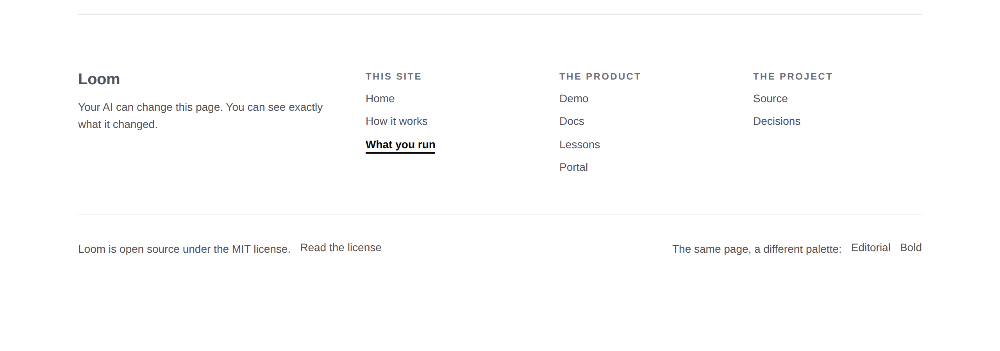

# 2026-09-27 — marketing: the answered questions

Four of the five open items came back answered. This is them, plus the one that
came back as a question.

| item | answer | what shipped |
| --- | --- | --- |
| `noindex` on previews | approved | `robots.ts` and `pageMetadata`, gated on `VERCEL_ENV` |
| three pages | approved | nothing — already merged in #406 |
| licensing | **settled: MIT** | the site's last placeholder is gone |
| pricing | none may remain | there was none; it is now held by a test |
| publisher | *asked back* | nothing, deliberately — see the last section |

---

## Licensing: the last placeholder

The footer had carried this since it was written: *"Licensing is not settled,
and this line is where it will be stated."* `docs/rollout.md` had it as the one
hard gate on Phase 4 — *undecided, and it gates whether the repository can be
public at all.*



**Nothing here is typed from a decision somebody reported.** The repository
already stated MIT in two places — `LICENSE` at the root and `license` in the
package manifest, both added by #402 when the framework went to npm — and
`license.test.ts` holds the site's sentence against the manifest and against the
file the link points at. The site cannot go on saying MIT if the package ever
stops.

The `SoftwareApplication` node in the structured data carries it too, because
that is the field an assistant answering *can I use this* reaches for, and a
graph disagreeing with the footer would be the site giving two answers to a
legal question.

**`PLACEHOLDER_COPY` is now empty and the mechanism stays.** The count is
asserted — 8 → 1 on 21 August when pricing came off the front door, 1 → 0 today
— so adding placeholder copy remains a deliberate act with a test to change. A
site that has forgotten how to mark an unanswered question is a site that
answers one quietly instead.

## Pricing: nothing to remove, so it is held instead

There was no pricing reference on the site. The front door's pricing band went
on 21 August and the site has been silent since. The scan found three kinds of
false positive and nothing else:

- **`PRODUCT_SURFACES.cost`** — *Costs you a click*, *Costs you an afternoon*.
  That is attention, it is the most useful thing that band says, and it is
  deliberately not caught.
- **The guards themselves** — `"price"` in `words.ts`, `UNMADE_CLAIMS` in
  `schema.ts`.
- **One rule example** on `/how-it-works` about protecting *the reader's own*
  price field from being edited.

So the instruction is **held rather than obeyed once**: a sweep over the words
every route renders, refusing currency, `per seat`, `a month`, `pricing`,
`subscription`, `free tier`, `starts at`, `billed`, `trial`. It is worth having
precisely because the site is silent — a page nobody edits does not drift, and
a page rewritten weekly by a routine with no memory of this conversation does.
The sentence that would do it is the kind a run writes without thinking, because
every other marketing site has one. Checked red with *"Free tier available,
starts at $0 per month"*.

The schema side is stricter and was already there: `UNMADE_CLAIMS` denies
`offers` and `price` as **fields**.

## `noindex` on previews

Two halves, because neither substitutes for the other. `robots.txt` is a request
a crawler honours; the page's own `robots` meta is what an assistant fetching
one address without reading the root file sees.

```
preview     → rules: { userAgent: "*", disallow: "/" },  no sitemap
production  → unchanged
no VERCEL_ENV → unchanged
```

**The rule is deliberately narrow, and the negative case is the important half.**
Not-production means *Vercel said so*. The obvious spelling — index only when
sure this is production — would silently de-index the site of anybody running
their own Loom deployment outside Vercel, and that failure cannot be seen from
here. It is far worse than a preview being crawled.

A disallowed deployment is handed **no sitemap line**: pointing a crawler that
has just been told to go away at a map of where to go is a contradiction it
resolves in whichever order it read them.

### One file outside this lane

`apps/loom/app/robots.ts` sits at the application root because Next honours
`robots` only there ([0190](../decisions/0190-a-route-group-may-contribute-a-sitemap-and-may-not-contribute-a-robots-txt.md)).
Everything in it is this lane's by content — its own comment says so — and
`docs/routines.md` is explicit that **the lane follows the content and not the
location**. Recorded here because a cross-lane diff of this kind gets a line
saying which file and why.

---

## The one that came back as a question

The maintainer asked what the `publisher` should be — the org name, or his own
name as author — and what the trade-offs are. **Nothing shipped for it**, which
is the right outcome for a question rather than an instruction: naming who
stands behind this site is positioning, and positioning is his.

The answer is in the pull request comment rather than here, because it is a
recommendation rather than a record. The short of it: `jam-overture` is already
the npm scope, the `LICENSE` copyright holder and the GitHub org, so naming it
is derivable rather than invented — which is the rule the whole schema module
follows. A person's name is the one that is hard to walk back.

---

## Findings

**One closed, one filed.**

- **Closed:** the preview `noindex` finding of 27 September, taken by this lane
  with the maintainer's approval.
- **Filed, for `Loom daily build`:** `docs/rollout.md` still calls licensing
  undecided and still lists it as a hard gate on Phase 4. It is a paragraph, and
  it is filed rather than fixed because that file is the plan every lane reads
  to find its position — a lane editing another lane's statement of what is
  blocked is how two routines end up disagreeing about what the project is
  waiting for. Worth doing soon: a run reading it today is told the repository
  may not be public, which is no longer true.

---

## Tests

`pnpm verify` — **exit 0**, read off the run rather than a pipe, on a `.next`
and a `dist` deleted first.

| | |
| --- | --- |
| runtime | **3,178 passed** in 164 files — untouched |
| application | **5,381 passed** in 310 files — 20 added |
| findings | **827**, 0 malformed |
| prerender | 112 pages, 1,300 junctions, 0 run together, 0 unserved |

Two checked red: the pricing sweep against a planted *"Free tier available,
starts at $0 per month"*, and the licence assertions against the manifest.
Verified on the served build: the footer states MIT and links to the file, and
the `SoftwareApplication` node carries `license` with no `offers` and no
`aggregateRating`.

**One thing caught by this lane's own new test.** The first draft of the footer
link read *"Read the licence"* — the British spelling — which the US-English
sweep added yesterday caught immediately. The instruction that produced that
test was three sentences long and a day old, and it had already earned itself.
